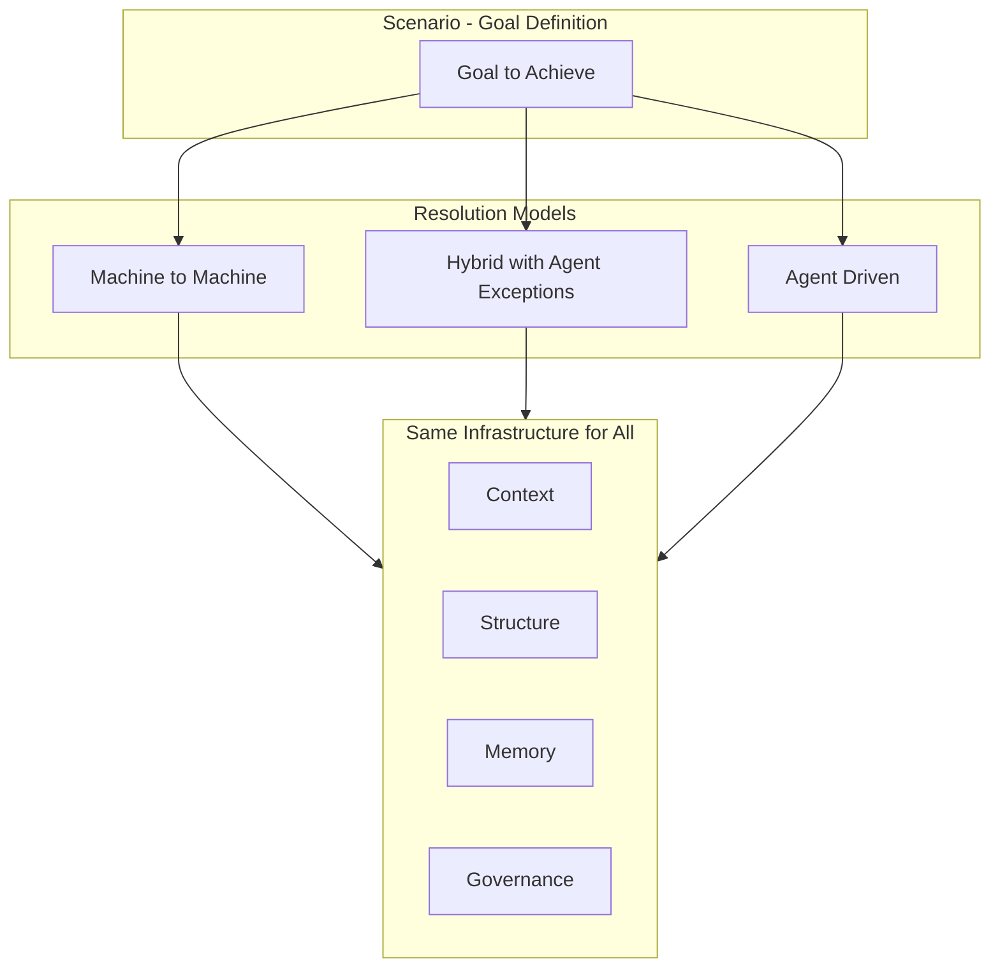

# Agency Is Not Essential — Documentation Updates

## Core Concept to Incorporate

Hub's collaboration model includes Machines and Agents in an Environment. This means:

- Pure machine-to-machine operations (traditionally called "integrations") are valid Hub Scenarios
- Agency (human or AI involvement) is often needed but not essential
- Traditional models try to eliminate agents for cost/feasibility; Hub neither excludes M2M nor mandates it
- Agents engage on business-level exceptions, not infrastructure failures
- The same governance applies regardless of resolution model

### Critical Clarification: Definition vs Resolution

**Agency is essential for Scenario definition, but not necessarily for Scenario resolution.**

| Layer | Agency Required? | Why |

|-------|------------------|-----|

| **Normative (Scenario Definition)** | **Always** | Defining goals, SOPs, decision criteria, boundaries — this is inherently cognitive work |

| **Execution (Scenario Resolution)** | **Sometimes** | Depends on whether the situation is repeatable, learned, and deterministic |

**Authoritative phrasing (for Foundational Beliefs and Glossary):**

> "When we say 'agency is not essential,' we refer to Scenario resolution, not Scenario definition. The normative layer — goals, SOPs, decision criteria, escalation rules — always requires cognitive faculties to create. What may not require agency is the resolution of situations that have been observed, learned, or accepted as sufficiently repeatable that machines can handle them. Over time, what requires agency shifts: novel situations become understood, and understood situations become automatable."

**Shorter form (for Introduction and Hub Applications):**

> "Designing a Scenario requires agency — it's cognitive work. Resolving a Scenario may not, if the situation is repeatable and deterministic."

### Resolution Models — Comprehensive Definition

**Resolution Model:** The pattern of participation between Machines and Agents in resolving a Scenario. It describes *who/what* resolves the work, not *what kind* of work it is (that's the Work Pattern).

> **Note:** This may also be referred to as "Execution Model" in some contexts. Hub uses "Resolution Model" to emphasize the goal-oriented nature of Scenario resolution.

| Resolution Model | Description | Agent Role | Example |

|------------------|-------------|------------|---------|

| **Pure Automation** | Machines resolve entirely; no agent involvement | None | ETL job, scheduled report generation |

| **Automation with Exception Escalation** | Machines resolve; agents engage only for business exceptions | Exception handling | Data reconciliation with conflict resolution |

| **Automation with Checkpoint Approval** | Machines resolve; agents approve at defined points | Gate approval | Payment batch processing with threshold approval |

| **Agent-Assisted Automation** | Automation does the work; agents guide, review, or correct | Guidance, review | AI-drafted document with human editing |

| **Human-AI Teaming** | Human and AI agents collaborate throughout | Co-resolution | Complex case investigation with AI research |

| **AI-Autonomous** | AI agents operate independently within governance | Primary resolver | Automated customer inquiry resolution |

| **Human-Supervised AI** | AI proposes; humans approve each action | Approval per action | High-risk financial decisions |

| **Pure Human Collaboration** | Humans work together; platform provides infrastructure | Primary resolver | Strategy session, creative brainstorming |

| **Human with Tool Support** | Human resolves; machines provide capabilities on demand | Primary resolver with tools | Analyst using data queries and calculators |

### Machines as Implicit Infrastructure

> "All resolution models may involve Machines providing capabilities (tools, commands, data access). The model describes the primary actors making decisions and driving resolution, not every participant. Machines are infrastructure for resolution, not actors in resolution."

### Evolution of Agency Requirements

Over time, what requires agency shifts. This evolution is itself organizational learning:

```
Novel Situation          Understood Situation         Automatable Situation
     │                          │                            │
     ▼                          ▼                            ▼
Agency Essential ───────→ Agency Helpful ───────→ Agency Optional
(Cognitive work)          (Supervision/review)     (Exception only)
     │                          │                            │
     └──────────────────────────┴────────────────────────────┘
                    Learning and formalization
```

This diagram should be included in:

- Glossary — Agency section (primary)
- Work Patterns README — Resolution Models section (reinforcement)

---

## Changes by Document

### 1. Glossary — Information-Centric Work

**File:** [olympus-hub-docs/01-concepts/glossary.md](olympus-hub-docs/01-concepts/glossary.md)

**Change:** Add new subsection after "Contrast: Physical-Centric Work" (around line 52)

**New Section: "Agency in Information-Centric Work"**

- Include the authoritative statement about definition vs resolution (see Core Concept above)
- Clarify that many situations are repeatable and can be resolved entirely by machines
- State that agency (human or AI involvement) is often needed for judgment, exceptions, novel situations — but not always
- Explain that Hub provides the same infrastructure (governance, audit, memory) regardless of whether agents are involved
- Note that traditional models try to eliminate agents for cost; Hub is agnostic to resolution model
- Note the evolution: novel situations → understood → automatable

**New Section: "Resolution Model"**

Add formal definition and comprehensive list of resolution models (see Core Concept above):

- Definition: The pattern of participation between Machines and Agents in resolving a Scenario
- Note that this may also be referred to as "Execution Model"
- Full table of 9 resolution models with descriptions, agent roles, and examples
- Include the "Machines as Implicit Infrastructure" clarification
- Clarify that Resolution Model × Work Pattern = how work actually operates
- Include the evolution diagram showing: Novel → Understood → Automatable

**New Section: "Collaboration and Integration — A Terminology Bridge"**

Bridge traditional enterprise terminology to Hub's unified model:

| Traditional Term | Traditional Meaning | Hub Equivalent |

|------------------|---------------------|----------------|

| **Integration** | Machine-to-Machine communication (APIs, ETL, data sync) | Machine-Machine collaboration |

| **Collaboration** | Humans working together, or humans with systems | Agent-Agent collaboration |

| **Orchestration** | Coordinating multiple systems/services | Scenario with multiple Machines and/or Agents |

| **Workflow** | Human task routing | One resolution pattern within a Scenario |

Key points:

- In Hub, all are forms of "collaboration" — entities working together toward a goal
- What's traditionally called "integration" is Machine-Machine collaboration in Hub
- Hub provides unified infrastructure regardless of participant types
- Enterprise architects can see their integration patterns as Hub Scenarios

---

### 2. Foundational Beliefs

**File:** [olympus-hub-docs/00-_why/foundational-beliefs.md](olympus-hub-docs/00-_why/foundational-beliefs.md)

**Change:** Add new belief in "On the Nature of Work" section (after line 15)

**New Belief:**

> "Agency is often needed for resolution, but not essential — many situations in information-centric work are sufficiently repeatable that machines can resolve them entirely; governance and infrastructure apply regardless of resolution model."

Include the clarification that this refers to resolution, not definition. The normative layer always requires cognitive faculties.

**Rationale:** This explicitly states what the current beliefs imply but don't articulate, while being precise about the distinction between definition and resolution.

---

### 3. Introduction — Collaboration Model

**File:** [olympus-hub-docs/01-concepts/introduction.md](olympus-hub-docs/01-concepts/introduction.md)

**Changes:**

**A. Expand collaboration modalities table (lines 149-153)**

Current:

```
| Human-Human | Traditional teamwork |
| Human-AI | Augmented collaboration |
| AI-AI | Autonomous coordination |
```

Add:

```
| Machine-Machine | Pure automation — integration, transformation, rules |
| Machine-with-Agent-Exception | Automation with agent escalation for business exceptions |
```

**B. Add clarifying paragraph after modalities table**

Explain that:

- Not all work requires agent involvement for resolution
- Many Scenarios have solutions that are pure automation on the happy path
- Agents engage when judgment is needed, not by default
- Hub provides the same governance regardless of resolution model
- Include the shorter form clarification: "Designing a Scenario requires agency — it's cognitive work. Resolving a Scenario may not, if the situation is repeatable and deterministic."
- Reference the resolution models defined in the Glossary

**C. Add terminology bridge subsection**

Include the same terminology mapping table as glossary:

| Traditional Term | Traditional Meaning | Hub Equivalent |

|------------------|---------------------|----------------|

| **Integration** | Machine-to-Machine communication | Machine-Machine collaboration |

| **Collaboration** | Humans working together | Agent-Agent collaboration |

| **Orchestration** | Coordinating multiple systems/services | Scenario with multiple Machines and/or Agents |

| **Workflow** | Human task routing | One resolution pattern within a Scenario |

Brief explanation that Hub unifies these concepts under a single collaboration model.

**D. Update "From Structured to Exploratory" table (lines 168-174)**

Add a row for "Pure automation" that clarifies full M2M execution with agent escalation for exceptions.

---

### 4. Hub Applications

**File:** [olympus-hub-docs/01-concepts/hub-applications.md](olympus-hub-docs/01-concepts/hub-applications.md)

**Change:** Add new section after "Overview" (around line 17)

**New Section: "Hub Applications and Agency"**

Content:

- Include shorter form clarification: "Designing a Scenario requires agency — it's cognitive work. Resolving a Scenario may not, if the situation is repeatable and deterministic."
- Hub Applications can be pure automation with no agent in the loop
- Examples: data transformation, rule application, decision execution, system integration
- The output of a Hub Application can go directly to a Machine in the environment
- Agents (human or AI) engage when:
  - Business exceptions require judgment (not infrastructure failures)
  - Decisions exceed automation authority
  - Novel situations need interpretation
- This is distinct from "oversight" — agents aren't supervising; they're handling cases automation can't resolve
- Example: Data reconciliation between systems may need human conflict resolution
- Reference the resolution models defined in the Glossary

---

### 5. Vision — Explanatory Text

**File:** [olympus-hub-docs/00-_why/vision.md](olympus-hub-docs/00-_why/vision.md)

**Change:** Add clarifying paragraph in "Understanding the Vision" section (after line 30)

**New Paragraph:**

Clarify that:

- The vision emphasizes AI-Human collaboration as Hub's transformative capability
- This doesn't exclude pure automation — many operations don't require agent involvement for resolution
- Hub provides the same infrastructure (context, structure, memory, governance) for all resolution models
- Traditional integrations can be Hub Scenarios with full governance
- The vision is about enabling the full spectrum, not mandating agent involvement

---

### 6. Work Patterns README

**File:** [olympus-hub-docs/03-information-centric-work/README.md](olympus-hub-docs/03-information-centric-work/README.md)

**Change:** Add new section after "How Patterns Compose" (around line 55)

**New Section: "Resolution Models — Agency Is Not Required"**

Content:

- Clarify: Work Patterns describe the nature of the situation; Resolution Models describe who resolves it
- Include definition/resolution distinction (shorter form)
- Reference the comprehensive resolution models list in the Glossary
- Include the evolution diagram showing: Novel → Understood → Automatable
- Include the "Machines as Implicit Infrastructure" clarification
- Any pattern can have solutions ranging from pure automation to pure agent work
- Example table showing a single pattern (Queue-Based) with different resolution models
- Show which resolution models are common for each work pattern
- Hub's value proposition isn't "agents everywhere" or "automate humans out" — it's operational infrastructure for whatever resolution model fits

---

### 7. Pattern Composition

**File:** [olympus-hub-docs/03-information-centric-work/pattern-composition.md](olympus-hub-docs/03-information-centric-work/pattern-composition.md)

**Change:** Add new section before "Modeling Implications" (around line 240)

**New Section: "Resolution Models Within Compositions"**

Content:

- Pattern compositions can include fully automated segments
- Example: In Loan Origination, the Queue-Based intake and Artifact-Centric document processing might be fully automated, with agents engaging only at Review-Based decision points
- Diagram showing a composition with M2M segments and Agent touchpoints
- Reference the evolution concept: different phases of a composition may be at different stages of the Novel → Automatable spectrum
- Key insight: Agent involvement is at specific points, not throughout

---

## Summary Diagram



---

## Implementation Order

1. Foundational Beliefs (establishes the principle)
2. Glossary (defines in terminology)
3. Vision (clarifies in explanatory text)
4. Introduction (expands collaboration model)
5. Hub Applications (explains application-level implications)
6. Work Patterns README (connects to pattern thinking)
7. Pattern Composition (shows in compositional context)