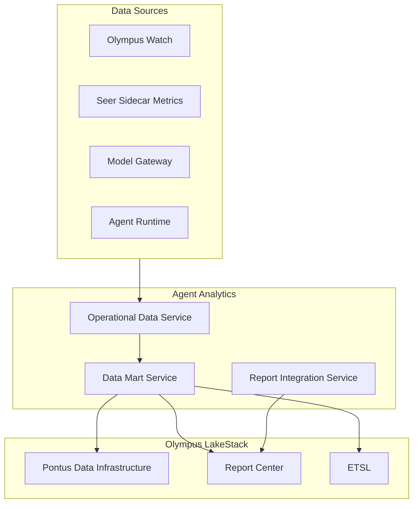
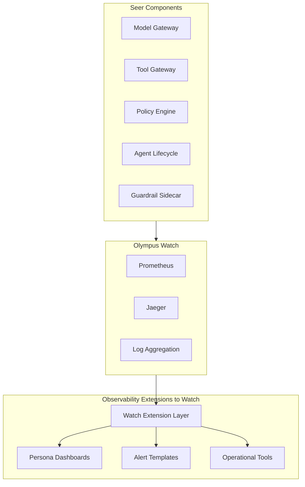
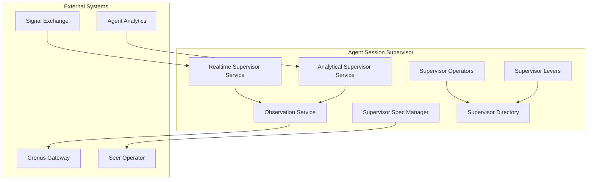
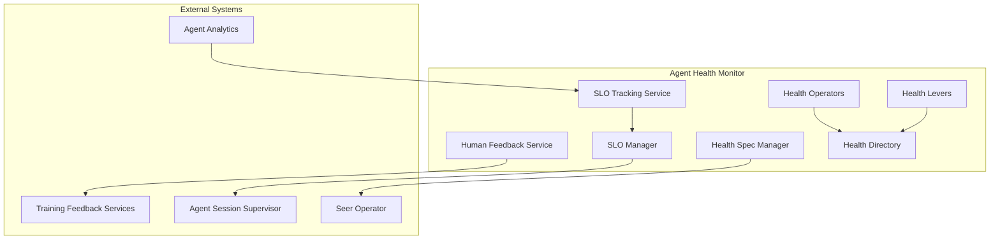

# Agent Analytics, Session Supervisor, Health Monitor & Watch Extensions Design

Create comprehensive C2-level design documentation for four subsystems: **Agent Analytics**, **Agent Session Supervisor**, **Agent Health Monitor**, and **Observability Extensions to Watch**. Follow the patterns established by previous subsystem designs.

## Subsystem 1: Agent Analytics

Agent Analytics is a **data mart** (analogous to Hub Analytics) that houses operational data for agents. It answers questions based on historic health, cost, effectiveness, feedback, and behavior of agents—not runtime observability.

### Architecture Pattern

### Sub-Components

| Component | Description | Key Capabilities |

|-----------|-------------|------------------|

| **Operational Data Service** | Collects and aggregates agent operational data | Data collection from Watch, Sidecar, Model Gateway, Runtime |

| **Data Mart Service** | Builds and maintains agent data marts | Data mart construction, ETSL integration, data product creation |

| **Report Integration Service** | Integrates with LakeStack Report Center | Report catalog sync, access mapping, context injection |

### Key Design Decisions

- **Data Mart Model**: Agent Analytics is a data mart, not runtime observability
- **LakeStack Integration**: Uses Pontus infrastructure for data marts and Report Center for serving
- **ETSL Integration**: Registers agent operational data as assertions into ETSL
- **Separation from Observability**: Runtime observability is in Observability Extensions to Watch

### Files to Create

| File | Description |

|------|-------------|

| `agent-analytics/operational-data-service.md` | Data collection and aggregation from multiple sources |

| `agent-analytics/data-mart-service.md` | Data mart construction, ETSL integration, data products |

| `agent-analytics/report-integration-service.md` | LakeStack Report Center integration |

| `agent-analytics/SCOPE.md` | Coverage summary, design status |

---

## Subsystem 2: Observability Extensions to Watch

Observability Extensions to Watch is a **separate subsystem** (like cipher-iam-extensions) that provides runtime observability extensions to Olympus Watch for AREs and Cognitive Operations Stewards.

### Architecture Pattern

### Sub-Components

| Component | Description | Key Capabilities |

|-----------|-------------|------------------|

| **Watch Extension Layer** | Extension infrastructure for Watch | Dashboard JSONs, Prometheus recording rules, Alertmanager configs, custom plugins |

| **Persona Dashboards** | Dashboards for AI Platform Engineer, LLMOps Engineer, SRE for Agentic Systems, Security Architect | Pre-built dashboards per persona |

| **Alert Templates** | Pre-built alert definitions | Alert rules, routing, severity levels |

| **Operational Tools** | UI tools for operational tasks | Agent isolator, credential revoker, guardrail configurator |

### Key Design Decisions

- **Separate Subsystem**: Independent subsystem like cipher-iam-extensions
- **Watch-Based**: All extensions built on Olympus Watch infrastructure
- **Persona-Focused**: Dashboards and tools organized by SRE persona needs
- **No New Infrastructure**: Extends Watch, doesn't create new observability layer

### Files to Create

| File | Description |

|------|-------------|

| `observability-extensions-to-watch/watch-extension-layer.md` | Extension infrastructure, deployment model |

| `observability-extensions-to-watch/persona-dashboards.md` | Dashboards for each SRE persona |

| `observability-extensions-to-watch/alert-templates.md` | Pre-built alert definitions and routing |

| `observability-extensions-to-watch/operational-tools.md` | UI tools for operational tasks |

| `observability-extensions-to-watch/SCOPE.md` | Coverage summary, design status |

**Note**: Existing `agent-analytics/observability-extensions-to-watch.md` should be migrated to this new subsystem structure.

---

## Subsystem 3: Agent Session Supervisor

Agent Session Supervisor provides supervisory oversight for agent sessions, managing supervisory policies, observations, and escalations. Follows lifecycle manager pattern.

### Architecture Pattern

### Sub-Components

| Component | Description | Key Capabilities |

|-----------|-------------|------------------|

| **Supervisor Spec Manager** | Supervisor specification CRD structure, validation | Spec structure, validation, deployment configuration |

| **Realtime Supervisor Service** | Observes SX events, evaluates OPA policies | SX event observation, OPA policy evaluation, real-time observation generation |

| **Analytical Supervisor Service** | Runs templated SQL queries on analytics data mart | Periodic execution, SQL template evaluation, analytical observation generation |

| **Observation Service** | Generates Cronus Observations/Exceptions | Observation/Exception creation, Cronus integration |

| **Supervisor Operators** | Lifecycle management via Seer Operator | Registration, validation, deployment, state transitions |

| **Supervisor Levers** | Runtime controls for supervisors | Enable/disable, suspend, emergency controls |

| **Supervisor Directory** | Registry of supervisors | Search, version tracking, deployment status |

### Key Design Decisions

- **Two Supervisor Types**: Realtime (SX + OPA) and Analytical (SQL on data mart)
- **Cronus Integration**: Generates Observations/Exceptions via Cronus Gateway (Hub model)
- **Deployment Model**: Supervisors deployed via Deployment CRDs referencing Spec CRDs
- **Lifecycle Pattern**: Follows same pattern as Trained/Employed Agent lifecycle managers

### Files to Create

| File | Description |

|------|-------------|

| `agent-session-supervisor/supervisor-spec-manager.md` | Spec structure, validation, deployment configuration |

| `agent-session-supervisor/realtime-supervisor-service.md` | SX event observation, OPA policy evaluation |

| `agent-session-supervisor/analytical-supervisor-service.md` | SQL template execution on analytics data mart |

| `agent-session-supervisor/observation-service.md` | Cronus Observations/Exceptions generation |

| `agent-session-supervisor/supervisor-operators.md` | Lifecycle management, state transitions |

| `agent-session-supervisor/supervisor-levers.md` | Runtime controls, enable/disable, suspend |

| `agent-session-supervisor/supervisor-directory.md` | Registry, search, version tracking |

| `agent-session-supervisor/SCOPE.md` | Coverage summary, design status |

---

## Subsystem 4: Agent Health Monitor

Agent Health Monitor tracks and enforces health-related Service Level Objectives (SLOs) for agents, including cost SLOs (ARE), behavior SLOs (COS), and feedback SLOs (PA/APO). Follows similar structure to Supervisor.

### Architecture Pattern

### Sub-Components

| Component | Description | Key Capabilities |

|-----------|-------------|------------------|

| **Health Spec Manager** | Health specification CRD structure, validation | Spec structure, SLO definitions, validation |

| **SLO Manager** | SLO definition and threshold management | Cost SLOs (ARE), Behavior SLOs (COS), Feedback SLOs (PA/APO) |

| **SLO Tracking Service** | Tracks SLO deviations using Agent Analytics | Deviation detection, threshold evaluation, metric aggregation |

| **Human Feedback Service** | Collects, routes, and calculates feedback metrics | Feedback collection, routing to Training Feedback Services, metric calculation |

| **Health Operators** | Lifecycle management via Seer Operator | Registration, validation, deployment, state transitions |

| **Health Levers** | Runtime controls for health monitoring | Enable/disable, suspend, emergency controls |

| **Health Directory** | Registry of health specs | Search, version tracking, SLO status |

### Key Design Decisions

- **SLO Types**: Cost (ARE), Behavior (COS), Feedback (PA/APO)
- **No Enforcement**: Only definition and tracking—no automatic enforcement actions
- **Agent Analytics Integration**: Uses Agent Analytics data mart for SLO evaluation
- **Supervisor Integration**: SLO deviations can trigger supervisors (if defined)
- **Lifecycle Pattern**: Follows same pattern as Supervisor lifecycle management

### Files to Create

| File | Description |

|------|-------------|

| `agent-health-monitor/health-spec-manager.md` | Spec structure, SLO definitions, validation |

| `agent-health-monitor/slo-manager.md` | SLO definition and threshold management |

| `agent-health-monitor/slo-tracking-service.md` | SLO deviation tracking using Agent Analytics |

| `agent-health-monitor/human-feedback-service.md` | Feedback collection, routing, metric calculation |

| `agent-health-monitor/health-operators.md` | Lifecycle management, state transitions |

| `agent-health-monitor/health-levers.md` | Runtime controls, enable/disable, suspend |

| `agent-health-monitor/health-directory.md` | Registry, search, version tracking |

| `agent-health-monitor/SCOPE.md` | Coverage summary, design status |

---

## Integration Points

### Agent Analytics

| Integration | Direction | Purpose |

|-------------|-----------|---------|

| Olympus Watch | Inbound | Collect operational metrics |

| Seer Sidecar | Inbound | Collect guardrail, policy, quota metrics |

| Model Gateway | Inbound | Collect model usage, cost metrics |

| Agent Runtime | Inbound | Collect deployment, health metrics |

| LakeStack Pontus | Outbound | Data mart construction, ETSL integration |

| LakeStack Report Center | Outbound | Report serving |

### Observability Extensions to Watch

| Integration | Direction | Purpose |

|-------------|-----------|---------|

| Olympus Watch | Extends | Dashboard, alert, tool extensions |

| Seer Components | Inbound | Metric sources (Model Gateway, Tool Gateway, Policy Engine, etc.) |

### Agent Session Supervisor

| Integration | Direction | Purpose |

|-------------|-----------|---------|

| Signal Exchange | Inbound | SX event observation for Realtime Supervisor |

| Agent Analytics | Inbound | Data mart queries for Analytical Supervisor |

| Cronus Gateway | Outbound | Generate Observations/Exceptions |

| Seer Operator | Outbound | CRD reconciliation |

### Agent Health Monitor

| Integration | Direction | Purpose |

|-------------|-----------|---------|

| Agent Analytics | Inbound | SLO evaluation using data mart |

| Training Feedback Services | Outbound | Route feedback for improvement |

| Agent Session Supervisor | Outbound | Trigger supervisors on SLO deviations (if configured) |

| Seer Operator | Outbound | CRD reconciliation |

---

## Content Migration

### From `agent-observability.md`

- **Platform-level observability content** → Migrate to `observability-extensions-to-watch/` subsystem
- **Cognitive Operations Desk references** → Keep in observability-extensions-to-watch (UI tool)
- **SDK content** → Already migrated to `seer-agent-sdk/` (observability-apis.md)

### From `agent-analytics/observability-extensions-to-watch.md`

- **Migrate entire content** → Move to `observability-extensions-to-watch/` subsystem structure
- **Split into sub-components**: Extension Layer, Persona Dashboards, Alert Templates, Operational Tools

---

## Implementation Details Deferred

Following the pattern from other subsystem designs:

- Detailed CRD schemas
- Complete API specifications (REST/gRPC endpoints)
- Storage backends and indexing strategies
- Specific algorithm implementations
- Error code taxonomies
- Wire format details
- SQL template syntax for Analytical Supervisor
- OPA policy schema for Realtime Supervisor