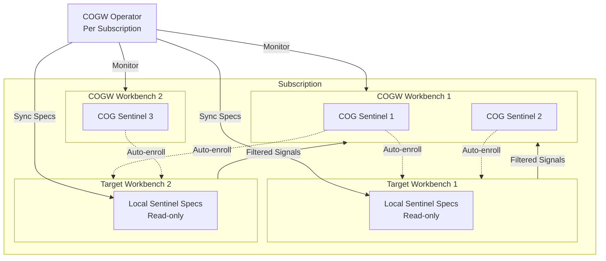

# Cognitive Operations Governance Workbench (COGW) Implementation Plan

## Overview

This plan implements the Cognitive Operations Governance Workbench (COGW) subsystem, enabling subscription-wide cognitive operations governance through cross-workbench Sentinels. COGWs allow organizations to automate multi-domain governance, supervision, and learning using Hub Workbenches and Seer Agents.

## Architecture Overview



## Phase 1: Implementation Concept Document

**File**: `olympus-seer-docs/seer-design/implementation-concepts/cognitive-operations-governance.md`

**Content**:

- **What**: COGW definition, purpose, relationship to enterprise agentic systems
- **Why**: Need for subscription-wide governance, cross-domain supervision, multi-domain learning
- **How**: COGW as workbench type, COG Sentinels, operator-based auto-enrollment
- **Relationship to**: Request Sentinels, Cross-Workbench Context Sharing, DevOps Workbench pattern
- **Key Concepts**: COGW workbench type, COG Sentinel labeling, cogSpec pattern matching, signal forwarding

**Design Level**: C2 (Container) with C3 (Component) details for critical concepts

## Phase 2: COGW Subsystem Documentation

**Directory**: `olympus-seer-docs/seer-design/subsystems/cognitive-operations-governance-workbench/`

### 2.1 README.md

- Overview of COGW subsystem
- Architecture diagram showing COGW operator, COG Sentinels, target workbenches
- Key design decisions summary
- Related subsystems

### 2.2 SCOPE.md

- Subsystem boundaries
- What's in scope: COGW workbench type, COG Sentinel management, operator, signal forwarding
- What's out of scope: Performance optimization, caching strategies
- Design documents table
- Related subsystems table

### 2.3 cogw-specification.md

**Design Level**: C2

**Content**:

- Workbench type: `workbench_type: "cogw"` (similar to `devops`)
- Default COGW creation at subscription creation
- COGW Blueprint structure (standard governance scenarios)
- Multiple COGW workbenches per subscription (no conflicts)
- Lifecycle: creation, deletion, activation

**Updates Required**:

- `olympus-hub-docs/04-subsystems/workbench-management/README.md` - Add `cogw` to workbench_type enum
- `olympus-hub-docs/04-subsystems/subscription-management/README.md` - Document default COGW creation

### 2.4 cog-sentinel-specification.md

**Design Level**: C2 with C3 details for pattern matching

**Content**:

- COG Sentinel labeling: `sentinel.olympus.io/cog-sentinel: "true"` in `SentinelSpec` metadata
- `cogSpec` structure in `SentinelScenarioDeploymentSpec`:
  ```yaml
  cogSpec:
    workbench_patterns:
      - pattern: "workbench-*"
        action: allow
      - pattern: "workbench-dev"
        action: disallow
      - pattern: "acme-*"
        action: allow
  ```

- Pattern matching: Apache webserver-style sequential evaluation (first match wins)
- Wildcard support: Simple prefix/suffix matching
- Validation: COG Sentinels only in COGW workbenches
- Context filtering: Via TrainingSpec `contextCompilation.retrieverConfigs`

**Updates Required**:

- `olympus-seer-docs/seer-design/subsystems/agent-session-sentinel/sentinel-scenario-deployment-spec.md` - Add `cogSpec` section
- `olympus-seer-docs/seer-design/subsystems/agent-session-sentinel/sentinel-spec-manager.md` - Add COG Sentinel validation rules

### 2.5 cogw-operator.md

**Design Level**: C2 with C3 details for reconciliation logic

**Content**:

- **Scope**: One operator per subscription (not per COGW)
- **Responsibilities**:
                - Watch all COG Sentinels in all COGW workbenches in subscription
                - Evaluate `cogSpec.workbench_patterns` against subscription workbenches
                - Create read-only `SentinelScenarioSpec` references in target workbenches
                - Register COG Sentinels for auto-enrollment in Signal Exchange
                - Handle updates (automatic sync to all target workbenches)
                - Handle deletions (remove from target workbenches)
- **Reconciliation Loop**: Watch COG Sentinels, workbenches, subscription changes
- **Access Scope**: Subscription-level access to enumerate workbenches
- **Read-only Spec Representation**: Same CRD type with `read-only: true` annotation

**Updates Required**:

- `olympus-hub-docs/04-subsystems/subscription-management/README.md` - Document workbench enumeration API

### 2.6 signal-forwarding.md

**Design Level**: C2

**Content**:

- **Mechanism**: Filtered locally (by sentinel's `participation.filters`) before forwarding
- **Implementation**: Signal Exchange evaluates filters, forwards matching updates to COGW
- **Child Request Creation**: In COGW workbench, with parent context access
- **Context Compilation**: Up to Context Compiler of the Sentinel (via TrainingSpec `contextCompilation.retrieverConfigs`)
- **Flow Diagram**: Request update → Local filter → Forward to COGW → Child request creation

**Updates Required**:

- `olympus-hub-docs/04-subsystems/signal-exchange/README.md` - Add COG Sentinel signal forwarding section
- `olympus-hub-docs/04-subsystems/request-management/request-hierarchy.md` - Document COG Sentinel child requests

### 2.7 administrative-controls.md

**Design Level**: C2

**Content**:

- **Local Visibility**: COG Sentinels appear in target workbench Sentinel Directory
- **Local Controls**: Enable/disable only (no spec modifications)
- **COGW Controls**: Full control (create, update, delete, enable/disable)
- **Status Visibility**: Local admins can see COG Sentinel status
- **Read-only Enforcement**: Specs cannot be modified in target workbenches

**Updates Required**:

- `olympus-seer-docs/seer-design/subsystems/agent-session-sentinel/sentinel-levers.md` - Document COG Sentinel enable/disable controls
- `olympus-seer-docs/seer-design/subsystems/agent-session-sentinel/sentinel-directory.md` - Document COG Sentinel visibility

### 2.8 examples/

- `cog-sentinel-example.md`: Complete COG Sentinel example with all three SentinelScenarioSpec types, cogSpec, TrainingSpec with contextCompilation
- `cogw-setup-example.md`: Default COGW setup example

## Phase 3: Hub Integration Documentation

**File**: `olympus-seer-docs/seer-design/hub-integration/cogw-workbench-integration.md`

**Content**:

- How COGW integrates with Hub Workbench Management
- Workbench type extension
- Default COGW creation flow
- COGW Blueprint structure
- Workbench enumeration API for COGW operator

## Phase 4: Architecture Decision Records

### 4.1 ADR-0118: Cognitive Operations Governance Workbench Type

**File**: `olympus-hub-docs/decision-logs/0118-cognitive-operations-governance-workbench-type.md`

**Content**:

- **Context**: Need for subscription-wide cognitive operations governance
- **Decision**: Introduce `workbench_type: "cogw"` as distinct workbench type
- **Alternatives**: Annotation-based approach (rejected)
- **Consequences**: Enables subscription-wide governance, requires operator, adds complexity

### 4.2 ADR-0119: COG Sentinel Cross-Workbench Enrollment

**File**: `olympus-hub-docs/decision-logs/0119-cog-sentinel-cross-workbench-enrollment.md`

**Content**:

- **Context**: Need for Sentinels to operate across multiple workbenches
- **Decision**: COG Sentinels auto-enroll in target workbenches via cogSpec patterns, read-only spec sync
- **Alternatives**: Manual enrollment (rejected), full spec copy (rejected)
- **Consequences**: Enables cross-workbench governance, requires operator, read-only enforcement

### 4.3 ADR-0120: COGW Operator Subscription Scope

**File**: `olympus-hub-docs/decision-logs/0120-cogw-operator-subscription-scope.md`

**Content**:

- **Context**: Where should COGW operator run?
- **Decision**: One operator per subscription (not per COGW workbench)
- **Alternatives**: Per-COGW operator (rejected - too many operators), per-workbench (rejected)
- **Consequences**: Centralized management, requires subscription-level access

## Phase 5: Updates to Existing Documentation

### 5.1 Hub Workbench Management

- **File**: `olympus-hub-docs/04-subsystems/workbench-management/README.md`
- **Update**: Add `cogw` to `workbench_type` enum in workbench structure

### 5.2 Subscription Management

- **File**: `olympus-hub-docs/04-subsystems/subscription-management/README.md`
- **Update**: Document default COGW creation at subscription creation
- **Update**: Document workbench enumeration API for COGW operator

### 5.3 Sentinel Subsystem

- **File**: `olympus-seer-docs/seer-design/subsystems/agent-session-sentinel/sentinel-scenario-deployment-spec.md`
- **Update**: Add `cogSpec` section with workbench_patterns structure

- **File**: `olympus-seer-docs/seer-design/subsystems/agent-session-sentinel/sentinel-spec-manager.md`
- **Update**: Add COG Sentinel validation rules (must be in COGW workbench, cogSpec required)

- **File**: `olympus-seer-docs/seer-design/subsystems/agent-session-sentinel/sentinel-directory.md`
- **Update**: Document COG Sentinel visibility and read-only representation

- **File**: `olympus-seer-docs/seer-design/subsystems/agent-session-sentinel/sentinel-levers.md`
- **Update**: Document COG Sentinel enable/disable controls in target workbenches

- **File**: `olympus-seer-docs/seer-design/subsystems/agent-session-sentinel/README.md`
- **Update**: Add COG Sentinel to architecture diagram and key decisions

- **File**: `olympus-seer-docs/seer-design/subsystems/agent-session-sentinel/SCOPE.md`
- **Update**: Add COGW-related documents to design documents table

### 5.4 Signal Exchange

- **File**: `olympus-hub-docs/04-subsystems/signal-exchange/README.md`
- **Update**: Add section on COG Sentinel signal forwarding (filtered updates → COGW)

### 5.5 Request Hierarchy

- **File**: `olympus-hub-docs/04-subsystems/request-management/request-hierarchy.md`
- **Update**: Document COG Sentinel child requests (cross-workbench, context inheritance)

### 5.6 Implementation Concepts

- **File**: `olympus-seer-docs/seer-design/implementation-concepts/agent-session-supervision.md`
- **Update**: Add COG Sentinel to sentinel types, document COGW relationship

## Phase 6: Cross-References and Index Updates

### 6.1 Hub Integration README

- **File**: `olympus-seer-docs/seer-design/hub-integration/README.md`
- **Update**: Add COGW Workbench Integration to integration points table

### 6.2 Seer Design README

- **File**: `olympus-seer-docs/seer-design/README.md`
- **Update**: Add COGW subsystem to subsystems list

### 6.3 Decision Log README

- **File**: `olympus-hub-docs/decision-logs/README.md`
- **Update**: Add ADR-0118, ADR-0119, ADR-0120 to index

## Implementation Details

### Pattern Matching Algorithm (C3 Detail)

Apache webserver-style sequential evaluation:

1. Evaluate patterns in order (top to bottom)
2. First match wins (allow or disallow)
3. If no match, default deny
4. Wildcard matching: `*` matches any sequence of characters

Example:

```yaml
workbench_patterns:
  - pattern: "workbench-*"    # Match 1: allow all workbench-*
    action: allow
  - pattern: "workbench-dev"   # Match 2: disallow workbench-dev (overrides match 1)
    action: disallow
  - pattern: "acme-*"         # Match 3: allow all acme-*
    action: allow
```

### Read-only Spec Representation (C3 Detail)

When COG Sentinel specs appear in target workbenches:

- Same CRD type (`SentinelScenarioNormativeSpec`, `SentinelScenarioAutomationSpec`, `SentinelScenarioDeploymentSpec`)
- Annotation: `sentinel.olympus.io/read-only: "true"`
- Annotation: `sentinel.olympus.io/cog-sentinel-source: "<cogw-workbench-id>/<sentinel-name>"`
- Validation: Reject any modifications to read-only specs
- Sync: Automatic sync on COG Sentinel updates

### Context Filtering (C3 Detail)

COG Sentinel child requests access parent context via TrainingSpec:

- TrainingSpec `contextCompilation.retrieverConfigs` defines what context to include
- Context Compiler automatically selects retrievers based on request update metadata
- Selectors can filter by updateType, taskType, contextKeys, etc.
- Token budgets and ranking strategies configured in TrainingSpec

## File Summary

**New Files** (13):

1. `olympus-seer-docs/seer-design/implementation-concepts/cognitive-operations-governance.md`
2. `olympus-seer-docs/seer-design/subsystems/cognitive-operations-governance-workbench/README.md`
3. `olympus-seer-docs/seer-design/subsystems/cognitive-operations-governance-workbench/SCOPE.md`
4. `olympus-seer-docs/seer-design/subsystems/cognitive-operations-governance-workbench/cogw-specification.md`
5. `olympus-seer-docs/seer-design/subsystems/cognitive-operations-governance-workbench/cog-sentinel-specification.md`
6. `olympus-seer-docs/seer-design/subsystems/cognitive-operations-governance-workbench/cogw-operator.md`
7. `olympus-seer-docs/seer-design/subsystems/cognitive-operations-governance-workbench/signal-forwarding.md`
8. `olympus-seer-docs/seer-design/subsystems/cognitive-operations-governance-workbench/administrative-controls.md`
9. `olympus-seer-docs/seer-design/subsystems/cognitive-operations-governance-workbench/examples/cog-sentinel-example.md`
10. `olympus-seer-docs/seer-design/subsystems/cognitive-operations-governance-workbench/examples/cogw-setup-example.md`
11. `olympus-seer-docs/seer-design/hub-integration/cogw-workbench-integration.md`
12. `olympus-hub-docs/decision-logs/0118-cognitive-operations-governance-workbench-type.md`
13. `olympus-hub-docs/decision-logs/0119-cog-sentinel-cross-workbench-enrollment.md`
14. `olympus-hub-docs/decision-logs/0120-cogw-operator-subscription-scope.md`

**Updated Files** (10):

1. `olympus-hub-docs/04-subsystems/workbench-management/README.md`
2. `olympus-hub-docs/04-subsystems/subscription-management/README.md`
3. `olympus-seer-docs/seer-design/subsystems/agent-session-sentinel/sentinel-scenario-deployment-spec.md`
4. `olympus-seer-docs/seer-design/subsystems/agent-session-sentinel/sentinel-spec-manager.md`
5. `olympus-seer-docs/seer-design/subsystems/agent-session-sentinel/sentinel-directory.md`
6. `olympus-seer-docs/seer-design/subsystems/agent-session-sentinel/sentinel-levers.md`
7. `olympus-seer-docs/seer-design/subsystems/agent-session-sentinel/README.md`
8. `olympus-seer-docs/seer-design/subsystems/agent-session-sentinel/SCOPE.md`
9. `olympus-hub-docs/04-subsystems/signal-exchange/README.md`
10. `olympus-hub-docs/04-subsystems/request-management/request-hierarchy.md`
11. `olympus-seer-docs/seer-design/implementation-concepts/agent-session-supervision.md`
12. `olympus-seer-docs/seer-design/hub-integration/README.md`
13. `olympus-seer-docs/seer-design/README.md`
14. `olympus-hub-docs/decision-logs/README.md`

## Design Level Guidelines

- **C2 (Container)**: Overall subsystem structure, component boundaries, integration points
- **C3 (Component)**: Critical concepts requiring detailed explanation:
                - Pattern matching algorithm (sequential evaluation)
                - Read-only spec representation mechanism
                - Context filtering via TrainingSpec
                - Signal forwarding flow
                - Reconciliation loop logic

## Dependencies

- Request Sentinel implementation (completed)
- Cross-Workbench Context Sharing (completed)
- TrainingSpec contextCompilation support (existing)
- Context Compiler service (existing)
- Signal Exchange observer pattern (existing)