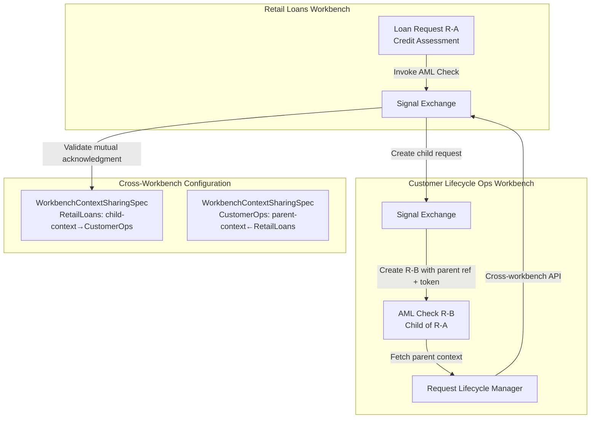
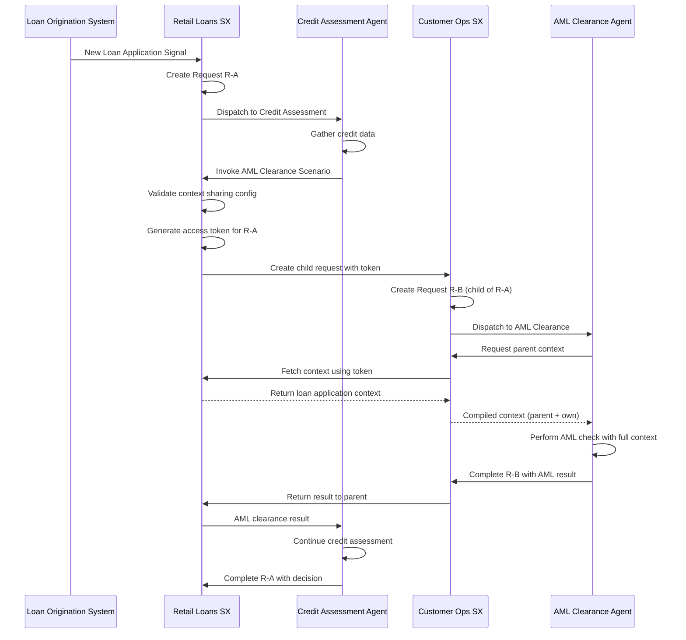

# Cross-Workbench Request Hierarchy Implementation Plan

## Overview

Extend the request hierarchy to support cross-workbench parent-child relationships with context sharing. This enables cross-domain agent collaboration where scenarios in different workbenches can establish parent-child request relationships with shared context.

## Architecture



---

## Phase 1: Core CRD and Configuration

### 1.1 Create WorkbenchContextSharingSpec Implementation Concept

**File**: `olympus-hub-docs/02-system-design/implementation-concepts/workbench-context-sharing.md` (NEW)

Create a new implementation concept document following the standard format:

- Ontology Context section
- Definition with characteristics
- Structure with CRD example
- Behavior section with validation rules
- Integration section
- Examples section

Key content:

- Workbench-level and Scenario-level granularity
- Mutual acknowledgment requirement
- Subscription membership validation at configuration time
- Union logic with ScenarioAutomationSpec.contextSharing

### 1.2 Update Implementation Concepts README

**File**: `olympus-hub-docs/02-system-design/implementation-concepts/README.md`

Add new entry to Composite Patterns section:

```markdown
| [Cross-Workbench Context Sharing](./workbench-context-sharing.md) | Parent-child request hierarchy across workbenches | NEW |
```

### 1.3 Update Scenario Specification Types

**File**: `olympus-hub-docs/02-system-design/implementation-concepts/scenario-specification-types.md`

Add `contextSharing` section to ScenarioAutomationSpec:

- Document new optional `contextSharing` section
- Document parent_contexts and child_contexts arrays
- Document union logic with WorkbenchContextSharingSpec
- Add example YAML

### 1.4 Update Workbench as Machine

**File**: `olympus-hub-docs/02-system-design/implementation-concepts/workbench-as-machine.md`

Add section "Cross-Workbench Context Sharing":

- Explain difference from current pattern (no parent-child, no context inheritance)
- Reference new WorkbenchContextSharingSpec for context-aware cross-workbench invocation
- Clarify when to use which pattern

---

## Phase 2: Request Management Changes

### 2.1 Update Request Hierarchy Documentation

**File**: `olympus-hub-docs/04-subsystems/request-management/request-hierarchy.md`

Major updates:

- Rename "Same-Workbench Only" principle to "Same-Workbench Default" with cross-workbench extension
- Add new section "Cross-Workbench Request Hierarchy"
- Update Request Entity structure with new fields:
        - `parent_workbench_id`
        - `root_workbench_id`
        - `global_depth`
        - `ancestor_context_tokens`
- Add section "Cross-Workbench Context Access"
- Update Context Access API section for cross-workbench compilation
- Add section "Access Token Management"
- Update Lifecycle Cascade section for best-effort cross-workbench propagation
- Update depth limits section for per-workbench limits

### 2.2 Update ADR-0066

**File**: `olympus-hub-docs/decision-logs/0066-request-hierarchy-context-inheritance.md`

Add new sections:

- "Cross-Workbench Extension" documenting the new capability
- Update consequences section with cross-workbench implications
- Document best-effort cascade semantics

### 2.3 Create New ADR for Cross-Workbench Context Sharing

**File**: `olympus-hub-docs/decision-logs/0XXX-cross-workbench-context-sharing.md` (NEW)

Document decision:

- Context: Need for cross-domain agent collaboration
- Decision: WorkbenchContextSharingSpec with mutual acknowledgment
- Consequences: Cross-workbench parent-child relationships, token-based context access

---

## Phase 3: Signal Exchange Changes

### 3.1 Update Signal Exchange README

**File**: `olympus-hub-docs/04-subsystems/signal-exchange/README.md`

Add section "Cross-Workbench Request Creation":

- Reference WorkbenchContextSharingSpec validation
- Document token generation for ancestor context access
- Document validation flow

### 3.2 Update Request Factory

**File**: `olympus-hub-docs/04-subsystems/signal-exchange/request-factory.md`

Add section "Cross-Workbench Child Request Creation":

- Document validation of context sharing configuration
- Document access token generation
- Document subscription validation

---

## Phase 4: Workbench Management Changes

### 4.1 Create Workbench Context Sharing Subsystem Document

**File**: `olympus-hub-docs/04-subsystems/workbench-management/workbench-context-sharing.md` (NEW)

Document:

- WorkbenchContextSharingSpec CRD schema
- Validation rules
- Mutual acknowledgment validation
- Subscription membership validation
- Integration with ScenarioAutomationSpec.contextSharing
- Union logic

### 4.2 Update Workbench Management README

**File**: `olympus-hub-docs/04-subsystems/workbench-management/README.md`

Add reference to new workbench-context-sharing.md document

---

## Phase 5: Operator Changes

### 5.1 Update Process Architect Operator

**File**: `olympus-hub-docs/04-subsystems/operators/process-architect-operator.md`

Add WorkbenchContextSharingSpec to managed CRDs:

- Document validation rules
- Document reconciliation behavior
- Add example

### 5.2 Update CRD Reference

**File**: `olympus-hub-docs/04-subsystems/operators/crd-reference.md`

Add entries:

- WorkbenchContextSharingSpec
- ScenarioAutomationSpec.contextSharing extension

---

## Phase 6: Guide Documentation

### 6.1 Create Cross-Workbench Context Sharing Guide

**File**: `olympus-hub-docs/10-guides/cross-workbench-context-sharing-guide.md` (NEW)

Comprehensive guide covering:

- When to use cross-workbench context sharing
- Step-by-step configuration
- Real-world example (detailed below)
- Troubleshooting
- Best practices

### 6.2 Example: Retail Loans AML Clearance

Include detailed walkthrough in the guide:

**Scenario:**

- **Retail Loans Workbench** handles loan origination and credit assessment
- **Customer Lifecycle Operations Workbench** handles customer-wide compliance including AML checks
- When processing a new loan request, the Credit Assessment scenario needs AML clearance from Customer Lifecycle Operations
- The AML check needs access to the loan application context (customer details, loan amount, purpose)

**Workbench Configuration:**

```yaml
# Retail Loans Workbench - allows CustomerOps as child-context
apiVersion: hub.olympus.io/v1
kind: WorkbenchContextSharingSpec
metadata:
  name: retail-loans-context-sharing
  namespace: acme-bank
spec:
  workbench_ref:
    name: retail-loans-workbench
    subscription_id: sub-acme-prod
  
  parent_contexts: []  # No workbench accepts this as child
  
  child_contexts:
    - type: workbench
      workbench_ref:
        name: customer-lifecycle-ops
        subscription_id: sub-acme-prod
      enabled: true
    - type: scenario
      workbench_ref:
        name: customer-lifecycle-ops
      scenario_ref:
        name: aml-clearance-check
      enabled: true
---
# Customer Lifecycle Ops Workbench - accepts RetailLoans as parent-context
apiVersion: hub.olympus.io/v1
kind: WorkbenchContextSharingSpec
metadata:
  name: customer-ops-context-sharing
  namespace: acme-bank
spec:
  workbench_ref:
    name: customer-lifecycle-ops
    subscription_id: sub-acme-prod
  
  parent_contexts:
    - type: workbench
      workbench_ref:
        name: retail-loans-workbench
        subscription_id: sub-acme-prod
      enabled: true
  
  child_contexts: []  # This workbench doesn't create children in other workbenches
```

**Scenario Configuration:**

```yaml
# Credit Assessment Scenario in Retail Loans
apiVersion: hub.olympus.io/v1
kind: ScenarioAutomationSpec
metadata:
  name: credit-assessment-automation
  namespace: retail-loans-workbench
spec:
  normative_ref:
    name: credit-assessment-normative
    version: "1.0.0"
  
  application:
    ref:
      name: credit-assessment-agent
    runtime: seer
  
  triggers:
    - id: loan-application-received
      signal_source: loan-origination-system
  
  # Cross-workbench context sharing
  contextSharing:
    child_contexts:
      - type: scenario
        workbench_ref:
          name: customer-lifecycle-ops
        scenario_ref:
          name: aml-clearance-check
---
# AML Clearance Scenario in Customer Lifecycle Ops
apiVersion: hub.olympus.io/v1
kind: ScenarioAutomationSpec
metadata:
  name: aml-clearance-automation
  namespace: customer-lifecycle-ops
spec:
  normative_ref:
    name: aml-clearance-normative
    version: "1.0.0"
  
  application:
    ref:
      name: aml-clearance-agent
    runtime: seer
  
  # Accept requests from Retail Loans as parent
  contextSharing:
    parent_contexts:
      - type: scenario
        workbench_ref:
          name: retail-loans-workbench
        scenario_ref:
          name: credit-assessment
```

**Request Flow Diagram:**



**Context Inheritance Example:**

```yaml
# When AML Agent requests compiled context
# GET /requests/R-B/compiled-context

response:
  request_id: "R-B"
  workbench_id: "customer-lifecycle-ops"
  
  ancestor_context:
    - request_id: "R-A"
      workbench_id: "retail-loans-workbench"  # Cross-workbench parent
      depth: 0
      context:
        version: "v2"
        verified_facts:
          - type: customer_identity
            customer_id: "cust-12345"
            verified: true
          - type: loan_application
            loan_amount: 500000
            loan_purpose: "home_purchase"
            applicant_income: 120000
        constraints:
          - "Loan requires AML clearance"
          - "Loan requires credit score > 700"
  
  current_context:
    request_id: "R-B"
    workbench_id: "customer-lifecycle-ops"
    depth: 0  # First request in this workbench
    context:
      version: "v1"
      verified_facts: []  # Initially empty, AML agent will add
```

**Lifecycle Cascade:**

When the Credit Assessment completes or cancels R-A:

- R-B in Customer Lifecycle Ops is notified (best-effort)
- R-B is marked as COMPLETED/CANCELLED with reason PARENT_COMPLETED/PARENT_CANCELLED
- If notification fails, retry mechanism attempts delivery

### 6.3 Update Workbench Setup Guide

**File**: `olympus-hub-docs/10-guides/workbench-setup-guide.md`

Add section "Configuring Cross-Workbench Context Sharing":

- Brief introduction
- Reference to full guide
- Quick setup checklist

---

## Phase 7: Composite Patterns Update

### 7.1 Create Cross-Workbench Context Sharing Pattern

**File**: `olympus-hub-docs/09-composite-systems-and-patterns/cross-workbench-context-sharing.md` (NEW)

Document as a composite pattern:

- Overview and motivation
- Structure (WorkbenchContextSharingSpec, ScenarioAutomationSpec.contextSharing)
- Behavior (request hierarchy, context access, lifecycle cascade)
- Examples (Retail Loans/AML Clearance)
- When to use vs. Workbench as Machine pattern

### 7.2 Update Composite Patterns README

**File**: `olympus-hub-docs/09-composite-systems-and-patterns/README.md`

Add entry for new cross-workbench context sharing pattern

---

## Phase 8: Subscription and Security

### 8.1 Update Subscription Documentation

**File**: `olympus-hub-docs/02-system-design/implementation-concepts/subscription.md`

Add section "Cross-Workbench Context Sharing":

- Document that context sharing is limited to same subscription
- Document validation at configuration time
- Reference WorkbenchContextSharingSpec

### 8.2 Document Security Model

**File**: `olympus-hub-docs/02-system-design/views/security-view.md`

Add section "Cross-Workbench Context Access":

- Document token-based authentication
- Document token scope (ancestor chain only)
- Document token expiration (on parent completion)

---

## Summary of New Files

| File | Type | Description |

|------|------|-------------|

| `implementation-concepts/workbench-context-sharing.md` | Implementation Concept | Core concept documentation |

| `decision-logs/0XXX-cross-workbench-context-sharing.md` | ADR | Decision rationale |

| `04-subsystems/workbench-management/workbench-context-sharing.md` | Subsystem | CRD schema and validation |

| `10-guides/cross-workbench-context-sharing-guide.md` | Guide | Step-by-step with AML example |

| `09-composite-systems-and-patterns/cross-workbench-context-sharing.md` | Pattern | Composite pattern documentation |

## Summary of Updated Files

| File | Changes |

|------|---------|

| `implementation-concepts/README.md` | Add new concept entry |

| `implementation-concepts/scenario-specification-types.md` | Add contextSharing section |

| `implementation-concepts/workbench-as-machine.md` | Reference context sharing pattern |

| `implementation-concepts/subscription.md` | Document subscription constraint |

| `request-management/request-hierarchy.md` | Major updates for cross-workbench |

| `decision-logs/0066-request-hierarchy-context-inheritance.md` | Add cross-workbench extension |

| `signal-exchange/README.md` | Add cross-workbench creation section |

| `signal-exchange/request-factory.md` | Add cross-workbench section |

| `workbench-management/README.md` | Add reference to new doc |

| `operators/process-architect-operator.md` | Add WorkbenchContextSharingSpec |

| `operators/crd-reference.md` | Add new CRD entries |

| `guides/workbench-setup-guide.md` | Add context sharing section |

| `09-composite-systems-and-patterns/README.md` | Add pattern entry |

| `views/security-view.md` | Add token security section |

## Key Design Decisions

| Decision | Implementation |

|----------|----------------|

| Context sharing configuration | WorkbenchContextSharingSpec CRD + ScenarioAutomationSpec.contextSharing (union) |

| Granularity | Both workbench-level and scenario-level |

| Mutual acknowledgment | Required - both sides must configure |

| Subscription scope | Same subscription only (validated at config time) |

| Access token scope | Entire ancestor chain in target workbench |

| Context compilation | One API call per workbench in ancestor chain |

| Lifecycle cascade | Best-effort propagation with retry |

| Depth limits | Per-workbench (not global) |