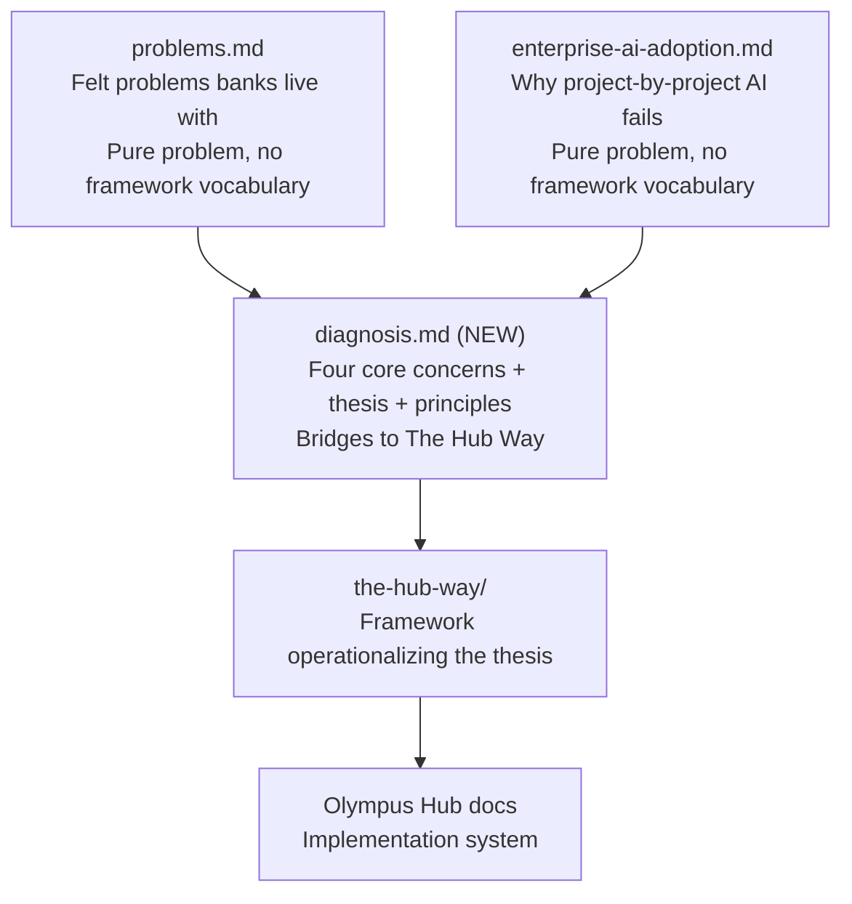

# Restructure: Problems, Diagnosis, and Thesis Separation

## Document architecture after this change

## File: [problems.md](org-8.0/what-we-sell/problems.md)

**Strip all Hub Way footnotes.** Remove every `> **Hub Way response:**` block (lines 51, 85, 119, 144, 187, 211). The document becomes a pure mirror of problems — relatable, agreeable, no framework vocabulary. The reader should finish it thinking "yes, that is exactly my reality" with no sense of being sold to.

No other content changes. The felt problems, procurement patterns, integration costs, organizational reality, systems gap, modernization trap, what has been tried, what forces action, and compound picture all stay as-is.

## File: [enterprise-ai-adoption.md](org-8.0/what-we-sell/enterprise-ai-adoption.md)

Three changes:

### 1. Fix the AI modeling paragraph (line 75)

Replace the current paragraph that reads as though AI agents cannot follow steps and modeling = defining goals. New version conveys:

- AI *can* follow existing sequences — but that's automation, not transformation
- AI can absorb parts of work that were never formally specified (judgment, coordination, compensation)
- AI can absorb *more* steps as the work is reasoned about and refined
- The model is what makes this progressive absorption visible and governable
- This is the foundation of why the change ahead is transformation, not automation

### 2. Strip the Hub Way sections (lines 127-151)

Remove "The Hub Way as Evaluation Framework" and "The Timing Challenge" sections. These belong in the diagnosis document. The enterprise-ai-adoption doc should end after establishing that decision makers need a model to evaluate AI approaches at domain scale — it should not name the Hub Way or position it.

The "What Decision Makers Need" section (lines 100-125) stays but is lightly edited to remove any forward reference to the Hub Way. It ends with the need for the model, not with the answer.

### 3. Remove working notes (lines 153-161)

Clean up the inline comments/notes at the bottom of the file.

## File: diagnosis.md (NEW)

New file at [org-8.0/what-we-sell/diagnosis.md](org-8.0/what-we-sell/diagnosis.md)

### Opening

Brief framing: the two companion documents describe the problems banks face in technology operations and in AI adoption. This document connects those problems to their structural causes, and proposes an alternative thesis.

### Part 1: The Four Core Concerns

The problems from both documents — despite their variety — trace to four structural conditions:

**1. Much of the work is invisible.**
The bank knows its major processes. But the full scope of work in a domain — the coordination between systems, the compensating logic, the judgment calls, the informal routines — was never modeled. It didn't need to be when humans handled it implicitly. The parts that were never modeled are invisible: invisible to management, invisible to measurement, invisible to AI. You can't transform what you can't see.

**2. Operational intelligence is locked in code — and fused to the vendor systems it connects.**
The bank's most valuable knowledge — how to coordinate systems, handle edge cases, enforce business rules, compensate for limitations — is encoded as bespoke integration logic. That logic is inseparable from the specific vendor systems it wires together. Changing the vendor means rebuilding the knowledge. Evolving the knowledge means touching the vendor integration. The double bind makes everything slow, expensive, and fragile.

**3. The architecture punishes evolution.**
Every new capability, every vendor change, every regulation, every AI agent adds integration burden. The cost-efficiency incentive ensures each response adds more plumbing. The more the bank modernizes, the slower it gets. The architecture and the procurement model both fight the strategy. Past approaches (ESBs, APIs, cloud, transformation programs) moved the complexity without eliminating it.

**4. Enterprise AI leverage depends on what doesn't exist yet.**
Project-by-project AI adoption produces tools and isolated agents — real value, but no compounding. Enterprise-scale AI requires agents that know what work they participate in, share context and governance, and compound on each other's capabilities. That requires a structural model of the domain's work — a model that banks do not have and that no current approach produces.

### Part 2: The Thesis

An alternative approach governed by a small set of principles. Each principle directly addresses one or more of the four core concerns:

- **Work, not systems, is the stable abstraction.** Systems change. Vendors change. The work — commitments to the outside world, internal disciplines that keep the domain healthy — persists. Model the work. (Addresses: work invisible, intelligence locked in code)
- **Operational intelligence should be declarative, not imperative.** Express the bank's knowledge as specifications — what needs to happen, what tools are available, what governance applies — not as bespoke code connecting specific systems. Specifications can be examined, reused, evolved, and interpreted by agents. Code cannot. (Addresses: intelligence locked in code, architecture punishes evolution)
- **The model must survive when the "who" changes.** Whether work is resolved by humans, AI, or any combination, the model stays the same. Changing who resolves the work is a configuration change, not a redesign. This is what makes AI adoption transformation rather than automation. (Addresses: AI leverage, architecture punishes evolution)
- **Progressive absorption, not replacement.** AI expands its role in work gradually — absorbing more steps, more judgment, more coordination — as the work model is reasoned about and refined. The model makes this expansion visible and governable. (Addresses: work invisible, AI leverage)
- **Domain by domain, at the domain's own pace.** No enterprise-wide big bang. Each domain starts where it is, models its work, and evolves independently. Each bank's unique mix of gaps and starting points is respected. (Addresses: architecture punishes evolution)

### Part 3: From Thesis to Framework

Brief bridge: these principles require a concrete framework to become actionable. The Hub Way is the operationalization of this thesis — translating the principles into a model that can be applied to any banking domain. Reference to the Hub Way documentation suite.

### Tone

Zeta practitioner voice. Strategic conviction. Not academic, not sales. The diagnosis earns intellectual respect; the thesis earns strategic alignment.