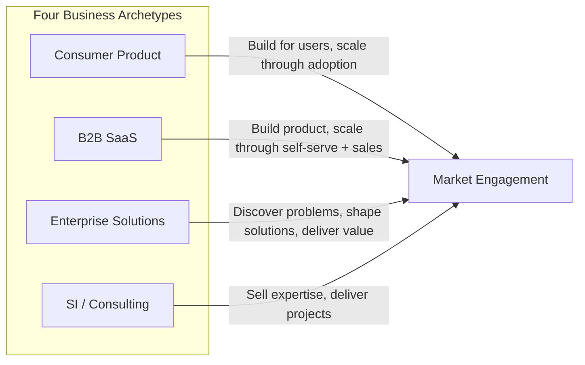

# The Enterprise Solutions Playbook — Mini-Book Plan

## Premise and Problem Statement

The central problem this book solves: executives and teams whose formative experience is in consumer products or B2B SaaS apply those playbooks to an enterprise solutions business. The result is systematic misalignment — in how they discover opportunities, shape deals, design delivery, measure success, and build organizations. This book provides the corrective lens.

## The Four-Archetype Contrast (Threaded Throughout)

Every chapter contrasts how the same strategic question is answered across four business archetypes:




Each chapter includes a **Contrast Table** showing how the chapter's core question resolves differently across these four models. This is the book's signature pedagogical device.

## Audience

Internal Zeta executives and leadership teams. The tone is McKinsey analytical rigor blended with a teaching structure ("the mistake" / "the correction" pattern) and enough directness to be actionable.

## Structure

The book is organized into five parts plus prologue and epilogue. Six chapters receive deep treatment (~~15-20 pages each); six chapters are treated more concisely (~~5-8 pages each) with an explicit callout in each brief chapter's introduction explaining why it is kept concise ("This topic is treated briefly here because..." or "This chapter provides a structural overview; deeper treatment would require...").

---

### File Structure

All files under `org-8.0/what-we-sell/solution-story/`:

```
solution-story/
  README.md                          # Book overview, reading guide, table of contents
  00-prologue.md                     # The Playbook Confusion
  01-problem-archetypes.md           # Ch 1 (concise)
  02-opportunity-discovery.md        # Ch 2 (DEEP)
  03-opportunity-sizing.md           # Ch 3 (concise)
  04-enterprise-value-pools.md       # Ch 4 (concise)
  05-solutions-business-archetypes.md # Ch 5 (concise)
  06-enterprise-buying-dynamics.md   # Ch 6 (DEEP)
  07-deal-shaping.md                 # Ch 7 (DEEP)
  08-delivery-models.md              # Ch 8 (DEEP)
  09-economics.md                    # Ch 9 (DEEP)
  10-scaling.md                      # Ch 10 (concise)
  11-platformization.md              # Ch 11 (DEEP)
  12-strategic-positioning.md        # Ch 12 (concise)
  13-epilogue.md                     # Beyond Archetypes
  bridging-to-zeta-reality.md        # Captured bridging thoughts (not part of the book)
  product-vs-solution-thinking.md    # Existing file — becomes the seed / retained as reference
```

---

### Chapter-by-Chapter Outline

#### Prologue: The Playbook Confusion (00-prologue.md)

**Purpose**: Set the stakes. Explain why applying the wrong playbook is not merely inefficient but structurally damaging.

- **The Invisible Playbook**: Every executive carries a mental model of "how business works" formed by their formative experience. When that model was shaped by consumer products (ship features, measure engagement, iterate) or B2B SaaS (build product, generate leads, convert trials), the instincts feel universal but are not.
- **The Four Archetypes**: Introduce the four business models as distinct strategic species — same genus (technology companies), different survival strategies. Consumer Product, B2B SaaS, Enterprise Solutions, SI/Consulting Firm.
- **The Cost of Misapplication**: Concrete examples of what goes wrong when consumer/SaaS instincts are applied to enterprise solutions:
  - Product managers define features (not solutions to enterprise problems)
  - GTM teams build funnels (not consultative discovery motions)
  - Pricing is modeled as subscription tiers (not value-based deal architecture)
  - Teams feel they "should be building for users" (misaligned reference points of success)
  - Success is measured in product metrics (DAU, NPS, feature velocity) instead of solution metrics (customer value realized, deal expansion, referencability)
- **How to Read This Book**: The 12-topic lifecycle, the four-column contrast as recurring device, which chapters go deep and why.
- **Named references**: Clayton Christensen's "jobs to be done" framework (how it applies differently to solutions vs products), Geoffrey Moore's "Crossing the Chasm" (written for products — what changes for solutions).

---

#### Part I: Finding the Problem

##### Chapter 1: Problem Archetypes (01-problem-archetypes.md) — CONCISE

**Key Question**: What types of enterprise problems support large solution businesses?

- Taxonomy of enterprise problem types: cost reduction, regulatory compliance, technology transitions, capability gaps, strategic differentiation.
- **The critical filter**: Not all problems are "solution problems." Some are product problems (well-defined, repeatable, self-serve solvable). Some are consulting problems (unique, advisory, no recurring technology component). Solution problems sit in the middle: complex enough to require co-development, repeatable enough to build leverageable IP.
- **Contrast Table**: How each archetype identifies "good problems" differently.


| Dimension      | Consumer                | B2B SaaS                  | Enterprise Solutions            | SI/Consulting               |
| -------------- | ----------------------- | ------------------------- | ------------------------------- | --------------------------- |
| Problem source | User pain points        | Workflow inefficiencies   | Enterprise transformation needs | Client asks                 |
| Validation     | User testing, analytics | Trial conversion rates    | Executive sponsorship + budget  | SOW signed                  |
| Problem scope  | Narrow, well-defined    | Moderate, workflow-scoped | Broad, cross-functional         | Whatever the client defines |


- **Banking example**: Why "core banking modernization" is a solution problem (not a product problem or a consulting problem) — and what that means for how you approach it.
- Callout: "This chapter provides a structural taxonomy. Deeper treatment of specific problem archetypes — with industry case studies — would require a companion volume."

---

##### Chapter 2: Opportunity Discovery (02-opportunity-discovery.md) — DEEP

**Key Question**: How are major solution opportunities discovered (not built)?

This is arguably the most important chapter because the consumer/SaaS instinct — "build product, they will come" — is the most damaging misapplication at this stage.

- **The fundamental difference**: In consumer and SaaS, the product creates demand by solving a visible user problem. In enterprise solutions, the opportunity exists before the solution — it lives in the gap between where an industry is and where it needs to be. Discovery is an analytical and relational act, not a product development act.
- **Pattern recognition across enterprises**: How consultants at McKinsey, Bain, Accenture discover repeatable patterns by seeing the same problem at multiple clients. The "third client" heuristic — the first client is interesting, the second is a coincidence, the third is a pattern.
- **Consulting-style diagnostic discovery**: How to structure diagnostic conversations with enterprise executives. The difference between "what features do you want?" (product thinking) and "what is the business outcome you cannot achieve with your current capabilities?" (solutions thinking).
- **Transformation triggers**: What causes enterprises to spend — regulatory mandates, competitive pressure, technology obsolescence, leadership change, M&A events. Solutions businesses track triggers, not user requests.
- **Pinpointing budget holders**: The money is not in "departmental budgets" (SaaS thinking). It is in transformation budgets, strategic initiative funds, regulatory compliance allocations, and board-mandated programs.
- **Contrast Table (detailed)**:


| Dimension                   | Consumer                                      | B2B SaaS                                                       | Enterprise Solutions                                                                              | SI/Consulting                                                 |
| --------------------------- | --------------------------------------------- | -------------------------------------------------------------- | ------------------------------------------------------------------------------------------------- | ------------------------------------------------------------- |
| How opportunities are found | User research, market trends, usage analytics | Inbound content marketing, community signals, competitive gaps | Pattern recognition across multiple enterprises, trigger event monitoring, diagnostic engagements | Client relationships, RFP responses, conference conversations |
| Who finds them              | Product managers, designers                   | Product + marketing                                            | Founders, senior partners, domain experts                                                         | Partners, business development                                |
| Time horizon                | Weeks                                         | Months                                                         | Years (pattern may take years to crystallize)                                                     | Reactive (client timing)                                      |
| Validation method           | Prototype testing                             | Trial/freemium conversion                                      | Diagnostic engagement + executive sponsorship                                                     | SOW acceptance                                                |
| Key risk                    | Building something nobody wants               | Building for a market that's too small                         | Seeing a pattern that doesn't generalize                                                          | Taking any project regardless of fit                          |


- **The anti-pattern**: Product managers at enterprise solutions companies who define "opportunity" as "a feature our competitors have that we don't." This is product thinking, not solutions thinking. The opportunity is the enterprise problem; the feature is an artifact of the solution.
- **Case studies**:
  - **Palantir**: Discovered the "intelligence integration" problem through government work, recognized the pattern in enterprise (public references: Palantir S-1 filing, Karp's letters to shareholders).
  - **ServiceNow**: Fred Luddy recognized that IT service management was a universal enterprise pain point from his experience at multiple companies (public reference: ServiceNow founding story, IPO prospectus).
  - **Veeva Systems**: Peter Gassner recognized that pharma/life sciences had unique CRM needs that Salesforce couldn't address, after seeing the pattern across engagements (public reference: Veeva S-1 filing).
- **Banking application**: How the "core banking modernization" opportunity is discovered — not by surveying banks about features, but by observing the compound problem (systems gap + plumbing problem + modernization trap) across multiple banking engagements.

---

##### Chapter 3: Opportunity Sizing (03-opportunity-sizing.md) — CONCISE

**Key Question**: How large is the market, and how do you model it?

- **Why TAM/SAM/SOM doesn't work (directly)**: SaaS companies size markets by counting potential users and multiplying by price per seat. Enterprise solutions companies must size markets by counting enterprises with the problem, estimating transformation budgets per enterprise, and modeling deal sizes and win rates.
- The "universe of affected enterprises" approach vs. the "number of potential users" approach.
- **Contrast Table**: TAM calculation differences across archetypes.
- **Banking example**: Sizing the core banking modernization market — not "number of banks x per-seat pricing" but "number of banks in modernization windows x average transformation budget x addressable share."
- Callout: "This chapter provides the structural approach to sizing. Detailed financial modeling is beyond scope."

---

##### Chapter 4: Enterprise Value Pools (04-enterprise-value-pools.md) — CONCISE

**Key Question**: Where does enterprise transformation money actually sit?

- The four major pools: IT services budgets, software platform budgets, outsourcing budgets, operational expense budgets.
- **The critical insight**: Enterprise money does not sit in "SaaS subscription" line items. It sits in transformation programs, strategic initiatives, run-the-bank vs. change-the-bank allocations, and vendor consolidation budgets. Knowing which pool you're targeting determines everything — sales motion, pricing, procurement path, competitive set.
- **Contrast Table**: Where revenue comes from across archetypes.
- **Banking example**: How banking technology budgets are structured — run vs. change, by domain, by vendor relationship. Why "displacing a SaaS subscription" is different from "winning a transformation budget allocation."
- Callout: "This chapter maps the terrain. Detailed value pool analysis for specific industries would require primary research."

---

#### Part II: Designing the Business

##### Chapter 5: Archetypes of Solutions Businesses (05-solutions-business-archetypes.md) — CONCISE

**Key Question**: What kind of solutions business are you building?

- Five archetypes within the solutions category itself:
  1. **Capability augmentation** (we add a capability the enterprise lacks — e.g., Workday adding HCM)
  2. **Transformation delivery** (we transform a domain — e.g., Accenture's industry practices)
  3. **Product-led solutions** (product IP + implementation + ongoing value — e.g., Salesforce enterprise)
  4. **Strategic intelligence systems** (we provide intelligence the enterprise can't build — e.g., Palantir)
  5. **Outcome/managed services** (we operate the outcome — e.g., ADP, Paychex)
- Most companies are hybrids. The question is which archetype is primary (drives revenue model, talent model, and scaling logic).
- **Banking example**: Banking technology companies mapped to archetypes — Temenos (product-led solutions), FIS/Fiserv (outcome/managed services + product-led), Thought Machine (capability augmentation), Accenture Avanade (transformation delivery).
- Callout: "This chapter provides the taxonomy. Each archetype's economics, scaling patterns, and organizational implications are explored in later chapters."

---

##### Chapter 6: Enterprise Buying Dynamics (06-enterprise-buying-dynamics.md) — DEEP

**Key Question**: How do enterprises actually purchase solutions?

This is the second most misunderstood area. Consumer and SaaS veterans expect "users adopt → usage proves value → purchase follows." Enterprise purchasing is fundamentally different.

- **Buying committees, not buyers**: The myth of "the decision maker." In reality, enterprise purchases involve 6-10 stakeholders across business, technology, risk, procurement, and operations — each with different evaluation criteria and veto power.
- **The three conversations** (drawn from the Zeta context but generalized): Every enterprise purchase involves parallel conversations with (1) the technology leadership (control + capability), (2) the business leadership (outcomes + speed), (3) the risk/procurement/governance apparatus (evidence + assurance). Winning one conversation while losing another kills the deal.
- **Political dynamics**: Champion vs. mobilizer. Why the person who loves your product may not be the person who can get it bought. The CEB/Gartner research on "mobilizers" vs. "talkers" (public reference: "The Challenger Customer" by Brent Adamson et al.).
- **Budget cycles and timing**: Enterprise budgets are planned 6-18 months in advance. A brilliant solution that arrives mid-cycle without a budget allocation will wait a year. Solutions businesses must map to budget planning cycles, not product release cycles.
- **Procurement processes**: RFPs, RFIs, vendor risk assessments, POCs, reference checks, contract negotiation — the full apparatus. Why "let them try it and they'll love it" (SaaS instinct) doesn't work when procurement requires 6 months of due diligence before a trial can begin.
- **Contrast Table (detailed)**:


| Dimension         | Consumer                    | B2B SaaS                             | Enterprise Solutions                                                       | SI/Consulting                                  |
| ----------------- | --------------------------- | ------------------------------------ | -------------------------------------------------------------------------- | ---------------------------------------------- |
| Who buys          | Individual user             | Department head / team lead          | Buying committee (6-10 stakeholders)                                       | Procurement + business sponsor                 |
| Purchase trigger  | Personal need / desire      | Team pain point                      | Strategic initiative / transformation program                              | Project need / board mandate                   |
| Evaluation method | Try it, like it, buy it     | Free trial / freemium / demo         | Multi-month evaluation: RFP, POC, reference checks, vendor risk assessment | Capabilities presentation, past work, team CVs |
| Sales cycle       | Minutes to days             | Weeks to months                      | 6-18 months                                                                | 3-6 months                                     |
| Key gatekeepers   | None (self-serve)           | IT admin, budget holder              | Risk, ISG, Procurement, Legal, Business Ops                                | Procurement, PMO                               |
| What kills deals  | Poor UX, better alternative | Lack of integration, poor onboarding | Failing the risk/procurement conversation                                  | Price, lack of relevant references             |


- **The "unhappy teams" problem**: When product teams feel frustrated that they're "not building for users," they're expressing a legitimate instinct in the wrong context. In enterprise solutions, the "user" in the consumer sense is 3-4 levels removed from the buyer. The product must work for users (table stakes), but the purchase decision is made by executives who will never use the product. The measurement of success must be enterprise outcomes (cost reduction, compliance achieved, transformation delivered), not user engagement metrics.
- **Case studies**:
  - **Salesforce's enterprise evolution**: Started as SaaS for salespeople (user-first). As deals grew larger, had to build an enterprise sales motion with buying committee navigation, professional services, and industry solutions (public reference: Salesforce annual reports, Benioff's "Behind the Cloud").
  - **Epic Systems in healthcare**: Never had a self-serve motion. Every sale is a multi-year, committee-driven enterprise decision. The product is excellent, but the sale is won through reference customers, executive relationships, and transformation credibility (public reference: Epic's sales methodology is well-documented in healthcare IT literature).

---

##### Chapter 7: Deal Shaping (07-deal-shaping.md) — DEEP

**Key Question**: How are large enterprise deals designed (not priced)?

- **Value framing vs. feature pricing**: In SaaS, pricing is simple: per-seat, per-usage, per-tier. In enterprise solutions, the deal is an architecture — a structure of value, risk, and commitment that must be designed.
- **ROI narratives**: The enterprise buyer needs a business case, not a feature list. How to construct ROI narratives that map to CFO language: cost avoidance, cost reduction, revenue enablement, risk mitigation, regulatory compliance.
- **Architecture shaping**: The solution architecture IS part of the deal. How the solution integrates with existing systems, what it replaces, what it augments — these are negotiated as part of deal shaping, not after the purchase.
- **Proof-of-concept strategies**: POCs in enterprise solutions are not "free trials." They are structured engagements with defined success criteria, often costing $100K-$1M to execute. The POC is a mini-engagement, not a product demo.
- **Risk mitigation**: How deals are structured to manage risk — phased rollouts, guaranteed milestones, shared-risk models, gain-sharing arrangements.
- **The pricing anti-pattern**: When enterprise solutions companies adopt SaaS-style subscription tiers, they leave enormous value on the table. A bank modernizing its card processing doesn't care about "tier 2 vs. tier 3" — it cares about "will this transformation achieve the business outcome, and what is that outcome worth?" Value-based pricing captures the economic value created, not the features consumed.
- **Contrast Table**:


| Dimension         | Consumer                           | B2B SaaS                                   | Enterprise Solutions                                                   | SI/Consulting                           |
| ----------------- | ---------------------------------- | ------------------------------------------ | ---------------------------------------------------------------------- | --------------------------------------- |
| Pricing model     | Per-unit / freemium / ad-supported | Per-seat / per-usage / tiered subscription | Value-based: deal-specific pricing tied to business outcomes           | Time & materials / fixed-price projects |
| Deal design       | No deal — self-serve               | Sales-assisted, standardized terms         | Architecturally designed: phased, milestone-based, risk-shared         | SOW-based, often competitive bid        |
| What's negotiated | Nothing (take it or leave it)      | Discount, contract length, SLA             | Architecture, scope, phases, risk allocation, IP ownership, exit terms | Rates, team composition, timeline       |
| POC / trial       | Free trial, freemium tier          | 14-30 day free trial                       | $100K-$1M structured engagement with defined success criteria          | Paid discovery phase                    |


- **Case studies**:
  - **Workday's deal structure**: Subscription revenue but enterprise deal shaping — multi-year contracts, phased implementations, executive sponsorship requirements (public reference: Workday 10-K filings, investor presentations).
  - **How Accenture shapes transformation deals**: Outcome-based contracting, shared-risk models, managed services transitions (public reference: Accenture annual reports, industry analyst coverage).

---

#### Part III: Delivering Value

##### Chapter 8: Delivery Models (08-delivery-models.md) — DEEP

**Key Question**: How are enterprise solutions actually delivered and implemented?

This is where the gap between "shipping a product" and "delivering a solution" is most visible.

- **Five delivery models**: Consulting delivery, product implementation, co-development, managed services, platform operations.
- **The delivery spectrum**: From pure consulting (all custom, no IP) to pure product (self-serve, no customization). Enterprise solutions occupy the middle — product IP configured and extended through a structured engagement methodology.
- **Why "ship and iterate" fails in enterprise**: Consumer products iterate in production — deploy, measure, adjust. Enterprise solutions cannot iterate on a bank's live card processing system the way you iterate on a mobile app feature. The cost of failure is regulatory, financial, and reputational. Delivery methodology exists to manage this asymmetry.
- **Knowledge transfer vs. dependency creation**: The best solutions businesses transfer capability to the customer. The worst create permanent dependency. The measurement: after the engagement, can the customer operate, configure, and extend the system without the vendor? If not, you've built a services business disguised as a product business.
- **Engagement Engineering as archetype**: Without naming it as a Zeta-specific methodology, describe the pattern: structured delivery with defined phases (initiate, discover, build, transfer, complete), squad-based execution, governed boundaries between platform and customer-specific work, verification as a first-class deliverable, and inner-source contribution patterns. This pattern is visible in mature solutions companies (Salesforce's implementation methodology, SAP's ASAP/Activate, ServiceNow's implementation framework).
- **Contrast Table**:


| Dimension            | Consumer                               | B2B SaaS                                    | Enterprise Solutions                                                             | SI/Consulting                                |
| -------------------- | -------------------------------------- | ------------------------------------------- | -------------------------------------------------------------------------------- | -------------------------------------------- |
| Delivery method      | App store / web — zero-touch           | Self-serve onboarding + customer success    | Structured engagement methodology: phased delivery, squads, governed milestones  | Project teams, SOW-driven delivery           |
| Customization        | None (one product for all)             | Configuration (limited)                     | Configuration + extension + integration (significant)                            | Fully custom (everything built from scratch) |
| Customer involvement | None (use the product)                 | Light (onboarding calls, success check-ins) | Deep (customer teams participate in discovery, UAT, transfer)                    | Deep (customer manages the project)          |
| Knowledge transfer   | N/A                                    | Documentation, training videos              | Structured transfer: documentation, training, certification, operational handoff | Varies (often poor — dependency is revenue)  |
| What compounds       | Product improvements benefit all users | Platform improvements benefit all tenants   | Engagement learnings feed back to platform (inner source)                        | Nothing — each project starts from scratch   |


- **Case studies**:
  - **SAP's implementation methodology evolution**: From waterfall to agile to "Activate" — how SAP learned that delivery methodology is as important as product quality (public reference: SAP Activate methodology documentation, SAP annual reports).
  - **Salesforce's implementation ecosystem**: How Salesforce built a partner ecosystem for implementation while retaining platform IP (public reference: Salesforce partner program documentation, Trailhead).

---

#### Part IV: Building the Machine

##### Chapter 9: Economics of Solutions Businesses (09-economics.md) — DEEP

**Key Question**: What drives revenue and margins, and why are they different from SaaS economics?

- **Why SaaS metrics mislead**: ARR, NRR, CAC/LTV, Rule of 40 — these are the vocabulary of SaaS economics. Enterprise solutions businesses have different unit economics, and applying SaaS metrics creates false conclusions.
- **Utilization vs. subscription**: Services-heavy solutions businesses are bounded by utilization (how much of your delivery capacity is billable). Product-heavy solutions businesses generate platform revenue that scales without proportional headcount. The mix determines margin structure.
- **Deal mix**: The balance between services revenue (linear, headcount-bounded) and platform revenue (recurring, leveraged). Healthy solutions businesses deliberately shift the mix toward platform over time.
- **Product attachment rate**: The percentage of services engagements that result in platform adoption. Low attachment rate = you're a services company. High attachment rate = you're a product company with a services-led GTM.
- **Operational leverage**: The ratio of incremental revenue to incremental cost. In SaaS, operational leverage is high (each new customer costs nearly nothing to serve). In enterprise solutions, operational leverage depends on how much of the delivery is productized vs. custom.
- **The margin structure contrast**:


| Metric                 | Consumer                              | B2B SaaS                          | Enterprise Solutions                                           | SI/Consulting                 |
| ---------------------- | ------------------------------------- | --------------------------------- | -------------------------------------------------------------- | ----------------------------- |
| Gross margin           | 60-80% (ad/freemium), higher for paid | 70-85%                            | 40-65% (blended services + platform)                           | 25-40%                        |
| Revenue scaling        | Network effects, viral                | Self-serve + sales-assisted       | Deal-by-deal, reference-driven                                 | Headcount-linear              |
| Key constraint         | User acquisition cost                 | Sales efficiency (CAC payback)    | Delivery capacity + deal pipeline                              | Bench utilization             |
| Margin expansion lever | Scale (fixed costs amortized)         | Upsell/cross-sell within accounts | Platformization (shift mix from services to product)           | Rate increases, offshoring    |
| Valuation driver       | Users, engagement, growth rate        | ARR, NRR, Rule of 40              | Platform ARR, gross margin trajectory, customer lifetime value | Revenue, utilization, backlog |


- **The dangerous misapplication**: When a solutions company is measured purely by SaaS metrics, it looks "bad" — lower margins, slower growth, longer sales cycles. This creates internal pressure to "become more SaaS-like" by cutting services, simplifying pricing, and pushing self-serve. For most enterprise solutions businesses, this is suicidal — the services are the wedge that wins the deal, the delivery creates the switching costs, and the relationship enables expansion.
- **Case studies**:
  - **Palantir's margin evolution**: How Palantir's gross margins improved from ~65% to ~80% as it shifted from services-heavy to platform-heavy revenue (public reference: Palantir 10-K filings, quarterly earnings).
  - **Veeva Systems**: Consistently high margins (~70%+ subscription gross margin) because it productized deeply within a vertical, reducing services intensity (public reference: Veeva 10-K filings).
  - **Cognizant/Infosys comparison**: How Indian IT services companies operate on utilization economics vs. how product-led solutions companies operate on platform economics (public reference: annual reports, industry analyst coverage).

---

##### Chapter 10: Scaling the Business (10-scaling.md) — CONCISE

**Key Question**: How do solutions businesses achieve repeatable growth?

- **Reference customers, not viral loops**: Growth in enterprise solutions is driven by reference customers — logo names that give other enterprises permission to buy. The first 3-5 customers are existential. Every one must be a success.
- **Land-and-expand, enterprise edition**: In SaaS, land-and-expand means "start with a team, grow to a department." In enterprise solutions, it means "start with one domain/division, expand to adjacent domains/divisions." The expansion is architecturally driven, not virally driven.
- **Capability expansion vs. feature addition**: Solutions businesses grow by expanding the solution's scope (new domains, new problems, new value pools), not by adding features to the existing product.
- **Geographic expansion**: International growth in enterprise solutions requires local regulatory expertise, local delivery capacity, and local references — not just localization of the product.
- **Partner ecosystems**: Implementation partners, technology partners, advisory partners — the ecosystem that multiplies your delivery capacity without proportional headcount growth.
- **Contrast Table**: Growth mechanics across archetypes.
- Callout: "This chapter provides the strategic framework for scaling. Detailed go-to-market playbooks for each scaling vector would require a companion volume."

---

##### Chapter 11: Platformization (11-platformization.md) — DEEP

**Key Question**: How do solutions evolve into scalable platforms — and when should they?

This chapter addresses the most consequential strategic question for a maturing solutions business.

- **The platformization thesis**: Every successful enterprise solutions company eventually faces the question: "Should we become a platform?" The answer is almost always yes, but the timing and approach determine whether the transition creates value or destroys it.
- **The four phases**:
  1. **Repeatable solution patterns**: You notice you're solving the same problem the same way at multiple customers. The solution is still custom, but the architecture is converging.
  2. **Productization**: You extract the repeatable parts into a product — configurable, deployable, upgradeable independently of any single customer's instance.
  3. **Platform strategy**: The product becomes a platform — extensible by customers, partners, and third parties. The value shifts from "what we built" to "what can be built on top of what we built."
  4. **Ecosystem growth**: The platform attracts an ecosystem of builders — ISVs, integrators, complementary products. The platform's value grows with the ecosystem, not just with your own R&D investment.
- **The premature platformization trap**: Building a platform before you have repeatable patterns is the most common failure mode. You end up with a general-purpose platform that solves no specific problem well. The correct sequence is: solve specific problems → notice patterns → extract platform. Never: build platform → hope problems arrive.
- **The reluctant platformization trap**: Staying in "custom solutions" mode too long because each customer engagement is profitable. Meanwhile, a competitor extracts the patterns, builds the platform, and makes your custom work obsolete.
- **Contrast Table**:


| Dimension       | Consumer                                   | B2B SaaS                                                        | Enterprise Solutions                                        | SI/Consulting                                      |
| --------------- | ------------------------------------------ | --------------------------------------------------------------- | ----------------------------------------------------------- | -------------------------------------------------- |
| Platform timing | Product IS the platform from day one       | Platform emerges from product (APIs, integrations, marketplace) | Platform extracted from repeated solution delivery          | Rarely platforms (methodology, not technology)     |
| Platform risk   | Over-engineering before product-market fit | Opening APIs before the product is defensible                   | Platformizing before patterns are proven                    | Building technology when your talent is consulting |
| Ecosystem       | App stores, developer communities          | Integration partners, API consumers                             | Implementation partners, ISV ecosystem, technology partners | Subcontractors, offshore delivery                  |
| Value capture   | Platform fee / revenue share               | Subscription + marketplace take rate                            | Platform license + implementation + ongoing services        | Billable hours                                     |


- **Case studies**:
  - **ServiceNow's platformization**: Started as IT service management SaaS, recognized repeatable patterns across IT workflows, extracted the Now Platform, opened to ISVs and enterprise developers. Textbook phase-by-phase evolution (public reference: ServiceNow annual reports, Bill McDermott investor communications, platform documentation).
  - **Salesforce's platform evolution**: From CRM product to Force.com to Lightning Platform to Hyperforce. Each phase expanded what could be built on the platform (public reference: Salesforce platform evolution documentation, investor presentations).
  - **AWS**: Started as Amazon's internal infrastructure, recognized the pattern (every company needs this), extracted the platform, built the ecosystem. The canonical platformization story (public reference: AWS history, Andy Jassy presentations).

---

##### Chapter 12: Strategic Positioning (12-strategic-positioning.md) — CONCISE

**Key Question**: What is the company's long-term strategic identity?

- **Four identity end-states**: Consulting firm, technology platform, industry infrastructure provider, managed services operator. Most companies are hybrids, but the primary identity determines organizational structure, talent model, and investor narrative.
- **The identity crisis**: Many solutions companies experience an identity crisis between years 5 and 10 — "Are we a product company? A services company? A platform company? A consulting firm?" The answer shapes everything: who you hire, how you're valued, what customers expect.
- **The investor narrative**: How the market values each identity differently. Platform companies get premium multiples (10-20x revenue). Services companies get discount multiples (1-3x revenue). The transition from "services company valuation" to "platform company valuation" is one of the most consequential strategic moves a solutions business can make.
- **Contrast Table**: Identity markers across archetypes.
- **Banking examples**: Where Temenos, FIS, Fiserv, Thought Machine, and Accenture Avanade sit on this spectrum — and how their strategic positioning determines their competitive dynamics.
- Callout: "This chapter provides the strategic framework. The choice of positioning for any specific company requires deep analysis of its capabilities, market position, and competitive dynamics."

---

#### Epilogue: Beyond Archetypes (13-epilogue.md)

**Purpose**: The essential closing message — no company is a pure archetype.

- **Archetypes are lenses, not labels**: Every real company is a hybrid. The value of understanding archetypes is not to pick one and follow it rigidly, but to recognize which instincts and playbooks are shaping decisions, evaluate whether those instincts fit the current context, and deliberately choose the right playbook for each strategic question.
- **The evolution imperative**: Companies evolve. Salesforce started as SaaS and evolved into an enterprise solutions platform. Palantir started as a solutions company and is evolving into a platform. Accenture started as consulting and is evolving toward product-led solutions. The trajectory matters more than the label.
- **Context over doctrine**: The best executives are not those who apply one playbook consistently. They are those who deeply understand their company's unique context — its customers, capabilities, competitive position, and stage of evolution — and select the right playbook elements for each decision. Some decisions call for product thinking. Others call for solutions thinking. The skill is knowing which is which.
- **Creating your own archetype**: Some companies evolve in ways that don't map to any existing archetype. They create a new pattern — one that others later study and emulate. The goal is not to fit a mold but to build a business that works, and if that business creates a new archetype along the way, so much the better.

---

### Bridging Document (bridging-to-zeta-reality.md)

This is **not part of the book**. It is a working document that captures thoughts on how the book's frameworks connect to Zeta's specific reality — to be developed collaboratively later with additional context from the user.

Initial captured bridging thoughts based on what's visible in the codebase:

- Zeta's Engagement Engineering methodology is a strong example of the "structured delivery" pattern described in Chapter 8
- The Hub Way (Streams/Loops/Channels/Teams/Machines) is a domain modeling framework that embodies solutions thinking — it models work, not features
- The five-layer leverage model (Infrastructure, Integration, Frameworks, Product Lines, Engagement Engineering) maps to the "platformization" sequence in Chapter 11
- The three-persona buyer analysis (CIO/CTO, Business, Risk/Procurement) maps directly to the "three conversations" in Chapter 6
- The anti-patterns described in the Prologue (feature-first PM, funnel-based GTM, subscription pricing, user-centric success metrics) are explicitly relevant to current organizational dynamics
- The "problems.md" document's articulation of banking's compound problem (systems gap + plumbing problem + modernization trap) is a textbook example of Chapter 2's "pattern recognition across enterprises"

---

### Writing Sequence

Recommended order of writing (not reading order — optimized for building momentum and establishing the contrast framework early):

1. **00-prologue.md** — Establishes the four-archetype contrast and the "why" of the book
2. **02-opportunity-discovery.md** — The highest-value chapter; sets the tone for solutions thinking
3. **06-enterprise-buying-dynamics.md** — The second most misunderstood area
4. **09-economics.md** — Grounds the argument in financial reality
5. **08-delivery-models.md** — Connects solutions thinking to operational reality
6. **07-deal-shaping.md** — Bridges buying dynamics to delivery
7. **11-platformization.md** — The strategic evolution chapter
8. **01-problem-archetypes.md** — Concise, can reference deeper chapters
9. **03-opportunity-sizing.md** — Concise
10. **04-enterprise-value-pools.md** — Concise
11. **05-solutions-business-archetypes.md** — Concise
12. **10-scaling.md** — Concise
13. **12-strategic-positioning.md** — Concise
14. **13-epilogue.md** — Closing
15. **README.md** — Table of contents and reading guide (written last)
16. **bridging-to-zeta-reality.md** — Ongoing capture

### Estimated Scope

- **Deep chapters** (6): ~15-20 pages each = ~90-120 pages
- **Concise chapters** (6): ~5-8 pages each = ~30-48 pages
- **Prologue + Epilogue**: ~10-15 pages each = ~20-30 pages
- **Total**: approximately 140-200 pages — a genuine mini-book

### Key Stylistic Conventions

- Every chapter opens with its **Key Question** in bold
- Every chapter includes a **Four-Archetype Contrast Table**
- Deep chapters include **named case studies with public references**
- Concise chapters include a **scope callout** explaining why they're brief
- Anti-patterns are called out in a recurring section titled **"The Misapplication"**
- Banking examples appear in a recurring section titled **"In Banking"**
- No Zeta-specific prescriptions in the book itself (reserved for bridging doc)

