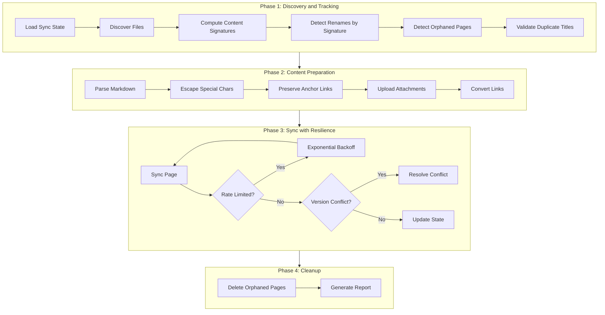

# Confluence Sync - Edge Case Fixes Implementation Plan

## Scope Summary

This plan addresses **12 issues** across critical and medium priority:

| Category | Issues |

|----------|--------|

| Identity Tracking | File rename, directory rename, title change detection |

| Orphan Management | File deletion with auto-delete |

| Data Integrity | Duplicate title detection, special character escaping |

| Resilience | Rate limiting, retry logic, conflict detection |

| Content Fidelity | Anchor link preservation, attachments support |

---

## Architecture Overview



---

## Implementation Details

### 1. Content Signature Tracking (for Rename Detection)

**Files to modify:**

- [`_confluence_sync/scripts/sync_state.py`](_confluence_sync/scripts/sync_state.py)
- [`_confluence_sync/scripts/content_preparer.py`](_confluence_sync/scripts/content_preparer.py)

**Approach:**

Add a `content_signature` field to state that captures the "identity" of a file (first 500 chars + structure hash). When a file path is not found in state but its signature matches an existing entry, treat it as a rename.

```python
# New function in sync_state.py
def compute_content_signature(markdown_content: str) -> str:
    """Compute identity signature from content structure (headings, first 500 chars)."""
    lines = markdown_content.split('\n')
    headings = [l for l in lines if l.startswith('#')]
    signature_base = '\n'.join(headings[:5]) + markdown_content[:500]
    return hashlib.sha256(signature_base.encode()).hexdigest()[:16]
```

State entry will include:

```json
{
  "file_path": "docs/guide.md",
  "content_signature": "a1b2c3d4e5f6g7h8",
  "page_id": "12345",
  ...
}
```

### 2. Rename Detection Logic

**Files to modify:**

- [`_confluence_sync/scripts/sync-to-confluence.py`](_confluence_sync/scripts/sync-to-confluence.py)
- [`_confluence_sync/scripts/sync_state.py`](_confluence_sync/scripts/sync_state.py)

**Approach:**

After file discovery, for files without existing state entries:

1. Compute content signature
2. Search state for matching signature with different path
3. If found, mark as "renamed" and update the existing page instead of creating new
```python
# New function in sync_state.py
def find_by_signature(sync_state: Dict, signature: str, exclude_path: str) -> Optional[Dict]:
    """Find existing entry by content signature (for rename detection)."""
    for path, entry in sync_state['sync_history'].items():
        if path != exclude_path and entry.get('content_signature') == signature:
            return {'old_path': path, **entry}
    return None
```


### 3. Orphan Detection and Auto-Delete

**Files to modify:**

- [`_confluence_sync/scripts/sync-to-confluence.py`](_confluence_sync/scripts/sync-to-confluence.py)
- [`_confluence_sync/scripts/confluence_sync.py`](_confluence_sync/scripts/confluence_sync.py)

**New file:**

- [`_confluence_sync/scripts/orphan_handler.py`](_confluence_sync/scripts/orphan_handler.py)

**Approach:**

1. After file discovery, compare discovered files against state entries
2. State entries without corresponding files are "orphaned"
3. Exclude renamed files (detected by signature)
4. Delete orphaned pages from Confluence
5. Remove from state
```python
# orphan_handler.py
class OrphanHandler:
    def find_orphans(self, sync_state: Dict, discovered_files: Set[str]) -> List[Dict]:
        """Find state entries that no longer have corresponding files."""
        orphans = []
        for path, entry in sync_state['sync_history'].items():
            if path not in discovered_files:
                # Check if it was renamed (signature match elsewhere)
                if not self.is_renamed(entry, discovered_files, sync_state):
                    orphans.append({'path': path, **entry})
        return orphans
    
    def delete_orphans(self, orphans: List[Dict], confluence_sync: ConfluenceSync) -> List[str]:
        """Delete orphaned pages from Confluence."""
        deleted = []
        for orphan in orphans:
            page_id = orphan.get('page_id')
            if page_id:
                try:
                    confluence_sync.delete_page(page_id)
                    deleted.append(orphan['path'])
                except Exception as e:
                    print(f"  Warning: Could not delete orphan {page_id}: {e}")
        return deleted
```


Add to `confluence_sync.py`:

```python
def delete_page(self, page_id: str) -> bool:
    """Delete a page from Confluence."""
    try:
        self._make_request('DELETE', f'/content/{page_id}')
        return True
    except Exception:
        return False
```

### 4. Title Change Detection

**Files to modify:**

- [`_confluence_sync/scripts/confluence_sync.py`](_confluence_sync/scripts/confluence_sync.py)
- [`_confluence_sync/scripts/sync_state.py`](_confluence_sync/scripts/sync_state.py)

**Approach:**

Store `page_title` in state. When syncing, if title differs from stored title:

1. Update page title in Confluence (already works via PUT)
2. Log the title change
3. Update state with new title
```python
# In confluence_sync.py create_or_update_page_from_storage()
# Add title change detection:
title_changed = (previous_title and previous_title != title)
if title_changed:
    # Title change triggers update even if content unchanged
    ...
```


### 5. Duplicate Title Detection

**Files to modify:**

- [`_confluence_sync/scripts/content_preparer.py`](_confluence_sync/scripts/content_preparer.py)
- [`_confluence_sync/scripts/sync-to-confluence.py`](_confluence_sync/scripts/sync-to-confluence.py)

**Approach:**

During title cache building, detect and warn about duplicates:

```python
# In sync-to-confluence.py during title cache building
title_to_files: Dict[str, List[str]] = {}
for rel_path, title in file_to_title.items():
    if title not in title_to_files:
        title_to_files[title] = []
    title_to_files[title].append(rel_path)

# Warn about duplicates
duplicates = {t: paths for t, paths in title_to_files.items() if len(paths) > 1}
if duplicates:
    print("WARNING: Duplicate page titles detected:")
    for title, paths in duplicates.items():
        print(f"  '{title}': {paths}")
    print("  Links to these pages may resolve incorrectly.")
```

### 6. Special Character Escaping

**Files to modify:**

- [`_confluence_sync/scripts/content_preparer.py`](_confluence_sync/scripts/content_preparer.py)

**Approach:**

Add XML escaping for titles and content that goes into Confluence storage format:

```python
# New utility function
def escape_xml(text: str) -> str:
    """Escape special characters for Confluence XML storage format."""
    replacements = [
        ('&', '&amp;'),
        ('<', '&lt;'),
        ('>', '&gt;'),
        ('"', '&quot;'),
        ("'", '&apos;'),
    ]
    for old, new in replacements:
        text = text.replace(old, new)
    return text

def escape_title_for_confluence(title: str) -> str:
    """Escape title for use in Confluence link references."""
    # Confluence titles can't contain certain characters
    return escape_xml(title.strip())
```

Apply in `convert_html_links_to_confluence()`:

```python
return f'<ac:link><ri:page ri:content-title="{escape_xml(page_title)}"/>...'
```

### 7. Rate Limiting with Exponential Backoff

**Files to modify:**

- [`_confluence_sync/scripts/confluence_sync.py`](_confluence_sync/scripts/confluence_sync.py)

**Approach:**

Add retry logic with exponential backoff to `_make_request()`:

```python
import time
from typing import Callable

def _make_request_with_retry(
    self,
    method: str,
    endpoint: str,
    max_retries: int = 3,
    base_delay: float = 1.0,
    **kwargs
) -> requests.Response:
    """Make API request with retry and exponential backoff."""
    last_exception = None
    
    for attempt in range(max_retries + 1):
        try:
            response = self._make_request_internal(method, endpoint, **kwargs)
            return response
        except requests.exceptions.HTTPError as e:
            last_exception = e
            if e.response is not None:
                status_code = e.response.status_code
                
                # Rate limited
                if status_code == 429:
                    retry_after = e.response.headers.get('Retry-After', base_delay * (2 ** attempt))
                    delay = float(retry_after)
                    print(f"  Rate limited. Waiting {delay}s before retry...")
                    time.sleep(delay)
                    continue
                
                # Server error - retry
                if status_code >= 500:
                    delay = base_delay * (2 ** attempt)
                    print(f"  Server error {status_code}. Retrying in {delay}s...")
                    time.sleep(delay)
                    continue
                
                # Client error - don't retry
                raise
        except requests.exceptions.ConnectionError as e:
            last_exception = e
            delay = base_delay * (2 ** attempt)
            print(f"  Connection error. Retrying in {delay}s...")
            time.sleep(delay)
            continue
    
    raise last_exception
```

### 8. Version Conflict Detection

**Files to modify:**

- [`_confluence_sync/scripts/confluence_sync.py`](_confluence_sync/scripts/confluence_sync.py)
- [`_confluence_sync/scripts/sync_state.py`](_confluence_sync/scripts/sync_state.py)

**Approach:**

Before updating, check if page version matches expected version from state:

```python
# In create_or_update_page_from_storage()
if existing_id:
    response = self._make_request('GET', f'/content/{existing_id}', params={'expand': 'version'})
    current_version = response.json()['version']['number']
    expected_version = previous_version  # From state
    
    if expected_version and current_version != expected_version:
        print(f"  Warning: Version conflict detected for '{title}'")
        print(f"    Expected version {expected_version}, found {current_version}")
        print(f"    Page was modified in Confluence since last sync.")
        # Still proceed with update (last-write-wins) but log it
```

### 9. Anchor Link Preservation

**Files to modify:**

- [`_confluence_sync/scripts/content_preparer.py`](_confluence_sync/scripts/content_preparer.py)

**Approach:**

1. Generate Confluence anchor macros for headings
2. Preserve anchor fragments in cross-page links
```python
def _add_anchors_to_headings(self, html: str) -> str:
    """Add Confluence anchor macros to headings for deep linking."""
    def add_anchor(match):
        tag = match.group(1)
        content = match.group(2)
        # Generate slug from heading text
        slug = re.sub(r'[^\w\s-]', '', content.lower())
        slug = re.sub(r'[\s_]+', '-', slug).strip('-')
        anchor = f'<ac:structured-macro ac:name="anchor"><ac:parameter ac:name="">{slug}</ac:parameter></ac:structured-macro>'
        return f'<{tag}>{anchor}{content}</{tag}>'
    
    return re.sub(r'<(h[1-6])>([^<]+)</\1>', add_anchor, html)

def convert_html_links_to_confluence(self, html: str, ...):
    # Preserve anchor in link
    if anchor:
        return f'<ac:link ac:anchor="{anchor}"><ri:page ri:content-title="{page_title}"/>...'
```


### 10. Attachments Support (Images)

**New files:**

- [`_confluence_sync/scripts/attachment_handler.py`](_confluence_sync/scripts/attachment_handler.py)

**Files to modify:**

- [`_confluence_sync/scripts/confluence_sync.py`](_confluence_sync/scripts/confluence_sync.py)
- [`_confluence_sync/scripts/content_preparer.py`](_confluence_sync/scripts/content_preparer.py)

**Approach:**

1. Detect image references in Markdown (``)
2. Upload images as Confluence attachments
3. Replace image references with Confluence image macros
```python
# attachment_handler.py
class AttachmentHandler:
    def __init__(self, confluence_sync: ConfluenceSync):
        self.confluence = confluence_sync
        self.uploaded: Dict[str, str] = {}  # local_path -> attachment_name
    
    def find_images_in_markdown(self, content: str, base_path: Path) -> List[Path]:
        """Find all local image references in Markdown content."""
        pattern = r'!\[([^\]]*)\]\(([^)]+)\)'
        images = []
        for match in re.finditer(pattern, content):
            img_path = match.group(2)
            if not img_path.startswith(('http://', 'https://', 'data:')):
                full_path = (base_path / img_path).resolve()
                if full_path.exists():
                    images.append(full_path)
        return images
    
    def upload_attachment(self, page_id: str, file_path: Path) -> Optional[str]:
        """Upload file as attachment to page."""
        # POST /content/{id}/child/attachment
        ...
    
    def convert_image_references(self, html: str, page_id: str) -> str:
        """Convert image tags to Confluence attachment references."""
        # Replace  with <ac:image><ri:attachment ri:filename="local.png"/></ac:image>
        ...
```


---

## Implementation Phases

### Phase A: Core Identity Tracking (Issues 1-4)

1. Add `content_signature` to state schema
2. Implement rename detection
3. Implement orphan detection  
4. Implement auto-delete
5. Add title change detection

### Phase B: Data Integrity (Issues 5-6)

1. Add duplicate title detection and warning
2. Implement XML escaping for titles and content

### Phase C: Resilience (Issues 7-8)

1. Implement retry with exponential backoff
2. Add rate limit handling (429)
3. Add version conflict detection

### Phase D: Content Fidelity (Issues 9-10)

1. Add anchor generation for headings
2. Preserve anchors in cross-page links
3. Implement attachment upload
4. Convert image references

---

## State Schema Changes

Current state entry:

```json
{
  "file_path": "docs/guide.md",
  "page_id": "12345",
  "page_title": "Guide",
  "content_hash": "abc...",
  "parent_id": "67890",
  "version": 5,
  "last_sync_commit": "a1b2c3d"
}
```

New state entry (additions highlighted):

```json
{
  "file_path": "docs/guide.md",
  "page_id": "12345",
  "page_title": "Guide",
  "content_hash": "abc...",
  "content_signature": "x1y2z3...",  // NEW: for rename detection
  "parent_id": "67890",
  "version": 5,
  "last_sync_commit": "a1b2c3d",
  "attachments": ["image1.png", "image2.jpg"]  // NEW: tracked attachments
}
```

---

## Testing Strategy

### Test File Structure

```
_confluence_sync/
  tests/
    __init__.py
    test_content_signature.py      # Unit tests for signature computation
    test_orphan_handler.py         # Unit tests for orphan detection
    test_escape_utils.py           # Unit tests for XML escaping
    test_retry_logic.py            # Unit tests for retry/backoff
    test_anchor_generation.py      # Unit tests for anchor links
    test_attachment_handler.py     # Unit tests for image handling
    test_integration.py            # Integration test suite
    fixtures/                      # Test data
      renamed-file/
      deleted-file/
      duplicate-titles/
      special-chars/
      with-images/
```

### Unit Tests

| Test File | Test Cases |

|-----------|------------|

| `test_content_signature.py` | `test_signature_same_content_same_hash`, `test_signature_different_content_different_hash`, `test_signature_ignores_whitespace_changes`, `test_signature_detects_structural_changes`, `test_signature_with_empty_content` |

| `test_orphan_handler.py` | `test_find_orphans_returns_deleted_files`, `test_find_orphans_excludes_renamed_files`, `test_find_orphans_empty_state`, `test_delete_orphans_calls_api`, `test_delete_orphans_handles_api_errors` |

| `test_escape_utils.py` | `test_escape_ampersand`, `test_escape_angle_brackets`, `test_escape_quotes`, `test_escape_combined_special_chars`, `test_escape_already_escaped_content`, `test_escape_empty_string` |

| `test_retry_logic.py` | `test_retry_on_429_with_retry_after`, `test_retry_on_500_with_backoff`, `test_no_retry_on_400`, `test_no_retry_on_401`, `test_retry_on_connection_error`, `test_max_retries_exceeded` |

| `test_anchor_generation.py` | `test_anchor_from_simple_heading`, `test_anchor_from_heading_with_spaces`, `test_anchor_from_heading_with_special_chars`, `test_anchor_preserves_case`, `test_multiple_headings_unique_anchors` |

| `test_attachment_handler.py` | `test_find_local_images`, `test_ignore_remote_images`, `test_ignore_data_urls`, `test_upload_attachment_success`, `test_upload_attachment_failure`, `test_convert_img_to_confluence_macro` |

### Integration Tests

| Test Scenario | Description | Setup | Expected Outcome |

|---------------|-------------|-------|------------------|

| **IT-01: File Rename** | File renamed from `old.md` to `new.md`, content unchanged | Create file, sync, rename file, sync again | Same page updated (not new page created), old path removed from state |

| **IT-02: Directory Rename** | Directory `old-dir/` renamed to `new-dir/` | Create dir with files, sync, rename dir, sync again | Directory page and children updated, old paths removed |

| **IT-03: File Deletion** | File `deleted.md` removed from repo | Create file, sync, delete file, sync again | Confluence page deleted, entry removed from state |

| **IT-04: Directory Deletion** | Directory with files deleted | Create dir with files, sync, delete dir, sync again | All pages under directory deleted |

| **IT-05: Title Change** | H1 title changed from "Old Title" to "New Title" | Create file with title, sync, change title, sync again | Same page updated with new title (not duplicate created) |

| **IT-06: Duplicate Titles** | Two files with same H1 "Guide" | Create two files with same H1 | Warning logged, both files synced, links may be ambiguous |

| **IT-07: Special Chars in Title** | Title contains `<Test> & "Quotes"` | Create file with special char title | Title properly escaped, page created successfully |

| **IT-08: Special Chars in Content** | Content contains `<code>` and `&` | Create file with special chars | Content properly escaped and rendered |

| **IT-09: Rate Limiting** | API returns 429 | Mock API to return 429 then 200 | Retry with backoff, eventually succeeds |

| **IT-10: Server Error** | API returns 500 | Mock API to return 500 then 200 | Retry with backoff, eventually succeeds |

| **IT-11: Version Conflict** | Page edited in Confluence between syncs | Sync, manually increment version in mock, sync again | Warning logged, page still updated |

| **IT-12: Anchor Links** | File links to `other.md#section` | Create files with anchor links | Anchor preserved in Confluence link macro |

| **IT-13: Local Images** | File references `./image.png` | Create file with local image reference | Image uploaded as attachment, reference converted |

| **IT-14: Mixed Changes** | Multiple files: some renamed, some deleted, some unchanged | Complex scenario with all change types | Each change type handled correctly |

| **IT-15: Parent Change** | File moved from `dir-a/file.md` to `dir-b/file.md` | Create file in dir-a, sync, move to dir-b, sync | Page moved to new parent in Confluence |

### Test Fixtures

| Fixture | Contents |

|---------|----------|

| `fixtures/renamed-file/` | `before/guide.md` and `after/user-guide.md` (same content signature) |

| `fixtures/deleted-file/` | `existing.md` with mock state entry, no actual file |

| `fixtures/duplicate-titles/` | `dir1/guide.md` and `dir2/guide.md` both with `# Guide` |

| `fixtures/special-chars/` | `test.md` with title `# <Test> & "More"` |

| `fixtures/with-images/` | `doc.md` referencing `./assets/diagram.png` |

### Test Execution

```bash
# Run all unit tests
pytest _confluence_sync/tests/ -v --ignore=_confluence_sync/tests/test_integration.py

# Run integration tests (requires mock or test Confluence)
pytest _confluence_sync/tests/test_integration.py -v

# Run with coverage
pytest _confluence_sync/tests/ --cov=_confluence_sync/scripts --cov-report=html
```

---

## Estimated Effort

| Phase | Components | Estimated Lines | Complexity |

|-------|------------|-----------------|------------|

| A: Identity Tracking | 4 features | ~300 lines | High |

| B: Data Integrity | 2 features | ~100 lines | Medium |

| C: Resilience | 3 features | ~150 lines | Medium |

| D: Content Fidelity | 3 features | ~250 lines | High |

| **Total** | **12 features** | **~800 lines** | |