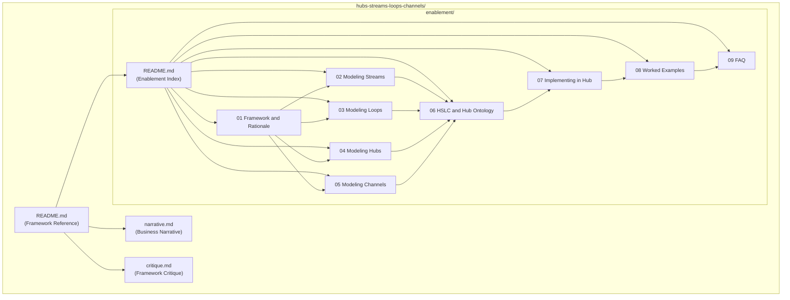

# HSLC Documentation Suite

## Context

The Hubs-Streams-Loops-Channels (HSLC) framework has been refined through discussion into a precise conceptual model:

- **Hub**: Bounded business domain; the system. Operations and collaboration fabric over existing systems (not a replacement). Maps to Workbench in Olympus Hub.
- **Stream**: External commitments — value delivery triggered by explicit requests from outside the Hub boundary. Modeled as coordinated Scenarios. Aligns with Case model thinking. Commitment-driven, episodic. Stream Specification (design-time) / Stream (runtime instance) / Stream Trace (observable record).
- **Loop**: Internal discipline — all work asynchronous to external commitments. Analytical, computational, integrity, compliance, housekeeping. Discipline-driven; triggered periodically, continuously, event-driven, or administratively. Also executes as Scenarios.
- **Channel**: Collaboration and interaction surface at Hub level. Not just a UI — a comprehensive system embodying identity, authentication, access control, and interaction model nuances. Each Hub configures which Channels are available for its Scenarios. Maps to Olympus Hub's Persona-Channel architecture.
- **Channel Product**: Organization-scoped composite experience that weaves together Channels from multiple Hubs into a cohesive persona experience. Delivered through the Neutrino suite. Distinct from Hub-scoped Channels.
- **Scenario**: Universal execution model for Streams and Loops. The atomic unit of all work in a Hub. Collaborators participate in Scenarios through Channels.
- **Key boundary**: External trigger = Stream; Internal trigger = Loop. This is a work classification construct that extends the AOSM ontology without contradicting it.

The four concepts address orthogonal concerns:

- **Hub** = the system (bounded domain)
- **Streams / Loops** = classification of work (external commitments / internal discipline)
- **Channels** = how collaborators participate in that work (Hub-scoped interaction surfaces)
- **Scenarios** = how work is modeled and executed (universal execution model)

**Scope**: HSLC is an operational work modeling framework. It covers work classification, execution, and collaboration surfaces. It does not address data architecture, product architecture, commercial architecture, integration governance, or temporal architecture. It extends DDD (Hub = Bounded Context) and AOSM (Scenario, Agent, OPD) without contradicting either.

**Critique status**: The framework was critiqued for 7 potential concerns ([hslc-critique.md](org-8.0/what-we-sell/hslc-critique.md)). 2 were resolved (binary partition is clear; Hub boundaries are an inherited DDD challenge). 5 remain as documentation/enablement concerns to address in the docs below.

The existing [hubs-streams-loops.md](org-8.0/what-we-sell/hubs-streams-loops.md) is a 42-line sketch to be replaced. The existing [hslc-critique.md](org-8.0/what-we-sell/hslc-critique.md) will move into the new folder.

---

## Folder Structure

```
org-8.0/what-we-sell/hubs-streams-loops-channels/
├── README.md                              # Framework reference (authoritative entry point)
├── narrative.md                           # Business stakeholder narrative
├── critique.md                            # Framework critique (resolved + open concerns)
└── enablement/
    ├── README.md                          # Enablement index and audience navigation
    ├── 01-framework-and-rationale.md
    ├── 02-modeling-streams.md
    ├── 03-modeling-loops.md
    ├── 04-modeling-hubs.md
    ├── 05-modeling-channels.md
    ├── 06-hslc-and-hub-ontology.md
    ├── 07-implementing-hslc-in-hub.md
    ├── 08-examples.md
    └── 09-faq.md
```

---

## Deliverables

### 1. Business Stakeholder Narrative (single doc)

**File**: `org-8.0/what-we-sell/hubs-streams-loops-channels/narrative.md`
**Audience**: Senior leadership, business stakeholders, customers
**Purpose**: Convey how Zeta models and operates complex banking domains

**Outline**:

- **Opening**: The complexity problem — banking domains are networks of commitments, disciplines, interactions, and cross-domain coordination
- **The Framework**: Hubs, Streams, Loops, Channels as a way to think about banking operations
- **Hubs — The Domain Fabric**: Bounded business domains; operations fabric over existing systems (not replacement); system-agnostic integration of Zeta products and third-party systems
- **Streams — External Commitments**: What the bank promises to customers, partners, regulators; coordinated scenarios fulfilling commitments; episodic, cross-domain; work against a commitment (request), aligning with Case model thinking
- **Loops — Internal Discipline**: How the bank keeps itself honest and improving; computation, analysis, integrity, compliance, preparation; rituals and routines; the feedback system that makes the Hub improve because it operates
- **Channels — How People and Systems Interact**: The collaboration surfaces through which humans and agents participate; not just UIs but comprehensive systems with identity, authentication, access control; digital and quasi-digital (web, chat, voice, telephony, API); Channel Products compose multiple Hub Channels into cohesive persona experiences
- **The Complete Picture**: Every piece of work is a Stream or a Loop; collaborators participate through Channels; Streams produce data, Loops consume it, Loops may trigger new Streams; the Hub improves because it operates
- **Why This Matters**: Operational visibility, domain-expert modeling, gradual automation, system-agnostic integration, multi-channel collaboration
- **Zeta's Hubs of Prominence**: Payments, Credit Card, CLM, Servicing, IAM, Merchants, Commercial Cards, Family Banking, Small Business

Tone: Narrative, readable prose. No implementation details. Ground in banking examples.

---

### 2. Framework Reference (entry point)

**File**: `org-8.0/what-we-sell/hubs-streams-loops-channels/README.md`
**Audience**: All (authoritative reference)
**Purpose**: Definitive, concise definition of HSLC concepts

Contents:

- Precise definitions of Hub, Stream, Loop, Channel, Channel Product
- The trigger boundary (external vs internal)
- Scenario as universal execution model
- Channels as Hub-scoped collaboration surfaces; Channel Products as Organization-scoped composites (Neutrino)
- Stream terminology (Specification / Instance / Trace)
- Loop characteristics (discipline-driven, flexible triggering, full range of work types)
- The complete partition (all work = Stream or Loop; all participation through Channels)
- Scope statement: what HSLC covers (operational work modeling) and what it does not
- Relationship to DDD and AOSM
- Zeta's Hubs of Prominence and Typical Loops (preserved from existing)

---

### 3. Critique (move existing)

**File**: `org-8.0/what-we-sell/hubs-streams-loops-channels/critique.md` (moved from `hslc-critique.md`)

Already updated. Contains resolved concerns (binary partition, Hub boundaries) and open concerns (Stream coordination, Scenario differentiation, Channel tensions, scope, anti-patterns) with pointers to which enablement docs address each.

---

### 4. Enablement Suite (multiple docs)

**Location**: `org-8.0/what-we-sell/hubs-streams-loops-channels/enablement/`

#### 4a. README.md — Index and Navigation

Brief introduction, audience guide, document map with reading paths.

#### 4b. Framework and Rationale (`01-framework-and-rationale.md`)

**Audience**: PMs, architects, engineers
**Purpose**: The "why" behind HSLC — conceptual foundations, design principles, scope

- Why HSLC exists: the problem of modeling complex banking domains
- The Hub-as-system metaphor: external interface (Streams) vs internal processes (Loops) vs interaction surfaces (Channels)
- The four orthogonal concerns: Hub (the system), Streams/Loops (work classification), Channels (collaboration surfaces), Scenarios (execution model)
- The complete partition: all work in a Hub is either a Stream or a Loop; all participation happens through Channels
- Key design principles:
  - Stream and Loop are work classification constructs, not privileged processes
  - Channel is not a UI — it is a comprehensive system with identity, auth, access control
  - Scenario is the universal execution model — no separate infrastructure for Streams vs Loops
  - Modeling is domain-expert discretion, not platform prescription
  - Hub is an operations fabric over existing systems, not a system replacement
- **Scope statement**: HSLC covers operational work modeling. It does not address data architecture, product architecture, commercial architecture, integration governance, or temporal architecture. These are complementary concerns.
- **Bridging Scenarios to differentiation**: While everything is a Scenario, the Hub ontology provides Work Patterns (Queue-Based, Case-Based, Event-Driven, etc.) and Resolution Models (Pure Automation through Human Collaboration) for differentiating how Scenarios execute. Modelers should select these consciously.
- Relationship to AOSM and DDD: extends without contradicting

#### 4c. Modeling Streams (`02-modeling-streams.md`)

**Audience**: PMs, domain architects
**Purpose**: How to identify and design Streams in a business domain

- Streams as external commitments: what the Hub promises to the outside world
- Streams represent work against a commitment (a request), acknowledging related requests
- Identifying commitments: explicit requests from customers, partners, regulators, other Hubs
- Stream Specification (prescriptive, design-time) / Stream (operative, runtime instance) / Stream Trace (observable, post-facto record)
- Scenarios within a Stream: coordinated collection, not a sequence; episodic execution with business-meaningful pauses
- Case model alignment: the path isn't fully predetermined; Scenarios may not fire, may repeat, may run in parallel
- **Stream coordination**: HSLC describes coordination conceptually (episodic, non-sequential, cross-Hub). Implementation mechanisms (dependency expression, conditional activation, state tracking, synchronization) are Olympus Hub implementation design concerns.
- Cross-Hub Streams: spanning domain boundaries via cross-workbench context sharing
- The OpenTelemetry trace analogy (where it holds, where it breaks)
- Stream boundaries: a modeling choice of domain experts
- Stream-Loop relationships: optional, modeling-driven
- **Stream anti-patterns**:
  - The Infinite Stream: no resolution criteria (it's an objective, not a Stream)
  - The Mega Stream: dozens of Scenarios over months (likely multiple related Streams)
  - The Opaque Stream: no Stream Trace design (can't audit commitment fulfillment)
  - The Trivial Stream: single Scenario (may not need Stream abstraction)
- **Stream heuristics**:
  - Every Stream should answer: who is the external party, and what does "fulfilled" look like?
  - If a Stream has more than ~10-15 Scenarios, consider splitting
  - Objectives decompose into Streams and Loops — don't model objectives as Streams

#### 4d. Modeling Loops (`03-modeling-loops.md`)

**Audience**: PMs, domain architects
**Purpose**: How to identify and design Loops in a business domain

- Loops as internal discipline: all work asynchronous to external commitments
- The full range of Loop work: analytical, computational, integrity, compliance, preparatory, housekeeping
- Trigger models: periodic, continuous, event-driven, administrative
- Loop outputs: passive intelligence, active intelligence, automated corrections, configuration changes, new Stream triggers
- Discipline-driven AND may be event-triggered (not a dichotomy)
- Fully automated processes vs agent-operated Loops
- Cross-Hub Loops: modeled in an aggregation Hub
- Loop-Stream feedback: Loops consume Stream data, Loops may trigger new Streams
- **Loop anti-patterns**:
  - The Inert Loop: runs but produces no actionable output
  - The Shadow Stream: actually handles external commitments (misclassified)
  - The Entangled Loop: directly modifies another Hub's state without proper boundary mechanism
  - The Unobserved Loop: no metrics, no monitoring, no evidence of execution
- **Loop heuristics**:
  - Every Loop should answer: what output does it produce, and who/what consumes it?
  - If a Loop serves only one Stream, consider whether it should be part of that Stream's Scenarios

#### 4e. Modeling Hubs (`04-modeling-hubs.md`)

**Audience**: PMs, domain architects
**Purpose**: How to identify and design Hubs (bounded business domains)

- Hub as a bounded business domain: the system
- Operations and collaboration fabric over existing systems (not replacement)
- System-agnostic integration: Zeta product lines natively; third-party systems equally
- What a Hub contains: Streams, Loops, Channels, Scenarios, Agents, Knowledge, Memory, Governance
- Hub boundaries: domain-expert modeling choice; HSLC inherits DDD's bounded context practice
- Cross-Hub patterns: Streams spanning Hubs; Aggregation Hubs for cross-cutting Loops
- Hub inventory: Zeta's Hubs of Prominence
- Hub and Workbench: mapping to Olympus Hub
- **Hub anti-patterns**:
  - The God Hub: too many unrelated domains (Streams don't share Loops)
  - The Empty Hub: Streams but no Loops (not a real bounded domain)
  - The Island Hub: no cross-Hub connections (over-isolated)
  - The Mirror Hubs: two Hubs sharing all Streams (probably one domain)
- **Hub heuristics**:
  - Should have a recognizable business domain name (not "Processing Hub")
  - If Streams don't share Loops or Channels, it might be two Hubs
  - If two Hubs share all Loops, they might be one Hub
  - Hub Boundary Churn is a sign of premature modeling

#### 4f. Modeling Channels (`05-modeling-channels.md`)

**Audience**: PMs, domain architects, engineers
**Purpose**: How to identify and design Channels and Channel Products

- Channels as comprehensive systems, not UIs (identity, auth, access control, interaction model)
- Channel types: web (desks/consoles), chat (MS Teams), voice/telephony, API (REST), AI agent (MCP), CLI
- **Channels are Hub-level**: each Hub configures which Channels are available for its Scenarios. Channel selection is a domain modeling decision.
- Channel and Persona: persona-scoped access, different capabilities per persona
- Channel and Scenario: collaborators participate through Channels; multi-channel participation in a single Scenario
- Identity, authentication, and access control: Human IAM (SSO, RBAC), AI agent IAM (SPIFFE), tool authorization
- **Channel vs Channel Product**:
  - A Channel is Hub-scoped — it represents one Hub's view of collaboration for a persona
  - A Channel Product is Organization-scoped — it composes Channels from multiple Hubs into a cohesive persona experience (navigation, interaction paradigm)
  - Channel Products are delivered through the Neutrino suite
  - A customer's mobile banking app is a Channel Product, not a single Hub's Channel
  - A Hub's Channel doesn't represent the full experience of a persona — Channel Products do
- **Channel anti-patterns**:
  - The Monolith Channel: one Channel serving all personas (different needs require different Channels)
  - The Backdoor Channel: interaction surface bypassing identity/auth (not a Channel — a vulnerability)
  - The Orphan Channel: configured but not connected to any Scenarios
- **Channel heuristics**:
  - Start with personas; each persona needs at least one Channel appropriate to their interaction paradigm
  - Consider interaction paradigm: task-oriented (desk), conversational (chat/voice), programmatic (API), AI-native (MCP)

Reference: [channel.md](olympus-hub-docs/02-system-design/implementation-concepts/channel.md), [persona.md](olympus-hub-docs/02-system-design/implementation-concepts/persona.md), [mcp-channel.md](olympus-hub-docs/01-concepts/mcp-channel.md)

#### 4g. HSLC and the Olympus Hub Ontology (`06-hslc-and-hub-ontology.md`)

**Audience**: Architects, engineers
**Purpose**: How HSLC extends the AOSM-based ontology; the theoretical alignment

- The four-layer ontology recap: Perception, Normative, Execution, Automation
- What HSLC adds:
  - Work classification by purpose and trigger origin — Streams and Loops
  - Collaboration surface modeling — Channels
- How HSLC is orthogonal (execution model, Scenario, Workbench, Work Patterns, Resolution Models, Agent model all unchanged)
- The trigger boundary as the defining classification
- Where HSLC sits conceptually: domain modeling constructs enriching Domain/Workbench
- **Bridging to Work Patterns and Resolution Models**: While HSLC says "everything is a Scenario," the ontology differentiates through Work Patterns (Queue-Based, Case-Based, Event-Driven, Artifact-Centric, Review-Based, Generative, Conversation-Based) and Resolution Models (Pure Automation through Pure Human Collaboration). Both Stream and Loop Scenarios should be profiled with their Work Pattern and Resolution Model.
- Channels and the ontology: Channels fill a gap the ontology acknowledges

Reference: [ontology-reference.md](olympus-hub-docs/01-concepts/ontology-reference.md), [hub-design-philosophy.md](olympus-hub-docs/02-system-design/hub-design-philosophy.md), [03-information-centric-work/](olympus-hub-docs/03-information-centric-work/README.md)

#### 4h. Implementing HSLC in Olympus Hub (`07-implementing-hslc-in-hub.md`)

**Audience**: Engineers, platform architects
**Purpose**: How to translate an HSLC domain model into Olympus Hub configuration

- Hub to Workbench: domain model, Scenario definitions, Agent pools, Knowledge Base, Memory
- Stream implementation: Scenario specs, external triggers, cross-workbench context sharing, Stream Trace via CAF, Request hierarchy
- Loop implementation: Scenario specs, internal triggers, Hub Applications for automated Loops, Loop metrics via Hub Analytics
- Channel implementation: Persona-Channel configuration per Workbench, Channel types, persona scoping, access control, MCP Server config
- **Channel Product implementation**: Organization-scoped composite experiences via Neutrino suite; composing Channels from multiple Workbenches
- Integration patterns: Machines, Workbench as Machine, Signal Exchange

Reference: [workbench-setup-guide.md](olympus-hub-docs/10-guides/workbench-setup-guide.md), [cross-workbench-context-sharing-guide.md](olympus-hub-docs/10-guides/cross-workbench-context-sharing-guide.md), [workbench-management/](olympus-hub-docs/04-subsystems/workbench-management/README.md), [mcp-channel/](olympus-hub-docs/04-subsystems/mcp-channel/)

#### 4i. Worked Examples (`08-examples.md`)

**Audience**: PMs, architects, engineers
**Purpose**: Concrete banking domain examples showing HSLC modeling end-to-end

- **Payments Hub**: Streams, Loops, Channels, cross-Hub patterns, anti-pattern illustrations
- **Credit Card Hub**: Streams, Loops, Channels, Channel Product example (mobile app composing Credit Card + Payments Channels)
- **Enterprise Compliance Hub** (aggregation Hub): cross-domain Loops, regulatory filing Streams, Supervisor Desk + MCP Channels
- Each example shows: Hub boundary identification, Stream/Loop classification, Channel selection, Scenario identification with Work Pattern/Resolution Model, trigger mapping, and anti-pattern avoidance notes

#### 4j. FAQ (`09-faq.md`)

**Audience**: All
**Purpose**: Common questions, resolved concerns, classification guidance, modeling pitfalls

Organized by topic:

- **Classification questions**:
  - "How do I know if something is a Stream or a Loop?" — Apply the trigger-origin rule: did something from outside the Hub cause this? Stream. Did something inside the Hub cause this? Loop.
  - "What about standing obligations like 'keep accounts accessible'?" — That's an objective, not work. Decompose it into actionable Streams (Incident Response) and Loops (System Health Monitoring).
  - "What if a regulatory change arrives — Stream or Loop?" — The change is an external trigger at the Compliance Hub (Stream). Resulting policy updates in other Hubs may be Streams in a DevOps Hub.
  - "Can a Loop trigger a Stream?" — Yes. When internal discipline reveals something requiring an external commitment (e.g., fraud detected → customer notification), the Loop triggers a new Stream. This boundary crossing is the business reality and should be visible.
  - "Can work be both a Stream and a Loop?" — No. The trigger-origin rule is binary. But a Scenario could serve both a Stream and a Loop if modeled that way (modeling choice).
- **Boundary questions**:
  - "How do I decide Hub boundaries?" — Follow DDD bounded context practices. HSLC inherits, doesn't replace them.
  - "When should I create an aggregation Hub?" — When cross-cutting analysis (compliance, fraud, customer intelligence) needs to span multiple product Hubs.
  - "How do I know my boundaries are wrong?" — Hub Boundary Churn, Streams that don't share Loops, God Hubs, Mirror Hubs.
- **Channel questions**:
  - "How is a Channel different from a UI?" — A Channel embodies identity, authentication, access control, and interaction model. A UI is one possible presentation within a Channel.
  - "What about a mobile app that spans multiple Hubs?" — That's a Channel Product (Organization-scoped, Neutrino suite), not a single Hub's Channel.
  - "Who decides which Channels a Hub needs?" — Domain modelers, based on the personas who interact with the Hub and their interaction paradigms.
- **Scope questions**:
  - "Does HSLC cover data architecture?" — No. HSLC is an operational work modeling framework. Data, product, commercial, and integration architecture are complementary concerns.
  - "Does HSLC replace DDD or AOSM?" — No. It extends both. Hub = Bounded Context (DDD). Scenario = AOSM execution model. HSLC adds work classification (Stream/Loop) and collaboration surfaces (Channel).
- **Modeling pitfalls**:
  - Don't model objectives as Streams — decompose them first
  - Don't skip Stream Trace design — you can't audit what you can't observe
  - Don't create Loops with no consumers — every Loop should produce something someone uses
  - Don't classify by work type — classify by trigger origin (the trigger-origin rule)
  - Don't confuse "what mandates the work" with "what triggers the work" (regulatory mandate ≠ external trigger if the bank's own schedule initiates the work)

---

## Document Relationships




## Audience Paths

- **Business stakeholders / customers**: README.md -> narrative.md
- **Product managers / domain architects**: README.md -> enablement/01 Rationale -> 02/03/04/05 Modeling guides -> 08 Examples -> 09 FAQ
- **Engineers / platform architects**: README.md -> enablement/01 Rationale -> 06 Ontology -> 07 Implementation -> 08 Examples -> 09 FAQ
- **Quick reference / troubleshooting**: enablement/09 FAQ directly
- **Framework assessment**: README.md -> critique.md
- **All audiences**: README.md as authoritative starting point

## File Summary

All files under `org-8.0/what-we-sell/hubs-streams-loops-channels/`:


| #   | Path                                        | Audience                          | Status                                 |
| --- | ------------------------------------------- | --------------------------------- | -------------------------------------- |
| 1   | `README.md`                                 | All                               | New (replaces `hubs-streams-loops.md`) |
| 2   | `narrative.md`                              | Business stakeholders, customers  | New                                    |
| 3   | `critique.md`                               | Internal                          | Move from `hslc-critique.md`           |
| 4   | `enablement/README.md`                      | All                               | New                                    |
| 5   | `enablement/01-framework-and-rationale.md`  | PMs, architects, engineers        | New                                    |
| 6   | `enablement/02-modeling-streams.md`         | PMs, domain architects            | New                                    |
| 7   | `enablement/03-modeling-loops.md`           | PMs, domain architects            | New                                    |
| 8   | `enablement/04-modeling-hubs.md`            | PMs, domain architects            | New                                    |
| 9   | `enablement/05-modeling-channels.md`        | PMs, domain architects, engineers | New                                    |
| 10  | `enablement/06-hslc-and-hub-ontology.md`    | Architects, engineers             | New                                    |
| 11  | `enablement/07-implementing-hslc-in-hub.md` | Engineers, platform architects    | New                                    |
| 12  | `enablement/08-examples.md`                 | PMs, architects, engineers        | New                                    |
| 13  | `enablement/09-faq.md`                      | All                               | New                                    |


