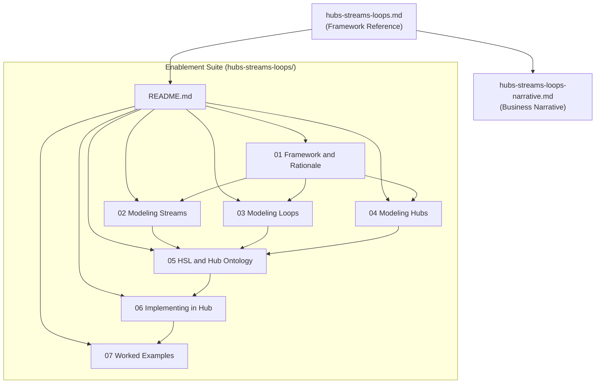

# HSL Documentation Suite

## Context

The Hubs-Streams-Loops (HSL) framework has been refined through discussion into a precise conceptual model:

- **Hub**: Bounded business domain; the system. Operations and collaboration fabric over existing systems (not a replacement). Maps to Workbench in Olympus Hub.
- **Stream**: External commitments — value delivery triggered by explicit requests from outside the Hub boundary. Modeled as coordinated Scenarios. Aligns with Case model thinking. Commitment-driven, episodic. Stream Specification (design-time) / Stream (runtime instance) / Stream Trace (observable record).
- **Loop**: Internal discipline — all work asynchronous to external commitments. Analytical, computational, integrity, compliance, housekeeping. Discipline-driven; triggered periodically, continuously, event-driven, or administratively. Also executes as Scenarios.
- **Scenario**: Universal execution model for both Streams and Loops. The atomic unit of all work in a Hub.
- **Key boundary**: External trigger = Stream; Internal trigger = Loop. This is a work classification construct that extends the AOSM ontology without contradicting it.

The existing [hubs-streams-loops.md](org-8.0/what-we-sell/hubs-streams-loops.md) is a 42-line sketch. The [olympus-hub-docs/](olympus-hub-docs/) covers Workbench anatomy, work patterns, cross-workbench sharing, and domain modeling — but has no HSL framing.

---

## Deliverables

### 1. Business Stakeholder Narrative (single doc)

**File**: `org-8.0/what-we-sell/hubs-streams-loops-narrative.md`
**Audience**: Senior leadership, business stakeholders, customers
**Purpose**: Convey how Zeta models and operates complex banking domains

**Outline**:

- **Opening**: The complexity problem — banking domains are not monolithic; they are networks of commitments, disciplines, and cross-domain coordination
- **The Framework**: Hubs, Streams, Loops as a way to think about banking operations
- **Hubs — The Domain Fabric**: Bounded business domains; operations fabric over existing systems (not replacement); system-agnostic integration of Zeta products and third-party systems
- **Streams — External Commitments**: What the bank promises to customers, partners, regulators; coordinated scenarios fulfilling commitments; episodic, cross-domain
- **Loops — Internal Discipline**: How the bank keeps itself honest and improving; computation, analysis, integrity, compliance, preparation; rituals and routines
- **The Complete Picture**: Every piece of work is a Stream or a Loop; Streams produce data, Loops consume it, Loops may trigger new Streams; the Hub improves because it operates
- **Why This Matters**: Operational visibility, domain-expert modeling, gradual automation, system-agnostic integration
- **Zeta's Hubs of Prominence**: Payments, Credit Card, CLM, Servicing, IAM, Merchants, Commercial Cards, Family Banking, Small Business

Tone: Narrative, readable prose. No implementation details. Ground in banking examples.

---

### 2. Updated Framework Reference (rewrite existing)

**File**: `org-8.0/what-we-sell/hubs-streams-loops.md`
**Audience**: All (authoritative reference)
**Purpose**: Definitive, concise definition of HSL concepts with the refined understanding

Update the existing 42-line sketch to a structured reference (~2-3 pages) incorporating:

- Precise definitions of Hub, Stream, Loop
- The trigger boundary (external vs internal)
- Scenario as universal execution model
- Stream terminology (Specification / Instance / Trace)
- Loop characteristics (discipline-driven, flexible triggering, full range of work types)
- The complete partition (all work = Stream or Loop)
- Zeta's Hubs of Prominence and Typical Loops (preserved from existing)

---

### 3. Enablement Suite (multiple docs)

**Location**: `org-8.0/what-we-sell/hubs-streams-loops/`

#### 3a. README.md — Index and Navigation

Brief introduction, audience guide, document map.

#### 3b. Framework and Rationale (`01-framework-and-rationale.md`)

**Audience**: PMs, architects, engineers
**Purpose**: The "why" behind HSL — conceptual foundations, design principles

- Why HSL exists: the problem of modeling complex banking domains
- The Hub-as-system metaphor: external interface (Streams) vs internal processes (Loops)
- The complete partition: all work in a Hub is either a Stream or a Loop
- Key design principles:
  - Stream and Loop are work classification constructs, not privileged processes
  - Scenario is the universal execution model — no separate infrastructure for Streams vs Loops
  - Modeling is domain-expert discretion, not platform prescription
  - Hub is an operations fabric over existing systems, not a system replacement
- Relationship to AOSM and DDD: extends without contradicting (the "why does this work exist?" dimension the ontology doesn't address)

#### 3c. Modeling Streams (`02-modeling-streams.md`)

**Audience**: PMs, domain architects
**Purpose**: How to identify and design Streams in a business domain

- Streams as external commitments: what the Hub promises to the outside world
- Identifying commitments: explicit requests from customers, partners, regulators, other Hubs
- Stream Specification (prescriptive, design-time) / Stream (operative, runtime instance) / Stream Trace (observable, post-facto record)
- Scenarios within a Stream: coordinated collection, not a sequence; episodic execution with business-meaningful pauses
- Case model alignment: the path isn't fully predetermined; Scenarios may not fire, may repeat, may run in parallel
- Cross-Hub Streams: spanning domain boundaries via cross-workbench context sharing
- The OpenTelemetry trace analogy:
  - Where it holds: correlation ID, spans (Scenarios), distributed execution, observability
  - Where it breaks: design-time vs observation-time, business timescale (days/weeks), cross-organizational scope, prescriptive intent
- Stream boundaries: a modeling choice of domain experts, not an architectural constraint
- Stream-Loop relationships: optional, modeling-driven

#### 3d. Modeling Loops (`03-modeling-loops.md`)

**Audience**: PMs, domain architects
**Purpose**: How to identify and design Loops in a business domain

- Loops as internal discipline: all work asynchronous to external commitments
- The full range of Loop work:
  - Analytical: funnel analysis, usage analysis, segmentation, trend detection
  - Computational: interest computation, fee calculation, account status assessment, period-close
  - Integrity: reconciliation, data quality, cross-system validation
  - Compliance: policy adherence monitoring, regulatory checks, audit preparation
  - Preparatory: feature engineering, ML pipelines, scoring
  - Housekeeping: system reconciliation, batch processing, scheduled jobs
- Trigger models: periodic (cadence-driven), continuous (always-on), event-driven (internal events), administrative (explicit operator action)
- Loop outputs: passive intelligence (reports, dashboards), active intelligence (alerts, flags), automated corrections, configuration changes, new Stream triggers
- Discipline-driven AND may be event-triggered (not a dichotomy)
- Fully automated processes vs agent-operated Loops: Loop is a modeling construct, execution model varies
- Cross-Hub Loops: modeled in an aggregation Hub that consumes data from other Hubs
- Loop-Stream feedback: Loops consume Stream data, Loops may trigger new Streams

#### 3e. Modeling Hubs (`04-modeling-hubs.md`)

**Audience**: PMs, domain architects
**Purpose**: How to identify and design Hubs (bounded business domains)

- Hub as a bounded business domain: the system
- Operations and collaboration fabric over existing systems (not replacement)
- System-agnostic integration: Zeta product lines as native systems; third-party systems equally supported
- What a Hub contains: Streams (external commitments), Loops (internal discipline), Scenarios (execution), Agents (participation), Knowledge, Memory, Governance
- Hub boundaries: domain-expert modeling choice
- Cross-Hub patterns:
  - Streams spanning Hubs (cross-workbench context sharing)
  - Aggregation Hubs for cross-cutting Loops (Enterprise Compliance, Customer Intelligence)
- Hub inventory: Zeta's Hubs of Prominence with brief characterization of each
- Hub and Workbench: the mapping to Olympus Hub's operational realization

#### 3f. HSL and the Olympus Hub Ontology (`05-hsl-and-hub-ontology.md`)

**Audience**: Architects, engineers
**Purpose**: How HSL extends the AOSM-based ontology; the theoretical alignment

- The four-layer ontology recap: Perception, Normative, Execution, Automation
- What HSL adds: work classification by purpose and trigger origin (the "why does this work exist?" question)
- How HSL is orthogonal:
  - Execution model untouched (Signal -> Trigger -> Scenario -> Operation -> Activity -> Action)
  - Scenario remains the atomic unit; Workbench remains the container
  - Work patterns (Queue, Case, Event-Driven, etc.) are available to both Streams and Loops
  - Resolution models (Pure Automation through Pure Human Collaboration) apply uniformly
  - Agent model unchanged (Human, AI, Rule-Based, Workflow agents)
- The trigger boundary as the defining classification:
  - External trigger (crosses Hub boundary inward) = Stream
  - Internal trigger (originates within Hub) = Loop
- Where HSL sits conceptually: domain modeling constructs at the Perception Layer level, enriching Domain/Workbench with a work classification dimension
- Streams and the Execution Layer: coordinated Scenarios may use Procedures, Workflows, or Cases
- Loops and the Execution Layer: Loop Scenarios may use any execution pattern

Reference: [ontology-reference.md](olympus-hub-docs/01-concepts/ontology-reference.md), [hub-design-philosophy.md](olympus-hub-docs/02-system-design/hub-design-philosophy.md), [workbench-anatomy.md](olympus-hub-docs/02-system-design/workbench-anatomy.md)

#### 3g. Implementing HSL in Olympus Hub (`06-implementing-hsl-in-hub.md`)

**Audience**: Engineers, platform architects
**Purpose**: How to translate an HSL domain model into Olympus Hub configuration

- Hub to Workbench: configuring a Workbench as a Hub
  - Domain model, Scenario definitions, Agent pools, Knowledge Base, Memory
- Stream implementation:
  - Scenario specifications for Stream Scenarios (Normative, Automation, Deployment)
  - Trigger configuration for external signals
  - Cross-workbench context sharing for cross-Hub Streams
  - Stream Trace: leveraging Cognitive Audit Fabric (CAF) for compliance-grade observability
  - Request hierarchy for multi-Scenario coordination
- Loop implementation:
  - Scenario specifications for Loop Scenarios
  - Internal trigger configuration (schedules, event-driven, threshold-based)
  - Hub Applications for fully automated Loops
  - Loop metrics via Hub Analytics
- Integration patterns:
  - Machines connecting to Zeta product lines and third-party systems
  - Workbench as Machine for cross-Hub invocation
  - Signal Exchange for cross-Hub event propagation

Reference: [workbench-setup-guide.md](olympus-hub-docs/10-guides/workbench-setup-guide.md), [cross-workbench-context-sharing-guide.md](olympus-hub-docs/10-guides/cross-workbench-context-sharing-guide.md), [workbench-management/](olympus-hub-docs/04-subsystems/workbench-management/README.md)

#### 3h. Worked Examples (`07-examples.md`)

**Audience**: PMs, architects, engineers
**Purpose**: Concrete banking domain examples showing HSL modeling end-to-end

- **Payments Hub**: 
  - Streams: payment initiation, refund processing, chargeback resolution
  - Loops: daily reconciliation, fraud pattern analysis, fee computation, compliance monitoring
  - Cross-Hub: payment-triggered credit card statement update
- **Credit Card Hub**: 
  - Streams: card application, card activation, dispute resolution, statement inquiry
  - Loops: interest computation, credit limit reassessment, usage segmentation, compliance reporting, end-of-period processing
- **Enterprise Compliance Hub** (aggregation Hub):
  - Streams: regulatory filing, audit response
  - Loops: cross-domain AML monitoring, enterprise-wide policy adherence, regulatory change impact assessment
- Each example shows: Hub boundary identification, Stream/Loop classification, Scenario identification, trigger mapping, and (briefly) Olympus Hub implementation sketch

---

## Document Relationships

## Audience Paths

- **Business stakeholders / customers**: Narrative only
- **Product managers / domain architects**: Framework Reference -> 01 Rationale -> 02/03/04 Modeling guides -> 07 Examples
- **Engineers / platform architects**: Framework Reference -> 01 Rationale -> 05 Ontology -> 06 Implementation -> 07 Examples
- **All audiences**: Framework Reference as authoritative starting point

