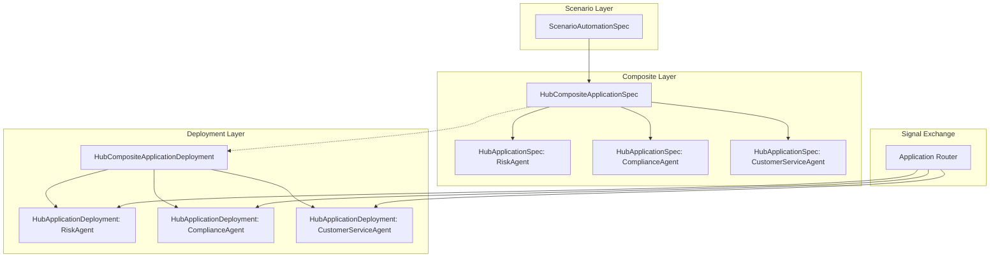

# Hub Composite Application Implementation Plan

## Overview

Implement **Hub Composite Applications** - a mechanism for multiple Hub Applications to participate in the same Request without explicit orchestration. Each app operates with an independent session, enabling multi-agent topologies like Blackboard, PEC Loop, and Market-Based patterns.

## Key Architectural Decisions

| Decision | Choice | Rationale |

|----------|--------|-----------|

| Session Model | Each app gets independent session | Apps operate autonomously, no shared state coupling |

| Deployment CRD | Create `HubCompositeApplicationDeployment` | Proper ownership hierarchy for lifecycle management |

| OPA Filter Input | Full access (update_type, request_state, update_payload, timestamp, app_identity) | Maximum flexibility for filtering logic |

---

## Architecture



---

## New CRDs

### 1. HubCompositeApplicationSpec

**Location**: New file `olympus-hub-docs/02-system-design/implementation-concepts/hub-composite-application.md`

```yaml
apiVersion: hub.olympus.io/v1
kind: HubCompositeApplicationSpec
metadata:
  name: dispute-investigation-composite
  namespace: acme-disputes
  labels:
    hub.olympus.io/workbench: acme-disputes
spec:
  display_name: "Dispute Investigation Composite"
  description: "Multi-agent composite for dispute resolution"
  
  # Constituent applications
  applications:
    - name: risk-agent  # Local identifier within composite
      ref:
        name: risk-assessment-agent
        version: "1.0.0"
      opa_filter:
        policy: |
          package composite.filter
          default allow = false
          allow { input.update_type == "REQUEST_CREATED" }
          allow { input.update_type == "DOCUMENT_UPLOADED" }
    
    - name: compliance-agent
      ref:
        name: compliance-check-agent
        version: "1.0.0"
      opa_filter:
        policy: |
          package composite.filter
          default allow = false
          allow { input.update_type in ["REQUEST_CREATED", "RISK_ASSESSMENT_COMPLETE"] }
    
    # Nested composite reference
    - name: customer-service-composite
      composite_ref:
        name: customer-service-composite
        version: "1.0.0"
  
  metadata:
    topology_pattern: "blackboard"  # blackboard | pec_loop | market_based | committee
```

**OPA Filter Input Structure**:

```json
{
  "update_type": "REQUEST_CREATED",
  "request_state": {
    "id": "req-123",
    "status": "ACTIVE",
    "scenario_id": "dispute-investigation",
    "workbench_id": "acme-disputes",
    "created_at": "2026-01-15T10:00:00Z"
  },
  "update_payload": {
    "memo": "...",
    "task_lifecycle": {...},
    "decision_records": [...]
  },
  "timestamp": "2026-01-15T10:05:00Z",
  "app_identity": {
    "name": "risk-agent",
    "deployment_id": "risk-agent-deployment-1"
  }
}
```

---

### 2. HubCompositeApplicationDeployment

**Location**: Update `olympus-hub-docs/02-system-design/implementation-concepts/hub-application-deployment.md`

```yaml
apiVersion: hub.olympus.io/v1
kind: HubCompositeApplicationDeployment
metadata:
  name: dispute-investigation-composite-sandbox
  namespace: acme-disputes
  labels:
    hub.olympus.io/workbench-instance: acme-disputes-sandbox
spec:
  compositeRef:
    name: dispute-investigation-composite
    version: "1.0.0"
  
  workbenchInstance:
    name: acme-disputes-sandbox
  
  # Per-app deployment overrides (optional)
  applicationOverrides:
    - name: risk-agent
      resources:
        cpu: "500m"
        memory: "512Mi"

status:
  phase: Running  # Pending | Deploying | Running | Failed | Terminating
  
  # Child deployment status
  applicationDeployments:
    - name: risk-agent
      deploymentRef: risk-agent-deployment-sandbox
      phase: Running
    - name: compliance-agent
      deploymentRef: compliance-agent-deployment-sandbox
      phase: Running
    - name: customer-service-agent
      deploymentRef: customer-service-agent-deployment-sandbox
      phase: Running
  
  conditions:
    - type: Ready
      status: "True"
      lastTransitionTime: "2026-01-15T10:00:00Z"
```

**Ownership Hierarchy**:

```
HubCompositeApplicationDeployment (parent)
  └── HubApplicationDeployment: risk-agent (child, ownerRef)
  └── HubApplicationDeployment: compliance-agent (child, ownerRef)
  └── HubApplicationDeployment: customer-service (child, ownerRef)
```

---

## Component Changes

### 1. Hub Operators - Composite Resolution

**Location**: Update `olympus-hub-docs/04-subsystems/operators/developer-operators.md`

**Changes**:

1. **New Composite Application Operator**:

            - Watches `HubCompositeApplicationSpec`
            - Validates structure (no circular references)
            - Resolves nested composites recursively

2. **Scenario Deployment Operator Updates**:

            - Detect when `ScenarioAutomationSpec.application.ref` points to composite
            - Create `HubCompositeApplicationDeployment` instead of `HubApplicationDeployment`
            - Composite Deployment Operator then creates child deployments

3. **Composite Deployment Operator** (new):

            - Watches `HubCompositeApplicationDeployment`
            - Creates child `HubApplicationDeployment` for each constituent app
            - Sets `ownerReference` on children for garbage collection
            - Aggregates child status → composite status
            - All-or-nothing: if any child fails, mark composite as failed

**Recursive Resolution**:

```
resolveComposite(compositeSpec):
  apps = []
  for each app in compositeSpec.applications:
    if app.ref exists:
      apps.append({
        name: app.name,
        spec: lookupHubApplicationSpec(app.ref),
        opa_filter: app.opa_filter
      })
    else if app.composite_ref exists:
      nested = lookupCompositeSpec(app.composite_ref)
      apps.extend(resolveComposite(nested))
  return apps
```

---

### 2. Signal Exchange - Application Router

**Location**: Update `olympus-hub-docs/04-subsystems/signal-exchange/application-router.md`

**Current Behavior**:

- Request → single Application session
- Route updates to active Application session

**New Behavior**:

- Request → multiple Application sessions (for composites)
- Route updates to ALL active sessions after OPA filter evaluation

**Changes**:

1. **Request-Sessions Mapping**:
   ```yaml
   request_sessions:
     request_id: "req-123"
     composite_deployment: "dispute-investigation-composite-sandbox"
     sessions:
       - app_name: "risk-agent"
         deployment_id: "risk-agent-deployment-sandbox"
         opa_filter: <compiled policy>
         status: "active"
       - app_name: "compliance-agent"
         deployment_id: "compliance-agent-deployment-sandbox"
         opa_filter: <compiled policy>
         status: "active"
   ```

2. **Update Routing Flow**:
   ```
   routeRequestUpdate(request, update):
     sessions = getSessionsForRequest(request.id)
     
     if sessions.length == 1:
       # Single app - existing behavior
       dispatchToApp(sessions[0], update)
     else:
       # Composite - fan-out with OPA filtering
       for each session in sessions:
         filterInput = buildFilterInput(update, request, session)
         if session.opa_filter is None OR evaluateOPA(session.opa_filter, filterInput):
           asyncDispatch(session, update)
   ```

3. **OPA Filter Evaluation**:

            - Use existing OPA integration pattern (see `olympus-hub-docs/decision-logs/0073-seer-authority-enforcement-opa.md`)
            - Cache compiled policies for performance
            - Log filter decisions for observability

4. **Async Dispatch**:

            - Each app dispatch is independent
            - Per-app DLQ for failed dispatches
            - No cross-app coordination

---

### 3. Request Factory

**Location**: Update `olympus-hub-docs/04-subsystems/signal-exchange/request-factory.md`

**Changes**:

1. **Session Initialization**:

            - When request created for composite scenario:
                    - Look up `HubCompositeApplicationDeployment`
                    - Initialize session for each child deployment
                    - Store request-sessions mapping

2. **Request Metadata Enhancement**:
   ```yaml
   request:
     id: "req-123"
     scenario_id: "dispute-investigation"
     
     # New fields for composite
     composite:
       deployment_id: "dispute-investigation-composite-sandbox"
       sessions:
         - app_name: "risk-agent"
           session_id: "sess-456"
           status: "active"
         - app_name: "compliance-agent"
           session_id: "sess-789"
           status: "active"
   ```


---

### 4. Request Management

**Location**: Update `olympus-hub-docs/04-subsystems/request-management/`

**Changes**:

1. **Request State Model**:

            - Add `composite` section to track multi-app sessions
            - Track per-app session lifecycle independently
            - Apps can fail/restart independently

2. **Update Conflict Resolution**:

            - Multiple apps can update request state concurrently
            - Latest update wins (timestamp-based)
            - If update is illegal (OPA policy at SX), record as rejected
            - All updates recorded in request history with source app

3. **Request History Enhancement**:
   ```yaml
   history:
     - timestamp: "2026-01-15T10:01:00Z"
       source_app: "risk-agent"
       update_type: "RISK_ASSESSMENT_COMPLETE"
       status: "accepted"
       
     - timestamp: "2026-01-15T10:01:05Z"
       source_app: "compliance-agent"
       update_type: "STATE_UPDATE"
       status: "rejected"
       rejection_reason: "Invalid state transition"
   ```


---

### 5. ScenarioAutomationSpec Update

**Location**: Update `olympus-hub-docs/04-subsystems/operators/crd-reference.md`

**Change**: Support composite reference in application field:

```yaml
spec:
  application:
    # Option 1: Single app (existing)
    ref:
      name: dispute-handler
      version: "1.0.0"
    
    # Option 2: Composite (new - mutually exclusive)
    composite_ref:
      name: dispute-investigation-composite
      version: "1.0.0"
```

**Validation**: Webhook validates that exactly one of `ref` or `composite_ref` is set.

---

## Documentation Updates

### New Documents

1. **`olympus-hub-docs/02-system-design/implementation-concepts/hub-composite-application.md`**

            - Concept overview with architecture diagrams
            - Relationship to multi-agent topologies (reference `olympus-seer-docs/agentic-ai-concepts/multi-agent-topologies.md`)
            - Design decisions and rationale

2. **`olympus-hub-docs/10-guides/using-composite-applications.md`**

            - Step-by-step guide to create composites
            - OPA filter examples for each topology pattern
            - Deployment and testing guide

3. **`olympus-hub-docs/decision-logs/0XXX-hub-composite-applications.md`**

            - ADR documenting the design decision

### Update Existing Documents

| Document | Changes |

|----------|---------|

| `olympus-hub-docs/01-concepts/hub-applications.md` | Add composite as application type |

| `olympus-hub-docs/02-system-design/implementation-concepts/hub-application-deployment.md` | Document composite deployment relationship |

| `olympus-hub-docs/04-subsystems/operators/crd-reference.md` | Add new CRDs to reference |

| `olympus-hub-docs/04-subsystems/signal-exchange/application-router.md` | Document multi-app routing |

| `olympus-hub-docs/04-subsystems/signal-exchange/request-factory.md` | Document multi-session initialization |

| `olympus-seer-docs/seer-design/hub-integration/employed-agent.md` | Note composite support (no code changes) |

---

## Finalize Scratchpad

Clean up `olympus-hub-docs/scratchpad/hub-composite-app.md`:

- Remove Q&A section at end
- Keep examples and design decisions
- Mark as ready for formalization

---

## Implementation Phases

### Phase 1: CRD Definitions

- Define `HubCompositeApplicationSpec` CRD
- Define `HubCompositeApplicationDeployment` CRD
- Update `ScenarioAutomationSpec` to support `composite_ref`

### Phase 2: Operator Support

- Composite Application Operator (validation, resolution)
- Composite Deployment Operator (child creation, status aggregation)
- Scenario Deployment Operator updates (composite detection)

### Phase 3: Signal Exchange Updates

- Request-sessions mapping storage
- Multi-app routing logic
- OPA filter evaluation
- Async dispatch with DLQ

### Phase 4: Request Management

- Request state model updates
- Update conflict resolution
- History enhancement

### Phase 5: Documentation and Testing

- Complete all documentation
- Example composite configurations
- Integration tests