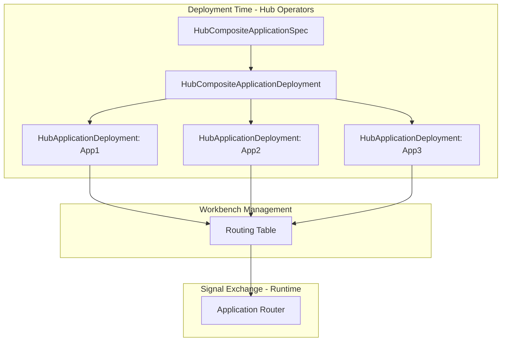

# Hub Composite Application Implementation Plan

## Overview

Implement **Hub Composite Applications** enabling multiple Hub Applications to participate in the same Request. Composites are resolved at **deployment time** - Signal Exchange sees only a list of apps per scenario, not composites.

## Key Architectural Decisions

| Decision | Choice | Rationale |

|----------|--------|-----------|

| Session Model | Each app gets independent session | Apps operate autonomously |

| Deployment CRD | Create `HubCompositeApplicationDeployment` | Proper ownership for lifecycle |

| OPA Filter Input | Full access | Maximum filtering flexibility |

| Resolution Time | Deployment time | Simpler SX, routing table has flattened list |

---

## Architecture



**Key Insight**: Signal Exchange doesn't know about composites. It just sees "Scenario X has apps [A, B, C] with filters [F1, F2, F3]" in the routing table.

---

## New CRDs

### 1. HubCompositeApplicationSpec

```yaml
apiVersion: hub.olympus.io/v1
kind: HubCompositeApplicationSpec
metadata:
  name: dispute-investigation-composite
  namespace: acme-disputes
spec:
  display_name: "Dispute Investigation Composite"
  
  applications:
  - name: risk-agent
      ref:
        name: risk-assessment-agent
        version: "1.0.0"
      opa_filter:
        policy: |
          package composite.filter
          default allow = false
          allow { input.update_type == "REQUEST_CREATED" }
          allow { input.update_type == "DOCUMENT_UPLOADED" }
    
  - name: compliance-agent
      ref:
        name: compliance-check-agent
        version: "1.0.0"
      opa_filter:
        policy: |
          package composite.filter
          default allow = false
          allow { input.update_type in ["REQUEST_CREATED", "RISK_ASSESSMENT_COMPLETE"] }
    
    # Nested composite
  - name: customer-service
      composite_ref:
        name: customer-service-composite
        version: "1.0.0"
```

### 2. HubCompositeApplicationDeployment

```yaml
apiVersion: hub.olympus.io/v1
kind: HubCompositeApplicationDeployment
metadata:
  name: dispute-investigation-composite-sandbox
  namespace: acme-disputes
spec:
  compositeRef:
    name: dispute-investigation-composite
    version: "1.0.0"
  workbenchInstance:
    name: acme-disputes-sandbox

status:
  phase: Running
  applicationDeployments:
  - name: risk-agent
      deploymentRef: risk-agent-deployment-sandbox
      phase: Running
  - name: compliance-agent
      deploymentRef: compliance-agent-deployment-sandbox
      phase: Running
```

**Ownership**: `HubCompositeApplicationDeployment` owns child `HubApplicationDeployment` resources via `ownerReference`.

---

## Component Changes

### 1. Hub Operators

**Location**: `olympus-hub-docs/04-subsystems/operators/developer-operators.md`

**New: Composite Application Operator**

- Watches `HubCompositeApplicationSpec`
- Validates structure (no circular refs)
- No deployment logic (just spec validation)

**New: Composite Deployment Operator**

- Watches `HubCompositeApplicationDeployment`
- Resolves composite recursively (flattens nested composites)
- Creates child `HubApplicationDeployment` for each app
- Sets `ownerReference` for garbage collection
- Aggregates child status → composite status
- **Populates routing table** with flattened app list + OPA filters

**Update: Scenario Deployment Operator**

- When `ScenarioAutomationSpec.application.composite_ref` is set:
                                                                                                                                                                                                                                                                - Create `HubCompositeApplicationDeployment` instead of `HubApplicationDeployment`

---

### 2. Routing Table (Workbench Management)

**Location**: `olympus-hub-docs/04-subsystems/workbench-management/`

**Current Schema**:

```yaml
scenario_routing:
  scenario_id: "dispute-investigation"
  application:
    deployment_id: "dispute-handler-sandbox"
    endpoint: "..."
```

**New Schema** (backward compatible):

```yaml
scenario_routing:
  scenario_id: "dispute-investigation"
  
  # Single app (existing)
  application:
    deployment_id: "dispute-handler-sandbox"
    endpoint: "..."
  
  # OR multiple apps (new - for composites)
  applications:
  - deployment_id: "risk-agent-deployment-sandbox"
      endpoint: "..."
      opa_filter: "<compiled policy>"
  - deployment_id: "compliance-agent-deployment-sandbox"
      endpoint: "..."
      opa_filter: "<compiled policy>"
```

If `applications` is present, Application Router routes to all. If only `application` is present, existing behavior.

---

### 3. Signal Exchange - Application Router

**Location**: `olympus-hub-docs/04-subsystems/signal-exchange/application-router.md`

**Changes** (minimal):

1. **Routing Lookup**: Accept list of apps from routing table
2. **Fan-out**: For each app in list, evaluate OPA filter and dispatch if allowed
3. **OPA Filter Evaluation**: New logic to evaluate inline Rego policy
```
routeRequestUpdate(request, update):
  routing = lookupRouting(request.scenario_id)
  
  if routing.applications exists:
    # Composite - fan-out
    for each app in routing.applications:
      filterInput = {
        update_type: update.type,
        request_state: request.state,
        update_payload: update.payload,
        timestamp: now(),
        app_identity: { name: app.name, deployment_id: app.deployment_id }
      }
      if app.opa_filter is None OR evaluateOPA(app.opa_filter, filterInput):
        asyncDispatch(app.endpoint, update)
  else:
    # Single app - existing behavior
    dispatch(routing.application.endpoint, update)
```


**Key**: SX doesn't know about composites. It just sees "this scenario has N apps".

---

### 4. Request Management

**Location**: `olympus-hub-docs/04-subsystems/request-management/`

**Changes**:

1. **Update Conflict Resolution**:

                                                                                                                                                                                                                                                                                                                                                                                                - Multiple apps can update same request concurrently
                                                                                                                                                                                                                                                                                                                                                                                                - Latest update wins (timestamp-based)
                                                                                                                                                                                                                                                                                                                                                                                                - Rejected updates recorded in history

2. **Request History Enhancement**:

                                                                                                                                                                                                                                                                                                                                                                                                - Add `source_app` field to each update record
                                                                                                                                                                                                                                                                                                                                                                                                - Track rejection reasons
```yaml
history:
 - timestamp: "2026-01-15T10:01:00Z"
    source_app: "risk-agent-deployment-sandbox"
    update_type: "RISK_ASSESSMENT_COMPLETE"
    status: "accepted"
```


---

### 5. ScenarioAutomationSpec Update

**Location**: `olympus-hub-docs/04-subsystems/operators/crd-reference.md`

```yaml
spec:
  application:
    # Option 1: Single app (existing)
    ref:
      name: dispute-handler
      version: "1.0.0"
    
    # Option 2: Composite (new - mutually exclusive)
    composite_ref:
      name: dispute-investigation-composite
      version: "1.0.0"
```

---

## Documentation

### New Documents

| Document | Purpose |

|----------|---------|

| `02-system-design/implementation-concepts/hub-composite-application.md` | Implementation concept for composite applications |

| `10-guides/using-composite-applications.md` | Developer guide with OPA filter examples |

| `decision-logs/0125-hub-composite-applications.md` | ADR: Composite application design decision |

| `decision-logs/0126-composite-routing-table-schema.md` | ADR: Routing table multi-app schema |

### Implementation Concept Updates

| Document | Changes |

|----------|---------|

| `02-system-design/implementation-concepts/hub-application.md` | Add reference to composite applications |

| `02-system-design/implementation-concepts/hub-application-deployment.md` | Document HubCompositeApplicationDeployment relationship |

### Subsystem Updates

| Document | Changes |

|----------|---------|

| `01-concepts/hub-applications.md` | Add composite as application type |

| `04-subsystems/operators/crd-reference.md` | Add HubCompositeApplicationSpec, HubCompositeApplicationDeployment |

| `04-subsystems/operators/developer-operators.md` | Add Composite Application and Composite Deployment operators |

| `04-subsystems/signal-exchange/README.md` | Update architecture diagrams for multi-app dispatch |

| `04-subsystems/signal-exchange/application-router.md` | Multi-app routing, OPA filter evaluation |

| `04-subsystems/workbench-management/scenario-definitions.md` | Routing table schema changes |

| `04-subsystems/request-management/` | source_app tracking, conflict resolution |

### Seer Documentation

| Document | Changes |

|----------|---------|

| `olympus-seer-docs/seer-design/hub-integration/employed-agent.md` | Note composite support (no code changes needed) |

### Cross-Reference Verification

After updates, verify all cross-references to:

- `hub-application.md`
- `hub-application-deployment.md`
- `application-router.md`

---

## Summary of Changes

| Component | Change |

|-----------|--------|

| **Hub Operators** | New Composite operators, resolve at deployment time |

| **Routing Table** | Support list of apps per scenario |

| **Application Router** | Fan-out to multiple apps with OPA filter |

| **Request Management** | Track source_app, handle concurrent updates |

| **Signal Exchange Core** | No changes - still Request-level only |

---

## Implementation Phases

### Phase 1: CRD Definitions

- `HubCompositeApplicationSpec`
- `HubCompositeApplicationDeployment`
- `ScenarioAutomationSpec` update

### Phase 2: Operator Support

- Composite Application Operator
- Composite Deployment Operator
- Routing table population

### Phase 3: Application Router

- Multi-app routing lookup
- OPA filter evaluation
- Fan-out dispatch

### Phase 4: Request Management

- source_app tracking
- Conflict resolution

### Phase 5: Documentation

- ADRs: composite-applications, composite-routing-table-schema
- New implementation concept: hub-composite-application.md
- Update implementation concepts: hub-application.md, hub-application-deployment.md
- Update subsystem docs: operators, signal-exchange, request-management
- New guide: using-composite-applications.md
- Seer integration docs update
- Cross-reference verification
- Scratchpad cleanup