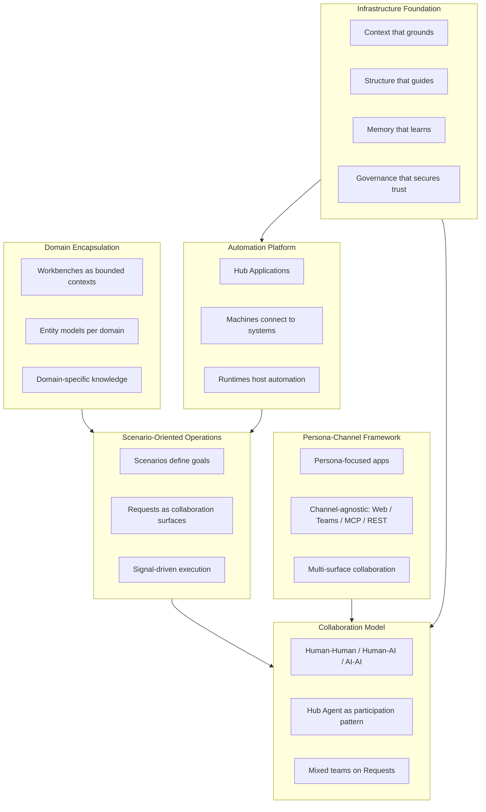

# Revise Hub Documentation to Reflect Full Breadth

## Problem

Current documents lead with "four pillars" (context, structure, memory, governance) which are **infrastructure services** but not Hub's full identity. Hub is an **operational platform** with multiple dimensions that are under-represented or missing entirely.

Additionally, legacy documents use "operations" and "Everything is Ops" language that needs bridging to the new "information-centric work" framing.

---

## Phase 0: Foundational Terminology (Prerequisites)

Before revising Introduction and Architecture, we must establish clear terminology that bridges legacy "Ops" language to the new framing.

### The Bridge Statement

> All operations in information-centric work are situations that need attention, decision, or action. Hub models each such operation as a **Scenario**.

### Terminology Definitions Needed

#### 1. Information-Centric Work (New Definition)

**File:** [olympus-hub-docs/01-concepts/glossary.md](olympus-hub-docs/01-concepts/glossary.md) or new concept file

**Definition:**

> **Information-Centric Work**: Work where the primary inputs, transformations, and outputs are information rather than physical matter.

>

> **Characteristics:**

> - **Inputs**: Data, documents, signals, requests, specifications, requirements

> - **Transformation**: Analysis, interpretation, decision-making, synthesis, design, composition

> - **Outputs**: Decisions, records, communications, documents, code, applications

>

> **Examples of work:**

> - Processing a request and making a disposition decision

> - Translating requirements into a design or implementation

> - Drafting, reviewing, and approving documents or code

> - Investigating an issue and determining root cause

> - Coordinating between parties to resolve a problem

> - Synthesizing information into recommendations or artifacts

**Software Development Example:**

> Software development is quintessentially information-centric work:

> - **Inputs**: Requirements (information), specifications (information), designs (information), existing code (information)

> - **Transformation**: Understanding, reasoning, designing, coding, testing — all cognitive/analytical activities

> - **Outputs**: Code (information), tests (information), documentation (information), applications (information artifacts)

>

> No physical material is transformed. The "product" (software) is itself an information artifact that can be copied infinitely at zero marginal cost.

**Purpose:** Define the realm where Hub operates, explicitly including software development.

#### 2. Operation (New Definition)

**File:** [olympus-hub-docs/01-concepts/glossary.md](olympus-hub-docs/01-concepts/glossary.md) or new concept file

**Definition:**

> **Operation**: A situation in information-centric work that needs attention, decision, or action. Hub models each operation as a Scenario.

**Purpose:** Bridge legacy "ops" terminology to new framing without creating a formal Hub concept that competes with Scenario.

**Software Development Examples:**

| Operation (Situation) | Hub Scenario |

|-----------------------|--------------|

| A feature needs to be implemented | Feature Development |

| A bug has been reported | Bug Fix |

| Code needs to be reviewed | Code Review |

| A production incident occurred | Incident Response |

| Technical debt needs to be addressed | Refactoring |

#### 3. Scenario (Enhancement)

**File:** [olympus-hub-docs/02-system-design/implementation-concepts/scenario.md](olympus-hub-docs/02-system-design/implementation-concepts/scenario.md)

**Enhancement:** Add explicit bridge to "operation" terminology:

> A Scenario is Hub's model for an operation — a goal-oriented definition of what needs to be achieved, not a step-by-step procedure.

#### 4. Operational Platform (New Definition)

**File:** [olympus-hub-docs/01-concepts/glossary.md](olympus-hub-docs/01-concepts/glossary.md) or Introduction

**Definition:**

> **Operational Platform**: A platform for modeling, managing, and automating operations in information-centric work. Hub is an operational platform that uses Scenarios to model operations and enables governed collaboration between human and AI agents.

**Purpose:** Cement what "operational" means in Hub's context, making it referenceable.

---

## SDLC Scratchpad Enhancement

**File:** [olympus-hub-docs/scratchpad/0WIP-hub-for-software-development.md](olympus-hub-docs/scratchpad/0WIP-hub-for-software-development.md)

**Add new section:** "Software Development as Information-Centric Work"

This section should:

1. Establish that software development is information-centric work
2. Show how various development situations are "operations" in Hub's terminology
3. Map these operations to Scenarios
4. Bridge the terminology for developers familiar with SDLC but new to Hub

**Content to add:**

- Formal definition of information-centric work
- Explicit argument for why software development qualifies
- Table mapping development "operations" (situations) to Hub Scenarios
- Explanation of how "All operations are modeled as Scenarios" applies to SDLC

---

## The Six Dimensions of Hub

---

## Key Gap: Persona-Channel Framework

Currently **absent** from both documents. Hub has robust support for:

- **Persona-focused**: Dedicated apps per role (Agent Desk, Supervisor Desk, Workbench Studio, etc.)
- **Channel-agnostic**: Web Console, MS Teams, MCP, REST APIs
- **Multi-surface collaboration**: Work in Teams, document editors, IDEs, consoles
- **AI-first**: MCP as native channel for AI assistants

Reference: [persona.md](olympus-hub-docs/02-system-design/implementation-concepts/persona.md), [channel.md](olympus-hub-docs/02-system-design/implementation-concepts/channel.md), [ADR-0008](olympus-hub-docs/decision-logs/0008-persona-channel-usecase-meta-approach.md)

---

## Phase 1: Document Revisions

### 1. Revise Introduction Opening

**File:** [introduction.md](olympus-hub-docs/01-concepts/introduction.md)

**Current:**

> "Olympus Hub is an operational infrastructure platform that enables organizations to deploy governed collaboration..."

**Proposed:**

> "Olympus Hub is a platform for modeling, managing, and automating **information-centric work** through governed collaboration."

>

> "All operations in information-centric work are situations that need attention, decision, or action. Hub models each such operation as a **Scenario** — a goal-oriented definition of what needs to be achieved, not a step-by-step procedure."

Then present the six dimensions as "What Hub Provides" with four pillars repositioned as dimension 6 (infrastructure foundation).

### 2. Add Persona-Channel to Introduction

**File:** [introduction.md](olympus-hub-docs/01-concepts/introduction.md)

Add new section in "How Hub Works" or "What Hub Enables" covering:

- Multi-surface collaboration (Teams, document editors, IDEs)
- Persona-focused design
- Channel-agnostic architecture
- MCP for AI agents

### 3. Revise Architecture Executive Summary

**File:** [hub-architecture.md](olympus-hub-docs/02-system-design/hub-architecture.md)

Lead with Hub as **operational platform** (not infrastructure platform). Present six dimensions summary. Position four pillars as foundation layer.

### 4. Add Persona-Channel Section to Architecture

**File:** [hub-architecture.md](olympus-hub-docs/02-system-design/hub-architecture.md)

New section "Persona-Channel Architecture" with:

- Persona-Channel matrix (from persona.md)
- Explanation of channel-agnostic design
- MCP as AI-first channel
- Links to detailed documentation

### 5. Ensure Consistent Terminology

Both documents should:

- Use "information-centric work" consistently
- Use the bridge statement for "operations"
- Reference Scenario as the formal Hub concept
- Bridge to mission statement correctly

### 6. Update Cross-References

Add links to:

- Persona and Channel documentation
- MCP Channel documentation
- Glossary/definitions for Information-Centric Work, Operation, Scenario, Operational Platform