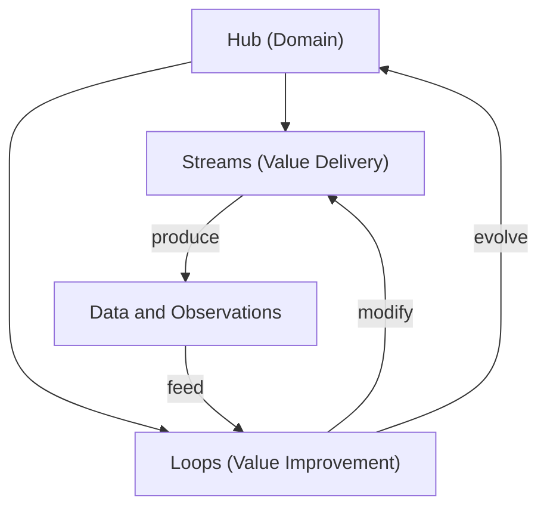

# Hub One-Pager

**Target file:** `org-8.0/what-we-sell/hubs-streams-loops.md` (expand existing) or new file if preferred
**Audience:** Senior management and product leadership
**Sources:** [olympus-hub-docs/README.md](olympus-hub-docs/README.md), [hub-architecture.md](olympus-hub-docs/02-system-design/hub-architecture.md), [workbench-management](olympus-hub-docs/04-subsystems/workbench-management/README.md), and the existing [hubs-streams-loops.md](org-8.0/what-we-sell/hubs-streams-loops.md)

---

## Structure

### 1. What Is a Hub?

Two-level definition:

- **Business concept:** A Hub is a bounded banking domain — self-contained enough to be operated, measured, and governed independently, but composable enough to integrate with other Hubs. Examples: Payments, Credit Cards, Customer Lifecycle Management.
- **Platform realization:** In Olympus Hub, a Hub is implemented as a **Workbench** — the concrete operational environment that encapsulates everything needed to run that domain: entities, scenarios, agents (human and AI), knowledge, memory, governance, and integration interfaces.

The distinction: Hub is the domain concept used in business strategy; Workbench is the same thing as built and operated in the platform.

### 2. What's Inside a Hub

Synthesized from the Workbench anatomy:

- **Domain Model** — Business entities, lifecycle states, validation rules
- **Scenarios** — Goal-oriented definitions of what needs to happen (not step-by-step procedures)
- **Signals and Triggers** — Events from the environment that initiate Scenarios
- **Agents** — Human and AI agents enrolled to operate in the domain
- **Knowledge Base** — SOPs, policies, runbooks, domain-specific grounding
- **Memory** — Organizational learning that accumulates from operations
- **Machines and Tools** — Connections to underlying systems (core banking, payment rails, etc.)
- **Task Queues** — Work distribution to agents by role
- **Governance** — Accountability, audit trails, human oversight, compliance

### 3. How Hubs, Streams, and Loops Relate

The relationship diagram:




- **Streams** deliver value to customers through sequences of Scenarios
- **Loops** improve value by analyzing Stream-generated data and adjusting the Hub
- Streams produce data; Loops consume it and generate actions that change Streams or Hub configuration

### 4. The Operational Pattern

From Hub architecture — the core flow that runs inside every Hub:

```
Signal → Trigger → Scenario → Request → Resolution → Outcome
```

Resolution happens across a spectrum: pure automation, automation with escalation, human-AI teaming, AI-autonomous, or pure human. The same governance applies regardless.

### 5. One Worked Example

Expand one Hub (e.g., Credit Card) to show Streams, Loops, and how the operational pattern plays out. This grounds the abstraction.

### 6. Hub Properties

Summary table of key properties: domain encapsulation, system agnostic, entity-centric, agent-enabled, compliance-grounded, composable with other Hubs.

---

## Tone

Written as a reference document, not narrative prose. Clean definitions, tables, one diagram, one worked example. Concise enough to be a single page when printed or shared.