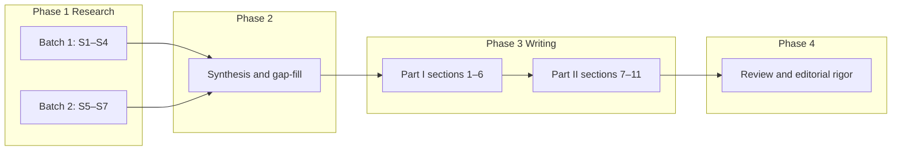

# Lending and Credit — Opportunity Analysis (Cursor Plan)

This plan executes the full research and writing workflow defined in [.cursor/plans/lending_credit_opportunity_analysis.plan.md](.cursor/plans/lending_credit_opportunity_analysis.plan.md). That file is the **authoritative specification** for streams, sources, citation rules, section order, and review checks. This Cursor plan is the **execution checklist** attached to the agent.

---

## Execution flow

- **Output document:** [org-8.0/what-we-sell/strategy/engagement-areas/lending-and-credit.md](org-8.0/what-we-sell/strategy/engagement-areas/lending-and-credit.md) (replaces current 116-line capability catalogue).
- **Research retention:** All stream outputs and synthesis in [org-8.0/what-we-sell/strategy/_research/lending-and-credit/](org-8.0/what-we-sell/strategy/_research/lending-and-credit/) per the plan’s “Output Files” section (s1–s7, synthesis-notes.md, unverified-claims.md).
- **Citation standard:** Every factual claim has a navigable URL or full bibliographic detail; unverifiable claims go into `unverified-claims.md` and are flagged in text.
- **Voice boundary:** Part I = analyst only (no Zeta references). Part II = Zeta-specific advisory. Clear heading between parts.

---

## Phase 1: Parallel research (2 batches, max 4 concurrent)

**Batch 1 (Streams 1–4):**  
Run sub-agents for market sizing, regulatory landscape (USA/India/UK), competitive landscape, and structural shifts. Each stream writes to `_research/lending-and-credit/sN-<stream-name>.md` with: research date, Claim|Value|Source|URL|Verified table, findings, gaps, raw notes. Competitive and structural-shifts streams must also collect **named bank modernization signals** (bank, tier, geography, signal, source, URL).

**Batch 2 (Streams 5–7):**  
Run sub-agents for embedded credit/BNPL disruption, AI in credit decisioning and servicing, and commercial lending technology gap. Same output format and citation rules. Cross-reference existing work: [research/payments/s2-regulatory-landscape.md](org-8.0/what-we-sell/strategy/_research/payments/s2-regulatory-landscape.md) (e.g. Dodd-Frank 1033), [research/digital-identity-and-trust/](org-8.0/what-we-sell/strategy/_research/digital-identity-and-trust/) (EU AI Act, identity) where relevant.

---

## Phase 2: Synthesis and gap-fill

- Cross-reference streams for consistency (market sizing, regulatory–competitive alignment, bank signals).
- Rate evidence quality per structural shift (Strong / Moderate / Thin / Hypothesis); drop or flag thin/hypothesis in Part I.
- Verify all URLs resolve; complete citations; log unverifiable claims in `unverified-claims.md`.
- Targeted gap-fill for shifts with &lt;3 data points or thin commercial-lending/India/UK signals.
- Map to Right to Play / Right to Win using [distillation/how-to.md](org-8.0/what-we-sell/strategy/distillation/how-to.md).
- Assemble **target universe** from signals (geography, tier, horizon, evidence URL); min. 15 named institutions.
- Ground Part II by mapping repo product lines (Tachyon Loans, Quark Lending, Evolution Fabric, Cognitive Audit Fabric, Trust Fabric, Photon) to the competitive landscape and stating gaps honestly.
- Write [synthesis-notes.md](org-8.0/what-we-sell/strategy/_research/lending-and-credit/synthesis-notes.md) with cross-refs, evidence ratings, R2P/R2W, and editorial decisions.

---

## Phase 3: Document writing (section order)

**Part I — The opportunity (analyst voice, no Zeta):**

1. **Market** — Vendor-addressable TAM by sub-segment and geography (USA, India, UK); growth and build-vs-buy by tier.
2. **How We Got Here** — Three eras (monolithic origination → digital overlay → platform pressure); what was deferred.
3. **Structural Shifts** — 7–8 shifts, each with evidence, regulatory citations, segment and geography analysis (final list from Phase 2 evidence quality).
4. **Engagement Landscape** — Engagement types (e.g. consumer origination, servicing replacement, commercial platform, embedded lending, AI decisioning, full lifecycle) mapped to tier and shift.
5. **Competitive Landscape** — Incumbents, cloud-native, mortgage, commercial, AI decisioning, embedded/BNPL, servicing; gaps and vulnerabilities.
6. **Target Universe** — Named institutions by geography, tier, horizon; each with cited evidence and URL.

**Part II — The advisory (Zeta-specific):**

1. **Zeta’s Position** — Tachyon Loans, Quark Lending, Evolution Fabric, Cognitive Audit Fabric, Trust Fabric, Photon mapped to opportunity; honest gaps (e.g. mortgage, commercial depth, AI models, servicing, US presence).
2. **Where to Play** — Pursue/defer by segment, geography, tier; explicit “do not pursue” (e.g. mortgage, standalone BNPL) where warranted.
3. **Risks and Gaps** — What must be true; window risks; capability gaps; GTM risk (lending vs payments buying center).
4. **Recommended Actions** — Near-term (0–2y) and medium-term (2–5y), prioritized; which banks first (from target universe).
5. **Executive Summary** — Written last; covers Part I and Part II; board-ready.

**Target length:** 5,500–8,000 words total. Use [.cursor/plans/lending_credit_opportunity_analysis.plan.md](.cursor/plans/lending_credit_opportunity_analysis.plan.md) for exact section content and wording guidance.

---

## Phase 4: Review

- **Part I:** Citations with URLs or full bibliographic detail; no broken links; no Zeta/commercial voice; segment/geography specificity; every target-universe bank has cited evidence; apply all 8 tests from [.cursor/skills/editorial-rigor-review/SKILL.md](.cursor/skills/editorial-rigor-review/SKILL.md).
- **Part II:** Every recommendation traces to Part I; gaps stated honestly; product references match repo product-line files; “do not pursue”/“delay” where appropriate.
- Fix any issues and re-check before considering the plan complete.

---

## Key references

| Purpose                                     | Reference                                                                                                                                                                            |
| ------------------------------------------- | ------------------------------------------------------------------------------------------------------------------------------------------------------------------------------------ |
| Full stream specs, regulations, competitors | [.cursor/plans/lending_credit_opportunity_analysis.plan.md](.cursor/plans/lending_credit_opportunity_analysis.plan.md)                                                               |
| Right to Play / Right to Win                | [org-8.0/what-we-sell/strategy/distillation/how-to.md](org-8.0/what-we-sell/strategy/distillation/how-to.md)                                                                         |
| Part I editorial bar                        | [.cursor/skills/editorial-rigor-review/SKILL.md](.cursor/skills/editorial-rigor-review/SKILL.md)                                                                                     |
| Zeta product lines (Part II accuracy)       | [org-8.0/what-we-sell/strategy/product-lines/](org-8.0/what-we-sell/strategy/product-lines/) (Tachyon, Quark, Evolution Fabric, Cognitive Audit Fabric, Trust Fabric)                |
| Cross-reference research                    | [research/payments/](org-8.0/what-we-sell/strategy/_research/payments/), [research/digital-identity-and-trust/](org-8.0/what-we-sell/strategy/_research/digital-identity-and-trust/) |

