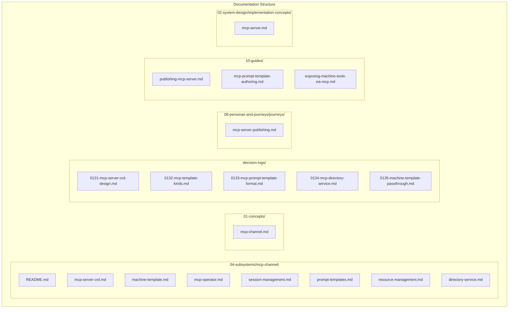

# MCP Channel Subsystem Documentation Plan

This plan creates a dedicated MCP Channel subsystem with supporting documentation across concepts, decisions, journeys, and guides.

---

## Architecture Overview



---

## Template Kinds Overview

The MCP Channel subsystem supports **seven template kinds** organized into two categories:

### Scenario-Based Templates (Request Lifecycle)

These templates expose Hub scenarios, requests, tasks, and resources with full request lifecycle management.

| Template Kind | Persona(s) | Tools | Prompts | Resources | Sessions |

|---------------|------------|-------|---------|-----------|----------|

| `business-user-template` | Business Customer, Employee, System | Request initiation/participation | Task solvers, guidance | Requests | Yes |

| `supervisor-template` | Supervisor | Queue mgmt, SLAs, directability | Queue analysis | Queues, escalations | Yes |

| `agent-template` | Agent (Human/AI) | Task processing, knowledge | Task solvers | Tasks, requests | Yes |

| `creator-template` | Process Architect, Developer | Scenario design, feedback | Design guides | Scenarios, feedback | Yes |

| `admin-template` | Administrator | Subscription mgmt | Resource optimization | Workbenches | Yes |

| `auditor-template` | Auditor | Decision investigation | Investigation guides | Audit trails | Yes |

### Tool-Based Templates (Passthrough)

These templates expose Tool Registry tools directly, with no request lifecycle.

| Template Kind | Purpose | Tools | Prompts | Resources | Sessions |

|---------------|---------|-------|---------|-----------|----------|

| `machine-template` | Expose Machine tools via MCP | From Tool Registry | None | None | Stateless |

---

## Phase 1: Subsystem Folder Structure

Create `olympus-hub-docs/04-subsystems/mcp-channel/` with the following documents:

### 1.1 README.md (Subsystem Overview)

**Content:**

- Overview of MCP Channel as a platform service
- Architecture diagram showing MCP Router, MCP Channel, MCP Servers, MCP Operator
- Key concepts: MCP Server CRD, Template Kinds (including machine-template), Prompt Templates, Resources, Sessions
- Core responsibilities: Client routing, session management, resource subscriptions, tool discovery, passthrough invocation
- Integration points: MCP Router, Heracles, Cipher IAM, Signal Exchange, Hub Applications, Tool Registry, HTTP Tool Calling Application
- Reference to existing [mcp-router.md](olympus-hub-docs/05-infrastructure/mcp-router.md) and [mcp-channels.md](olympus-hub-docs/06-ux-architecture/tenant-domain/mcp-channels.md)

### 1.2 mcp-server-crd.md

**Content:**

- MCP Server CRD specification (C2 level)
- Template kinds overview (all seven)
- CRD structure: server identity, workbench scope, exposed scenarios, prompt templates, access policy, session config
- OPA-based access control
- Examples for each template kind (except machine-template which has dedicated doc)

### 1.3 machine-template.md (NEW)

**Content:**

- Purpose: Expose Tool Registry tools via MCP without request lifecycle
- Architecture: MCP Router as gateway with passthrough to HTTP Tool Calling Application
- CRD structure:
  - Tool source options: Machine reference OR explicit tool list
  - OPA-based access control
  - No prompts, no resources, no sessions (stateless)
- Flow diagram: MCP Client -> MCP Router (auth, protocol) -> HTTP Tool Calling Application -> Machine Tools
- Integration with Tool Registry two-level model (Tool Protocols + Tools)
- Example CRD
```yaml
apiVersion: hub.olympus.io/v1
kind: machine-template
metadata:
  name: core-banking-mcp
  namespace: acme-bank
spec:
  server:
    name: core-banking-mcp
    display_name: "Core Banking Tools"
    version: "1.0.0"
  
  # Option A: All tools from a Machine
  tool_source:
    machine_ref: acme-core-banking
  
  # Option B: Explicit tool list
  # tool_source:
  #   tools:
  #     - get-account
  #     - get-transaction-history
  #     - validate-account
  
  access_policy:
    # OPA Rego policy
```


### 1.4 mcp-operator.md

**Content:**

- MCP Operator role: Provisions endpoints at MCP Channel based on CRDs
- Operator lifecycle: Watch CRDs, provision/deprovision endpoints
- Endpoint provisioning flow
- Machine-template specific handling: Register tools from Tool Registry
- Integration with MCP Channel platform service

### 1.5 session-management.md

**Content:**

- MCP session scope (up to MCP Gateway)
- OAuth authentication flow
- Session establishment, termination triggers
- Inactivity timeout, max subscriptions
- Session-bound resource subscriptions
- Note: machine-template is stateless (no session management)

### 1.6 prompt-templates.md

**Content:**

- Prompt template format specification
- MCP Router compatibility (list-prompts response format)
- Template categories: task_solver, guidance, error_handling, progress
- Mustache/Handlebars compilation
- Context available for compilation
- Examples from scratchpad
- Note: machine-template does not support prompts

### 1.7 resource-management.md

**Content:**

- Resource types per template kind (requests, tasks, queues, escalations, scenarios, feedback)
- Resource URI patterns
- Resource subscriptions (session-bound)
- Notification mechanisms: JSON-RPC notifications, resource/updated events
- SSE and Streamable HTTP transport
- Note: machine-template does not support resources

### 1.8 directory-service.md

**Content:**

- Directory purpose: For collaborators, not MCP Clients
- Directory tools: list_mcp_servers, get_mcp_server_info, get_client_config
- Client injection mechanism
- Directory entry structure
- Machine-template servers included in directory

---

## Phase 2: Concept Document

Create `olympus-hub-docs/01-concepts/mcp-channel.md`:

**Content:**

- What is an MCP Channel? (Platform service for AI agent access)
- Relationship to other channels (REST, Web Console, MS Teams)
- MCP as persona-scoped access surface
- Key distinction: MCP Channel (platform service) vs MCP Server (workbench-scoped CRD)
- Two categories: Scenario-based templates (request lifecycle) vs Tool-based templates (passthrough)
- Control Plane vs Data Plane channels
- Link to detailed subsystem documentation

---

## Phase 3: Architecture Decision Records

### 3.1 ADR-0131: MCP Server CRD Design

**Context:** Need to define how developers publish MCP Servers per workbench.

**Decision:**

- MCP Server is a CRD (Custom Resource Definition)
- Template kind implies persona (no explicit persona field)
- Scenarios automatically include corresponding requests
- OPA-based access control

### 3.2 ADR-0132: MCP Template Kinds

**Context:** Need to support different persona-scoped MCP access.

**Decision:**

- Seven template kinds in two categories:
  - Scenario-based: business-user-template, supervisor-template, agent-template, creator-template, admin-template, auditor-template
  - Tool-based: machine-template
- Scenario-based templates imply default tools, resources, and capabilities
- machine-template exposes Tool Registry tools without request lifecycle
- Template kind is part of CRD kind

### 3.3 ADR-0133: MCP Prompt Template Format

**Context:** Prompt templates must be compatible with MCP Router list-prompts response.

**Decision:**

- Prompt templates structured for semantic/structural equivalence with MCP Router
- Hub stores additional metadata (category, scenario_ref, task_type, template)
- MCP Router exposes only MCP-compliant fields
- Mustache/Handlebars for template rendering
- Note: machine-template does not support prompts

### 3.4 ADR-0134: MCP Directory Service for Collaborators

**Context:** Need mechanism for discovering available MCP Servers.

**Decision:**

- Directory exposed for collaborators (not MCP Clients)
- MCP Clients are injected configuration
- Directory tools: list_mcp_servers, get_mcp_server_info, get_client_config
- All template types included in directory

### 3.5 ADR-0135: Machine Template Passthrough Pattern (NEW)

**Context:** Need to expose Tool Registry tools via MCP without request lifecycle overhead.

**Decision:**

- machine-template exposes a collection of tools from Tool Registry
- MCP Router acts as gateway: authentication, protocol translation, passthrough
- Invocation via HTTP Tool Calling Application (native HTTP tool calling)
- No request lifecycle, no prompts, no resources, no sessions (stateless)
- Tool source options: Machine reference OR explicit tool list
- OPA policy controls access (same as other templates)

**Rationale:**

- Enables exposing existing Machine tools to AI agents via MCP
- Avoids overhead of request lifecycle for stateless tool calls
- Reuses existing infrastructure: Tool Registry, HTTP Tool Calling Application
- Consistent access control model (OPA)

---

## Phase 4: Journey Document

Create `olympus-hub-docs/08-personas-and-journeys/journeys/mcp-server-publishing.md`:

**Content:**

- Journey overview: Developer publishes MCP Server for business users
- Two paths:
  - **Scenario-based**: Expose scenarios, requests, tasks (with request lifecycle)
  - **Tool-based**: Expose Machine tools (stateless passthrough)
- Phases for Scenario-based:

  1. Design: Identify scenarios, tools, prompts to expose
  2. Define CRD: Create MCP Server CRD with template kind
  3. Author Prompts: Create prompt templates (task solvers, guidance)
  4. Configure Access: Define OPA policy for access control
  5. Publish: Apply CRD, MCP Operator provisions endpoints
  6. Validate: Test via MCP client

- Phases for Tool-based (machine-template):

  1. Identify tools: Select Machine or specific tools from Tool Registry
  2. Define CRD: Create machine-template CRD
  3. Configure Access: Define OPA policy
  4. Publish: Apply CRD
  5. Validate: Test via MCP client

- Personas involved: Developer, Supervisor (validation)
- Output: Published MCP Server accessible via MCP Channel

---

## Phase 5: Guide Documents

### 5.1 publishing-mcp-server.md

**Content:**

- Overview: How to publish an MCP Server for a workbench
- Prerequisites: Workbench exists, scenarios defined, Developer access
- Step-by-step for scenario-based templates:

  1. Choose template kind
  2. Define exposed scenarios
  3. Create prompt templates
  4. Configure OPA policy
  5. Apply CRD
  6. Verify via MCP client

- Complete example
- Troubleshooting

### 5.2 mcp-prompt-template-authoring.md

**Content:**

- Overview: How to author effective MCP prompt templates
- Task solver prompts (essential)
- Guidance prompts (optional)
- Template structure (MCP-compatible)
- Context variables available
- Mustache/Handlebars syntax
- Examples for different task types
- Best practices

### 5.3 exposing-machine-tools-via-mcp.md (NEW)

**Content:**

- Overview: How to expose Machine tools via MCP (machine-template)
- Prerequisites: Machine registered, tools in Tool Registry, Developer access
- When to use: Stateless tool invocation without request lifecycle
- Step-by-step:

  1. Identify tools: Choose Machine or specific tools
  2. Create machine-template CRD
  3. Configure OPA policy
  4. Apply CRD
  5. Verify via MCP client

- Tool source options: Machine reference vs explicit tool list
- Complete example
- Comparison with scenario-based templates
- Troubleshooting

---

## Phase 6: Implementation Concept

Create `olympus-hub-docs/02-system-design/implementation-concepts/mcp-server.md`:

**Content:**

- What is an MCP Server? (Workbench-scoped configuration layer)
- Relationship to MCP Channel (platform service)
- CRD-based configuration
- Two categories:
  - Scenario-based: Request lifecycle, prompts, resources, sessions
  - Tool-based (machine-template): Passthrough invocation, stateless
- MCP Operator provisions endpoints
- Tools, Prompts, Resources exposed per template kind
- machine-template integration with Tool Registry and HTTP Tool Calling Application
- Link to detailed subsystem documentation

---

## Phase 7: Update Existing Documentation

### 7.1 Update [mcp-channels.md](olympus-hub-docs/06-ux-architecture/tenant-domain/mcp-channels.md)

- Add reference to new subsystem
- Clarify MCP Channel vs MCP Server distinction
- Add machine-template to template kinds table
- Link to new ADRs

### 7.2 Update [mcp-router.md](olympus-hub-docs/05-infrastructure/mcp-router.md)

- Add reference to MCP Server CRDs
- Add reference to MCP Operator
- Add machine-template passthrough pattern
- Link to prompt template format

### 7.3 Update [decision-logs/README.md](olympus-hub-docs/decision-logs/README.md)

- Add entries for new ADRs (0131-0135)

### 7.4 Update [tool-registry.md](olympus-hub-docs/04-subsystems/registry-services/tool-registry.md)

- Add reference to machine-template MCP exposure
- Link to new documentation

---

## Summary Statistics

| Category | New Files | Updated Files |

|----------|-----------|---------------|

| Subsystem (04-subsystems/mcp-channel/) | 8 | 0 |

| Concepts (01-concepts/) | 1 | 0 |

| Decision Logs | 5 | 1 |

| Journeys | 1 | 0 |

| Guides | 3 | 0 |

| Implementation Concepts | 1 | 0 |

| Existing Docs | 0 | 3 |

| **Total** | **19** | **4** |

---

## Source Material

All content derives from the brainstorming document:

- [0WIP-hub-mcp.md](olympus-hub-docs/scratchpad/0WIP-hub-mcp.md)

After completion, the scratchpad document should be archived or deleted.