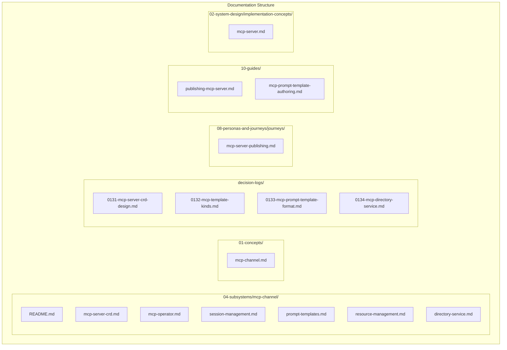

# MCP Channel Subsystem Documentation Plan

This plan creates a dedicated MCP Channel subsystem with supporting documentation across concepts, decisions, journeys, and guides.

---

## Architecture Overview

---

## Phase 1: Subsystem Folder Structure

Create `olympus-hub-docs/04-subsystems/mcp-channel/` with the following documents:

### 1.1 README.md (Subsystem Overview)

**Content:**
- Overview of MCP Channel as a platform service
- Architecture diagram showing MCP Router, MCP Channel, MCP Servers, MCP Operator
- Key concepts: MCP Server CRD, Template Kinds, Prompt Templates, Resources, Sessions
- Core responsibilities: Client routing, session management, resource subscriptions, tool discovery
- Integration points: MCP Router, Heracles, Cipher IAM, Signal Exchange, Hub Applications
- Reference to existing [mcp-router.md](olympus-hub-docs/05-infrastructure/mcp-router.md) and [mcp-channels.md](olympus-hub-docs/06-ux-architecture/tenant-domain/mcp-channels.md)

### 1.2 mcp-server-crd.md

**Content:**
- MCP Server CRD specification (C2 level)
- Template kinds overview (business-user-template, supervisor-template, agent-template, creator-template, admin-template, auditor-template)
- CRD structure: server identity, workbench scope, exposed scenarios, prompt templates, access policy, session config
- OPA-based access control
- Examples for each template kind

### 1.3 mcp-operator.md

**Content:**
- MCP Operator role: Provisions endpoints at MCP Channel based on CRDs
- Operator lifecycle: Watch CRDs, provision/deprovision endpoints
- Endpoint provisioning flow
- Integration with MCP Channel platform service

### 1.4 session-management.md

**Content:**
- MCP session scope (up to MCP Gateway)
- OAuth authentication flow
- Session establishment, termination triggers
- Inactivity timeout, max subscriptions
- Session-bound resource subscriptions

### 1.5 prompt-templates.md

**Content:**
- Prompt template format specification
- MCP Router compatibility (list-prompts response format)
- Template categories: task_solver, guidance, error_handling, progress
- Mustache/Handlebars compilation
- Context available for compilation
- Examples from scratchpad

### 1.6 resource-management.md

**Content:**
- Resource types per template kind (requests, tasks, queues, escalations, scenarios, feedback)
- Resource URI patterns
- Resource subscriptions (session-bound)
- Notification mechanisms: JSON-RPC notifications, resource/updated events
- SSE and Streamable HTTP transport

### 1.7 directory-service.md

**Content:**
- Directory purpose: For collaborators, not MCP Clients
- Directory tools: list_mcp_servers, get_mcp_server_info, get_client_config
- Client injection mechanism
- Directory entry structure

---

## Phase 2: Concept Document

Create `olympus-hub-docs/01-concepts/mcp-channel.md`:

**Content:**
- What is an MCP Channel? (Platform service for AI agent access)
- Relationship to other channels (REST, Web Console, MS Teams)
- MCP as persona-scoped access surface
- Key distinction: MCP Channel (platform service) vs MCP Server (workbench-scoped CRD)
- Control Plane vs Data Plane channels
- Link to detailed subsystem documentation

---

## Phase 3: Architecture Decision Records

### 3.1 ADR-0131: MCP Server CRD Design

**Context:** Need to define how developers publish MCP Servers per workbench.

**Decision:**
- MCP Server is a CRD (Custom Resource Definition)
- Template kind implies persona (no explicit persona field)
- Scenarios automatically include corresponding requests
- OPA-based access control

### 3.2 ADR-0132: MCP Template Kinds

**Context:** Need to support different persona-scoped MCP access.

**Decision:**
- Six template kinds: business-user-template, supervisor-template, agent-template, creator-template, admin-template, auditor-template
- Each template implies default tools, resources, and capabilities
- Template kind is part of CRD kind

### 3.3 ADR-0133: MCP Prompt Template Format

**Context:** Prompt templates must be compatible with MCP Router list-prompts response.

**Decision:**
- Prompt templates structured for semantic/structural equivalence with MCP Router
- Hub stores additional metadata (category, scenario_ref, task_type, template)
- MCP Router exposes only MCP-compliant fields
- Mustache/Handlebars for template rendering

### 3.4 ADR-0134: MCP Directory Service for Collaborators

**Context:** Need mechanism for discovering available MCP Servers.

**Decision:**
- Directory exposed for collaborators (not MCP Clients)
- MCP Clients are injected configuration
- Directory tools: list_mcp_servers, get_mcp_server_info, get_client_config

---

## Phase 4: Journey Document

Create `olympus-hub-docs/08-personas-and-journeys/journeys/mcp-server-publishing.md`:

**Content:**
- Journey overview: Developer publishes MCP Server for business users
- Phases:
  1. Design: Identify scenarios, tools, prompts to expose
  2. Define CRD: Create MCP Server CRD with template kind
  3. Author Prompts: Create prompt templates (task solvers, guidance)
  4. Configure Access: Define OPA policy for access control
  5. Publish: Apply CRD, MCP Operator provisions endpoints
  6. Validate: Test via MCP client
- Personas involved: Developer, Supervisor (validation)
- Output: Published MCP Server accessible via MCP Channel

---

## Phase 5: Guide Documents

### 5.1 publishing-mcp-server.md

**Content:**
- Overview: How to publish an MCP Server for a workbench
- Prerequisites: Workbench exists, scenarios defined, Developer access
- Step-by-step:
  1. Choose template kind
  2. Define exposed scenarios
  3. Create prompt templates
  4. Configure OPA policy
  5. Apply CRD
  6. Verify via MCP client
- Complete example
- Troubleshooting

### 5.2 mcp-prompt-template-authoring.md

**Content:**
- Overview: How to author effective MCP prompt templates
- Task solver prompts (essential)
- Guidance prompts (optional)
- Template structure (MCP-compatible)
- Context variables available
- Mustache/Handlebars syntax
- Examples for different task types
- Best practices

---

## Phase 6: Implementation Concept

Create `olympus-hub-docs/02-system-design/implementation-concepts/mcp-server.md`:

**Content:**
- What is an MCP Server? (Workbench-scoped configuration layer)
- Relationship to MCP Channel (platform service)
- CRD-based configuration
- MCP Operator provisions endpoints
- Tools, Prompts, Resources exposed per template kind
- Link to detailed subsystem documentation

---

## Phase 7: Update Existing Documentation

### 7.1 Update [mcp-channels.md](olympus-hub-docs/06-ux-architecture/tenant-domain/mcp-channels.md)

- Add reference to new subsystem
- Clarify MCP Channel vs MCP Server distinction
- Link to new ADRs

### 7.2 Update [mcp-router.md](olympus-hub-docs/05-infrastructure/mcp-router.md)

- Add reference to MCP Server CRDs
- Add reference to MCP Operator
- Link to prompt template format

### 7.3 Update [decision-logs/README.md](olympus-hub-docs/decision-logs/README.md)

- Add entries for new ADRs (0131-0134)

---

## Summary Statistics

| Category | New Files | Updated Files |
|----------|-----------|---------------|
| Subsystem (04-subsystems/mcp-channel/) | 7 | 0 |
| Concepts (01-concepts/) | 1 | 0 |
| Decision Logs | 4 | 1 |
| Journeys | 1 | 0 |
| Guides | 2 | 0 |
| Implementation Concepts | 1 | 0 |
| Existing Docs | 0 | 2 |
| **Total** | **16** | **3** |

---

## Source Material

All content derives from the brainstorming document:
- [0WIP-hub-mcp.md](olympus-hub-docs/scratchpad/0WIP-hub-mcp.md)

After completion, the scratchpad document should be archived or deleted.
