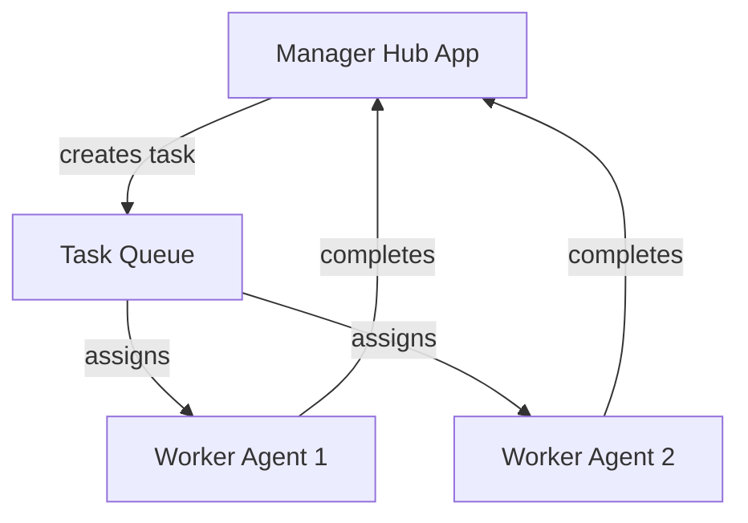
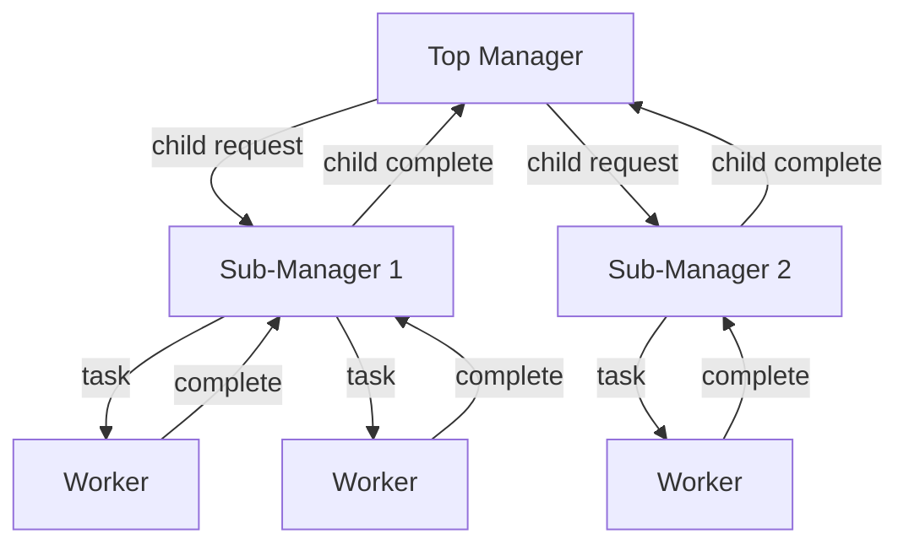
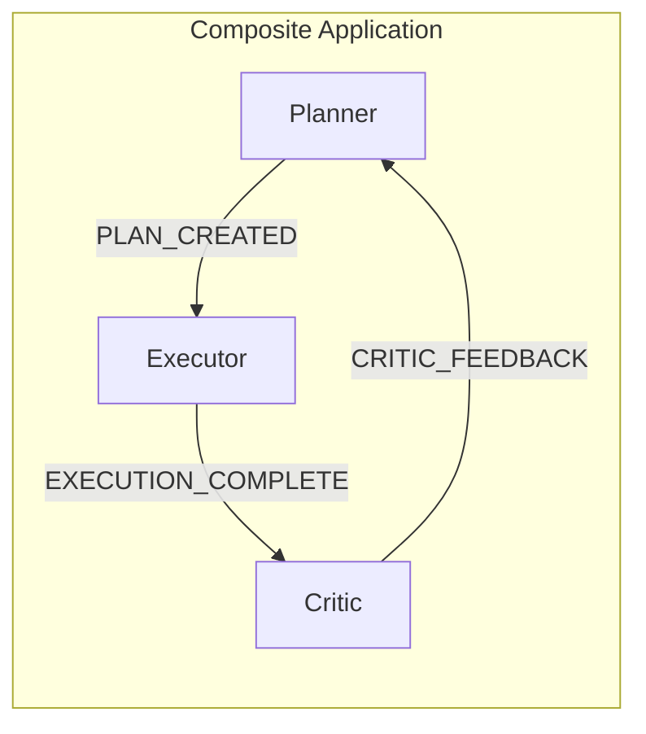
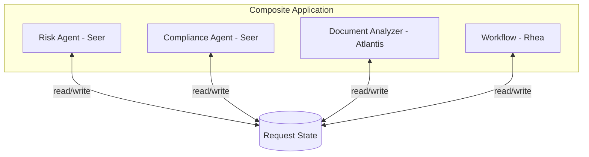
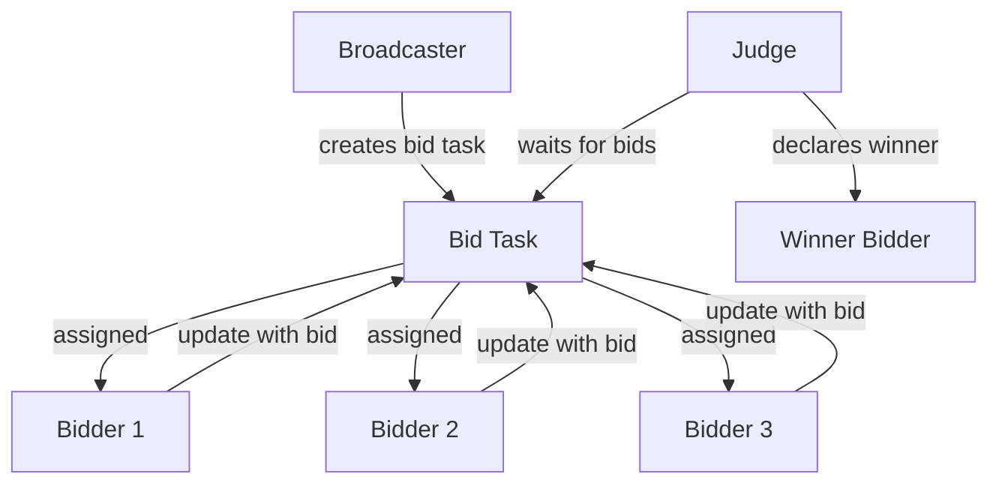
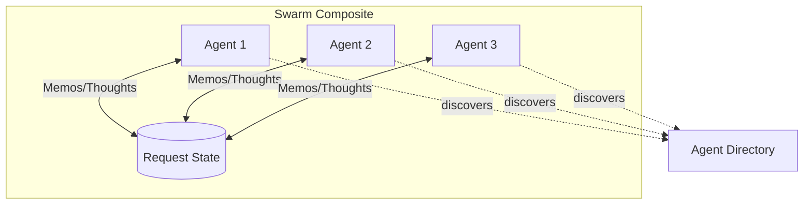
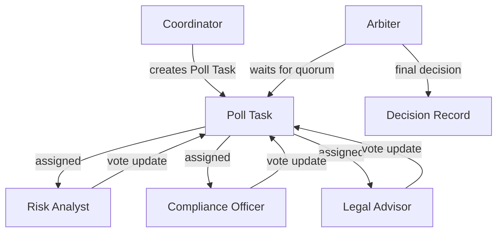
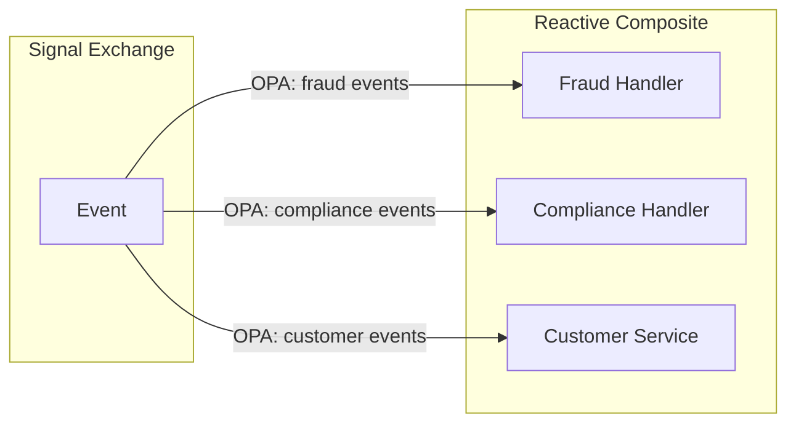
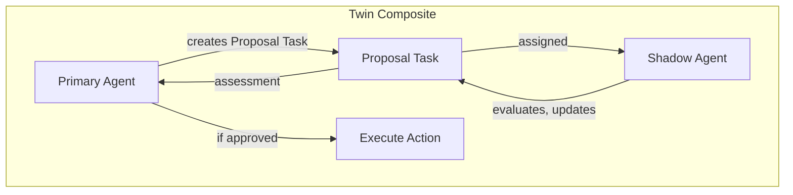

# Multi-Agent Topology Implementation Guides

## Overview

Create 9 guide documents in [`olympus-seer-docs/seer-design/guides/multi-agent-topologies/`](olympus-seer-docs/seer-design/guides/multi-agent-topologies/) explaining how to implement each topology from [multi-agent-topologies.md](olympus-seer-docs/agentic-ai-concepts/multi-agent-topologies.md) using Hub and Seer capabilities.

---

## Document Structure (All Guides)

Each guide follows this structure:

```markdown
# [Topology Name]

## Overview
- Pattern description and characteristics
- Reference to catalog entry

## When to Use
- Best use cases
- Strengths and failure modes

## Hub/Seer Mapping
- Table mapping topology concepts to Hub/Seer concepts

## Approach 1: [Name]
- Architecture (Mermaid diagram)
- Components and their roles
- Configuration (CRD snippets)
- Execution flow

## Approach 2: [Name]
- Alternative implementation
- Same structure as Approach 1

## Comparison
- When to use each approach

## Sentinel Enhancement (where applicable)
- How sentinels add value

## Related Patterns
- Links to other topologies
```

---

## Guide 1: Manager-Worker (Orchestrator)

**File:** `01-manager-worker.md`

### Approach 1: Hub Application with Task Delegation
- **Manager**: Hub Application (Seer) creates tasks
- **Workers**: Employed Agents assigned via task queue escalation matrix
- **Coordination**: Manager receives task completion updates, aggregates results



### Approach 2: Scenario-as-Agent Workers
- **Manager**: Hub Application in parent scenario
- **Workers**: Scenario-as-Agent enrolled in task queue
- **Benefit**: Workers are full scenarios with their own automation

**Key CRDs:** `HubApplicationSpec`, `ScenarioAsAgent`, Task Queue configuration

---

## Guide 2: Hierarchical (Multi-Level Orchestration)

**File:** `02-hierarchical.md`

### Approach 1: Parent-Child Request Hierarchy
- **Top Manager**: Creates child requests for sub-domains
- **Sub-Managers**: Scenario-as-Agent that creates further child requests
- **Workers**: Employed Agents in leaf-level queues
- **Results**: Child completion updates parent automatically



### Approach 2: Nested Task Queues with Escalation
- Multiple escalation levels represent hierarchy
- Each level adds new assignees (cumulative)

**Key CRDs:** `ScenarioAsAgent`, Parent-Child Request configuration, Escalation Matrix

---

## Guide 3: Planner-Executor-Critic (PEC Loop)

**File:** `03-planner-executor-critic.md`

### Approach 1: Composite Application with OPA Filters
- **Planner, Executor, Critic**: Three apps in `HubCompositeApplicationSpec`
- **Coordination**: OPA filters route updates by `update_type`
  - Planner: `REQUEST_CREATED`, `CRITIC_FEEDBACK`
  - Executor: `PLAN_CREATED`
  - Critic: `EXECUTION_COMPLETE`



### Approach 2: Scenario-as-Tool Chain
- Planner invokes Executor as tool
- Executor invokes Critic as tool
- Critic returns feedback synchronously

**Key CRDs:** `HubCompositeApplicationSpec` with OPA filters, `ScenarioAsTool`

---

## Guide 4: Blackboard (Shared Memory Coordination)

**File:** `04-blackboard.md`

### Approach 1: Composite Application (Primary)
- Multiple specialist apps in composite
- **Request state as blackboard**: All apps read/write
- **OPA filters**: Route updates selectively
- **Cross-runtime**: Seer + Rhea + Atlantis example



### Approach 2: Multiple Independent Apps
- Separate Hub Applications coordinate via Request updates
- No composite needed; Signal Exchange routes to all

**Key Concepts:**
- Request state as shared memory
- OPA filters for selective routing
- Cross-runtime composition

---

## Guide 5: Market-Based / Auction

**File:** `05-market-based-auction.md`

### Approach 1: Composite with Judge Pattern
- **Broadcaster**: Creates "bid request" task, assigns to all bidders
- **Bidders**: Update task with their bid (cost/confidence fields)
- **Judge**: Waits for bids (timeout via Hub scheduling), evaluates, declares winner



### Approach 2: Task Queue with Scenario-as-Agent Bidders
- Multiple Scenario-as-Agent enrolled in same queue
- Allocation algorithm selects based on capabilities
- Each Scenario-as-Agent represents a "bidder"

**Key Concepts:**
- Bids modeled as task updates
- Judge app uses Hub scheduling for timeouts
- Bid evaluation is ensemble-defined (not Hub-imposed)

---

## Guide 6: Peer-to-Peer (Swarm)

**File:** `06-peer-to-peer-swarm.md`

### Approach 1: Composite with Event-Driven Coordination
- All apps in composite, no central coordinator
- Each reacts to Request updates independently
- **Lateral communication**: Memos with agent scoping, Thoughts with tagging



### Approach 2: Independent Apps with Discovery
- Agents discover each other via directories (as tools)
- Introduce new agents by adding as assignees
- Out-of-band communication via Raw Agent capabilities

**Key Concepts:**
- Request as "collaboration substrate"
- Memos for targeted communication (scoped to agent)
- Thoughts for tagged communication
- Directories as tools for discovery

**Sentinel Enhancement:**
- Realtime Sentinel monitors swarm health
- Detects stuck or divergent agents

---

## Guide 7: Role-Specialized Committees

**File:** `07-role-specialized-committees.md`

### Approach 1: Composite with Poll Task Pattern
- Specialist apps provide perspectives via Request updates
- **Poll Task**: Created by coordinator, assigned to all committee members
- **Voting**: Each specialist updates Poll Task with their vote
- **Arbiter**: Waits for quorum (Hub scheduling), aggregates votes



### Approach 2: Parallel Task Assignment
- Committee task created with multiple assignees (role-based)
- Each assignee provides perspective
- First-to-complete or all-must-complete semantics

**Key Concepts:**
- Poll Task pattern for voting
- Arbiter/Judge pattern (same as auction)
- Hub scheduling for quorum timeout
- Role-based escalation matrix

---

## Guide 8: Event-Driven Agents (Reactive Mesh)

**File:** `08-event-driven-reactive.md`

### Approach 1: Composite with OPA Filters
- Multiple reactive apps in composite
- OPA filters route events to relevant apps
- Each app reacts independently



### Approach 2: Signal-Based Subscription
- Apps subscribe to specific signal types
- No composite needed; Signal Exchange routes by signal match

**Sentinel Enhancement:**
- Request Sentinel detects feedback loops
- Analytical Sentinel monitors event patterns

---

## Guide 9: Cognitive Twin / Shadow Agents

**File:** `09-cognitive-twin-shadow.md`

### Approach 1: Composite with Proposal Task
- **Primary** and **Shadow** both in composite
- Primary creates "Proposal Task" assigned to Shadow
- Shadow evaluates, updates task with assessment
- Primary receives update, proceeds or aborts



### Approach 2: Scenario-as-Tool Shadow
- Primary invokes Shadow scenario as tool
- Synchronous evaluation
- Shadow returns approval/rejection

**Guardrails Enhancement:**
- Guardrail on Primary enforces shadow approval before action
- Prevents bypass of shadow evaluation

**Key Concepts:**
- Proposal Task pattern (Primary → Shadow → Primary)
- Same request (composite) or child request (as tool)
- Request Sentinel NOT recommended (primary should be aware of shadow)

---

## README Index

**File:** `README.md`

```markdown
# Multi-Agent Topology Implementation Guides

Guides for implementing multi-agent collaboration patterns using Hub and Seer.

## Topologies

| # | Topology | Primary Pattern | Key Concepts |
|---|----------|-----------------|--------------|
| 1 | [Manager-Worker](./01-manager-worker.md) | Task Delegation | Task queues, Employed Agents |
| 2 | [Hierarchical](./02-hierarchical.md) | Multi-Level | Parent-child requests, Scenario-as-Agent |
| 3 | [PEC Loop](./03-planner-executor-critic.md) | Composite + OPA | Update type routing |
| 4 | [Blackboard](./04-blackboard.md) | Composite | Shared Request state |
| 5 | [Market-Based](./05-market-based-auction.md) | Judge Pattern | Bid tasks, scheduling |
| 6 | [Peer-to-Peer](./06-peer-to-peer-swarm.md) | Discovery | Memos, Directories |
| 7 | [Committees](./07-role-specialized-committees.md) | Poll Task | Voting, arbiter |
| 8 | [Event-Driven](./08-event-driven-reactive.md) | Reactive | OPA filters, signals |
| 9 | [Cognitive Twin](./09-cognitive-twin-shadow.md) | Proposal Task | Shadow evaluation |

## Key Patterns

- **Composite Application**: Multiple apps in same Request
- **Scenario-as-Agent**: Automation enrolled in task queue
- **Scenario-as-Tool**: Synchronous scenario invocation
- **Judge/Arbiter Pattern**: Wait for inputs, evaluate, decide
- **Proposal Task Pattern**: Primary → Shadow → Primary

## References

- [Hub Composite Application](../../olympus-hub-docs/02-system-design/implementation-concepts/hub-composite-application.md)
- [Scenario as Agent](../../olympus-hub-docs/02-system-design/implementation-concepts/scenario-as-agent.md)
- [Scenario as Tool](../../olympus-hub-docs/02-system-design/implementation-concepts/scenario-as-tool.md)
- [Task Queues](../../olympus-hub-docs/04-subsystems/task-management/task-queues.md)
- [Seer Sentinels](../subsystems/seer-sentinels/README.md)
```

---

## Cross-Cutting Concerns

### Hub Concepts Used Across Guides

| Concept | Used In | Description |
|---------|---------|-------------|
| Composite Application | 3, 4, 5, 6, 7, 8, 9 | Multiple apps in same Request |
| Task Queue | 1, 2, 5, 7 | Agent assignment via escalation matrix |
| Scenario-as-Agent | 1, 2, 5 | Automation in task queue |
| Scenario-as-Tool | 3, 9 | Synchronous invocation |
| Memos | 6 | Targeted agent communication |
| Directories | 6 | Agent discovery as tools |
| Hub Scheduling | 5, 7 | Timeout for bids/votes |
| Parent-Child Requests | 2 | Hierarchical coordination |
| Guardrails | 9 | Action blocking |

### Sentinel Integration

| Topology | Sentinel Type | Purpose |
|----------|---------------|---------|
| Peer-to-Peer | Realtime | Swarm health monitoring |
| Event-Driven | Request | Feedback loop detection |

---

## Files to Create

1. `olympus-seer-docs/seer-design/guides/multi-agent-topologies/README.md`
2. `olympus-seer-docs/seer-design/guides/multi-agent-topologies/01-manager-worker.md`
3. `olympus-seer-docs/seer-design/guides/multi-agent-topologies/02-hierarchical.md`
4. `olympus-seer-docs/seer-design/guides/multi-agent-topologies/03-planner-executor-critic.md`
5. `olympus-seer-docs/seer-design/guides/multi-agent-topologies/04-blackboard.md`
6. `olympus-seer-docs/seer-design/guides/multi-agent-topologies/05-market-based-auction.md`
7. `olympus-seer-docs/seer-design/guides/multi-agent-topologies/06-peer-to-peer-swarm.md`
8. `olympus-seer-docs/seer-design/guides/multi-agent-topologies/07-role-specialized-committees.md`
9. `olympus-seer-docs/seer-design/guides/multi-agent-topologies/08-event-driven-reactive.md`
10. `olympus-seer-docs/seer-design/guides/multi-agent-topologies/09-cognitive-twin-shadow.md`

---

## Execution Order

1. Create folder and README (establishes structure)
2. Create guides 1-9 in sequence
3. Update parent README (`guides/README.md`) with links
4. Clean up scratchpad file

---

## Success Criteria

- Each topology has 2+ implementation approaches
- Mermaid diagrams for architecture
- Key CRD snippets (inline OPA policies where applicable)
- Clear mapping of topology concepts to Hub/Seer
- Cross-references to existing documentation
- Consistent structure across all guides