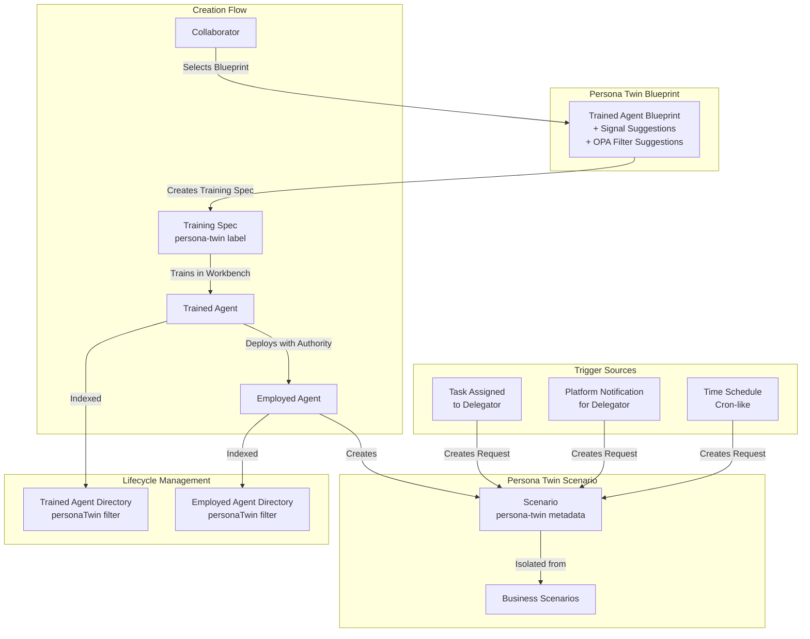

# Persona Twins Implementation Plan

## Overview

Persona Twins enable any Collaborator in a Workbench to create Agent Twins that delegate their responsibilities. Each Persona Twin is backed by a Scenario labeled as `persona-twin` and follows the standard agent lifecycle (Raw → Trained → Employed) with special recognition, isolation, and trigger mechanisms.

## Architecture Overview



## Implementation Tasks

### 1. Concept Documentation

#### 1.1 Core Concept Document

**File:** `olympus-seer-docs/seer-design/implementation-concepts/persona-twins.md`

- Definition: Persona Twins as delegatable AI agents for collaborators
- Relationship to three-layer agent model (Raw → Trained → Employed)
- Authority delegation model (delegator = collaborator who creates NormativeSpec, manager = delegator)
- Accountability model
- Isolation from Business Scenarios
- Visibility controls (private scenarios at scenario level)

#### 1.2 Persona Twin Blueprint Concept

**File:** `olympus-seer-docs/seer-design/implementation-concepts/persona-twin-blueprint.md`

- Definition: Trained Agent Blueprint CRD with additional metadata fields
- Common signal suggestions:
        - `task.assigned` - Tasks assigned to delegator
        - `platform.notification` - Platform notifications scoped to workbench for delegator
        - `request.update` - Request updates for delegator's assigned tasks
        - Workbench-level events
        - Subscription-level events
- OPA filter suggestions (similar to COG Sentinel `on_request_update` pattern)
- Blueprint availability (default Hub Platform subscription, all workbenches)

**Schema Addition:**

```yaml
apiVersion: seer.olympus.io/v1
kind: TrainingSpec
metadata:
  name: persona-twin-blueprint-example
spec:
  # Standard Trained Agent Blueprint fields
  rawAgent: ...
  knowledge: ...
  skills: ...
  
  # Persona Twin specific additions
  personaTwinBlueprint:
    signalSuggestions:
      - signalType: "task.assigned"
        description: "Tasks assigned to delegator"
        defaultFilter: |
          package persona.twin.task_filter
          default allow = false
          allow {
            input.payload.task.assignee == input.delegator_id
          }
    filterSuggestions:
      - name: "high-priority-tasks-only"
        policy: |
          package persona.twin.priority_filter
          ...
```

### 2. Subsystem Updates

#### 2.1 Trained Agent Lifecycle Manager

**File:** `olympus-seer-docs/seer-design/subsystems/trained-agent-lifecycle-manager/training-spec-manager.md`

**Updates:**

- Add `personaTwin` metadata field validation
- Support Persona Twin Blueprint as source (extends standard Trained Agent Blueprint)
- Validate `persona-twin` label in metadata

**File:** `olympus-seer-docs/seer-design/subsystems/trained-agent-lifecycle-manager/trained-agent-directory.md`

**Updates:**

- Add `personaTwin` filter to search capabilities
- Index by `persona-twin` label
- Support queries: "Find all Persona Twins for delegator X"
- Add `delegator` field to registry entry structure

#### 2.2 Agent Lifecycle Manager

**File:** `olympus-seer-docs/seer-design/subsystems/agent-lifecycle-manager/employment-spec-manager.md`

**Updates:**

- Support Persona Twin recognition via `personaTwin` metadata field
- Authority delegation configuration for Persona Twins:
        - Delegator = collaborator who creates NormativeSpec
        - Manager = Delegator (same person)
        - Roles, scopes, group membership configurable at deployment
        - OPA policies per PEP for fine-tuning delegation scope

**File:** `olympus-seer-docs/seer-design/subsystems/agent-lifecycle-manager/employed-agent-directory.md`

**Updates:**

- Add `personaTwin` filter to search capabilities
- Index by `persona-twin` label
- Track delegator information in agent profiles
- Support queries: "Find all Persona Twins for delegator X"

#### 2.3 Workbench Management

**File:** `olympus-hub-docs/04-subsystems/workbench-management/scenario-definitions.md`

**Updates:**

- Add `persona-twin` metadata label support
- Add `visibility` field (scenario-level, similar to marketplace visibility controls)
- Support `private` visibility mode (only admin and scenario owner/creator can see)
- Add `category` field to distinguish Persona Twin Scenarios from Business Scenarios

**Schema Addition:**

```yaml
scenario:
  id: string
  name: string
  workbench_id: string
  metadata:
    labels:
      persona-twin: "true"  # Metadata label
    category: "persona-twin" | "business"  # For isolation
    visibility: "public" | "private"  # Scenario-level visibility
    delegator: "user:john.smith@acme.com"  # Creator/delegator
  # ... rest of scenario schema
```

#### 2.4 Trigger System

**File:** `olympus-hub-docs/04-subsystems/workbench-management/trigger-definitions.md`

**Updates:**

- Support Persona Twin specific trigger types:

        1. **Task Assignment Trigger**: When task assigned to delegator → creates new Request in twin's scenario
        2. **Platform Notification Trigger**: Platform notifications scoped to workbench for delegator → creates Request
        3. **Time Schedule Trigger**: Cron-like schedules (using Kale scheduler) → creates Request

**New Trigger Type: Task Assignment**

```yaml
trigger:
  name: "delegator-task-assignment"
  type: task_assignment
  target:
    workbench: "dispute-ops"
    scenario: "john-smith-assistant"
  conditions:
    assignee: "user:john.smith@acme.com"  # Delegator
    # Optional OPA filter
    opaFilter: |
      package persona.twin.task_filter
      default allow = false
      allow {
        input.payload.task.priority == "high"
      }
  transform:
    request_type: "PersonaTwinTask"
    mapping:
      original_task_id: "$.task.id"
      delegator: "$.task.assignee"
```

**Integration with Task Management:**

- Task Management System observes task assignments
- When task assigned to delegator with Persona Twin, creates signal
- Signal Exchange routes to Persona Twin Scenario trigger
- Creates new Request in twin's scenario

**File:** `olympus-hub-docs/04-subsystems/signal-providers/kale-scheduler.md`

**Updates:**

- Document Persona Twin time schedule usage
- Support per-collaborator schedule configuration

#### 2.5 Platform Notifications Integration

**File:** `olympus-hub-docs/04-subsystems/platform-notifications/README.md`

**Updates:**

- Support Persona Twin notification routing
- When platform notification scoped to workbench for delegator, route to Persona Twin Scenario
- Add notification-to-scenario trigger mechanism

#### 2.6 Signal Exchange

**File:** `olympus-hub-docs/04-subsystems/signal-exchange/trigger-evaluator.md`

**Updates:**

- Support Persona Twin trigger evaluation
- OPA filter evaluation for Persona Twin triggers (similar to COG Sentinel pattern)
- Task assignment signal routing to Persona Twin Scenarios

### 3. Guides and Journeys

#### 3.1 Persona Twin Creation Guide

**File:** `olympus-hub-docs/10-guides/persona-twin-creation-guide.md`

**Content:**

- Overview: What are Persona Twins
- Prerequisites: Collaborator access, workbench membership
- Step-by-step:

        1. Select Persona Twin Blueprint
        2. Configure signal triggers with OPA filters
        3. Customize training spec (skills, behavior prompts)
        4. Train twin in workbench
        5. Deploy twin (create Employment Spec with authority delegation)
        6. Configure scenario visibility

- Examples: Common use cases

#### 3.2 Persona Twin Management Guide

**File:** `olympus-hub-docs/10-guides/persona-twin-management-guide.md`

**Content:**

- Managing multiple twins
- Updating twin configuration
- Modifying triggers and filters
- Retraining twins
- Promoting twins to other workbenches
- Revoking/deactivating twins

#### 3.3 Persona Twin Journey

**File:** `olympus-hub-docs/08-personas-and-journeys/journeys/persona-twin-creation.md`

**Content:**

- User journey: Collaborator creates Persona Twin
- Touchpoints: Workbench Studio, Agent Lifecycle UI
- Decision points: Blueprint selection, trigger configuration, authority delegation
- Outcomes: Twin deployed and operational

### 4. UX Subsystem Updates

#### 4.1 Workbench Studio Updates

**File:** `olympus-hub-docs/06-ux-architecture/workbench-studio/scenario-management.md`

**Updates:**

- Separate sections for Persona Twin Scenarios vs Business Scenarios
- Filter support: Show all / Business only / Persona Twins only
- Visibility controls: Private scenarios only visible to admin and creator
- Persona Twin creation wizard

**UI Structure:**

```
Workbench Studio → Scenarios
├── Business Scenarios (default view)
└── Persona Twins (separate section)
    ├── My Twins (collaborator's own twins)
    └── All Twins (admin view, respects visibility)
```

#### 4.2 Agent Lifecycle UI Updates

**File:** `olympus-hub-docs/06-ux-architecture/agent-lifecycle-ui/trained-agent-management.md`

**Updates:**

- Persona Twin filter in Trained Agent Directory
- Persona Twin badge/indicator
- Delegator information display
- Persona Twin specific creation flow

**File:** `olympus-hub-docs/06-ux-architecture/agent-lifecycle-ui/employed-agent-management.md`

**Updates:**

- Persona Twin filter in Employed Agent Directory
- Persona Twin badge/indicator
- Delegator information display
- Authority delegation UI for Persona Twins

#### 4.3 Scenario List/API Updates

**File:** `olympus-hub-docs/04-subsystems/workbench-management/README.md`

**Updates:**

- API filter support: `?category=persona-twin` or `?category=business`
- API filter support: `?visibility=private` or `?visibility=public`
- Default behavior: Include all scenarios (filter support sufficient, no exclusion by default)

### 5. Promotion and Marketplace Integration

#### 5.1 Promotion Support

**File:** `olympus-hub-docs/02-system-design/implementation-concepts/promotion.md`

**Updates:**

- Document Persona Twin promotion (same as scenario promotion)
- Each target workbench requires admin authorization
- Twin can exist in multiple workbenches simultaneously (different identities)
- Promotion creates new Employed Agent in target workbench using same Training Spec

#### 5.2 Marketplace Integration

**File:** `olympus-hub-docs/04-subsystems/marketplace/blueprints-and-packages.md`

**Updates:**

- Persona Twin Blueprints can be published as Trained Agent Blueprints
- Support subscribing to Persona Twin Blueprints across workbenches/subscriptions
- Visibility controls apply to published blueprints

### 6. Cipher IAM Extensions

**File:** `olympus-seer-docs/seer-design/subsystems/cipher-iam-extensions/authority-delegation.md`

**Updates:**

- Document Persona Twin authority delegation patterns
- Delegator = collaborator (user delegation type)
- Manager = Delegator (same person)
- Roles, scopes, group membership configurable
- OPA policies per PEP for fine-tuning (reference existing documentation)

## Key Design Decisions

1. **Persona Twin Blueprint**: Trained Agent Blueprint CRD with additional metadata fields (not separate CRD type)
2. **Scenario Labeling**: Metadata label `persona-twin: "true"` + category field for isolation
3. **Trigger Mechanism**: Task assignment creates new Request in twin's scenario (not direct task collaboration)
4. **Visibility**: Scenario-level, similar to marketplace visibility controls
5. **Authority Delegation**: Uses existing Employment Spec Manager with Persona Twin specific configuration
6. **Promotion**: Standard scenario promotion mechanism, admin approval per target workbench
7. **Lifecycle Recognition**: Tag/metadata field in both Training Spec and Employment Spec

## Dependencies

- Trained Agent Blueprint system (existing)
- Agent Lifecycle Manager (existing)
- Workbench Management (existing)
- Signal Exchange (existing)
- Task Management System (existing)
- Platform Notifications (existing)
- Kale Scheduler (existing)
- Cipher IAM Extensions (existing)

## Testing Considerations

- Persona Twin creation from blueprint
- Trigger mechanisms (task assignment, notifications, schedules)
- Scenario isolation and visibility controls
- Authority delegation configuration
- Promotion across workbenches
- Directory filtering and search
- OPA filter evaluation

## Related Documentation Updates

- Update agent lifecycle concepts to mention Persona Twins
- Update scenario specification types to include Persona Twin category
- Update collaborator documentation to mention Persona Twin capability
- Update workbench anatomy to show Persona Twin Scenarios section

### 7. Implementation Concepts Index Updates

#### 7.1 Hub Implementation Concepts Index

**File:** `olympus-hub-docs/02-system-design/implementation-concepts/README.md`

**Updates:**
- Add Persona Twins to appropriate category (likely "User Experience Architecture" or new "Agent Delegation" category)
- Add Persona Twin Blueprint to appropriate category
- Update concept index table with status

**Example Addition:**
```markdown
### User Experience Architecture

| Concept | Description | Status |
|---------|-------------|--------|
| [Persona](./persona.md) | Hub user types with distinct responsibilities | ✅ Complete |
| [Persona Twins](./persona-twins.md) | AI agent twins for collaborator delegation | 🟡 Draft |
| [Persona Twin Blueprint](./persona-twin-blueprint.md) | Blueprint for creating Persona Twins | 🟡 Draft |
```

#### 7.2 Seer Implementation Concepts

**File:** `olympus-seer-docs/seer-design/implementation-concepts/agent-lifecycle.md`

**Updates:**
- Add Persona Twins as a use case in the Trained Agent section
- Reference Persona Twin Blueprint in Training Spec examples
- Update Employed Agent section to mention Persona Twin authority delegation patterns

**File:** `olympus-seer-docs/seer-design/implementation-concepts/README.md` (if exists)

**Updates:**
- Add Persona Twins to concept index if Seer maintains a separate index

### 8. Architecture Decision Records (ADRs)

#### 8.1 ADR: Persona Twin Blueprint Structure

**File:** `olympus-hub-docs/decision-logs/XXXX-persona-twin-blueprint-structure.md`

**Content:**
- **Context**: Need for collaborator-accessible agent creation mechanism
- **Decision**: Persona Twin Blueprint extends Trained Agent Blueprint with signal suggestions and OPA filter templates (not separate CRD type)
- **Alternatives**: Separate PersonaTwinBlueprint CRD, standalone blueprint system
- **Consequences**: Reuses existing blueprint infrastructure, maintains consistency

#### 8.2 ADR: Persona Twin Scenario Isolation

**File:** `olympus-hub-docs/decision-logs/XXXX-persona-twin-scenario-isolation.md`

**Content:**
- **Context**: Need to distinguish Persona Twin Scenarios from Business Scenarios
- **Decision**: Use metadata label `persona-twin: "true"` + category field for isolation, separate UI sections
- **Alternatives**: Separate scenario type, namespace isolation
- **Consequences**: Filter-based isolation, maintains single scenario model

#### 8.3 ADR: Persona Twin Trigger Mechanisms

**File:** `olympus-hub-docs/decision-logs/XXXX-persona-twin-trigger-mechanisms.md`

**Content:**
- **Context**: Need for Persona Twins to respond to delegator events
- **Decision**: Task assignment creates new Request in twin's scenario; platform notifications route to twin scenarios; time schedules use Kale scheduler
- **Alternatives**: Direct task collaboration, separate notification system
- **Consequences**: Consistent with existing trigger patterns, maintains request lifecycle

#### 8.4 ADR: Persona Twin Visibility Controls

**File:** `olympus-hub-docs/decision-logs/XXXX-persona-twin-visibility-controls.md`

**Content:**
- **Context**: Need for private Persona Twin Scenarios
- **Decision**: Scenario-level visibility controls (similar to marketplace), private mode restricts to admin and creator
- **Alternatives**: Workbench-level controls, role-based access
- **Consequences**: Fine-grained control, consistent with marketplace pattern

**Note:** ADR numbers (XXXX) should be assigned sequentially based on existing decision log index.

### 9. Cross-Reference Updates

#### 9.1 Agent Lifecycle Documentation

**Files to Update:**
- `olympus-seer-docs/seer-design/implementation-concepts/agent-lifecycle.md` - Add Persona Twin examples
- `olympus-seer-docs/seer-design/subsystems/agent-lifecycle-manager/README.md` - Mention Persona Twin support
- `olympus-seer-docs/seer-design/subsystems/trained-agent-lifecycle-manager/README.md` - Mention Persona Twin support

#### 9.2 Scenario Documentation

**Files to Update:**
- `olympus-hub-docs/02-system-design/implementation-concepts/scenario-specification-types.md` - Add Persona Twin category
- `olympus-hub-docs/02-system-design/workbench-anatomy.md` - Add Persona Twin Scenarios section
- `olympus-hub-docs/04-subsystems/workbench-management/README.md` - Document Persona Twin scenario support

#### 9.3 Collaborator Documentation

**Files to Update:**
- `olympus-hub-docs/01-concepts/collaborators.md` - Mention Persona Twin creation capability
- `olympus-hub-docs/08-personas-and-journeys/personas/agent.md` - Reference Persona Twins as delegation mechanism

#### 9.4 Promotion Documentation

**Files to Update:**
- `olympus-hub-docs/02-system-design/implementation-concepts/promotion.md` - Add Persona Twin promotion examples
- `olympus-hub-docs/04-subsystems/artifact-registry/promotion-model.md` - Document Persona Twin promotion flow

#### 9.5 Blueprint Documentation

**Files to Update:**
- `olympus-hub-docs/02-system-design/implementation-concepts/blueprint.md` - Reference Persona Twin Blueprint as variant
- `olympus-hub-docs/04-subsystems/marketplace/blueprints-and-packages.md` - Document Persona Twin Blueprint publishing