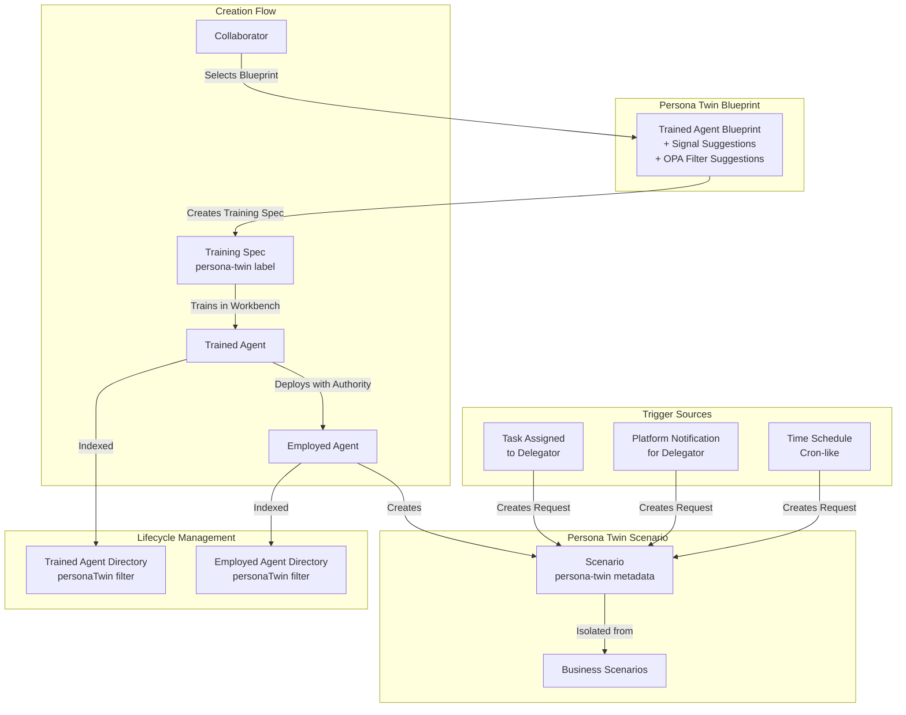

# Persona Twins Implementation Plan

## Overview

Persona Twins enable any Collaborator in a Workbench to create Agent Twins that delegate their responsibilities. Each Persona Twin is backed by a Scenario labeled as `persona-twin` and follows the standard agent lifecycle (Raw → Trained → Employed) with special recognition, isolation, and trigger mechanisms.

## Architecture Overview

## Implementation Tasks

### 1. Concept Documentation

#### 1.1 Core Concept Document

**File:** `olympus-seer-docs/seer-design/implementation-concepts/persona-twins.md`

- Definition: Persona Twins as delegatable AI agents for collaborators
- Relationship to three-layer agent model (Raw → Trained → Employed)
- Authority delegation model (delegator = collaborator who creates NormativeSpec, manager = delegator)
- Accountability model
- Isolation from Business Scenarios
- Visibility controls (private scenarios at scenario level)

#### 1.2 Persona Twin Blueprint Concept

**File:** `olympus-seer-docs/seer-design/implementation-concepts/persona-twin-blueprint.md`

- Definition: Trained Agent Blueprint CRD with additional metadata fields
- Common signal suggestions:
  - `task.assigned` - Tasks assigned to delegator
  - `platform.notification` - Platform notifications scoped to workbench for delegator
  - `request.update` - Request updates for delegator's assigned tasks
  - Workbench-level events
  - Subscription-level events
- OPA filter suggestions (similar to COG Sentinel `on_request_update` pattern)
- Blueprint availability (default Hub Platform subscription, all workbenches)

### 2. Subsystem Updates

#### 2.1 Trained Agent Lifecycle Manager

- Update Training Spec Manager to support Persona Twin metadata
- Update Trained Agent Directory with Persona Twin filtering and indexing

#### 2.2 Agent Lifecycle Manager

- Update Employment Spec Manager for Persona Twin authority delegation
- Update Employed Agent Directory with Persona Twin filtering and indexing

#### 2.3 Workbench Management

- Update Scenario definitions to support `persona-twin` metadata, visibility controls, and category isolation

#### 2.4 Trigger System

- Add Persona Twin trigger types (task assignment, platform notifications, time schedules) with OPA filter support
- Integrate with Task Management System for task assignment triggers
- Integrate with Platform Notifications for notification triggers
- Update Signal Exchange for Persona Twin trigger evaluation

### 3. Guides and Journeys

#### 3.1 Persona Twin Creation Guide

**File:** `olympus-hub-docs/10-guides/persona-twin-creation-guide.md`

#### 3.2 Persona Twin Management Guide

**File:** `olympus-hub-docs/10-guides/persona-twin-management-guide.md`

#### 3.3 Persona Twin Journey

**File:** `olympus-hub-docs/08-personas-and-journeys/journeys/persona-twin-creation.md`

### 4. UX Subsystem Updates

- Update Workbench Studio scenario management for Persona Twin isolation
- Update Agent Lifecycle UI for Persona Twin filtering and display
- Update API filters for Persona Twin category support

### 5. ADRs (Architecture Decision Records)

#### 5.1 Persona Twin as Metadata Label

**File:** `olympus-hub-docs/decision-logs/0115-persona-twin-metadata-label.md`

**Decision:** Persona Twins are identified via metadata label `persona-twin: "true"` rather than a first-class scenario type.

**Context:** Need to distinguish Persona Twin Scenarios from Business Scenarios while maintaining flexibility and avoiding schema changes.

**Alternatives:**

- First-class scenario type: Rejected - adds complexity, less flexible
- Separate resource type: Rejected - breaks scenario model consistency

#### 5.2 Persona Twin Blueprint Structure

**File:** `olympus-hub-docs/decision-logs/0116-persona-twin-blueprint-structure.md`

**Decision:** Persona Twin Blueprint is a Trained Agent Blueprint CRD with additional metadata fields for signal suggestions, not a separate CRD type.

**Context:** Need to provide common signals and OPA filter suggestions while reusing existing blueprint infrastructure.

**Alternatives:**

- Separate PersonaTwinBlueprint CRD: Rejected - unnecessary duplication
- Just tags/labels: Rejected - insufficient for signal suggestions

#### 5.3 Persona Twin Trigger Mechanism

**File:** `olympus-hub-docs/decision-logs/0117-persona-twin-trigger-mechanism.md`

**Decision:** When a task is assigned to delegator, create a new Request in the twin's scenario (not direct task collaboration).

**Context:** Need to trigger Persona Twin Scenarios from delegator task assignments while maintaining scenario isolation.

**Alternatives:**

- Twin acts directly on existing task: Rejected - breaks scenario isolation
- Signal/notification only: Rejected - doesn't create actionable work

#### 5.4 Persona Twin Visibility Controls

**File:** `olympus-hub-docs/decision-logs/0118-persona-twin-visibility-controls.md`

**Decision:** Persona Twin Scenarios support scenario-level visibility controls (similar to marketplace visibility), with `private` mode restricting access to admin and scenario owner/creator.

**Context:** Collaborators need privacy for personal assistant agents while maintaining admin oversight.

**Alternatives:**

- Workbench-level visibility: Rejected - too coarse-gr