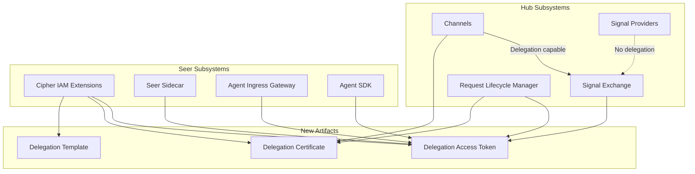

# Request-Scoped Delegation Documentation Implementation

## Overview

Implement documentation for Request-Scoped Authority Delegation across Hub and Seer. The comprehensive design document exists at [`request-scoped-delegation.md`](olympus-seer-docs/seer-design/implementation-concepts/request-scoped-delegation.md). This plan covers all subsystem updates needed to integrate the concept.

## Architecture Context

---

## Key Clarification: Signal Provider vs Channel

A critical distinction for delegation:

| Concept | Signal Provider (I/O Gateway) | Channel |

|---------|-------------------------------|---------|

| **Purpose** | Signal ingestion (events, files, API calls) | User interaction interface |

| **Direction** | Primarily inbound; may send responses | Fully bidirectional |

| **User Presence** | No user context; machine-to-machine | User is present and can interact |

| **Delegation Role** | **Cannot delegate** — just forwards signals | **Can facilitate delegation** — captures consent, presents UI |

| **Examples** | Atropos (events), Dia (files), Kale (scheduler) | Web Console, MS Teams, MCP, REST API |

**Why This Matters for Delegation:**

- Signal Providers normalize and forward signals but have no user identity context
- Channels interact with authenticated users who can grant or deny delegation
- Only Channels can: present consent UI, attach Delegation Certificates to Requests, handle AUTHORITY_REQUEST updates
- Signal Providers fire-and-forget; Channels maintain conversational context

This distinction must be documented in Phase 2 (Hub Implementation Concepts) and Phase 4 (Channel documentation).

---

## Phase 0: Context Summary Creation

Before executing any documentation updates, create a condensed context summary that serves as the single source of truth for all phases.

| Task | Artifact | Description |

|------|----------|-------------|

| 0.1 | `context-summary.md` | Create condensed reference document in scratchpad |

### Context Summary Contents

The context summary will include:

**1. Terminology Glossary** (single-line definitions)

- Delegation Template, Certificate, Access Token
- Authority Request, Authority Grant
- Chaining vs Cascading
- Business User vs Enterprise Identity

**2. OAuth 2.0 Mapping Table**

- Agent = Client, Business User = Resource Owner, Template = Scope, etc.

**3. Critical Invariants Checklist**

- Policy composition: AND logic (all must ALLOW)
- Token binding: One token per agent (SPIFFE ID)
- Signal Provider vs Channel: Only Channels can delegate
- Flows: Proactive, Reactive, Implicit, Cascading

**4. YAML Schema Snippets**

- Delegation Template CRD structure
- EmploymentSpec delegation section
- TrainingSpec delegation_requirements section
- environment.auth.delegations structure

**5. Confirmed Design Decisions** (from scratchpad Q&A)

- Authority Request as REQUEST_UPDATE sub-type (follows REMIND pattern)
- Authority Grant delivered as REQUEST_UPDATE with token in payload + environment
- Channels are observer modules receiving all REQUEST_UPDATEs
- Signal Exchange refreshes delegations on each update delivery
- Cascading via Request Hierarchy (follows lifecycle cascade pattern)
- Cross-workbench cascading is best-effort async
- Channels can implicitly fulfill via existing certificates
- Agent cannot query its own certificates (unless privileged)
- Delegation template selection is developer/architect responsibility
- Policy composition: All policies must ALLOW (AND/intersection logic)
- Chaining: Agent-initiated via SDK; Channel uses Certificates only
- Cipher maintains business user profiles with imported + added claims
- Token bound to single agent (SPIFFE ID)
- Denial/timeout: default is degraded capability continuation

**6. Sequence Diagram References**

- Pointers to comprehensive doc sections for each flow

**Location**: [`olympus-hub-docs/scratchpad/request-scoped-delegation-context-summary.md`](olympus-hub-docs/scratchpad/request-scoped-delegation-context-summary.md)

---

## Phase 1: Cipher IAM Extensions (Foundation)

### Rehydration Task

Before starting Phase 1, load context:

1. Read context summary (created in Phase 0)
2. Read comprehensive doc Sections 2-3 (Core Concepts, OAuth Mapping)
3. Read existing [`cipher-iam-extensions/README.md`](olympus-seer-docs/seer-design/subsystems/cipher-iam-extensions/README.md) for current structure

Core authority concepts must be documented first as all other components depend on them.

| Task | File | Type | Description |

|------|------|------|-------------|

| 1.1 | [`cipher-iam-extensions/README.md`](olympus-seer-docs/seer-design/subsystems/cipher-iam-extensions/README.md) | UPDATE | Add Request-Scoped Delegation to capability overview |

| 1.2 | [`cipher-iam-extensions/authority-delegation.md`](olympus-seer-docs/seer-design/subsystems/cipher-iam-extensions/authority-delegation.md) | UPDATE | Add new delegation type; distinguish from User/Role/Bot |

| 1.3 | `cipher-iam-extensions/delegation-templates.md` | NEW | Template CRD schema, registry, constraints, examples |

| 1.4 | `cipher-iam-extensions/delegation-certificates.md` | NEW | Certificate lifecycle, issuance, revocation, chaining |

| 1.5 | `cipher-iam-extensions/business-user-profiles.md` | NEW | Business user identity, claim import, federation |

| 1.6 | [`cipher-iam-extensions/credential-management.md`](olympus-seer-docs/seer-design/subsystems/cipher-iam-extensions/credential-management.md) | UPDATE | Add Delegation Access Token lifecycle |

| 1.7 | [`cipher-iam-extensions/policy-enforcement-points.md`](olympus-seer-docs/seer-design/subsystems/cipher-iam-extensions/policy-enforcement-points.md) | UPDATE | Add delegation token validation |

| 1.8 | [`cipher-iam-extensions/integration-patterns.md`](olympus-seer-docs/seer-design/subsystems/cipher-iam-extensions/integration-patterns.md) | UPDATE | Add request-scoped delegation patterns |

### Phase 1 Checkpoint (Self-Verify, then proceed)

After completing Phase 1:

- Verify new docs (1.3, 1.4, 1.5) use consistent terminology from context summary
- Confirm Template → Certificate → Token hierarchy is clear

---

## Phase 2: Hub Request Infrastructure

### Rehydration Task

Before starting Phase 2, load context:

1. Re-read context summary (invariants, schemas)
2. Read comprehensive doc Sections 4-5 (Delegation Flows, Component Responsibilities)
3. Read Phase 1 outputs: `delegation-templates.md`, `delegation-certificates.md` (for consistency)
4. Read existing [`signal-exchange/README.md`](olympus-hub-docs/04-subsystems/signal-exchange/README.md) for current structure

Signal Exchange and Request Management handle the runtime flow.

### Signal Exchange

| Task | File | Type | Description |

|------|------|------|-------------|

| 2.1 | [`signal-exchange/README.md`](olympus-hub-docs/04-subsystems/signal-exchange/README.md) | UPDATE | Add AUTHORITY_REQUEST/GRANTED to overview |

| 2.2 | [`signal-exchange/message-envelope.md`](olympus-hub-docs/04-subsystems/signal-exchange/message-envelope.md) | UPDATE | Add `environment.auth.delegations` schema |

| 2.3 | [`signal-exchange/observer-notifications.md`](olympus-hub-docs/04-subsystems/signal-exchange/observer-notifications.md) | UPDATE | Document Channel as delegation observer |

| 2.4 | [`signal-exchange/request-factory.md`](olympus-hub-docs/04-subsystems/signal-exchange/request-factory.md) | UPDATE | Delegation context initialization |

| 2.5 | `signal-exchange/delegation-handling.md` | NEW | Token refresh, AUTHORITY_REQUEST routing |

### Request Management

| Task | File | Type | Description |

|------|------|------|-------------|

| 2.6 | [`request-management/README.md`](olympus-hub-docs/04-subsystems/request-management/README.md) | UPDATE | Add delegation context to overview |

| 2.7 | [`request-management/request-lifecycle.md`](olympus-hub-docs/04-subsystems/request-management/request-lifecycle.md) | UPDATE | Delegation context in state model |

| 2.8 | [`request-management/request-storage.md`](olympus-hub-docs/04-subsystems/request-management/request-storage.md) | UPDATE | Certificate/token storage |

| 2.9 | [`request-management/request-hierarchy.md`](olympus-hub-docs/04-subsystems/request-management/request-hierarchy.md) | UPDATE | Authority cascading rules |

| 2.10 | `request-management/delegation-context.md` | NEW | Delegation lookup API |

### Hub Implementation Concepts

| Task | File | Type | Description |

|------|------|------|-------------|

| 2.11 | [`request-update.md`](olympus-hub-docs/02-system-design/implementation-concepts/request-update.md) | UPDATE | Add AUTHORITY_REQUEST/GRANTED sub-types |

| 2.12 | [`observer-pattern.md`](olympus-hub-docs/02-system-design/implementation-concepts/observer-pattern.md) | UPDATE | Channels as delegation observers |

| 2.13 | `request-scoped-delegation.md` | NEW | Hub-side implementation concept; reference to Seer authoritative doc; Signal Provider vs Channel distinction |

### Phase 2 Checkpoint (Self-Verify, then proceed)

After completing Phase 2:

- Verify AUTHORITY_REQUEST/GRANTED patterns are consistent across SX and RLM docs
- Confirm `environment.auth.delegations` schema matches context summary
- Verify Signal Provider vs Channel distinction is documented in 2.13

---

## Phase 3: Seer Agent Integration

### Rehydration Task

Before starting Phase 3, load context:

1. Re-read context summary (SDK API signatures, token validation patterns)
2. Read comprehensive doc Sections 5, 8 (Component Responsibilities, SDK Usage)
3. Read Phase 2 outputs: `delegation-handling.md`, `message-envelope.md` (for SX integration)
4. Read existing [`seer-sidecar/README.md`](olympus-seer-docs/seer-design/subsystems/seer-sidecar/README.md) for current structure

How agents request, receive, and use delegation tokens.

### Seer Sidecar

| Task | File | Type | Description |

|------|------|------|-------------|

| 3.1 | [`seer-sidecar/README.md`](olympus-seer-docs/seer-design/subsystems/seer-sidecar/README.md) | UPDATE | Add delegation check responsibility |

| 3.2 | [`seer-sidecar/authority-enforcement-service.md`](olympus-seer-docs/seer-design/subsystems/seer-sidecar/authority-enforcement-service.md) | UPDATE | Token validation, Authority Request logic |

| 3.3 | [`seer-sidecar/policy-enforcement-service.md`](olympus-seer-docs/seer-design/subsystems/seer-sidecar/policy-enforcement-service.md) | UPDATE | Policy composition (AND logic) |

| 3.4 | `seer-sidecar/delegation-service.md` | NEW | Pre-guardrail check, chaining, token injection |

### Agent Ingress Gateway

| Task | File | Type | Description |

|------|------|------|-------------|

| 3.5 | [`agent-ingress-gateway/README.md`](olympus-seer-docs/seer-design/subsystems/agent-ingress-gateway/README.md) | UPDATE | Delegation context forwarding |

| 3.6 | [`agent-ingress-gateway/request-routing.md`](olympus-seer-docs/seer-design/subsystems/agent-ingress-gateway/request-routing.md) | UPDATE | Token in request context |

| 3.7 | [`agent-ingress-gateway/signal-exchange-integration.md`](olympus-seer-docs/seer-design/subsystems/agent-ingress-gateway/signal-exchange-integration.md) | UPDATE | Token refresh from SX |

### Seer Agent SDK

| Task | File | Type | Description |

|------|------|------|-------------|

| 3.8 | [`seer-agent-sdk/README.md`](olympus-seer-docs/seer-design/subsystems/seer-agent-sdk/README.md) | UPDATE | Add delegation APIs to overview |

| 3.9 | [`python-sdk/hub-integration-apis.md`](olympus-seer-docs/seer-design/subsystems/seer-agent-sdk/python-sdk/hub-integration-apis.md) | UPDATE | Add delegation APIs |

| 3.10 | [`java-sdk/hub-integration-apis.md`](olympus-seer-docs/seer-design/subsystems/seer-agent-sdk/java-sdk/hub-integration-apis.md) | UPDATE | Add delegation APIs |

| 3.11 | `seer-agent-sdk/python-sdk/delegation-apis.md` | NEW | Detailed Python delegation API reference |

| 3.12 | `seer-agent-sdk/java-sdk/delegation-apis.md` | NEW | Detailed Java delegation API reference |

### Phase 3 Checkpoint (Self-Verify, then proceed)

After completing Phase 3:

- Verify SDK API signatures match between Python and Java docs
- Confirm sidecar delegation-service.md references correct SX patterns from Phase 2
- Verify token validation logic is consistent with Cipher docs from Phase 1

---

## Phase 4: Specs and Channels

### Rehydration Task

Before starting Phase 4, load context:

1. Re-read context summary (YAML schemas for specs, Channel responsibilities)
2. Read comprehensive doc Sections 7, 10 (Configuration, Relationships)
3. Read Phase 1 output: `delegation-templates.md` (for template references in specs)
4. Read Phase 3 output: `delegation-apis.md` (for SDK patterns specs should align with)
5. Read existing [`channel.md`](olympus-hub-docs/02-system-design/implementation-concepts/channel.md) for current structure

Configuration surfaces for developers and operators.

### Agent Lifecycle Specs

| Task | File | Type | Description |

|------|------|------|-------------|

| 4.1 | [`employment-spec-crd.md`](olympus-seer-docs/seer-design/hub-integration/employment-spec-crd.md) | UPDATE | Add `delegation_mode: deferred`, `request_scoped_delegation` |

| 4.2 | [`training-spec-crd.md`](olympus-seer-docs/seer-design/hub-integration/training-spec-crd.md) | UPDATE | Add `delegation_requirements` section |

| 4.3 | [`employed-agent.md`](olympus-seer-docs/seer-design/hub-integration/employed-agent.md) | UPDATE | OAuth client analogy |

| 4.4 | [`request-dispatch.md`](olympus-seer-docs/seer-design/hub-integration/request-dispatch.md) | UPDATE | Delegation token handling |

### Seer Implementation Concepts

| Task | File | Type | Description |

|------|------|------|-------------|

| 4.5 | [`agent-identity-credentials.md`](olympus-seer-docs/seer-design/implementation-concepts/agent-identity-credentials.md) | UPDATE | Add Delegation Access Token, OAuth analogy |

| 4.6 | [`delegation-chains.md`](olympus-seer-docs/seer-design/implementation-concepts/delegation-chains.md) | UPDATE | Request-Scoped vs User/Role/Bot |

| 4.7 | [`authority-enforcement.md`](olympus-seer-docs/seer-design/implementation-concepts/authority-enforcement.md) | UPDATE | Delegation token enforcement |

| 4.8 | [`seer-sidecar.md`](olympus-seer-docs/seer-design/implementation-concepts/seer-sidecar.md) | UPDATE | Pre-guardrail delegation check |

### Channel Documentation

| Task | File | Type | Description |

|------|------|------|-------------|

| 4.9 | [`channel.md`](olympus-hub-docs/02-system-design/implementation-concepts/channel.md) | UPDATE | Delegation responsibilities |

| 4.10 | [`mcp-channels.md`](olympus-hub-docs/06-ux-architecture/tenant-domain/mcp-channels.md) | UPDATE | AI-to-AI delegation flow |

| 4.11 | [`rest-channels.md`](olympus-hub-docs/06-ux-architecture/tenant-domain/rest-channels.md) | UPDATE | Programmatic delegation flow |

### Phase 4 Checkpoint (Self-Verify, then proceed)

After completing Phase 4:

- Verify EmploymentSpec/TrainingSpec YAML examples match context summary schemas
- Confirm Channel delegation responsibilities align with Signal Provider distinction
- Verify all spec references to Templates/Certificates use Phase 1 terminology

---

## Phase 5: Cross-Cutting Documentation

### Rehydration Task

Before starting Phase 5, load context:

1. Re-read context summary (full document for ADRs)
2. Read scratchpad confirmed decisions section (lines 642-730) for decision rationale
3. Read comprehensive doc (full) for guide/journey synthesis
4. Skim all Phase 1-4 outputs to identify patterns for guides

Decision records, guides, and journeys.

### Decision Logs

| Task | File | Type | Description |

|------|------|------|-------------|

| 5.1 | `decision-logs/0127-request-scoped-authority-delegation.md` | NEW | ADR: Two identity domains |

| 5.2 | `decision-logs/00XX-authority-request-as-request-update.md` | NEW | ADR: REQUEST_UPDATE sub-types |

| 5.3 | `decision-logs/00XX-delegation-policy-composition.md` | NEW | ADR: All policies must ALLOW |

| 5.4 | `decision-logs/00XX-delegation-token-per-agent.md` | NEW | ADR: Token bound to SPIFFE ID |

| 5.5 | `decision-logs/0128-channels-vs-signal-providers-delegation.md` | NEW | ADR: Why Channels can delegate but Signal Providers cannot |

### Guides

| Task | File | Type | Description |

|------|------|------|-------------|

| 5.6 | `10-guides/configuring-request-scoped-delegation.md` | NEW | Developer guide for specs |

| 5.7 | `10-guides/delegation-template-design.md` | NEW | Process Architect guide |

### Journeys

| Task | File | Type | Description |

|------|------|------|-------------|

| 5.8 | [`journeys/request-lifecycle.md`](olympus-hub-docs/08-personas-and-journeys/journeys/request-lifecycle.md) | UPDATE | Add delegation to journey |

| 5.9 | `journeys/delegation-workflow.md` | NEW | End-to-end delegation journey |

### Phase 5 Checkpoint (Final)

After completing Phase 5:

- Verify all ADRs reference correct comprehensive doc sections
- Confirm guides are actionable and reference correct spec locations
- Verify delegation-workflow journey covers all three flows (proactive, reactive, implicit)
- Final cross-check: all 54 documents use consistent terminology

---

## Summary

| Phase | New | Update | Total | Checkpoint |

|-------|-----|--------|-------|------------|

| Phase 0: Context Summary | 1 | 0 | 1 | Foundation |

| Phase 1: Cipher IAM | 3 | 5 | 8 | Terminology |

| Phase 2: Hub Infrastructure | 4 | 9 | 13 | SX/RLM Patterns |

| Phase 3: Agent Integration | 3 | 9 | 12 | SDK/Sidecar |

| Phase 4: Specs and Channels | 0 | 11 | 11 | Configuration |

| Phase 5: Cross-Cutting | 8 | 1 | 9 | Final Review |

| **TOTAL** | **19** | **35** | **54** | |

---

## Context Rehydration Summary

| Before Phase | Read Context Summary | Read Comprehensive Doc | Read Prior Phase Outputs |

|--------------|---------------------|------------------------|-------------------------|

| Phase 1 | Full | Sections 2-3 | N/A |

| Phase 2 | Invariants, Schemas | Sections 4-5 | Phase 1: Templates, Certificates |

| Phase 3 | SDK APIs, Tokens | Sections 5, 8 | Phase 2: SX/RLM patterns |

| Phase 4 | YAML Schemas | Sections 7, 10 | Phase 1 + Phase 3 |

| Phase 5 | Full | Full | Skim all phases |

---

**Notes:**

- Comprehensive design already exists at [`request-scoped-delegation.md`](olympus-seer-docs/seer-design/implementation-concepts/request-scoped-delegation.md) — all updates will reference this as the authoritative source.
- Context summary will be created at [`request-scoped-delegation-context-summary.md`](olympus-hub-docs/scratchpad/request-scoped-delegation-context-summary.md) in Phase 0.
- Each phase ends with a checkpoint for user review before proceeding.
- The Hub-side implementation concept (Task 2.13) will include the Signal Provider vs Channel distinction for delegation.
- ADR 5.5 formally documents why Channels can facilitate delegation while Signal Providers cannot.