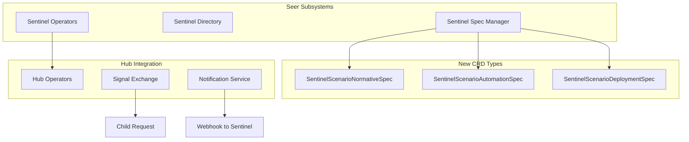

# Request Sentinel Type Implementation

## Summary

Add a third Sentinel type (`request`) to the Agent Session Sentinel subsystem. Unlike Realtime and Analytical Sentinels that generate Observations/Exceptions via Cronus, Request Sentinels operate as Employed Agents within a Workbench, observing/participating in requests through the existing Hub Request model.

## Architecture

## Phase 1: CRD Definitions (3 new files)

### 1.1 SentinelScenarioNormativeSpec

**New file**: `olympus-seer-docs/seer-design/subsystems/agent-session-sentinel/sentinel-scenario-normative-spec.md`

- Extends `ScenarioNormativeSpec` from Hub (no Sentinel-specific additions)
- Document structure, validation, and relationship to regular ScenarioNormativeSpec
- Include example YAML

### 1.2 SentinelScenarioAutomationSpec

**New file**: `olympus-seer-docs/seer-design/subsystems/agent-session-sentinel/sentinel-scenario-automation-spec.md`

- Extends `ScenarioAutomationSpec` from Hub
- Add isolated `sentinel` section with:
  - `participation.mode`: `observe | participate | observe_and_participate`
  - `participation.filters.scenario_whitelist`: Optional array
  - `participation.filters.scenario_blacklist`: Optional array
  - `participation.filters.on_request_update.enabled`: Boolean
  - `participation.filters.on_request_update.update_filter_policy`: OPA policy (rego)
- Reference pattern: `application.ref` → `HubApplicationSpec` → `seerTrainingRef` → Trained Agent Spec

### 1.3 SentinelScenarioDeploymentSpec

**New file**: `olympus-seer-docs/seer-design/subsystems/agent-session-sentinel/sentinel-scenario-deployment-spec.md`

- Extends `ScenarioDeploymentSpec` from Hub
- Add Sentinel-specific deployment settings if needed
- Document deployment flow that creates Employed Agent

## Phase 2: Sentinel Subsystem Updates (4 files)

### 2.1 Update Sentinel Spec Manager

**File**: [`sentinel-spec-manager.md`](olympus-seer-docs/seer-design/subsystems/agent-session-sentinel/sentinel-spec-manager.md)

- Add `request` to Sentinel Type enum in Core Components table
- Add "Request Sentinel" section after Analytical Sentinel
- Update validation rules: For `type: request`, require `sentinel_scenario_specs` section
- Add example SentinelSpec for Request type

### 2.2 Update Sentinel Directory

**File**: [`sentinel-directory.md`](olympus-seer-docs/seer-design/subsystems/agent-session-sentinel/sentinel-directory.md)

- Add `sentinel_type: "request"` option to Registry Entry
- Add new fields: `sentinel_scenario_specs`, `trained_agent_ref`, `participation_filters`
- Add new indexes: By Trained Agent, By Scenario (whitelist/blacklist), By Participation Mode

### 2.3 Update Sentinel Operators

**File**: [`sentinel-operators.md`](olympus-seer-docs/seer-design/subsystems/agent-session-sentinel/sentinel-operators.md)

- Update Registration Service for Request Sentinel type
- Add validation for Trained Agent reference chain
- Document coordination with Hub Operators for Scenario registration

### 2.4 Update Sentinel Levers

**File**: [`sentinel-levers.md`](olympus-seer-docs/seer-design/subsystems/agent-session-sentinel/sentinel-levers.md)

- Add Request Sentinel control actions (enable/disable, suspend, archive)
- Add new states: `enrolled`, `suspended`

## Phase 3: Hub Integration (3 files)

### 3.1 Create Hub Operators Integration Document

**New file**: `olympus-seer-docs/seer-design/hub-integration/sentinel-scenario-processing.md`

- Document how Hub Operators recognize SentinelScenarioSpec CRDs
- Process flow: Convert to regular ScenarioSpec types internally
- Reference: [`developer-operators.md`](olympus-hub-docs/04-subsystems/operators/developer-operators.md)

### 3.2 Update Signal Exchange Documentation

**File**: [`olympus-hub-docs/04-subsystems/signal-exchange/README.md`](olympus-hub-docs/04-subsystems/signal-exchange/README.md)

- Add section "Request Sentinel Auto-Enrollment"
- Document Request Creation Flow (query active Request Sentinels, apply filters, add as assignee)
- Document Request Update Flow (evaluate OPA policy, create child request if match)

### 3.3 Update Request Hierarchy Documentation

**File**: [`request-hierarchy.md`](olympus-hub-docs/04-subsystems/request-management/request-hierarchy.md)

- Add section "Request Sentinel Child Requests"
- Document that child requests use SentinelScenario (not parent's scenario)
- Document lifecycle cascade and stale update handling

## Phase 4: Main Documentation Updates (3 files)

### 4.1 Update Sentinel README

**File**: [`README.md`](olympus-seer-docs/seer-design/subsystems/agent-session-sentinel/README.md)

- Update "Two Sentinel Types" to "Three Sentinel Types"
- Add Request Sentinel description and flow
- Update architecture diagram

### 4.2 Update Sentinel SCOPE

**File**: [`SCOPE.md`](olympus-seer-docs/seer-design/subsystems/agent-session-sentinel/SCOPE.md)

- Add Request Sentinel to scope description
- Update Design Documents table with three new SentinelScenarioSpec documents

### 4.3 Update Implementation Concepts

**File**: [`agent-session-supervision.md`](olympus-seer-docs/seer-design/implementation-concepts/agent-session-supervision.md)

- Update "Two Sentinel Types" section to "Three Sentinel Types"
- Add Request Sentinel architecture diagram
- **Add new section: "Why Request Sentinels"** covering:
  - The need for cross-request observation/participation
  - Gap in Realtime/Analytical Sentinels (they generate Observations, not participate)
  - Need for AI agents to monitor other AI agents' work
- **Add new section: "Request Sentinel Use Cases"** covering:
  - Token usage governance / cost monitoring across requests
  - Compliance monitoring (PII detection, regulatory checks)
  - Quality assurance sampling and review
  - Fraud pattern detection across multiple requests
  - Escalation pattern analysis
  - Cross-request correlation and pattern detection

## Phase 5: Decision Logs (2 new files)

### 5.1 Create ADR for Request Sentinel Type

**New file**: `olympus-seer-docs/seer-design/decision-logs/XXXX-request-sentinel-type.md`

- Context: Need for AI agents to observe/participate in other agents' requests
- Decision: Introduce third Sentinel type that operates as Employed Agent
- Alternatives considered:
  - Extend Realtime Sentinel (rejected: different output model)
  - Use regular Scenario enrollment (rejected: no cross-request filtering)
- Consequences: New CRD types, Hub integration, enrollment flow

### 5.2 Create ADR for SentinelScenarioSpec CRD Structure

**New file**: `olympus-seer-docs/seer-design/decision-logs/XXXX-sentinel-scenario-spec-crds.md`

- Context: Need to define how Request Sentinels reference Scenarios
- Decision: Three separate CRD types extending Hub ScenarioSpec types
- Rationale: Clean extension pattern, isolated `sentinel` section
- Alternatives considered:
  - Single CRD with embedded specs (rejected: too complex)
  - Modify existing Hub CRDs (rejected: breaks separation)

## Phase 6: Example (1 new file)

### 6.1 Create Request Sentinel Example

**New file**: `olympus-seer-docs/seer-design/subsystems/agent-session-sentinel/examples/request-sentinel-example.md`

- Complete example with SentinelSpec, all three SentinelScenarioSpec types
- HubApplicationSpec with proper `seerTrainingRef` naming pattern
- Participation filters and OPA policy example
- Use case: Token usage governance sentinel

## Key Design Decisions

| Decision | Rationale |

|----------|-----------|

| Three separate SentinelScenarioSpec CRD types | Extend corresponding Hub ScenarioSpec types cleanly |

| Trained Agent reference chain preserved | `SentinelScenarioAutomationSpec` → `HubApplicationSpec` → `seerTrainingRef` |

| Sentinel filters in isolated `sentinel` section | Clean separation from standard Scenario fields |

| Child request created on enrollment | Immediate association with Sentinel's scenario |

| Asynchronous webhook delivery, no acknowledgment | Aligns with existing Notification Service patterns |

## Dependencies

The following Hub components already exist and will be leveraged:

- Hub Scenario Specification Types ([`developer-operators.md`](olympus-hub-docs/04-subsystems/operators/developer-operators.md))
- Hub Request Hierarchy ([`request-hierarchy.md`](olympus-hub-docs/04-subsystems/request-management/request-hierarchy.md))
- Hub Notification Service ([`README.md`](olympus-hub-docs/04-subsystems/notification-services/README.md))
- Signal Exchange Observer Pattern ([`README.md`](olympus-hub-docs/04-subsystems/signal-exchange/README.md))

## File Summary

| Action | Count | Files |

|--------|-------|-------|

| **New files** | 7 | 3 CRD specs, 1 Hub integration doc, 2 ADRs, 1 example |

| **Updated files** | 9 | Sentinel subsystem (4), Hub docs (2), Main docs (3) |