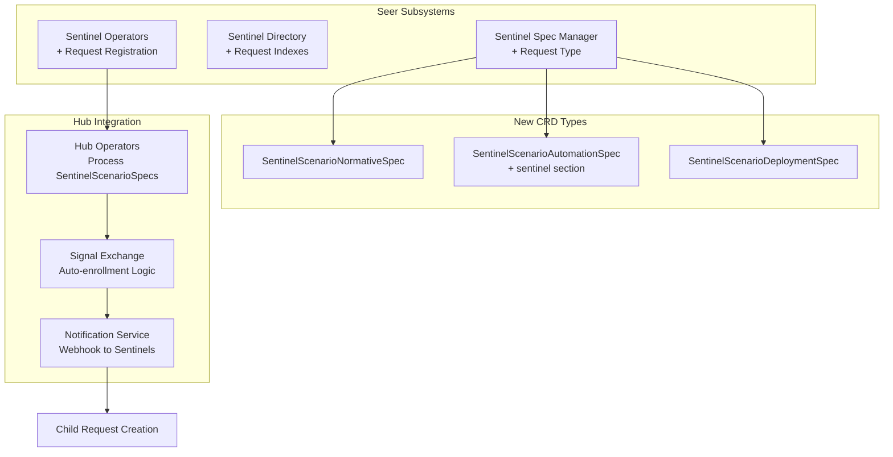

# Request Sentinel Type Implementation Plan

## Overview

This plan introduces a third Sentinel type (`request`) that operates as an Employed Agent in a Workbench, observing and/or participating in requests. Unlike Realtime and Analytical Sentinels that generate Observations/Exceptions, Request Sentinels create child requests and receive webhook notifications.

## Architecture Changes



## Phase 1: CRD Definitions and Spec Structure

### 1.1 Create SentinelScenarioNormativeSpec CRD

**File**: `olympus-seer-docs/seer-design/subsystems/agent-session-sentinel/sentinel-scenario-normative-spec.md` (NEW)

- Extends `ScenarioNormativeSpec` from Hub
- No Sentinel-specific additions
- Document structure, validation, and relationship to regular ScenarioNormativeSpec
- Include example YAML

### 1.2 Create SentinelScenarioAutomationSpec CRD

**File**: `olympus-seer-docs/seer-design/subsystems/agent-session-sentinel/sentinel-scenario-automation-spec.md` (NEW)

- Extends `ScenarioAutomationSpec` from Hub
- Add isolated `sentinel` section with:
  - `participation.mode`: `observe | participate | observe_and_participate`
  - `participation.filters.scenario_whitelist`: Optional array
  - `participation.filters.scenario_blacklist`: Optional array
  - `participation.filters.on_request_update.enabled`: Boolean
  - `participation.filters.on_request_update.update_filter_policy`: OPA policy (rego)
- Document that `application.ref` references `HubApplicationSpec` which contains `seerTrainingRef` pointing to Trained Agent Spec
- Include example with proper naming: `token-usage-governance-trained-agent # Seer Trained Agent Spec`

### 1.3 Create SentinelScenarioDeploymentSpec CRD

**File**: `olympus-seer-docs/seer-design/subsystems/agent-session-sentinel/sentinel-scenario-deployment-spec.md` (NEW)

- Extends `ScenarioDeploymentSpec` from Hub
- Add Sentinel-specific deployment settings if needed
- Document deployment flow that creates Employed Agent

### 1.4 Update SentinelSpec CRD Structure

**File**: `olympus-seer-docs/seer-design/subsystems/agent-session-sentinel/sentinel-spec-manager.md`

**Changes**:

- Update Core Components table: Add `request` to Sentinel Type enum
- Add new section "Request Sentinel" after Analytical Sentinel section
- Update validation rules: For `type: request`, require `sentinel_scenario_specs` section instead of `policy`/`observation_config`
- Add example SentinelSpec for Request type:
```yaml
apiVersion: seer.olympus.io/v1
kind: SentinelSpec
metadata:
  name: request-monitor-sentinel
  namespace: acme-disputes
spec:
  type: request  # realtime | analytical | request
  
  target:
    workbench_ids: ["acme-disputes"]
  
  # For Request Sentinel: Reference to Sentinel Scenario Specs
  sentinel_scenario_specs:
    normative_ref:
      name: request-monitor-sentinel-normative
      version: "1.0.0"
    automation_ref:
      name: request-monitor-sentinel-automation
      version: "1.0.0"
    deployment_ref:
      name: request-monitor-sentinel-deployment
      version: "1.0.0"
```


## Phase 2: Sentinel Subsystem Updates

### 2.1 Update Sentinel Spec Manager

**File**: `olympus-seer-docs/seer-design/subsystems/agent-session-sentinel/sentinel-spec-manager.md`

**Changes**:

- Add "Request Sentinel" configuration section with:
  - Event Source: Request creation/updates in Workbench
  - Enrollment Trigger: Automatic based on filters
  - Output: Child requests created, webhook notifications
- Update Spec Validation section:
  - For `type: request`: Validate `sentinel_scenario_specs` exists, all three refs valid
  - For `type: request`: Reject if `policy` or `observation_config` present
  - For `type: realtime | analytical`: Reject if `sentinel_scenario_specs` present
- Add validation for Trained Agent reference chain: SentinelScenarioAutomationSpec → HubApplicationSpec → seerTrainingRef → TrainingSpec exists

### 2.2 Update Sentinel Directory

**File**: `olympus-seer-docs/seer-design/subsystems/agent-session-sentinel/sentinel-directory.md`

**Changes**:

- Update Registry Entry Structure example: Add `sentinel_type: "request"` option
- Add new fields to registry entry:
  - `sentinel_scenario_specs`: Object with normative_ref, automation_ref, deployment_ref
  - `trained_agent_ref`: Extracted from HubApplicationSpec
  - `participation_filters`: From sentinel section
- Add new indexes:
  - By Trained Agent: Find sentinels using specific Trained Agent
  - By Scenario (whitelist/blacklist): Find sentinels filtering scenarios
  - By Participation Mode: Filter by observe/participate/observe_and_participate
- Update Search Queries table with new query types

### 2.3 Update Sentinel Operators

**File**: `olympus-seer-docs/seer-design/subsystems/agent-session-sentinel/sentinel-operators.md`

**Changes**:

- Update Registration Service:
  - For Request Sentinel: Validate all three SentinelScenarioSpec CRDs exist
  - Validate Trained Agent reference chain
  - Coordinate with Hub Operators for Scenario registration
- Update Deployment Flow:
  - For Request Sentinel: Create SentinelScenarioDeploymentSpec
  - Trigger Hub Operators to process and create Employed Agent
- Add new validation checks for Request Sentinel type

### 2.4 Update Sentinel Levers

**File**: `olympus-seer-docs/seer-design/subsystems/agent-session-sentinel/sentinel-levers.md`

**Changes**:

- Add Request Sentinel control actions:
  - Enable/disable: Controls enrollment in new requests
  - Suspend: Removes from active assignees, stops processing
  - Archive: Removes from Workbench
- Add new states: `enrolled`, `suspended` (in addition to existing states)

## Phase 3: Hub Integration Documentation

### 3.1 Create Hub Operators Integration Document

**File**: `olympus-seer-docs/seer-design/hub-integration/sentinel-scenario-processing.md` (NEW)

- Document how Hub Operators recognize SentinelScenarioSpec CRDs
- Process flow: Convert to regular ScenarioSpec types for internal processing
- Extract `sentinel` section from SentinelScenarioAutomationSpec
- Register Scenario in Workbench
- Create Employed Agent from Trained Agent reference
- Reference Hub documentation: `olympus-hub-docs/04-subsystems/operators/developer-operators.md`

### 3.2 Update Signal Exchange Documentation

**File**: `olympus-hub-docs/04-subsystems/signal-exchange/README.md` (or new file)

**Changes**:

- Add section "Request Sentinel Auto-Enrollment"
- Document Request Creation Flow:

  1. Request created in Workbench
  2. Query active Request Sentinels in Workbench
  3. Apply scenario whitelist/blacklist filters
  4. If match: Add Sentinel's Employed Agent as assignee
  5. Create child request for SentinelScenario immediately

- Document Request Update Flow:

  1. Evaluate OPA policy (`update_filter_policy`) if `on_request_update.enabled: true`
  2. If policy allows AND scenario filters match: Enroll Sentinel
  3. Create child request if not exists

- Reference: `olympus-hub-docs/04-subsystems/request-management/request-hierarchy.md` for child request structure

### 3.3 Update Notification Service Documentation

**File**: `olympus-hub-docs/04-subsystems/notification-services/README.md`

**Changes**:

- Add section "Request Sentinel Notifications"
- Document webhook delivery to SentinelScenario (Hub Application endpoint)
- Include full Request Update DTO
- Asynchronous delivery, no acknowledgment required
- Retry logic per Notification Service guarantees
- If delivery fails after retries: Update lost until next deliverable update
- Agent can detect missed updates when receiving next update

### 3.4 Update Request Hierarchy Documentation

**File**: `olympus-hub-docs/04-subsystems/request-management/request-hierarchy.md`

**Changes**:

- Add section "Request Sentinel Child Requests"
- Document that child requests use SentinelScenario (not parent's scenario)
- Document context inheritance by reference
- Document lifecycle cascade (parent COMPLETED/CANCELLED → child COMPLETED/CANCELLED)
- Document stale update handling after completion

## Phase 4: Main Documentation Updates

### 4.1 Update Sentinel README

**File**: `olympus-seer-docs/seer-design/subsystems/agent-session-sentinel/README.md`

**Changes**:

- Update "Two Sentinel Types" to "Three Sentinel Types"
- Add Request Sentinel description:
  - Observes/participates in Workbench requests
  - Creates child requests
  - Receives webhook notifications
  - Operates as Employed Agent
- Update architecture diagram to include Request Sentinel flow
- Add Request Sentinel to Design Documents table

### 4.2 Update Sentinel SCOPE

**File**: `olympus-seer-docs/seer-design/subsystems/agent-session-sentinel/SCOPE.md`

**Changes**:

- Add Request Sentinel to scope description
- Update Design Documents table with three new SentinelScenarioSpec documents
- Add coverage summary for Request Sentinel components

### 4.3 Update Implementation Concepts

**File**: `olympus-seer-docs/seer-design/implementation-concepts/agent-session-supervision.md`

**Changes**:

- Update "Two Sentinel Types" section to include Request Sentinel
- Add Request Sentinel architecture diagram
- Document relationship to Hub Request model

## Phase 5: Examples and Reference

### 5.1 Create Request Sentinel Example

**File**: `olympus-seer-docs/seer-design/subsystems/agent-session-sentinel/examples/request-sentinel-example.md` (NEW)

- Complete example with:
  - SentinelSpec
  - All three SentinelScenarioSpec types
  - HubApplicationSpec with proper Trained Agent reference naming
  - Participation filters configuration
  - OPA policy for update filtering

### 5.2 Update CRD Reference (if exists)

**File**: Check for Seer CRD reference document

- Add three new SentinelScenarioSpec CRD types
- Document structure, required fields, validation rules

## Implementation Notes

### Naming Conventions

- HubApplicationSpec name pattern: `{agent-name}` (e.g., `token-usage-governance-trained-agent`)
- Comment pattern: `# Seer Trained Agent Spec`
- Display name pattern: `"{Name} (Trained Agent)"` (from developer-operators.md)

### Key Design Decisions

1. Three separate SentinelScenarioSpec types extending corresponding ScenarioSpec types
2. Trained Agent reference same as regular scenarios: SentinelScenarioAutomationSpec → HubApplicationSpec → seerTrainingRef
3. Sentinel filters in isolated `sentinel` section of SentinelScenarioAutomationSpec
4. Child request created immediately on enrollment (not on webhook)
5. OPA policy for update type filtering
6. Asynchronous webhook delivery, no acknowledgment

### Dependencies

- Hub Scenario Specification Types (already exist)
- Hub Request Hierarchy (already exists)
- Hub Notification Service (already exists)
- Signal Exchange Observer Pattern (already exists)