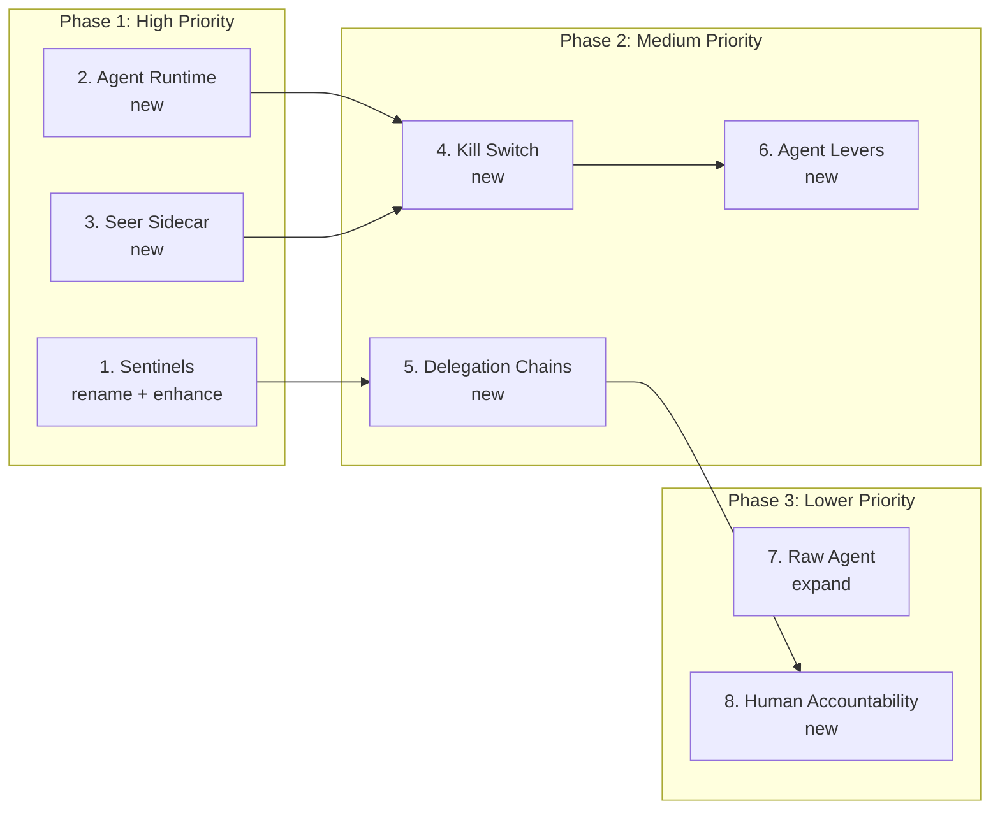

# Seer Missing Implementation Concepts Plan

## Objective

Create comprehensive implementation concept documents for 8 missing critical concepts in the Seer design scope, using the standard template at [_templates/implementation-concept.md](_templates/implementation-concept.md).

---

## Concepts to Write

| # | Concept | Action | Priority | Effort |

|---|---------|--------|----------|--------|

| 1 | **Sentinels** | Rename + enhance existing | High | Medium |

| 2 | **Agent Runtime** | New document | High | High |

| 3 | **Seer Sidecar** | New document | High | Medium |

| 4 | **Kill Switch & Emergency Controls** | New document | Medium | Medium |

| 5 | **Delegation Chains** | New document | Medium | Medium |

| 6 | **Agent Levers** | New document | Medium | Low |

| 7 | **Raw Agent Lifecycle** | Expand existing | Lower | Low |

| 8 | **Human Accountability** | New document | Lower | Low |

---

## Document Details

### 1. Sentinels (Rename + Enhance)

**File**: Rename [agent-session-supervision.md](olympus-seer-docs/seer-design/implementation-concepts/agent-session-supervision.md) to `sentinels.md`

**Source Material**:

- [seer-sentinels/README.md](olympus-seer-docs/seer-design/subsystems/seer-sentinels/README.md) - Architecture overview
- [seer-sentinels/SCOPE.md](olympus-seer-docs/seer-design/subsystems/seer-sentinels/SCOPE.md) - Complete scope coverage
- [sentinel-spec-manager.md](olympus-seer-docs/seer-design/subsystems/seer-sentinels/sentinel-spec-manager.md) - Spec structure
- All sentinel service documents (realtime, analytical, request)

**Key Sections to Add/Enhance**:

- Ontology Context (sentinel as governance pattern)
- Three sentinel types mental model (Realtime, Analytical, Request)
- Sentinel lifecycle states (Drafted, Validated, Deployed, Suspended, Archived)
- Cronus integration for Observations/Exceptions
- Clear structure showing SentinelSpec CRD conceptual model
- Examples for each sentinel type

**Update Cross-References**: Update all references to `agent-session-supervision.md` across the codebase.

---

### 2. Agent Runtime (New)

**File**: `olympus-seer-docs/seer-design/implementation-concepts/agent-runtime.md`

**Source Material**:

- [agent-runtime/README.md](olympus-seer-docs/seer-design/subsystems/agent-runtime/README.md) - Overview
- [runtime-deployment.md](olympus-seer-docs/seer-design/subsystems/agent-runtime/runtime-deployment.md) - Core deployment
- [signal-exchange-integration.md](olympus-seer-docs/seer-design/subsystems/agent-runtime/signal-exchange-integration.md) - sx-observer
- [authority-change-respawning.md](olympus-seer-docs/seer-design/subsystems/agent-runtime/authority-change-respawning.md) - Respawn logic
- ADR-0074 (Runtime on Atlantis)

**Key Sections**:

- Overview: Runtime as execution environment for Employed Agents
- Ontology Context: Runtime in AOSM agent model
- Definition: Pod-based deployment on Atlantis (EKS)
- Structure: Pod architecture, sidecar integration, ingress path
- Behavior: Deployment flow, scaling (HPA), scale-to-zero, respawning
- sx-observer pattern and store-and-forward
- Constraints: Resource limits, network isolation, credential injection
- Examples: Deployment spec, scaling configuration

---

### 3. Seer Sidecar (New)

**File**: `olympus-seer-docs/seer-design/implementation-concepts/seer-sidecar.md`

**Source Material**:

- [seer-sidecar/README.md](olympus-seer-docs/seer-design/subsystems/seer-sidecar/README.md) - Overview
- [guardrail-service.md](olympus-seer-docs/seer-design/subsystems/seer-sidecar/guardrail-service.md) - Guardrail execution
- [authority-enforcement-service.md](olympus-seer-docs/seer-design/subsystems/seer-sidecar/authority-enforcement-service.md) - Authority checks
- [policy-enforcement-service.md](olympus-seer-docs/seer-design/subsystems/seer-sidecar/policy-enforcement-service.md) - OPA policies
- Existing [guardrails.md](olympus-seer-docs/seer-design/implementation-concepts/guardrails.md) and [authority-enforcement.md](olympus-seer-docs/seer-design/implementation-concepts/authority-enforcement.md)

**Key Sections**:

- Overview: Sidecar as runtime enforcement layer
- Interception model (Istio-based)
- Inbound vs outbound traffic handling
- Per-API guardrail configuration
- OPA policy evaluation
- Resource quotas and fair usage budgets
- Metrics collection
- Hot-reload configuration
- Relationship to existing guardrails.md and authority-enforcement.md concepts

---

### 4. Kill Switch & Emergency Controls (New)

**File**: `olympus-seer-docs/seer-design/implementation-concepts/kill-switch-emergency-controls.md`

**Source Material**:

- [agent-lifecycle-manager/agent-levers.md](olympus-seer-docs/seer-design/subsystems/agent-lifecycle-manager/agent-levers.md) - Kill switch lever
- [sentinel-levers.md](olympus-seer-docs/seer-design/subsystems/seer-sentinels/sentinel-levers.md) - Emergency controls
- [iam-provisioning.md](olympus-seer-docs/seer-design/subsystems/agent-runtime/iam-provisioning.md) - IAM revocation on kill

**Key Sections**:

- Overview: Why enterprise agents need kill switches
- Kill switch states and triggers
- Emergency disable vs suspend vs archive semantics
- What happens on activation (pod termination, IAM revocation, SX deregistration)
- Authority revocation flow
- Audit trail requirements
- Recovery procedures
- Examples: Kill switch activation, emergency suspend

---

### 5. Delegation Chains (New)

**File**: `olympus-seer-docs/seer-design/implementation-concepts/delegation-chains.md`

**Source Material**:

- [cipher-iam-extensions/authority-delegation.md](olympus-seer-docs/seer-design/subsystems/cipher-iam-extensions/authority-delegation.md) - Delegation model
- [why-seer/part-2-how-seer-solves/03-identity-authority-in-seer/](olympus-seer-docs/why-seer/part-2-how-seer-solves/03-identity-authority-in-seer/) - Conceptual foundation
- [agent-identity-credentials.md](olympus-seer-docs/seer-design/implementation-concepts/agent-identity-credentials.md) - Related concept

**Key Sections**:

- Overview: Delegation as enterprise authority model
- Ontology Context: AOSM controlled autonomy
- Delegation modes: User delegation, Role delegation, Bot mode
- Delegation chain structure
- Authority ceiling enforcement
- Narrowing-only principle
- Inheritance algorithms (wildcard, CSV subset)
- RASCI accountability mapping
- Examples: User-delegated agent, Role-based agent, Bot mode agent

---

### 6. Agent Levers (New)

**File**: `olympus-seer-docs/seer-design/implementation-concepts/agent-levers.md`

**Source Material**:

- [agent-lifecycle-manager/agent-levers.md](olympus-seer-docs/seer-design/subsystems/agent-lifecycle-manager/agent-levers.md) - Employed agent levers
- [trained-agent-lifecycle-manager/trained-agent-levers.md](olympus-seer-docs/seer-design/subsystems/trained-agent-lifecycle-manager/trained-agent-levers.md) - Trained agent levers
- [sentinel-levers.md](olympus-seer-docs/seer-design/subsystems/seer-sentinels/sentinel-levers.md) - Sentinel levers

**Key Sections**:

- Overview: Levers as runtime control mechanisms
- Lever taxonomy across agent types
- Enable/disable semantics
- Suspension semantics
- Override behaviors
- Lever authorization (who can pull which lever)
- Audit trail for lever operations
- Examples: Disable agent, Suspend temporarily, Force respawn

---

### 7. Raw Agent Lifecycle (Expand Existing)

**File**: Expand [agent-lifecycle.md](olympus-seer-docs/seer-design/implementation-concepts/agent-lifecycle.md)

**Source Material**:

- [raw-agent-lifecycle-manager/README.md](olympus-seer-docs/seer-design/subsystems/raw-agent-lifecycle-manager/README.md) - Subsystem overview
- [hub-integration/raw-agent.md](olympus-seer-docs/seer-design/hub-integration/raw-agent.md) - Hub context

**Key Sections to Add**:

- Dedicated section for Raw Agent layer
- Container requirements and validation
- Framework flexibility (any agentic framework)
- Abilities vs Skills distinction
- Infrastructure identity (vs delegated identity)
- Registration and validation flow
- Raw Agent Directory

---

### 8. Human Accountability (New)

**File**: `olympus-seer-docs/seer-design/implementation-concepts/human-accountability.md`

**Source Material**:

- [cipher-iam-extensions/human-accountability.md](olympus-seer-docs/seer-design/subsystems/cipher-iam-extensions/human-accountability.md) - Implementation
- [aosm-meta-model/agent-oriented-system.md](aosm-meta-model/agent-oriented-system.md) - AOSM foundations

**Key Sections**:

- Overview: Why humans must remain accountable
- RASCI model application
- Accountable human assignment rules
- Audit trail requirements
- Human override authority
- Relationship to delegation chains
- Examples: Decision accountability, Action accountability

---

## Implementation Order

**Rationale for Order**:

- Sentinels first (rename impacts cross-references)
- Agent Runtime before Kill Switch (runtime provides context)
- Seer Sidecar before Kill Switch (enforcement context)
- Delegation Chains before Human Accountability (foundation)

---

## Cross-Reference Updates

After completing the documents, update references in:

- Subsystem README files that link to implementation concepts
- Related implementation concepts
- Hub integration documents
- ADR references

---

## Deliverables

1. 6 new implementation concept documents
2. 1 renamed + enhanced document (agent-session-supervision.md to sentinels.md)
3. 1 expanded document (agent-lifecycle.md with Raw Agent section)
4. Updated cross-references across codebase