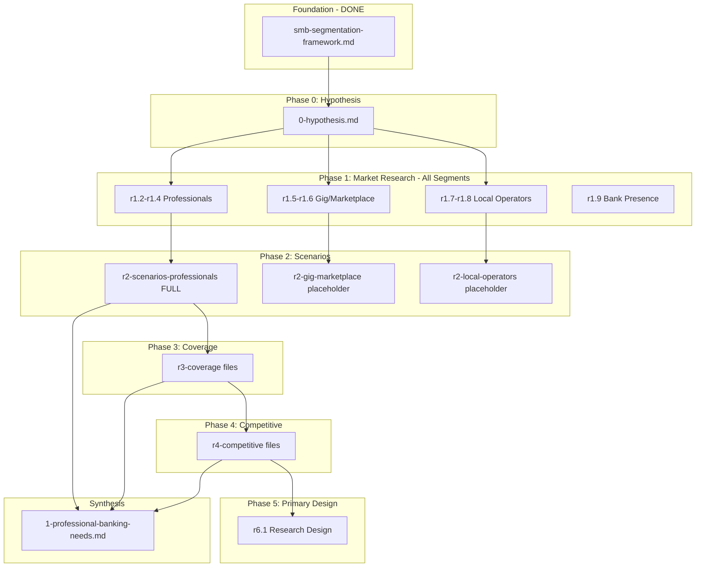

# SMB Banking Proposal: Research Execution Plan

## Foundation

This plan builds on the segmentation framework established in:

- [smb-segmentation-framework.md](ibuki/ibuki-smb-banking-value-prop-us/_research/r0-foundations/smb-segmentation-framework.md)

### Three Priority Segments (from framework analysis)

| Segment | Definition | Phase |

|---------|------------|-------|

| **Professionals** | Licensed Professionals + Knowledge/Creative Workers + Professional Firms | Phase 1 (Priority) |

| **Gig/Marketplace** | Gig Workers + Marketplace Sellers (Platform-Dependent) | Phase 2 |

| **Local Operators** | Food & Beverage + Personal Services + Hospitality | Phase 3 |

---

## Folder Structure

```
ibuki/ibuki-smb-banking-value-prop-us/
├── README.md                              # Executive overview (created last)
├── 0-hypothesis.md                        # Hypotheses for all 3 segments
│
├── phase1-professionals/
│   ├── 1-professional-banking-needs.md    # Scenarios + gap analysis
│   ├── 2-solution-vision.md               # Why agents
│   ├── 3-value-to-professional.md         # Customer value
│   └── 4-value-to-bank.md                 # Bank value
│
├── phase2-gig-marketplace/
│   └── 1-gig-marketplace-needs.md         # Placeholder/draft
│
├── phase3-local-operators/
│   └── 1-local-operator-needs.md          # Placeholder/draft
│
└── _research/
    ├── r0-foundations/
    │   └── smb-segmentation-framework.md  # DONE
    ├── r1-market/                         # All segments
    ├── r2-scenarios-professionals/        # Phase 1 deep dive
    ├── r2-scenarios-gig-marketplace/      # Phase 2 (placeholder)
    ├── r2-scenarios-local-operators/      # Phase 3 (placeholder)
    ├── r3-coverage/                       # Professionals focus
    ├── r4-competitive/                    # All segments
    └── r6-primary-design/                 # Phase 1
```

---

## Phase 0: Hypothesis Document

### Deliverable: `0-hypothesis.md`

**Content:**

1. Core Hypothesis (all segments)
2. Segment 1: Professionals

   - H1.1: Market size (3-4M solo + 500K firms, $50B+ banking wallet)
   - H1.2: Integration gap (business-personal disconnection)
   - H1.3: Scenario gap (products vs. practice needs)
   - H1.4: Value hypothesis ($3K-$10K per relationship)
   - H1.5: Competitive white space

3. Segment 2: Gig/Marketplace

   - H2.1: Market size (7-9M active, $15B+ banking wallet)
   - H2.2: Income variability gap
   - H2.3: Tax and platform payout gaps
   - H2.4: Value hypothesis ($300-$800 per customer, volume)
   - H2.5: Beyond liquidity products positioning

4. Segment 3: Local Operators

   - H3.1: Market size (2M+ businesses, $30B+ banking wallet)
   - H3.2: Cash flow timing gap
   - H3.3: High-transaction, thin-margin gap
   - H3.4: Value hypothesis ($1K-$3K per relationship)
   - H3.5: Risk-adjusted opportunity

5. Phasing rationale
6. Success criteria per hypothesis

---

## Phase 1: Market Research (All Segments)

### Research Files

| File | Purpose |

|------|---------|

| `r1-market/r1.1-smb-market-overview.md` | Overall SMB landscape, banking wallet |

| `r1-market/r1.2-professionals-market.md` | Licensed + Knowledge workers + Firms sizing |

| `r1-market/r1.3-professionals-verticals.md` | Top 5 verticals: Healthcare, Legal, Accounting, Consulting, Creative |

| `r1-market/r1.4-professionals-banking-wallet.md` | Products, deposits, lending per professional |

| `r1-market/r1.5-gig-marketplace-market.md` | Gig workers + Marketplace sellers sizing |

| `r1-market/r1.6-gig-marketplace-banking-wallet.md` | Products, deposits, transaction patterns |

| `r1-market/r1.7-local-operators-market.md` | F&B + Personal Services + Hospitality sizing |

| `r1-market/r1.8-local-operators-banking-wallet.md` | Products, deposits, merchant services |

| `r1-market/r1.9-mid-sized-bank-smb-presence.md` | Current SMB banking at target banks |

### Research Sources

- Census Bureau (SUSB, Nonemployer Statistics)
- Bureau of Labor Statistics
- Industry associations (AMA, ABA, AICPA, Freelancers Union)
- McKinsey/Pew gig economy reports
- National Restaurant Association
- IBISWorld industry reports

---

## Phase 2A: Scenario Research - Professionals

### Research Files

| File | Purpose |

|------|---------|

| `r2-scenarios-professionals/r2.1-methodology.md` | Research approach |

| `r2-scenarios-professionals/r2.2-healthcare-practice.md` | Physician, dental, therapy scenarios |

| `r2-scenarios-professionals/r2.3-legal-practice.md` | Law firm, solo attorney scenarios |

| `r2-scenarios-professionals/r2.4-accounting-practice.md` | CPA firm, solo accountant scenarios |

| `r2-scenarios-professionals/r2.5-consulting-creative.md` | Consultant, designer, developer scenarios |

| `r2-scenarios-professionals/r2.6-cross-vertical.md` | Common scenarios across verticals |

| `r2-scenarios-professionals/r2.7-scenario-inventory.md` | Complete list with metadata |

| `r2-scenarios-professionals/r2.8-prioritization.md` | Frequency x Impact ranking |

### Journey Types (Professionals)

1. Daily Cash Flow Operations
2. Owner Compensation & Draws
3. Business-Personal Separation
4. Client/Patient Billing & Collections
5. Vendor & Expense Management
6. Tax & Compliance
7. Financing & Credit
8. Practice Growth & Investment
9. When Things Go Wrong
10. Practice Lifecycle Transitions

### Secondary Research Sources

- Fintech features: Mercury, Relay, Novo, Found, Collective, Bench
- Accounting: QuickBooks, FreshBooks, Wave, Xero
- Practice management by vertical
- Industry forums, Reddit communities
- CPA/bookkeeper insights

---

## Phase 2B/2C: Scenario Research - Other Segments (Placeholders)

### Gig/Marketplace Placeholders

| File | Purpose |

|------|---------|

| `r2-scenarios-gig-marketplace/r2.1-methodology.md` | Planned approach |

| `r2-scenarios-gig-marketplace/r2.2-hypothesized-scenarios.md` | Initial 15-20 scenario hypotheses |

**Hypothesized Journey Types:**

- Income Tracking & Smoothing
- Platform Earnings Management
- Expense Tracking & Deductions
- Quarterly Tax Management
- Income Verification & Credit
- Multi-Platform Coordination
- Emergency Cash Flow
- Gig-to-Business Transition

### Local Operators Placeholders

| File | Purpose |

|------|---------|

| `r2-scenarios-local-operators/r2.1-methodology.md` | Planned approach |

| `r2-scenarios-local-operators/r2.2-hypothesized-scenarios.md` | Initial 15-20 scenario hypotheses |

**Hypothesized Journey Types:**

- Daily Cash Position
- Payroll & Tip Management
- Vendor & Supplier Payments
- Inventory & COGS
- Location Costs (rent, utilities)
- Seasonal Cash Flow
- Merchant Services Optimization
- Growth & Additional Locations

---

## Phase 3: Coverage & Gap Analysis

### Research Files

| File | Purpose |

|------|---------|

| `r3-coverage/r3.1-mid-sized-bank-products.md` | Current SMB product offerings |

| `r3-coverage/r3.2-product-vs-solution-gaps.md` | Products offered vs. scenarios solved |

| `r3-coverage/r3.3-integration-gaps.md` | Business-personal integration gaps |

| `r3-coverage/r3.4-coverage-matrix-professionals.md` | Scenario-by-scenario assessment |

---

## Phase 4: Competitive Landscape

### Research Files

| File | Purpose |

|------|---------|

| `r4-competitive/r4.1-fintech-professionals.md` | Mercury, Relay, Novo, Found, Collective |

| `r4-competitive/r4.2-fintech-gig-marketplace.md` | Lili, Moves, Payoneer, Stripe, PayPal |

| `r4-competitive/r4.3-fintech-local-operators.md` | Toast, Square, Clover ecosystem |

| `r4-competitive/r4.4-accounting-software.md` | QuickBooks, FreshBooks, Wave, Xero |

| `r4-competitive/r4.5-vertical-solutions.md` | Practice management by vertical |

| `r4-competitive/r4.6-competitive-positioning.md` | White space analysis |

---

## Phase 5: Primary Research Design

### Deliverable: `r6-primary-design/r6.1-professionals-research-design.md`

**Content:**

1. Research Objectives

   - Validate 80-90% scenario coverage
   - Quantify pain severity
   - Identify unmet needs

2. Methodology

| Method | Sample | Purpose |

|--------|--------|---------|

| In-depth interviews | 20-25 professionals (4-5 per vertical) | Journey understanding |

| Day-in-life observation | 5-8 professionals | Workflow observation |

| Expert interviews | 5-8 (CPAs, bookkeepers, consultants) | Fill gaps |

| Validation survey | 150-200 professionals | Quantify frequency/importance |

3. Interview Protocol

   - Screener criteria
   - Discussion guide
   - Journey mapping exercises
   - Pain severity rating scale

4. Sample Design

   - Vertical: Healthcare, Legal, Accounting, Consulting, Creative
   - Size: Solo, 1-5 staff, 5-10 staff
   - Geography: Urban, suburban
   - Banking: Single bank, multi-bank, fintech users

5. Analysis Plan

### Placeholders for Future Phases

| File | Phase |

|------|-------|

| `r6-primary-design/r6.2-gig-marketplace-research-design.md` | Phase 2 |

| `r6-primary-design/r6.3-local-operators-research-design.md` | Phase 3 |

---

## Phase 6: Synthesis

### Deliverable: `phase1-professionals/1-professional-banking-needs.md`

Combines:

- Journey types and scenario inventory
- Coverage matrix and gap analysis
- Competitive context
- Prioritized opportunities

---

## Execution Flow



---

## Deliverables Summary

| Phase | Deliverables | Segments Covered |

|-------|--------------|------------------|

| Foundation | smb-segmentation-framework.md | All (DONE) |

| Phase 0 | 0-hypothesis.md | All 3 segments |

| Phase 1 | r1.1-r1.9 market research | All 3 segments |

| Phase 2A | r2-scenarios-professionals (8 files) | Professionals |

| Phase 2B/C | Placeholder files | Gig/Marketplace, Local Operators |

| Phase 3 | r3-coverage (4 files) | Professionals focus |

| Phase 4 | r4-competitive (6 files) | All 3 segments |

| Phase 5 | r6.1 research design | Professionals |

| Synthesis | 1-professional-banking-needs.md | Professionals |

**Total new files:** ~30 research files + 1 hypothesis doc + 1 needs synthesis doc