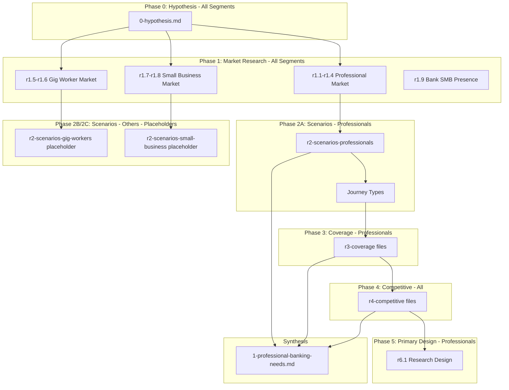

# SMB Banking Unified Proposal: Research & Design Plan

## Overview

This plan creates a **unified proposal** for relationship-focused SMB banking covering three segments:

- **Phase 1 (Priority):** Professionals (doctors, lawyers, accountants, consultants, architects)
- **Phase 2:** Gig Workers (platform-dependent earners)
- **Phase 3:** 1-10 Employee Businesses (practices and businesses with staff)

The current plan scope covers **everything through primary research design for Phase 1 (Professionals)**, plus **hypothesis and market research for all three segments** to establish the complete opportunity.

---

## Folder Structure

```
ibuki/
└── ibuki-smb-banking-value-prop-us/
    ├── README.md                           # Executive overview
    ├── 0-hypothesis.md                     # Hypotheses for ALL segments
    │
    ├── phase1-professionals/               # Phase 1: Professionals
    │   ├── 1-professional-banking-needs.md
    │   ├── 2-solution-vision.md
    │   ├── 3-value-to-professional.md
    │   └── 4-value-to-bank.md
    │
    ├── phase2-gig-workers/                 # Phase 2: Gig Workers (later)
    │   └── 1-gig-worker-banking-needs.md   # Placeholder/draft
    │
    ├── phase3-small-business/              # Phase 3: 1-10 Employees (later)
    │   └── 1-small-business-banking-needs.md  # Placeholder/draft
    │
    └── _research/
        ├── r0-hypothesis/                  # Hypothesis support (all segments)
        ├── r1-market/                      # Market research (all segments)
        ├── r2-scenarios-professionals/     # Scenario research (Phase 1)
        ├── r2-scenarios-gig-workers/       # Scenario research (Phase 2 - later)
        ├── r2-scenarios-small-business/    # Scenario research (Phase 3 - later)
        ├── r3-coverage/                    # Coverage analysis (Phase 1 focus)
        ├── r4-competitive/                 # Competitive landscape (all segments)
        └── r6-primary-design/              # Primary research design (Phase 1)
```

---

## Phase 0: Hypothesis Formation (All Segments)

### Deliverable: `0-hypothesis.md`

**Structure:**

1. **Core Hypothesis** (applies to all segments)

> Banks treat SMBs as a bundle of products rather than as economic units with interconnected financial needs. By shifting to a relationship-focused model that solves scenarios rather than sells products, we can create significantly more value.

2. **Segment 1: Professionals**

   - H1.1: Market size hypothesis (5-8M practices, $50B+ banking wallet)
   - H1.2: Integration gap hypothesis (business-personal disconnection)
   - H1.3: Scenario gap hypothesis (products vs. practice scenarios)
   - H1.4: Value hypothesis ($3K-$10K annual value per relationship)
   - H1.5: Competitive white space hypothesis (no one owns this segment)

3. **Segment 2: Gig Workers**

   - H2.1: Market size hypothesis (15-20M workers, $10B+ banking wallet)
   - H2.2: Income variability gap hypothesis (underwriting, cash flow)
   - H2.3: Tax and expense gap hypothesis (quarterly taxes, expense tracking)
   - H2.4: Value hypothesis ($200-$500 per customer, volume play)
   - H2.5: Competitive positioning hypothesis (beyond liquidity products)

4. **Segment 3: 1-10 Employee Businesses**

   - H3.1: Market size hypothesis (5-6M businesses, $100B+ banking wallet)
   - H3.2: Coordination gap hypothesis (payroll, multi-stakeholder access)
   - H3.3: Scenario gap hypothesis (operational complexity unaddressed)
   - H3.4: Value hypothesis ($5K-$15K annual value per relationship)
   - H3.5: Scaling opportunity hypothesis (grows with business)

5. **Phasing Rationale**

   - Why Professionals first (highest value, clearest gap, fintechs haven't won)
   - Phase 2/3 timing considerations
   - Cross-segment synergies

6. **Success Criteria** (per hypothesis)

---

## Phase 1: Market & Segment Research (All Segments)

### Research Files to Create

**All-Segment Market Research:**

| File | Purpose | Segments |

|------|---------|----------|

| `r1-market/r1.1-smb-market-overview.md` | Overall SMB landscape in US | All |

| `r1-market/r1.2-professional-market-size.md` | Professional practices by vertical, revenue | Professionals |

| `r1-market/r1.3-professional-verticals.md` | Top 5 verticals deep-dive (Healthcare, Legal, Accounting, Consulting, Architecture) | Professionals |

| `r1-market/r1.4-professional-banking-wallet.md` | Banking wallet per professional | Professionals |

| `r1-market/r1.5-gig-worker-market-size.md` | Gig worker count, income, segments | Gig Workers |

| `r1-market/r1.6-gig-worker-banking-wallet.md` | Banking wallet per gig worker | Gig Workers |

| `r1-market/r1.7-small-business-market-size.md` | 1-10 employee business count, revenue | Small Business |

| `r1-market/r1.8-small-business-banking-wallet.md` | Banking wallet per small business | Small Business |

| `r1-market/r1.9-mid-sized-bank-smb-presence.md` | Current SMB banking at mid-sized banks | All |

**Research Sources:**

- US Census Bureau (SUSB, County Business Patterns)
- Bureau of Labor Statistics
- FDIC/Federal Reserve banking data
- Industry associations (AMA, ABA, AICPA, AIA, Freelancers Union)
- Gig economy reports (McKinsey, Pew Research)
- IBISWorld, Statista industry reports

---

## Phase 2A: Scenario Research - Professionals (Phase 1 Segment)

This is the deep-dive for the priority segment.

### Research Files to Create

| File | Purpose |

|------|---------|

| `r2-scenarios-professionals/r2.1-methodology.md` | How scenarios were identified |

| `r2-scenarios-professionals/r2.2-healthcare-practice.md` | Physician, dental, therapy practice scenarios |

| `r2-scenarios-professionals/r2.3-legal-practice.md` | Law firm and solo attorney scenarios |

| `r2-scenarios-professionals/r2.4-accounting-practice.md` | CPA firm and solo accountant scenarios |

| `r2-scenarios-professionals/r2.5-consulting-practice.md` | Consultant and agency scenarios |

| `r2-scenarios-professionals/r2.6-cross-vertical.md` | Common scenarios across verticals |

| `r2-scenarios-professionals/r2.7-scenario-inventory.md` | Complete scenario list with metadata |

| `r2-scenarios-professionals/r2.8-prioritization.md` | Frequency x Impact ranking |

### Journey Type Framework (Professionals)

1. **Daily Cash Flow Operations** - Receivables, payables, cash position
2. **Owner Compensation & Draws** - When/how much to pay yourself
3. **Business-Personal Separation** - Expense categorization, reimbursements
4. **Client/Patient Billing** - Invoicing, collections, insurance billing
5. **Vendor & Supplier Payments** - Terms, timing, relationships
6. **Tax & Compliance** - Quarterly estimates, year-end, audit prep
7. **Financing & Credit** - Line of credit, loans, cash flow gaps
8. **Practice Growth & Investment** - Equipment, hiring, expansion
9. **When Things Go Wrong** - Cash shortfall, fraud, disputes
10. **Practice Lifecycle** - Starting, restructuring, selling, retiring

### Secondary Research Sources

- Fintech features: Mercury, Relay, Novo, Found, Collective, Bench
- Accounting software: QuickBooks, FreshBooks, Wave, Xero
- Practice management software (by vertical)
- Industry forums, Reddit communities
- CPA and bookkeeper insights

---

## Phase 2B: Scenario Research - Gig Workers (Deferred to Phase 2)

### Placeholder Files to Create

| File | Purpose |

|------|---------|

| `r2-scenarios-gig-workers/r2.1-methodology.md` | Placeholder with planned approach |

| `r2-scenarios-gig-workers/r2.2-scenario-hypotheses.md` | Initial scenario hypotheses (10-15 examples) |

**Hypothesized Journey Types (to be validated in Phase 2):**

1. Income Tracking & Smoothing
2. Platform Earnings Management
3. Expense Tracking & Deductions
4. Quarterly Tax Management
5. Income Verification & Credit Building
6. Vehicle/Equipment Costs
7. Multi-Platform Coordination
8. Personal-Business Blur
9. Emergency Cash Flow
10. Gig-to-Business Transition

---

## Phase 2C: Scenario Research - Small Business (Deferred to Phase 3)

### Placeholder Files to Create

| File | Purpose |

|------|---------|

| `r2-scenarios-small-business/r2.1-methodology.md` | Placeholder with planned approach |

| `r2-scenarios-small-business/r2.2-scenario-hypotheses.md` | Initial scenario hypotheses (10-15 examples) |

**Hypothesized Journey Types (to be validated in Phase 3):**

1. Payroll & Employee Finance
2. Multi-Stakeholder Access & Permissions
3. Accounts Receivable Management
4. Accounts Payable & Vendor Management
5. Owner vs. Business Separation
6. Cash Flow Forecasting
7. Tax & Compliance (with employees)
8. Financing & Growth Capital
9. When Things Go Wrong
10. Business Lifecycle & Exit

---

## Phase 3: Coverage & Gap Analysis (Professionals Focus)

### Research Files to Create

| File | Purpose |

|------|---------|

| `r3-coverage/r3.1-mid-sized-bank-smb-products.md` | What banks offer for SMB/professional |

| `r3-coverage/r3.2-product-vs-solution-gaps.md` | Products offered vs. scenarios solved |

| `r3-coverage/r3.3-integration-gaps.md` | Business-personal integration gaps |

| `r3-coverage/r3.4-coverage-matrix-professionals.md` | Scenario-by-scenario coverage (Professionals) |

---

## Phase 4: Competitive Landscape (All Segments)

### Research Files to Create

| File | Purpose | Segments |

|------|---------|----------|

| `r4-competitive/r4.1-fintech-landscape-professionals.md` | Mercury, Relay, Novo, Found, Collective | Professionals |

| `r4-competitive/r4.2-fintech-landscape-gig.md` | Dave, Chime, Lili, Moves, Stride | Gig Workers |

| `r4-competitive/r4.3-fintech-landscape-smb.md` | Brex, Ramp, Mercury, Bluevine | Small Business |

| `r4-competitive/r4.4-vertical-solutions.md` | Practice management + finance by vertical | All |

| `r4-competitive/r4.5-accounting-software.md` | QuickBooks, FreshBooks, Wave, Xero | All |

| `r4-competitive/r4.6-competitive-positioning.md` | White space and differentiation | All |

---

## Phase 5: Primary Research Design (Professionals Only)

### Deliverable: `r6-primary-design/r6.1-primary-research-design-professionals.md`

**Structure:**

1. **Research Objectives**

   - Validate scenario inventory (80-90% confidence)
   - Understand pain point severity
   - Quantify time/cost of current workarounds
   - Identify unmet needs not in secondary research

2. **Methodology**

| Method | Purpose | Sample |

|--------|---------|--------|

| In-depth interviews | Deep journey understanding | 20-25 professionals (4-5 per vertical) |

| Day-in-life observation | Observe actual workflows | 5-8 professionals |

| Expert interviews | Fill knowledge gaps | 5-8 (CPAs, bookkeepers, consultants) |

| Validation survey | Quantify frequency/importance | 150-200 professionals |

3. **Interview Protocol**

   - Screener questions
   - Discussion guide
   - Journey mapping exercises
   - Pain point severity rating

4. **Sample Design**

   - Vertical distribution (Healthcare, Legal, Accounting, Consulting, Other)
   - Practice size (solo, 1-5, 5-10 employees)
   - Geographic (urban, suburban)
   - Bank relationship (single, multi-bank, fintech users)

5. **Analysis Plan**

   - Scenario validation criteria
   - Pain point clustering
   - Journey type refinement

### Placeholder for Future Phases

| File | Purpose | Phase |

|------|---------|-------|

| `r6-primary-design/r6.2-primary-research-design-gig.md` | Research design for Gig Workers | Phase 2 |

| `r6-primary-design/r6.3-primary-research-design-smb.md` | Research design for Small Business | Phase 3 |

---

## Synthesis: Phase 1 Needs Document

### Deliverable: `phase1-professionals/1-professional-banking-needs.md`

Combines:

- Journey types and scenario inventory from r2 research
- Coverage matrix from r3 research
- Gap patterns and prioritization
- Competitive context from r4 research

This document becomes the foundation for solution design.

---

## Deliverable Sequence (Phase 1 Scope)



---

## Summary: What This Plan Produces

| Deliverable | Scope |

|-------------|-------|

| `0-hypothesis.md` | All 3 segments - hypotheses and success criteria |

| Market research (r1.x) | All 3 segments - sizing and banking wallet |

| Scenario research (r2-professionals) | Professionals only - full inventory |

| Scenario placeholders (r2-gig, r2-smb) | Other segments - hypothesized scenarios |

| Coverage analysis (r3.x) | Professionals focus |

| Competitive landscape (r4.x) | All 3 segments |

| Primary research design (r6.1) | Professionals only |

| `1-professional-banking-needs.md` | Professionals - synthesis document |

**Confidence levels at end of Phase 1:**

- Professionals: 70-80% scenario confidence (pre-primary research)
- Gig Workers: 30-40% (hypothesized only)
- 1-10 Employee: 30-40% (hypothesized only)

---

## Phase 2/3 Scope (Future)

After primary research for Professionals is complete:

**Phase 2: Gig Workers**

- Full scenario research (r2-scenarios-gig-workers)
- Coverage analysis update
- Primary research design for gig workers
- Needs document synthesis

**Phase 3: 1-10 Employee Businesses**

- Full scenario research (r2-scenarios-small-business)
- Coverage analysis update
- Primary research design for small businesses
- Needs document synthesis

**Final synthesis: Unified proposal with all three segments**