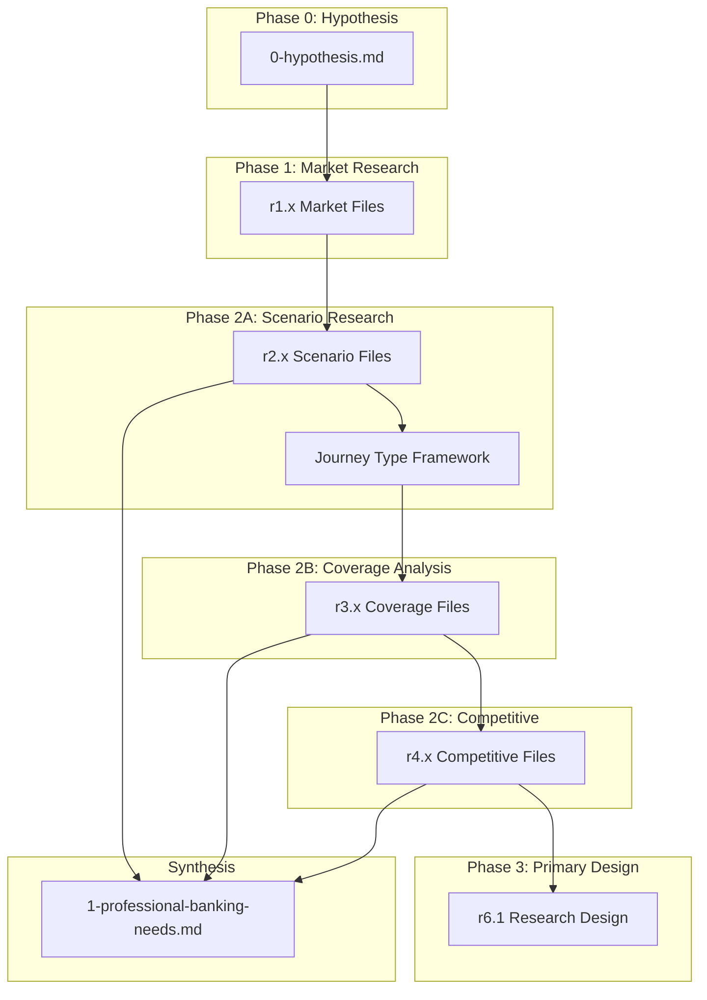

# SMB Professional Banking Proposal: Research & Design Plan

## Overview

This plan covers all work from hypothesis formation through secondary research, plus the design of primary research. The goal is to create a comprehensive, hypothesis-driven proposal for relationship-focused banking targeting Professionals, with extensibility to Gig Workers and 1-10 employee businesses.

---

## Folder Structure

```
ibuki/
└── ibuki-professional-banking-value-prop-us/
    ├── README.md                           # Executive overview (created last)
    ├── 0-hypothesis.md                     # Core hypotheses and success criteria
    ├── 1-professional-banking-needs.md     # Scenario inventory and gap analysis
    ├── 2-solution-vision.md                # Why agents, not apps
    ├── 3-value-to-professional.md          # Value quantification for customer
    ├── 4-value-to-bank.md                  # Business case
    └── _research/
        ├── r0.x-hypothesis/                # Hypothesis support
        ├── r1.x-market/                    # Market sizing and segmentation
        ├── r2.x-scenarios/                 # Scenario research
        ├── r3.x-coverage/                  # Current bank coverage analysis
        ├── r4.x-competitive/               # Competitive landscape
        ├── r5.x-value/                     # Value quantification research
        └── r6.x-primary-design/            # Primary research design docs
```

---

## Phase 0: Hypothesis Formation

### Deliverable: `0-hypothesis.md`

**Structure:**

- Core Hypothesis Statement
- Segment Hypotheses (Professionals, Gig Workers, 1-10 Employee Businesses)
- Gap Hypotheses (what's missing in current banking)
- Value Hypotheses (what value can be created)
- Success Criteria (what would validate/invalidate each hypothesis)
- Initial Scenario Sketch (10-20 illustrative scenarios)

**Content to include:**

1. Core Hypothesis:

> Banks treat professionals as a bundle of products (business checking, credit line, merchant services) rather than as an economic unit with interconnected financial needs. By shifting to a relationship-focused model centered on the professional practice as an entity, we can create significantly more value.

2. Segment-Specific Hypotheses for:

   - Professionals (H1.1-H1.5)
   - Gig Workers (H2.1-H2.5) 
   - 1-10 Employee Businesses (H3.1-H3.5)

3. Prioritization Rationale (why start with Professionals)

---

## Phase 1: Market & Segment Research

### Research Files to Create

| File | Purpose |

|------|---------|

| `r1.1-professional-market-size.md` | Market sizing: number of professional practices by vertical, revenue distribution |

| `r1.2-professional-verticals.md` | Deep dive on top 5 verticals: Healthcare, Legal, Accounting, Consulting, Architecture |

| `r1.3-professional-banking-wallet.md` | Banking wallet per professional: deposits, lending, payments, treasury |

| `r1.4-gig-worker-market-size.md` | Market sizing for gig worker segment |

| `r1.5-small-business-market-size.md` | Market sizing for 1-10 employee businesses |

| `r1.6-mid-sized-bank-smb-presence.md` | Current SMB banking at mid-sized banks (products, penetration, revenue) |

### Research Sources

- US Census Bureau (SUSB - Statistics of US Businesses)
- Bureau of Labor Statistics (Occupational data)
- FDIC/Federal Reserve (Banking data)
- Industry associations (AMA, ABA, AICPA, AIA)
- IBISWorld, Statista (Industry reports)

---

## Phase 2A: Secondary Research (Scenario Discovery)

### Research Files to Create

**Scenario Research:**

| File | Purpose |

|------|---------|

| `r2.1-scenario-research-methodology.md` | How scenarios were identified and validated |

| `r2.2-healthcare-practice-scenarios.md` | Scenarios for physician/dental/therapy practices |

| `r2.3-legal-practice-scenarios.md` | Scenarios for law firms and solo attorneys |

| `r2.4-accounting-practice-scenarios.md` | Scenarios for CPA firms and solo accountants |

| `r2.5-consulting-practice-scenarios.md` | Scenarios for consultants and agencies |

| `r2.6-cross-vertical-scenarios.md` | Common scenarios across all professional verticals |

| `r2.7-scenario-inventory-complete.md` | Master list of all scenarios with metadata |

| `r2.8-scenario-prioritization.md` | Frequency x Impact ranking |

**Secondary Research Sources:**

- Fintech feature analysis (Mercury, Relay, Novo, Found, Lili, Collective)
- Accounting software analysis (QuickBooks, FreshBooks, Wave)
- Practice management software (by vertical)
- Industry forums and communities (Reddit, professional associations)
- Tax preparer and CPA insights (blogs, forums)
- Bank business banking product pages

### Journey Type Framework (Draft)

Create initial journey types analogous to family banking's 10:

1. **Daily Cash Flow Operations** - Receivables, payables, cash position
2. **Owner Compensation & Draws** - When/how much to pay yourself
3. **Business-Personal Separation** - Expense categorization, reimbursements
4. **Client/Patient Billing** - Invoicing, collections, insurance billing
5. **Vendor & Supplier Payments** - Terms, timing, relationships
6. **Tax & Compliance** - Quarterly estimates, year-end, audit prep
7. **Financing & Credit** - Line of credit, loans, cash flow gaps
8. **Practice Growth & Investment** - Equipment, hiring, expansion
9. **When Things Go Wrong** - Cash shortfall, fraud, disputes
10. **Practice Lifecycle** - Starting, restructuring, selling, retiring

---

## Phase 2B: Coverage & Gap Analysis

### Research Files to Create

| File | Purpose |

|------|---------|

| `r3.1-mid-sized-bank-smb-products.md` | What mid-sized banks offer for SMB/professional |

| `r3.2-product-vs-solution-gaps.md` | Gap analysis: products offered vs. scenarios solved |

| `r3.3-integration-gaps.md` | Business-personal integration gaps |

| `r3.4-coverage-matrix.md` | Scenario-by-scenario coverage assessment |

---

## Phase 2C: Competitive Landscape

### Research Files to Create

| File | Purpose |

|------|---------|

| `r4.1-fintech-landscape.md` | Mercury, Relay, Novo, Found, Lili, Brex, Ramp analysis |

| `r4.2-vertical-specific-solutions.md` | Vertical-specific practice management + finance tools |

| `r4.3-accounting-software-landscape.md` | QuickBooks, FreshBooks, Wave, Xero |

| `r4.4-competitive-positioning.md` | White space analysis and differentiation opportunities |

---

## Phase 3: Primary Research Design

### Deliverable: `r6.1-primary-research-design.md`

**Structure:**

1. **Research Objectives**

   - Validate scenario inventory (confirm top 80-90%)
   - Understand pain point severity
   - Quantify time/cost of current workarounds
   - Identify unmet needs not found in secondary research

2. **Methodology**

| Method | Purpose | Sample |

|--------|---------|--------|

| In-depth interviews | Deep journey understanding | 20-25 professionals across 5 verticals (4-5 per vertical) |

| Day-in-life observation | Observe actual workflows | 5-8 professionals (1-2 per vertical) |

| Expert interviews | Fill knowledge gaps | 5-8 experts (CPAs, bookkeepers, practice consultants) |

| Validation survey | Quantify frequency/importance | 150-200 professionals |

3. **Interview Protocol**

   - Screener questions
   - Discussion guide (structured conversation flow)
   - Journey mapping exercises
   - Pain point severity rating

4. **Sample Design**

   - Vertical distribution (Healthcare, Legal, Accounting, Consulting, Other)
   - Practice size distribution (solo, 1-5 employees, 5-10 employees)
   - Geographic distribution (urban, suburban)
   - Bank relationship types (single bank, multi-bank, fintech users)

5. **Analysis Plan**

   - Scenario validation criteria
   - Pain point clustering
   - Journey type refinement
   - Gap severity quantification

---

## Deliverable Sequence



---

## Output Summary

At the end of this plan, we will have:

1. **Hypothesis Document** (`0-hypothesis.md`) - Core thesis and testable claims
2. **16+ Research Files** covering market, scenarios, coverage, and competitive landscape
3. **Draft Scenario Inventory** - 50-80 scenarios across 10 journey types (60-70% confidence)
4. **Gap Analysis** - Scenario-by-scenario coverage assessment
5. **Primary Research Design** - Ready-to-execute research plan with protocols
6. **Draft Needs Document** (`1-professional-banking-needs.md`) - Synthesis ready for validation

---

## Key Differences from Family Banking Proposal

| Aspect | Family Banking | Professional Banking |

|--------|---------------|---------------------|

| Structure | Needs-first, embedded research | Hypothesis-first, separated research |

| Research visibility | Implicit in main docs | Explicit in `_research/` with methodology |

| Scenario source | Presented as findings | Clearly traced to research sources |

| Validation | Assumed validated | Explicit validation criteria and primary research design |