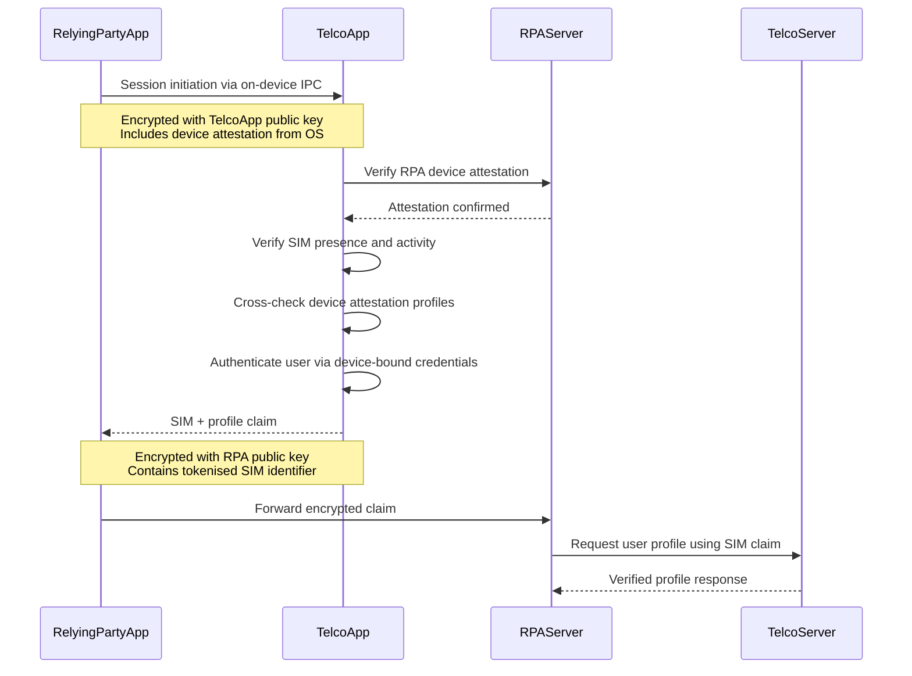

# SMS OTP End-of-Life Supplement — Detailed Writing Plan

## Folder Location

`misc/rbi-digital-payment-fraud/supplement-telco-device-attestation/`

Also update [README.md](misc/rbi-digital-payment-fraud/README.md) to add a "Supplementary Recommendations" section linking to this folder.

---

## Document 1: `README.md` — Overview and Index

**Purpose**: Orientation document for the folder. Sets up the argument arc and links to all 6 documents.

**Contents**:

- One-paragraph summary: SMS OTP is a structurally weak authentication factor; the ecosystem has responded with 30+ compensating controls that are costly, inconsistent, and losing the arms race against evolving fraud. A Telco-attested, SIM-bound device authentication factor would be structurally stronger and reduce the regulatory/compliance overhead.
- Context: this is a supplementary recommendation to the RBI Discussion Paper on Digital Payment Fraud, and relates to the RBI Authentication Mechanisms Directions 2025.
- Why this is relevant to the discussion paper: while the paper focuses on APP fraud, the underlying authentication infrastructure (SMS OTP) is also a vector for user-mediated account takeover (credential sharing under social engineering). A stronger factor makes credentials unshareable.
- The scope extends beyond payments: SMS OTP is embedded across India's entire Digital Public Infrastructure (Aadhaar, eSign, DigiLocker, EPFO, etc.) — a weakness in the authentication layer is a weakness in every service built on top of it.
- Document index with one-line description of each document:
  1. Case for SMS OTP end-of-life
  2. Compensating controls inventory
  3. Telco attestation protocol (brief)
  4. Public digital infrastructure exposure
  5. Stakeholder perspectives
  6. Regulatory ask
- Cross-reference to Options 1-7 in the parent folder

---

## Document 2: `01-case-for-sms-otp-eol.md` — The Narrative

**Purpose**: The "why" document. Makes the case that SMS OTP has reached end-of-life as a viable authentication factor.

**Structure**:

### Section 1: SMS OTP's structural weaknesses

- Shareable: user can read it aloud, type it into a phishing site, or share screen
- Interceptable: SS7 protocol exploits, rogue cell towers, mobile malware
- Replayable: no binding to the specific transaction or device context
- Dependent on PSTN: a network designed for voice, not security
- Cite NIST SP 800-63B Rev 4 classification as "restricted authenticator" — must offer alternatives, document risks, maintain migration plan

### Section 2: India-specific evidence

- 80 lakh fraudulent SIMs identified, 6 lakh blacklisted
- SIM swap losses averaging Rs 2-25 lakh per incident
- UPI fraud jumped 85% in FY2024 (13.42 lakh cases, Rs 1,087 Cr)
- NCRP: 2.27 million cybercrime complaints in 2024 (+42% YoY), Rs 36,450 Cr losses
- The link between OTP-sharing under social engineering and APP fraud

### Section 3: The arms race is unsustainable

- Brief summary of the 30+ compensating controls (detailed in doc 02)
- Each new OS version, device type, or attack vector requires new controls
- Inconsistent implementation across PSPs and banks — some implement all, some implement few
- The compliance burden falls on every RPA individually
- Core argument: **patching a weak factor with dozens of controls is more expensive and less effective than replacing the factor**

### Section 4: The door is already open

- RBI Authentication Mechanisms Directions 2025 are principle-based and technology-agnostic
- They explicitly encourage passkeys, FIDO, biometrics, device-bound keys
- They require factor independence (compromise of one must not affect the other) — SMS OTP arguably fails this when the SIM is also the device binding mechanism
- What's missing is a **deadline** — without an end-of-life date, the ecosystem will continue defaulting to SMS OTP because it's the path of least resistance

### Section 5: This is not just a payments problem

- SMS OTP is used across regulators: RBI, IRDAI, SEBI, MeitY/UIDAI, TRAI
- Exploits in one sector (e.g., telecom) cascade into another (e.g., banking)
- No single regulator has ownership of the SMS OTP problem
- A coordinated cross-regulator deprecation is needed

---

## Document 3: `02-compensating-controls-inventory.md` — The Evidence

**Purpose**: Catalogue of existing NPCI/RBI controls that exist specifically to compensate for SMS OTP and device-level weaknesses. Demonstrates the scale of the problem.

**Structure**:

### Section 1: NPCI UPI Mobile Application Security Framework 2025

Organised by the NPCI's own four-phase structure:

**Identify phase** (threat detection):

- Root/jailbreak detection
- Root cloaking detection
- Installation source validation
- Virtual device/emulator blocking
- Device blacklisting
- Harmful app detection

**Protect phase** (23 controls):

- Code integrity (runtime memory checks)
- Anti-debugging (ptrace/gdb blocking)
- Anti-reverse engineering (obfuscation, control flow flattening)
- AES-256 key encryption
- OWASP Top 10 (SAST/DAST/SCA)
- Screen hiding, screenshot prevention, secure inputs
- Proxy detection, IP whitelisting, SSL pinning
- Developer options / USB debugging blocking
- Auto-read OTP, sender ID whitelisting
- OTP and binding security controls

**Detect phase**:

- Runtime tampering scanning (code, memory, config)
- Unsecured Wi-Fi alerting

**Respond phase**:

- Real-time threat reporting to monitoring systems

### Section 2: NPCI Device Binding Checklist

Full list of binding-specific controls:

- SIM/eSIM state validation (per platform)
- Airplane mode prohibition
- Connectivity rules (iOS mobile data mandatory, Android conditional Wi-Fi)
- Session integrity (no app toggling, token invalidation on exit)
- 45-second timer
- Dynamic SMS tokens (35+ chars, alphanumeric + special)
- VMN management (10+ VMNs, random, no series)
- 3-attempt limit, 24-hour device ID block
- SMS-sent verification
- Auto-read OTP fallback with sender ID whitelisting
- iOS Private API for token/VMN editing prevention
- iOS 5-second handoff limit
- Identical shortcode rejection
- Deactivated SIM blocking
- Force-update to latest app version
- New registration transaction caps (Rs 5,000 for 24 hours)

### Section 3: RBI Master Direction on Cyber Resilience (2024)

- Mobile app controls: remote access tool detection, jailbreak/root detection, malware detection
- Governance: board-approved cyber resilience policies
- Vendor risk management

### Section 4: RBI Authentication Directions (2025)

- 2FA mandate with dynamic factor requirement
- Factor independence requirement
- Issuer liability for non-compliance

### Section 5: The overhead argument

- Count of distinct controls: 30+ mandatory, 10+ recommended
- Each control requires: implementation, testing, annual audit (CERT-In empanelled), remediation
- Multiply by number of PSPs, banks, and TPAPs in the ecosystem
- Inconsistency: NPCI shares controls privately to PSPs/TPAs — not all entities have the same information
- Argument: a structurally stronger authentication factor would reduce or eliminate the need for the majority of these compensating controls

---

## Document 4: `03-telco-attestation-protocol.md` — The Proposal (Brief)

**Purpose**: High-level description of the Telco-attested device authentication protocol. Enough detail to convey the concept and its security properties. Full protocol specification to be developed in a subsequent iteration.

**Structure**:

### Section 1: Design principles

- Unshareable by design — no credential the user can read aloud or type
- SIM-bound — tied to the physical SIM in the device, not just a phone number
- Device-attested — cross-verified between the RPA and Telco App using OS-level device attestation
- KYC-backed — Telco's regulated KYC information provides identity assurance
- Tokenised — SIM identifier is unique per (SIM, RPA) pair, preventing cross-service tracking

### Section 2: Protocol overview (brief)

High-level flow diagram (mermaid):

Brief description of each step — 2-3 sentences per step, not full specification.

### Section 3: What this factor resists

Table comparing SMS OTP vs. Telco attestation across attack vectors:

- SIM swap, SS7 interception, OTP sharing/phishing, remote access (AnyDesk), device cloning, malware, MITM
- For each: how SMS OTP is vulnerable and how Telco attestation resists

### Section 4: Open design questions (acknowledged, to be resolved later)

- Colocation verification: how to ensure RPA and Telco App are on the same physical device (not proxied)
- iOS constraints: no general-purpose cross-vendor IPC; may require API-mediated flow
- Dual-SIM handling
- Fallback when Telco App is not installed
- USSD vs. carrier-grade API for SIM verification
- Key management and rotation
- Cross-telco interoperability

---

## Document 5: `04-public-digital-infrastructure-exposure.md` — SMS OTP Across India's DPI

**Purpose**: Enumerate the public digital goods and infrastructure that rely on SMS OTP as a primary or fallback authentication factor. Demonstrate that SMS OTP is not merely a payments problem — it is a systemic vulnerability woven into India's entire digital public infrastructure. An OTP compromise in one system cascades across all others.

**Structure**:

### Section 1: The India Stack's dependence on SMS OTP

SMS OTP is the de facto universal authentication layer across India's Digital Public Infrastructure. Virtually every service built on top of Aadhaar, the mobile number, and the India Stack uses SMS OTP as a primary or fallback factor. This section sets the framing: a weakness in the authentication layer is a weakness in every service built on top of it.

### Section 2: Inventory of critical public digital infrastructure

**Aadhaar ecosystem (UIDAI)**:

- Aadhaar OTP authentication — used for e-KYC across banking, telecom, insurance, securities
- Aadhaar eSign — legally binding digital signatures authenticated via OTP; used for loan agreements, property registrations, government filings
- Aadhaar update/correction — demographic and biometric updates use OTP as one authentication path
- Aadhaar-linked bank account verification
- Volume: Aadhaar authentication transactions clocked a 32% jump in January 2025 YoY

**eSign (CCA/CDAC)**:

- Aadhaar-based eSign is the most widely used electronic signature mechanism in India
- Authenticated via SMS OTP — a single intercepted OTP can authorise a legally binding signature
- Used for: loan agreements, insurance policies, property registrations, government contracts, court filings
- Risk: an eSign fraud is not just a financial loss — it creates a legally enforceable obligation against the victim

**DigiLocker (MeitY)**:

- SMS OTP for login and document access
- Stores: Aadhaar, PAN, driving licence, vehicle registration, academic certificates, ration cards
- A compromised DigiLocker account exposes the victim's entire identity document portfolio

**UMANG (MeitY)**:

- Single-window access to 1,500+ government services
- SMS OTP for registration, login, and service authorisation
- Includes access to: EPFO (provident fund), pension (BHAVISHYA), passport, driving licence, scholarships, utility payments

**EPFO**:

- SMS OTP for PF balance check, passbook access, withdrawal claims
- PF withdrawals (partial and full) can be initiated with OTP authentication
- A compromised OTP can trigger withdrawal of the victim's entire provident fund balance

**Direct Benefit Transfer (DBT)**:

- Government welfare scheme disbursements use Aadhaar authentication (including OTP fallback)
- Beneficiary verification for PM-KISAN, LPG subsidy, NREGA wages, scholarships
- Fraud here affects the most vulnerable sections of society

**Income Tax (CBDT)**:

- ITR e-verification via Aadhaar OTP
- PAN-Aadhaar linking via OTP
- Refund status and form submissions

**GST Portal (GSTN)**:

- Registration, return filing, and invoice authentication use OTP
- Business-critical: GST compliance affects every registered business in India

**API Setu / India Stack APIs**:

- Many government and private APIs hosted on this platform use SMS OTP as the end-user authentication layer
- Third-party applications consuming these APIs inherit the SMS OTP vulnerability

**Other government services**:

- Passport Seva (passport application and tracking)
- Parivahan (driving licence and vehicle registration)
- National Scholarship Portal
- CoWIN / Aarogya Setu (health services)
- IRCTC (railway booking — linked to Aadhaar for concessions)

### Section 3: The cascade risk

- A SIM swap or OTP interception doesn't just compromise one service — it potentially compromises **all** services linked to that mobile number
- The mobile number is the common thread: Aadhaar, bank accounts, DigiLocker, eSign, EPFO, ITR all linked to the same number
- A single point of failure (the SMS channel) creates a single point of compromise across the entire identity and service stack
- Illustrative scenario: attacker performs SIM swap → intercepts Aadhaar OTP → uses eSign to execute a loan agreement in victim's name → uses DigiLocker to access identity documents → uses EPFO OTP to withdraw provident fund

### Section 4: eSign deserves special attention

- eSign is uniquely high-stakes: it creates **legally binding obligations**, not just financial transactions
- Unlike a bank transaction (which can potentially be reversed), a signed loan agreement or property deed is enforceable in court
- The authentication bar for eSign should be the **highest in the stack** — yet it relies on the same SMS OTP as a Rs 500 UPI transfer
- Documented cases of eSign misuse for unauthorised loan agreements, property transfers
- Recommendation: eSign should be among the first services to mandate non-SMS authentication

### Section 5: The argument for system-wide deprecation

- Deprecating SMS OTP for payments alone (RBI's jurisdiction) leaves the same vulnerability open in eSign, DigiLocker, EPFO, income tax, and dozens of other services
- Fraudsters will simply shift their attack vector to the weakest link in the chain
- A coordinated, cross-regulator deprecation is the only effective approach
- This reinforces the regulatory ask in document 06

---

## Document 6: `05-stakeholder-perspectives.md` — Who Is Affected

**Purpose**: Map the impact and incentives for each stakeholder group.

**Structure**:

### Banks and PSPs

- Reduced compliance burden (fewer compensating controls to implement and audit)
- Stronger authentication reduces fraud losses and customer complaints
- Integration effort: new SDK/API integration with Telco attestation service
- Transition cost during the migration period (supporting both SMS OTP and Telco attestation)

### Telcos (Jio, Airtel, Vi, BSNL)

- New regulated role as authentication service providers
- Commercial opportunity: authentication-as-a-service to banks/PSPs
- Regulatory obligations: SLA, uptime, audit requirements
- Technical investment: building and maintaining the attestation app and backend
- Incentive alignment: telcos already suffer reputational damage from SIM swap fraud

### Regulators

- **RBI**: aligns with 2025 Authentication Directions; needs to set the end-of-life timeline
- **TRAI/DoT**: need to mandate telco participation; define the attestation service as a regulated telecom service
- **MeitY/UIDAI**: Aadhaar-based services also rely on SMS OTP; benefit from stronger factor
- **SEBI, IRDAI**: securities and insurance sectors use SMS OTP; benefit from cross-regulator deprecation
- Coordination mechanism needed (inter-ministerial or inter-regulatory working group)

### Consumers

- UX: Telco-app-based authentication could be faster than SMS OTP (no waiting for SMS, no manual entry)
- Accessibility: must work for users with disabilities, limited digital literacy
- Inclusion: what happens for users on feature phones or without telco app?
- Trust: users need to understand and trust the new mechanism

### OS Vendors (Apple, Google)

- Platform support for on-device IPC between third-party apps
- Device attestation APIs (Play Integrity, App Attest) are critical infrastructure
- iOS restrictions on cross-vendor IPC may require Apple engagement

---

## Document 7: `06-regulatory-ask.md` — The Specific Asks

**Purpose**: What we are asking RBI (and other regulators) to do. Concrete, actionable.

**Structure**:

### Ask 1: Notify SMS OTP end-of-life

- Phased timeline:
  - Phase 1 (12 months): high-value transactions (above a threshold) must offer a non-SMS alternative
  - Phase 2 (24 months): high-value transactions must use a non-SMS factor; SMS OTP restricted to low-value
  - Phase 3 (36 months): SMS OTP fully deprecated for all digital payment transactions
- Aligns with RBI 2025 Authentication Directions (which already encourage non-SMS factors)

### Ask 2: Establish cross-regulator working group

- RBI + DoT/TRAI + MeitY to coordinate on Telco-based authentication standards
- Define the attestation service as a regulated telecom service
- Harmonise authentication requirements across financial, telecom, and government services

### Ask 3: Mandate Telco attestation service availability

- Telcos with >X million subscribers must provide a device attestation API/app
- Service must meet prescribed SLAs (uptime, latency, availability)
- Interoperability: all telcos must implement the same standardised protocol

### Ask 4: Pilot program

- RBI to authorise a pilot with 2-3 banks and 2-3 telcos
- Scope: high-value UPI transactions in a defined geography or customer segment
- Duration: 6-12 months
- Evaluation criteria: fraud reduction, UX metrics, implementation cost, scalability

---

## Updates to Parent Folder

Update [misc/rbi-digital-payment-fraud/README.md](misc/rbi-digital-payment-fraud/README.md):

- Add a "Supplementary Recommendations" section after "Our Additional Proposed Approaches"
- Link to `supplement-telco-device-attestation/README.md`
- Brief description: "Supplementary recommendation to notify end-of-life for SMS OTP and adopt Telco-attested, SIM-bound device authentication as a structurally stronger replacement factor"

Move content from [misc/rbi-digital-payment-fraud/todos.md](misc/rbi-digital-payment-fraud/todos.md) into `03-telco-attestation-protocol.md` and clean up `todos.md`.