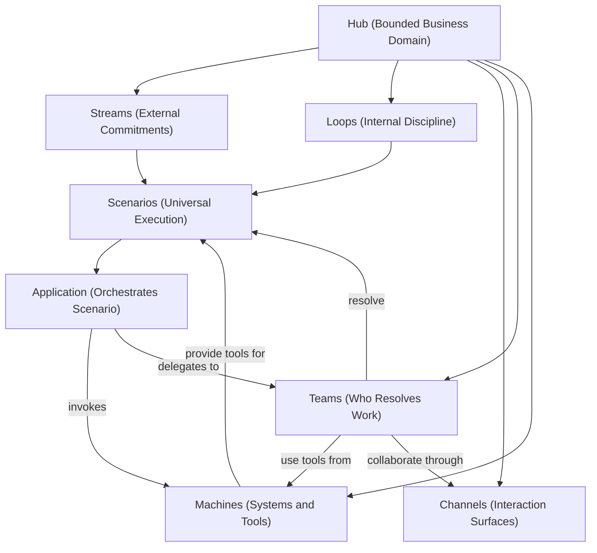

# The Hub Way -- Complete Documentation Overhaul

## What Changes

Three categories of change applied to the documentation suite:

1. **Rename**: HSLC --> "The Hub Way"; folder and file renames; scope phrasing update
2. **New concepts**: Teams, Machines, Application
3. **Weave**: Integrate new concepts into every existing document with style consistency

## Hub Constituents After This Change

---

## Phase 1: Folder and File Renames

**Folder rename:**

- `org-8.0/what-we-sell/hubs-streams-loops-channels/` --> `org-8.0/what-we-sell/the-hub-way/`

**Enablement file renames** (clean renumbering since all files are being touched):

| Old Name                         | New Name                    | Reason                              |
| -------------------------------- | --------------------------- | ----------------------------------- |
| `06-hslc-and-hub-ontology.md`    | `08-ontology-alignment.md`  | Remove HSLC from filename; renumber |
| `07-implementing-hslc-in-hub.md` | `09-implementing-in-hub.md` | Remove HSLC from filename; renumber |
| `08-examples.md`                 | `10-examples.md`            | Renumber                            |
| `09-faq.md`                      | `11-faq.md`                 | Renumber                            |

**New enablement files:**

- `06-modeling-teams.md` (NEW)
- `07-modeling-machines.md` (NEW)

**Final enablement numbering:**

| #   | Document                | Status                        |
| --- | ----------------------- | ----------------------------- |
| 01  | Framework and Rationale | Existing -- update            |
| 02  | Modeling Streams        | Existing -- update            |
| 03  | Modeling Loops          | Existing -- update            |
| 04  | Modeling Hubs           | Existing -- update            |
| 05  | Modeling Channels       | Existing -- update            |
| 06  | Modeling Teams          | **NEW**                       |
| 07  | Modeling Machines       | **NEW**                       |
| 08  | Ontology Alignment      | Existing -- rename + update   |
| 09  | Implementing in Hub     | Existing -- rename + update   |
| 10  | Worked Examples         | Existing -- renumber + update |
| 11  | FAQ                     | Existing -- renumber + update |

---

## Phase 2: Global Text Replacements (All 13 Existing Files)

**97 HSLC occurrences** across 13 files need context-sensitive replacement:

| Pattern                                  | Replacement   | Example                                          |
| ---------------------------------------- | ------------- | ------------------------------------------------ |
| `HSLC` (standalone, as framework name)   | The Hub Way   | "HSLC provides..." --> "The Hub Way provides..." |
| `HSLC framework`                         | The Hub Way   | "the HSLC framework" --> "The Hub Way"           |
| `Hubs-Streams-Loops-Channels` (expanded) | The Hub Way   | Used in enablement README, heading text          |
| `HSLC (Hubs, Streams, Loops, Channels)`  | The Hub Way   | First-mention expansions                         |
| `HSLC's` (possessive)                    | The Hub Way's | Possessive form                                  |

Context-sensitive: some occurrences need sentence restructuring. For example:

- Current: "HSLC is an operational work modeling framework"
- New: "The Hub Way is a framework for modeling work in business domains"

**Scope phrasing update** -- replace "operational work modeling framework" and similar with "framework for modeling work in business domains" throughout. Specific locations:

- [README.md](org-8.0/what-we-sell/hubs-streams-loops-channels/README.md) line 1-2
- [01-framework-and-rationale.md](org-8.0/what-we-sell/hubs-streams-loops-channels/enablement/01-framework-and-rationale.md) lines 1, 100, 198
- [09-faq.md](org-8.0/what-we-sell/hubs-streams-loops-channels/enablement/09-faq.md) line 78

**Internal cross-references** -- all `../README.md`, `../narrative.md`, `../critique.md`, and inter-enablement links remain valid (relative paths within the folder are unchanged). Only the folder path in any absolute references would change.

---

## Phase 3: New Document -- [06-modeling-teams.md](org-8.0/what-we-sell/the-hub-way/enablement/06-modeling-teams.md)

Structure (following existing enablement doc style):

- **Section 1: Teams as Hub Constituents** -- Teams are the human and AI agents enrolled in a Hub to resolve its Scenarios. A Hub without Teams is an empty specification. Teams are the "who" -- integral to Streams and Loops, not external operators.
- **Section 2: What a Team Comprises** -- Table: human agent types (Operator/Agent, Supervisor, Process Architect, Developer) and AI agent types (Capable AI, Skilful AI, Scenario-as-Agent, Persona Twins). Banking examples. Reference AOSM's HAT (shared context, task interoperability, seamless handoff, human oversight).
- **Section 3: Teams in Streams and Loops** -- Teams are the "who" for each Scenario. Stream Scenarios require specific teams (dispute analysts, credit officers). Loop Scenarios may require different teams (reconciliation ops, data engineers) or no team at all (Pure Automation). The Resolution Model determines team involvement.
- **Section 4: Team Assignment and Structure** -- Skill-based pools, task queues, escalation matrices, allocation algorithms. Reference `olympus-hub-docs/02-system-design/implementation-concepts/task-allocation.md`.
- **Section 5: Teams and Resolution Models** -- Link Teams to the 9 Resolution Models. Pure Automation = no team. Human-AI Teaming = mixed. AI-Autonomous = AI team within governance. The Application-Agent convergence: when the runtime is Seer, the Application IS an AI Agent -- simultaneously a Team member and the Scenario orchestrator.
- **Section 6: Cross-Hub Teams** -- Teams are Hub-scoped (enrolled per Workbench). Individuals may span Hubs. Aggregation Hubs have their own teams.
- **Section 7: Anti-Patterns** -- The Phantom Team (no enrolled agents), The Monolith Team (one team for all work), The Invisible Team (work modeled without considering who), The Siloed Team (no cross-Hub collaboration when Streams span Hubs).
- **Section 8: Heuristics** -- "Every Scenario should answer: who resolves this?", "Start with Streams and Loops, then ask who participates", "Design for gradual automation: today's human team may become tomorrow's AI team."
- Summary, Related Documents

---

## Phase 4: New Document -- [07-modeling-machines.md](org-8.0/what-we-sell/the-hub-way/enablement/07-modeling-machines.md)

Structure:

- **Section 1: Machines as Hub Constituents** -- A Machine is a deployed system that provides capabilities to the Hub. Core banking, payment switches, fraud engines, ML services -- all are Machines. Brief mention: Machines also emit Signals (covered in Stream/Loop trigger modeling). Emphasis: what matters for Hub Way modeling is the Tools they provide.
- **Section 2: Tools -- What Machines Provide** -- Three Tool types aligned to OPD, with banking examples:
  - Prediction Application (Observe/Predict): fraud risk score, propensity model
  - Decision Application (Decide): credit policy engine, AML rule set
  - Command / Actuator (Act): `lockAccount`, `authorizePayment`, `issueCard`
  - Table with examples, not deep dives.
- **Section 3: Application -- The Orchestration Layer** -- The Hub Application orchestrates how a Scenario is resolved -- invoking Tools, coordinating Team activities, managing state. Application types span the Resolution spectrum: workflow apps (ChronoShift, Rhea) for structured flows, batch apps (Perseus) for data processing, and **Seer Case Orchestration Agents** for AI-driven resolution. When the runtime is Seer, the Application IS an AI Agent. Reference [09-implementing-in-hub.md] for implementation details.
- **Section 4: Machine Scope and Registration** -- Machine Registry inheritance: System --> Tenant --> Workbench. Modelers decide which Machines a Hub needs. Domain modeling decision.
- **Section 5: System-Agnostic Integration** -- The Hub does not care which system provides the capability. Zeta product lines (Tachyon, Neutrino, Electron) are Machines. Third-party systems are equally valid. Replace a Machine without changing Streams, Loops, Teams, or Channels. The Tool contract is the stable interface.
- **Section 6: Machines in Streams and Loops** -- Stream Scenarios use Tools to fulfill commitments. Loop Scenarios use Tools for discipline. Fully automated Loops are entirely Machine-driven.
- **Section 7: Hub as Machine** -- A Hub can be exposed as a Machine to other Hubs (Workbench-as-Machine pattern). Channel and Machine are both Hub-relative: Channel is how collaborators interact with this Hub; Machine is a system this Hub uses for tools. Another Hub can be both.
- **Section 8: Anti-Patterns** -- The Invisible Machine (unregistered dependencies), The Over-Connected Hub (too many Machines), The Unbound Scenario (no Tool bindings), The Monolith Machine (hundreds of commands without grouping).
- **Section 9: Heuristics** -- "For each Scenario, ask: what tools does the Team need to Observe, Decide, and Act?", "The Tool contract is the stable interface -- design around contracts, not system identity", "If a Machine serves many Hubs, consider a Shared Services Hub."
- Summary, Related Documents

---

## Phase 5: Update Existing Documents

### [narrative.md](org-8.0/what-we-sell/hubs-streams-loops-channels/narrative.md)

- **Title/opening**: Replace HSLC references with The Hub Way. Update scope phrasing.
- **Add "Teams: Who Makes It Work" section** (between Channels and The Complete Picture, ~12 lines): Streams and Loops define what work exists. Channels define how participants interact. Teams are the people and AI agents who actually do the work. A dispute resolution Stream requires investigators, supervisors, AI analysts. An interest computation Loop may need no human team -- fully automated. The composition evolves: today's human team becomes tomorrow's AI-augmented team.
- **Add "Machines: What the Bank Works With" section** (after Teams, ~12 lines): Every Scenario depends on external systems. Transaction lookup, risk scoring, payment authorization, account management -- these capabilities come from Machines. An Application orchestrates how these Tools are used. The Application may itself be an AI Agent -- perceiving, deciding, and acting through Machine Tools within governance. The Hub is system-agnostic: Zeta products and third-party systems are equally valid Machines.
- **Update "The Complete Picture"** (line 73-77): Include Teams and Machines. "...resolved by Teams of human and AI agents, using Tools from Machines, collaborating through Channels."
- **Update closing line** (line 107): "...modeled as a Hub with its own Streams, Loops, Channels, Teams, and Machines"

### [README.md](org-8.0/what-we-sell/hubs-streams-loops-channels/README.md)

- **Title**: "The Hub Way" (line 1)
- **Opening**: Update scope phrasing. Enumerate six constituents.
- **"The Four Concepts" --> "The Core Concepts"**: Keep Hub, Stream, Loop, Channel subsections. Add:
  - **Team -- The Collaborators** (~8 lines): definition, HAT alignment, Hub-scoped, Resolution Model link
  - **Machine -- The Systems and Tools** (~8 lines): definition, Tool types (brief), system-agnostic, Application mention
- **Scope section** (line 103): add "How collaborators are structured (Teams)" and "What systems and tools are available (Machines)"
- **Relationship to DDD and AOSM** (line 111): add AOSM alignment for Teams-->HAT and Machines-->Machine/Tool/Command
- **Hub inventory** (line 120+): "each modeled as a Hub with Streams, Loops, Channels, Teams, and Machines"

### [enablement/README.md](org-8.0/what-we-sell/hubs-streams-loops-channels/enablement/README.md)

- Replace HSLC with The Hub Way (8 occurrences)
- Add 06, 07 to audience paths and document map table
- Renumber 08-->08, 09-->09, old-08-->10, old-09-->11

### [01-framework-and-rationale.md](org-8.0/what-we-sell/hubs-streams-loops-channels/enablement/01-framework-and-rationale.md)

- Replace HSLC (17 occurrences), update scope phrasing
- **Section 2 Hub-as-system table** (line 22): add Teams row ("Agents/actors | Who does the work") and Machines row ("External systems | What systems and tools are available")
- **Section 3 Orthogonal Concerns** (line 35): add Teams and Machines rows to table. Update prose.
- **Section 8 AOSM alignment** (line 163): add Teams-->HAT, Machines-->Machine/Tool/Command

### [02-modeling-streams.md](org-8.0/what-we-sell/hubs-streams-loops-channels/enablement/02-modeling-streams.md)

- Replace HSLC (7 occurrences)
- **Section 4** (line 78): add paragraph -- Scenarios within a Stream are resolved by Teams using Tools from Machines through Channels. Team composition may vary per Scenario.
- **Related Documents**: add links to 06-modeling-teams.md and 07-modeling-machines.md

### [03-modeling-loops.md](org-8.0/what-we-sell/hubs-streams-loops-channels/enablement/03-modeling-loops.md)

- Replace HSLC (2 occurrences)
- **Section 5** (line 65): reinforce -- Loops execute as Scenarios resolved by Teams. Some Loops have no human team (Pure Automation -- entirely Machine-driven). The Resolution Model determines team involvement.
- **Related Documents**: add links to 06 and 07

### [04-modeling-hubs.md](org-8.0/what-we-sell/hubs-streams-loops-channels/enablement/04-modeling-hubs.md)

- Replace HSLC (3 occurrences)
- **Section 1 table** (line 11): add "Collaborators / Teams" and "Systems / Machines" rows
- **Section 4 "What a Hub Contains" table** (line 53): add Teams row ("Human and AI agents enrolled, organized into pools, assigned via task queues and escalation matrices") and Machines row ("External systems registered in Machine Registry, exposing Tools for Scenarios")
- **Section 7 Hub-Workbench table** (line 112): add Teams-->Agent Pools/Task Queues/Escalation Matrices and Machines-->Machine Registry/Tool Registry
- **Summary** (line 190): mention Teams and Machines

### [05-modeling-channels.md](org-8.0/what-we-sell/hubs-streams-loops-channels/enablement/05-modeling-channels.md)

- Replace HSLC (2 occurrences)
- **Section 5** (line 85): strengthen connection -- "Teams collaborate through Channels to resolve Scenarios. Channels are the surfaces; Teams are the participants; Machines provide the tools."
- **Related Documents**: add links to 06 and 07

### [06-hslc-and-hub-ontology.md --> 08-ontology-alignment.md](org-8.0/what-we-sell/hubs-streams-loops-channels/enablement/06-hslc-and-hub-ontology.md)

- Replace HSLC (20 occurrences) -- heaviest file
- **Title**: "The Hub Way and the Olympus Hub Ontology"
- **Section 2 "What The Hub Way Adds"** (line 39): add Teams row ("Collaborator structuring as a modeling concern") and Machines row ("Tool availability as a modeling concern -- the ontology defines Machine/Tool abstractly; The Hub Way makes it a domain-level decision")
- **Section 3 "Agent Model"** (line 97): bridging note -- The Hub Way's Team concept uses the ontology's Agent types unchanged but elevates agent organization as a modeling concern. The Application-Agent convergence: when the runtime is Seer, the Application IS an AI Agent.
- **Section 8 Summary Mapping** (line 234): add Team-->Agent Pools/HAT and Machine-->Machine Registry/Tool Registry rows

### [07-implementing-hslc-in-hub.md --> 09-implementing-in-hub.md](org-8.0/what-we-sell/hubs-streams-loops-channels/enablement/07-implementing-hslc-in-hub.md)

- Replace HSLC (2 occurrences)
- **Title**: "Implementing The Hub Way in Olympus Hub"
- **Section 1.3 Agent Pools** (line 101): add framing -- "Agent pools implement The Hub Way's Team concept at the platform level."
- **Section 6.1 Machines** (line 551): add framing -- "Machines implement The Hub Way's Machine concept. The Machine Registry and Tool Registry provide the governance and discovery infrastructure."
- **Summary** (line 622): mention Teams and Machines

### [08-examples.md --> 10-examples.md](org-8.0/what-we-sell/hubs-streams-loops-channels/enablement/08-examples.md)

- Replace HSLC (3 occurrences)
- For each of the 3 example Hubs (Payments, Credit Card, Enterprise Compliance), add:
  - **Teams table** (after Channels table): roles, agent types (Human/AI/Mixed), which Streams/Loops they serve
  - **Machines table** (after Teams table): Machine name, Tool types exposed, which Scenarios use them
- **Summary Checklist** (line 149): add "Teams | Who resolves? Agent types? Skills? Resolution Model?" and "Machines | What systems? What Tools? Registered?"

### [09-faq.md --> 11-faq.md](org-8.0/what-we-sell/hubs-streams-loops-channels/enablement/09-faq.md)

- Replace HSLC (7 occurrences)
- **Add "Team Questions" section** (3-4 entries):
  - "How do Teams differ from Personas?" -- Personas are interaction archetypes; Teams are the specific agents enrolled to resolve work.
  - "Do Teams change when we automate?" -- Team composition evolves with Resolution Model. The Stream/Loop model stays the same.
  - "Are Teams Hub-scoped?" -- Yes, enrolled per Workbench. Individuals may span Hubs.
- **Add "Machine Questions" section** (3-4 entries):
  - "How is a Machine different from a Channel?" -- Both are Hub-relative. Channel = how collaborators interact with this Hub. Machine = a system this Hub uses for Tools. Another Hub can be a Machine to this Hub.
  - "Does changing a Machine affect Streams and Loops?" -- No. The Tool contract is the stable interface. Replace the Machine registration; work classification is unaffected.
  - "What about AI Agents as Applications?" -- When the runtime is Seer, the Hub Application IS an AI Agent. This agent is both a Team member and the Scenario orchestrator.

### [critique.md](org-8.0/what-we-sell/hubs-streams-loops-channels/critique.md)

- Replace HSLC (16 occurrences)
- No structural changes needed -- Teams and Machines are additions, not responses to critique concerns

---

## Phase 6: Execution Order

To minimize broken cross-references during editing:

1. Rename folder and files first (git mv)
2. Global HSLC-->Hub Way replacement across all files
3. Scope phrasing updates
4. Create new docs (06-modeling-teams.md, 07-modeling-machines.md)
5. Update enablement/README.md with new numbering
6. Weave Teams into narrative, README, and all enablement docs
7. Weave Machines and Application into narrative, README, and all enablement docs
8. Update cross-reference links in Related Documents sections
9. Final consistency pass

