# The Hub Way -- Complete Documentation Overhaul

## What Changes

Four categories of change applied to the documentation suite:

1. **Rename**: HSLC --> "The Hub Way"; folder and file renames; scope phrasing update
2. **New concepts**: Teams, Machines, Application
3. **Agent-centric editorial shift**: Reframe the entire suite around agent-centric thinking
4. **Weave**: Integrate new concepts into every existing document with style consistency

## Editorial Principles (Apply Across All Documents)

### Agent-Centric by Design

The Hub Way is a framework for thinking about, modeling, and operating **all** work in a business domain. Not a subset. Not "agent-collaborative work." ALL work -- from millisecond payment authorizations to months-long investigations to nightly batch computations -- is modeled through the same agent-centric lens.

Key reframes throughout the suite:

- **Scenarios are goals resolved by agents, not activities or process steps.** The path is not predetermined because agents exercise judgment. Replace language like "coordinated set of business activities" with "goals that agents -- human and AI -- collaborate to resolve."
- **Agent-centric is the default, not a mode.** The framework does not "add AI" to processes. It models all work as agent-resolved from the start. A fully automated interest computation is resolved by machine agents. A complex investigation is resolved by a human-AI team. Both are modeled the same way.
- **The spectrum is built in.** Every piece of work sits somewhere on a spectrum from fully human to fully automated, with every combination of human-AI collaboration in between. The organization decides where each Scenario sits today and can move it tomorrow.
- **The transformation is non-disruptive.** Start with how work already happens. The model captures it faithfully. Then move the dial, one Scenario at a time, at whatever pace the stakeholders choose. The model does not change; the resolution does.

### Narrative Voice: Simon Sinek Style (Start with Why)

The [narrative.md](org-8.0/what-we-sell/the-hub-way/narrative.md) follows a Why --> How --> What arc:

- **WHY**: Banking domains are complex networks of commitments, disciplines, and interactions. The existing ways of thinking about this work -- process maps, workflow engines, undifferentiated "operations" -- do not give banks a coherent model. They cannot answer: what do we owe the outside world? What do we do for ourselves? Who resolves the work? What tools do they use? How do we gradually shift from human-operated to AI-augmented without rebuilding?
- **HOW**: The Hub Way provides an agent-centric model for all work in a business domain. Every piece of work is a goal. Agents -- human and AI -- resolve those goals using tools from the systems the bank runs, interacting through surfaces appropriate to each participant. The bank controls a dial: how much is human, how much is AI, how much is automated. The dial can move gradually, one Scenario at a time, without changing the model.
- **WHAT**: Hubs, Streams, Loops, Channels, Teams, Machines -- the specific constructs that make this model concrete and actionable.

### Terminology in the Narrative vs Enablement Docs

The narrative targets business stakeholders. Avoid internal ontology jargon:

- Use "spectrum" or "dial" instead of "Resolution Model"
- Use "goals resolved by agents" instead of "Scenarios"  (introduce "Scenario" as the named term after establishing the concept)
- Use "the systems the bank runs" or "tools" instead of "Machines" on first introduction
- Introduce Hub Way terms naturally, with the concept before the label

## Hub Constituents After This Change

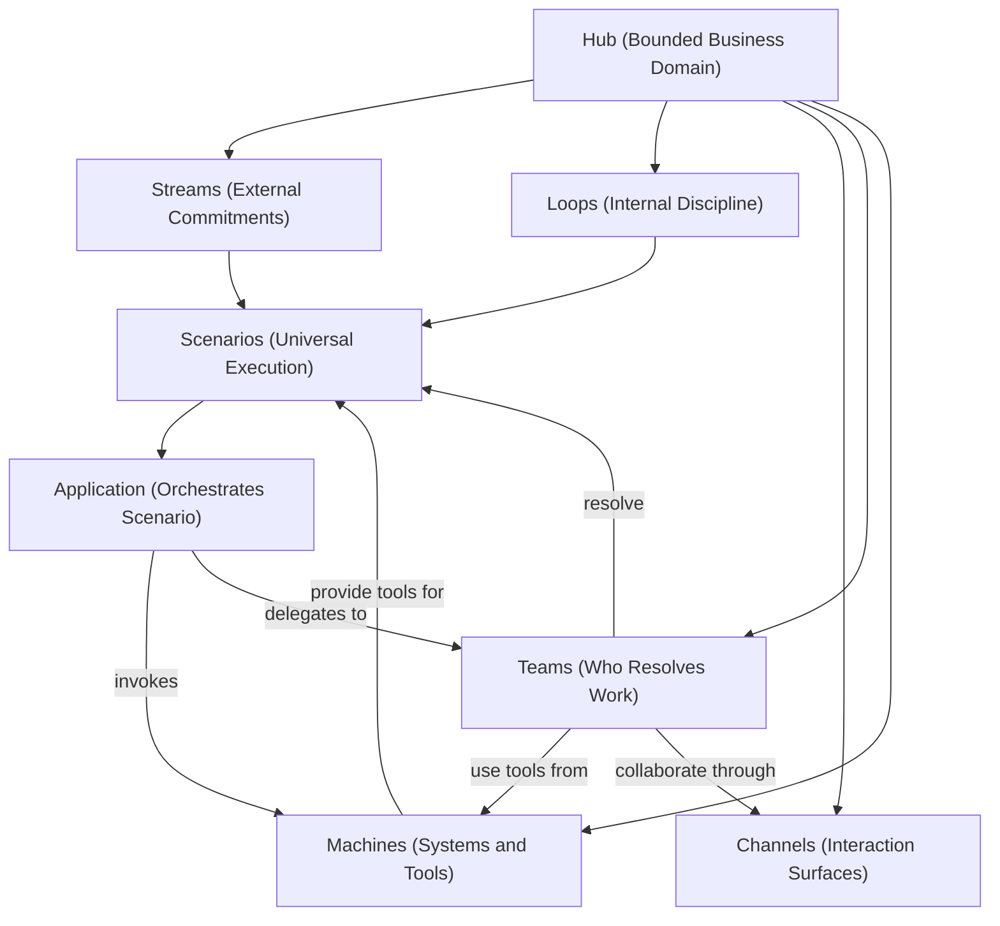

---

## Phase 1: Folder and File Renames

**Folder rename:**

- `org-8.0/what-we-sell/hubs-streams-loops-channels/` --> `org-8.0/what-we-sell/the-hub-way/`

**Enablement file renames** (clean renumbering since all files are being touched):

| Old Name                         | New Name                    | Reason                              |
| -------------------------------- | --------------------------- | ----------------------------------- |
| `06-hslc-and-hub-ontology.md`    | `08-ontology-alignment.md`  | Remove HSLC from filename; renumber |
| `07-implementing-hslc-in-hub.md` | `09-implementing-in-hub.md` | Remove HSLC from filename; renumber |
| `08-examples.md`                 | `10-examples.md`            | Renumber                            |
| `09-faq.md`                      | `11-faq.md`                 | Renumber                            |

**New enablement files:**

- `06-modeling-teams.md` (NEW)
- `07-modeling-machines.md` (NEW)

**Final enablement numbering:**

| #   | Document                | Status                        |
| --- | ----------------------- | ----------------------------- |
| 01  | Framework and Rationale | Existing -- update            |
| 02  | Modeling Streams        | Existing -- update            |
| 03  | Modeling Loops          | Existing -- update            |
| 04  | Modeling Hubs           | Existing -- update            |
| 05  | Modeling Channels       | Existing -- update            |
| 06  | Modeling Teams          | **NEW**                       |
| 07  | Modeling Machines       | **NEW**                       |
| 08  | Ontology Alignment      | Existing -- rename + update   |
| 09  | Implementing in Hub     | Existing -- rename + update   |
| 10  | Worked Examples         | Existing -- renumber + update |
| 11  | FAQ                     | Existing -- renumber + update |

---

## Phase 2: Global Text Replacements (All 13 Existing Files)

**97 HSLC occurrences** across 13 files need context-sensitive replacement:

| Pattern                                  | Replacement   | Example                                          |
| ---------------------------------------- | ------------- | ------------------------------------------------ |
| `HSLC` (standalone, as framework name)   | The Hub Way   | "HSLC provides..." --> "The Hub Way provides..." |
| `HSLC framework`                         | The Hub Way   | "the HSLC framework" --> "The Hub Way"           |
| `Hubs-Streams-Loops-Channels` (expanded) | The Hub Way   | Used in enablement README, heading text          |
| `HSLC (Hubs, Streams, Loops, Channels)`  | The Hub Way   | First-mention expansions                         |
| `HSLC's` (possessive)                    | The Hub Way's | Possessive form                                  |

Context-sensitive: some occurrences need sentence restructuring. For example:

- Current: "HSLC is an operational work modeling framework"
- New: "The Hub Way is a framework for modeling work in business domains"

**Scope phrasing update** -- replace "operational work modeling framework" and similar with "framework for modeling work in business domains" throughout. Specific locations:

- [README.md](org-8.0/what-we-sell/hubs-streams-loops-channels/README.md) line 1-2
- [01-framework-and-rationale.md](org-8.0/what-we-sell/hubs-streams-loops-channels/enablement/01-framework-and-rationale.md) lines 1, 100, 198
- [09-faq.md](org-8.0/what-we-sell/hubs-streams-loops-channels/enablement/09-faq.md) line 78

**Internal cross-references** -- all `../README.md`, `../narrative.md`, `../critique.md`, and inter-enablement links remain valid (relative paths within the folder are unchanged). Only the folder path in any absolute references would change.

---

## Diagrams Across the Suite

Mermaid diagrams to add where they clarify concepts. Diagrams are placed inside the documents themselves, not as separate files.

### README.md -- Hub Constituents Overview

The Hub Way's core concepts and their relationships at a glance. Placed after the opening paragraph.

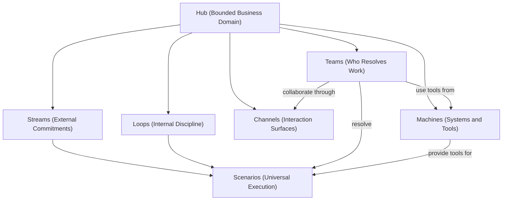

### 01-framework-and-rationale.md -- Hub-as-System Metaphor

Visual of the systems thinking metaphor. Placed in Section 2.

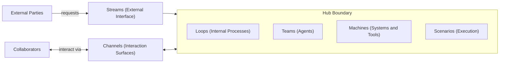

### 02-modeling-streams.md -- Stream Lifecycle

Specification, Instance, and Trace. Placed in Section 3.

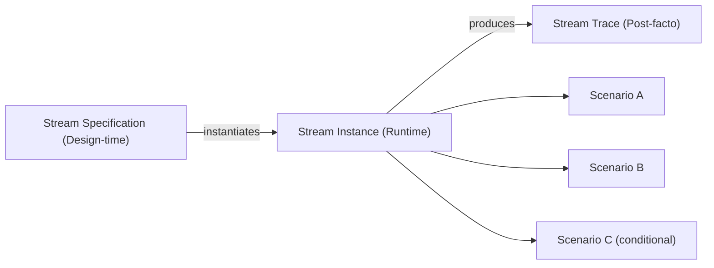

### 03-modeling-loops.md -- Loop-Stream Feedback System

The virtuous cycle. Placed in Section 7.

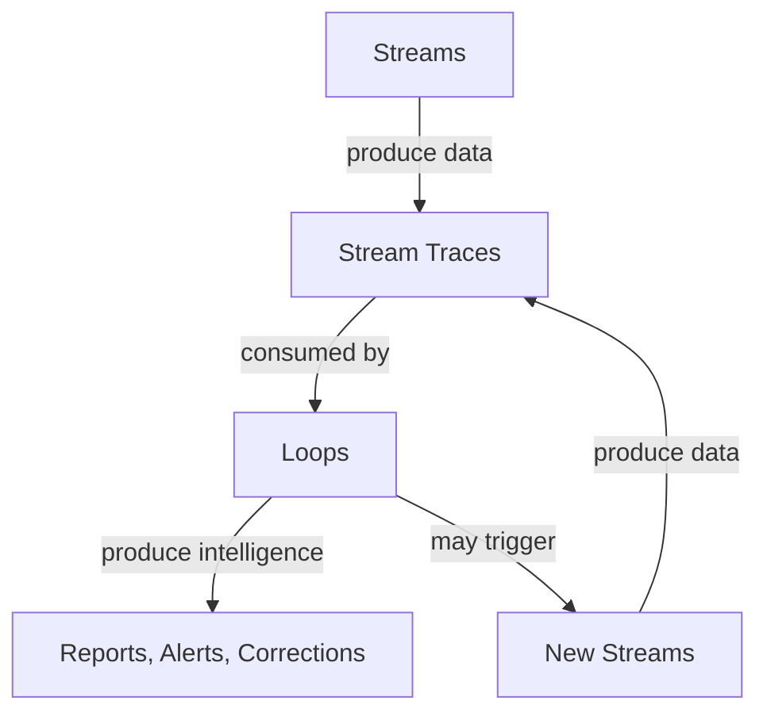

### 04-modeling-hubs.md -- What a Hub Contains

All constituents in one view. Placed in Section 4.

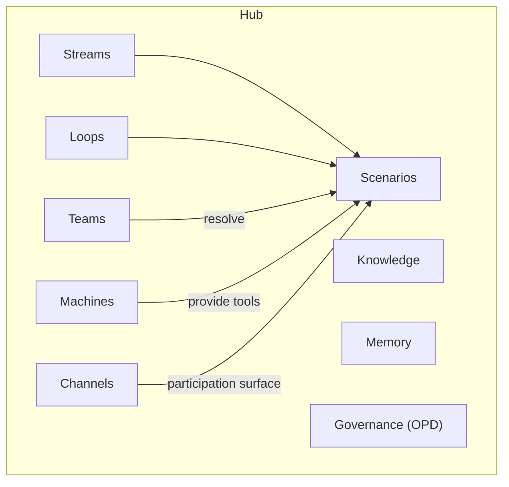

### 05-modeling-channels.md -- Channel vs Channel Product

Scope distinction. Placed in Section 7.

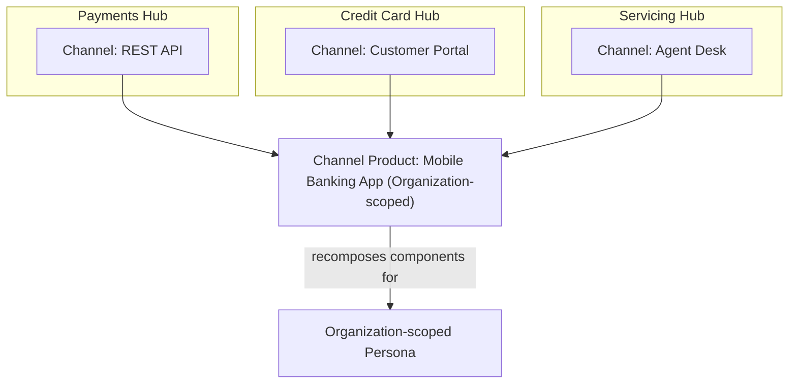

### 06-modeling-teams.md -- Teams and the Resolution Spectrum

Shows how Team composition changes across Resolution Models. Placed in Section 5.

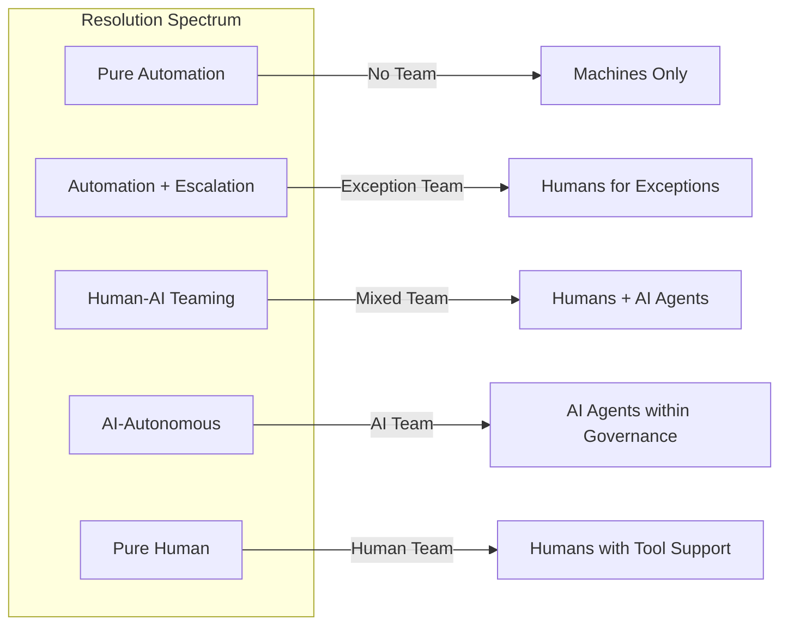

Also: Application-Agent convergence diagram. Placed in Section 5.

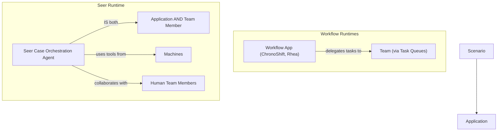

### 07-modeling-machines.md -- Tools and the OPD Cycle

How Tool types align to the OPD phases. Placed in Section 2.

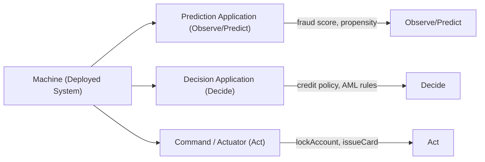

Also: Hub-as-Machine pattern. Placed in Section 7.

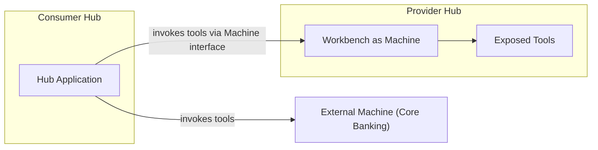

### 08-ontology-alignment.md -- Hub Way to Ontology Mapping

Where Hub Way concepts sit in the four-layer ontology. Placed in Section 5.

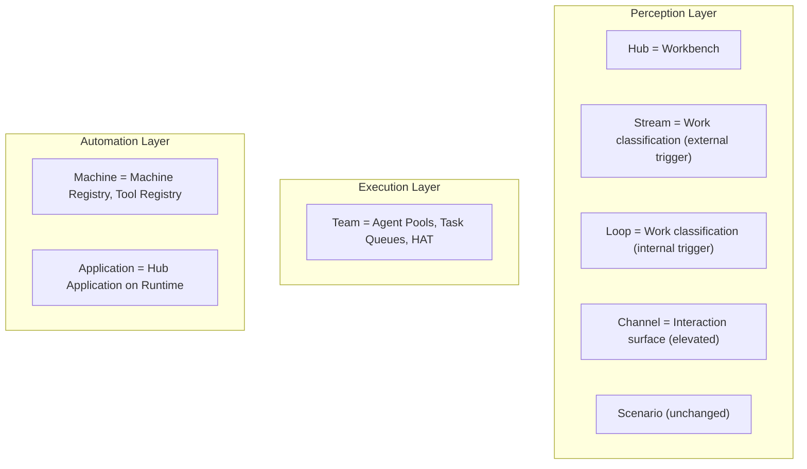

### 10-examples.md -- Per-Hub Composition

One diagram per example Hub showing all constituents together. Placed at the start of each example. Example for Payments Hub:

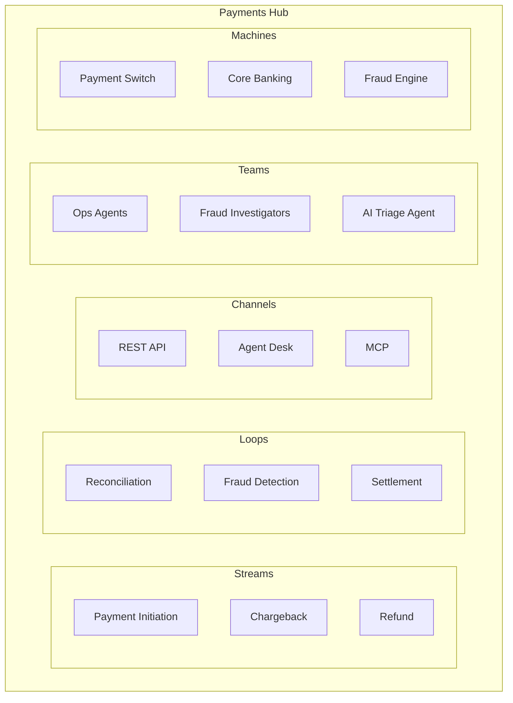

---

## Phase 3: New Document -- [06-modeling-teams.md](org-8.0/what-we-sell/the-hub-way/enablement/06-modeling-teams.md)

Structure (following existing enablement doc style):

- **Section 1: Teams as Hub Constituents** -- Teams are the human and AI agents enrolled in a Hub to resolve its Scenarios. A Hub without Teams is an empty specification. Teams are the "who" -- integral to Streams and Loops, not external operators.
- **Section 2: What a Team Comprises** -- Table: human agent types (Operator/Agent, Supervisor, Process Architect, Developer) and AI agent types (Capable AI, Skilful AI, Scenario-as-Agent, Persona Twins). Banking examples. Reference AOSM's HAT (shared context, task interoperability, seamless handoff, human oversight).
- **Section 3: Teams in Streams and Loops** -- Teams are the "who" for each Scenario. Stream Scenarios require specific teams (dispute analysts, credit officers). Loop Scenarios may require different teams (reconciliation ops, data engineers) or no team at all (Pure Automation). The Resolution Model determines team involvement.
- **Section 4: Team Assignment and Structure** -- Skill-based pools, task queues, escalation matrices, allocation algorithms. Reference `olympus-hub-docs/02-system-design/implementation-concepts/task-allocation.md`.
- **Section 5: Teams and Resolution Models** -- Link Teams to the 9 Resolution Models. Pure Automation = no team. Human-AI Teaming = mixed. AI-Autonomous = AI team within governance. The Application-Agent convergence: when the runtime is Seer, the Application IS an AI Agent -- simultaneously a Team member and the Scenario orchestrator. **Diagrams**: Resolution spectrum showing Team composition; Application-Agent convergence (workflow runtime vs Seer runtime).
- **Section 6: Cross-Hub Teams** -- Teams are Hub-scoped (enrolled per Workbench). Individuals may span Hubs. Aggregation Hubs have their own teams.
- **Section 7: Anti-Patterns** -- The Phantom Team (no enrolled agents), The Monolith Team (one team for all work), The Invisible Team (work modeled without considering who), The Siloed Team (no cross-Hub collaboration when Streams span Hubs).
- **Section 8: Heuristics** -- "Every Scenario should answer: who resolves this?", "Start with Streams and Loops, then ask who participates", "Design for gradual automation: today's human team may become tomorrow's AI team."
- Summary, Related Documents

---

## Phase 4: New Document -- [07-modeling-machines.md](org-8.0/what-we-sell/the-hub-way/enablement/07-modeling-machines.md)

Structure:

- **Section 1: Machines as Hub Constituents** -- A Machine is a deployed system that provides capabilities to the Hub. Core banking, payment switches, fraud engines, ML services -- all are Machines. Brief mention: Machines also emit Signals (covered in Stream/Loop trigger modeling). Emphasis: what matters for Hub Way modeling is the Tools they provide.
- **Section 2: Tools -- What Machines Provide** -- Three Tool types aligned to OPD, with banking examples. **Diagram**: Tools and the OPD cycle.
  - Prediction Application (Observe/Predict): fraud risk score, propensity model
  - Decision Application (Decide): credit policy engine, AML rule set
  - Command / Actuator (Act): `lockAccount`, `authorizePayment`, `issueCard`
  - Table with examples, not deep dives.
- **Section 3: Application -- The Orchestration Layer** -- The Hub Application orchestrates how a Scenario is resolved -- invoking Tools, coordinating Team activities, managing state. Application types span the Resolution spectrum: workflow apps (ChronoShift, Rhea) for structured flows, batch apps (Perseus) for data processing, and **Seer Case Orchestration Agents** for AI-driven resolution. When the runtime is Seer, the Application IS an AI Agent. Reference [09-implementing-in-hub.md] for implementation details.
- **Section 4: Machine Scope and Registration** -- Machine Registry inheritance: System --> Tenant --> Workbench. Modelers decide which Machines a Hub needs. Domain modeling decision.
- **Section 5: System-Agnostic Integration** -- The Hub does not care which system provides the capability. Zeta product lines (Tachyon, Neutrino, Electron) are Machines. Third-party systems are equally valid. Replace a Machine without changing Streams, Loops, Teams, or Channels. The Tool contract is the stable interface.
- **Section 6: Machines in Streams and Loops** -- Stream Scenarios use Tools to fulfill commitments. Loop Scenarios use Tools for discipline. Fully automated Loops are entirely Machine-driven.
- **Section 7: Hub as Machine** -- A Hub can be exposed as a Machine to other Hubs (Workbench-as-Machine pattern). Channel and Machine are both Hub-relative: Channel is how collaborators interact with this Hub; Machine is a system this Hub uses for tools. Another Hub can be both. **Diagram**: Hub-as-Machine pattern.
- **Section 8: Anti-Patterns** -- The Invisible Machine (unregistered dependencies), The Over-Connected Hub (too many Machines), The Unbound Scenario (no Tool bindings), The Monolith Machine (hundreds of commands without grouping).
- **Section 9: Heuristics** -- "For each Scenario, ask: what tools does the Team need to Observe, Decide, and Act?", "The Tool contract is the stable interface -- design around contracts, not system identity", "If a Machine serves many Hubs, consider a Shared Services Hub."
- Summary, Related Documents

---

## Phase 5: Update Existing Documents

### [narrative.md](org-8.0/what-we-sell/hubs-streams-loops-channels/narrative.md) -- FULL REWRITE

The narrative is substantially rewritten to follow Simon Sinek's Why-How-What arc and to foreground agent-centric thinking. The existing section content (Hubs, Streams, Loops, Channels) is preserved in substance but reframed; Teams, Machines, and the dial/spectrum concept are woven in.

**Proposed structure:**

1. **Title**: "The Hub Way" (subtitle: "How Zeta thinks about work in banking domains")
2. **Opening / WHY** (~2 paragraphs): Banking is a network of business domains. Each has commitments to the outside world, internal disciplines, many kinds of participants, and systems that do the actual processing. The challenge: how do you model all of this coherently -- so that business leaders, domain experts, and technology teams see the same reality? And how do you do it in a way that lets the bank gradually shift from human-operated to AI-augmented, one piece of work at a time, without rebuilding the model?
3. **The Core Idea / HOW** (~2 paragraphs): Every piece of work in a domain is a goal. Someone -- or something -- resolves that goal. It might be a human team today. It might be an AI agent next year. The Hub Way models all work this way: as goals resolved by agents, using tools from the systems the bank runs, interacting through surfaces appropriate to each participant. The bank controls a dial for each piece of work -- fully human on one end, fully automated on the other, with every combination in between. Moving the dial does not change the model. It changes who resolves the work and how much autonomy they have. The bank decides the pace.
4. **Hubs: The Domain Fabric** -- largely as-is, but reframe the opening to emphasize agents. A Hub is where agents -- human and AI -- collaborate to operate a business domain.
5. **Streams: What the Bank Promises** -- largely as-is. Reframe Scenarios from "activities" to "goals that agents resolve." The path varies because agents exercise judgment, not because a workflow branches.
6. **Loops: How the Bank Keeps Itself Honest** -- largely as-is. Emphasize that some Loops are resolved entirely by machine agents (automated processes) while others involve human-AI teams. The model is the same; the dial position differs.
7. **Channels: How Participants Interact** -- largely as-is.
8. **Teams: Who Does the Work** (~10-12 lines, NEW): Every goal needs someone to resolve it. In the Hub Way, that someone is a Team -- a combination of human and AI agents with the skills, judgment, and tools to get the work done. A dispute investigation team might include a human analyst, an AI research assistant, and a supervisor. A nightly interest computation might have no human team at all -- the application that runs it is itself an agent. The composition of the team is the dial. The bank can move it for each piece of work independently.
9. **Machines: What the Bank Works With** (~10-12 lines, NEW): Agents need tools. Transaction lookup, risk scoring, payment authorization, account management -- these capabilities come from the systems the bank runs. The Hub Way calls them Machines. An application orchestrates how agents use these tools within each goal. That application might be a workflow, a batch process, or an AI agent itself -- perceiving the situation, deciding what to do, and acting through the tools available. The Hub does not care which systems provide the tools. Zeta products and third-party systems are equally valid. When a bank modernizes a system, it swaps the connection. The work model stays the same.
10. **The Complete Picture** -- rewritten to bring all six constructs together with agent-centric framing. "Every piece of work is a goal. Agents resolve it. They use tools from the systems around them, interacting through surfaces designed for each kind of participant. The bank controls how much is human, how much is AI, how much is automated -- and can change that answer for each piece of work, at its own pace."
11. **Why This Matters** -- reframe the four value propositions with agent-centric language. Replace "Gradual automation" with the dial concept using natural language (no "Resolution Model" jargon).
12. **Zeta's Hubs of Prominence** -- as-is, but update closing to "Streams, Loops, Channels, Teams, and Machines"

### [README.md](org-8.0/what-we-sell/hubs-streams-loops-channels/README.md)

- **Title**: "The Hub Way" (line 1)
- **Opening**: Update scope phrasing. Enumerate six constituents.
- **Diagram**: Hub Constituents Overview (after opening paragraph)
- **"The Four Concepts" --> "The Core Concepts"**: Keep Hub, Stream, Loop, Channel subsections. Add:
  - **Team -- The Collaborators** (~8 lines): definition, HAT alignment, Hub-scoped, Resolution Model link
  - **Machine -- The Systems and Tools** (~8 lines): definition, Tool types (brief), system-agnostic, Application mention
- **Scope section** (line 103): add "How collaborators are structured (Teams)" and "What systems and tools are available (Machines)"
- **Relationship to DDD and AOSM** (line 111): add AOSM alignment for Teams-->HAT and Machines-->Machine/Tool/Command
- **Hub inventory** (line 120+): "each modeled as a Hub with Streams, Loops, Channels, Teams, and Machines"

### [enablement/README.md](org-8.0/what-we-sell/hubs-streams-loops-channels/enablement/README.md)

- Replace HSLC with The Hub Way (8 occurrences)
- Add 06, 07 to audience paths and document map table
- Renumber 08-->08, 09-->09, old-08-->10, old-09-->11

### [01-framework-and-rationale.md](org-8.0/what-we-sell/hubs-streams-loops-channels/enablement/01-framework-and-rationale.md)

- Replace HSLC (17 occurrences), update scope phrasing
- **Section 2 Hub-as-system table** (line 22): add Teams row ("Agents/actors | Who does the work") and Machines row ("External systems | What systems and tools are available")
- **Diagram**: Hub-as-system metaphor (in Section 2)
- **Section 3 Orthogonal Concerns** (line 35): add Teams and Machines rows to table. Update prose.
- **Section 8 AOSM alignment** (line 163): add Teams-->HAT, Machines-->Machine/Tool/Command

### [02-modeling-streams.md](org-8.0/what-we-sell/hubs-streams-loops-channels/enablement/02-modeling-streams.md)

- Replace HSLC (7 occurrences)
- **Diagram**: Stream lifecycle (Spec --> Instance --> Trace) in Section 3
- **Section 4** (line 78): add paragraph -- Scenarios within a Stream are resolved by Teams using Tools from Machines through Channels. Team composition may vary per Scenario.
- **Related Documents**: add links to 06-modeling-teams.md and 07-modeling-machines.md

### [03-modeling-loops.md](org-8.0/what-we-sell/hubs-streams-loops-channels/enablement/03-modeling-loops.md)

- Replace HSLC (2 occurrences)
- **Diagram**: Loop-Stream feedback system in Section 7
- **Section 5** (line 65): reinforce -- Loops execute as Scenarios resolved by Teams. Some Loops have no human team (Pure Automation -- entirely Machine-driven). The Resolution Model determines team involvement.
- **Related Documents**: add links to 06 and 07

### [04-modeling-hubs.md](org-8.0/what-we-sell/hubs-streams-loops-channels/enablement/04-modeling-hubs.md)

- Replace HSLC (3 occurrences)
- **Section 1 table** (line 11): add "Collaborators / Teams" and "Systems / Machines" rows
- **Section 4 "What a Hub Contains" table** (line 53): add Teams row ("Human and AI agents enrolled, organized into pools, assigned via task queues and escalation matrices") and Machines row ("External systems registered in Machine Registry, exposing Tools for Scenarios")
- **Diagram**: What a Hub Contains (in Section 4)
- **Section 7 Hub-Workbench table** (line 112): add Teams-->Agent Pools/Task Queues/Escalation Matrices and Machines-->Machine Registry/Tool Registry
- **Summary** (line 190): mention Teams and Machines

### [05-modeling-channels.md](org-8.0/what-we-sell/hubs-streams-loops-channels/enablement/05-modeling-channels.md)

- Replace HSLC (2 occurrences)
- **Diagram**: Channel vs Channel Product scope distinction (in Section 7)
- **Section 5** (line 85): strengthen connection -- "Teams collaborate through Channels to resolve Scenarios. Channels are the surfaces; Teams are the participants; Machines provide the tools."
- **Related Documents**: add links to 06 and 07

### [06-hslc-and-hub-ontology.md --> 08-ontology-alignment.md](org-8.0/what-we-sell/hubs-streams-loops-channels/enablement/06-hslc-and-hub-ontology.md)

- Replace HSLC (20 occurrences) -- heaviest file
- **Title**: "The Hub Way and the Olympus Hub Ontology"
- **Diagram**: Hub Way concepts mapped to ontology layers (in Section 5)
- **Section 2 "What The Hub Way Adds"** (line 39): add Teams row ("Collaborator structuring as a modeling concern") and Machines row ("Tool availability as a modeling concern -- the ontology defines Machine/Tool abstractly; The Hub Way makes it a domain-level decision")
- **Section 3 "Agent Model"** (line 97): bridging note -- The Hub Way's Team concept uses the ontology's Agent types unchanged but elevates agent organization as a modeling concern. The Application-Agent convergence: when the runtime is Seer, the Application IS an AI Agent.
- **Section 8 Summary Mapping** (line 234): add Team-->Agent Pools/HAT and Machine-->Machine Registry/Tool Registry rows

### [07-implementing-hslc-in-hub.md --> 09-implementing-in-hub.md](org-8.0/what-we-sell/hubs-streams-loops-channels/enablement/07-implementing-hslc-in-hub.md)

- Replace HSLC (2 occurrences)
- **Title**: "Implementing The Hub Way in Olympus Hub"
- **Section 1.3 Agent Pools** (line 101): add framing -- "Agent pools implement The Hub Way's Team concept at the platform level."
- **Section 6.1 Machines** (line 551): add framing -- "Machines implement The Hub Way's Machine concept. The Machine Registry and Tool Registry provide the governance and discovery infrastructure."
- **Summary** (line 622): mention Teams and Machines

### [08-examples.md --> 10-examples.md](org-8.0/what-we-sell/hubs-streams-loops-channels/enablement/08-examples.md)

- Replace HSLC (3 occurrences)
- **Diagram**: Per-Hub composition diagram at the start of each example (Payments, Credit Card, Compliance) showing Streams, Loops, Channels, Teams, and Machines together
- For each of the 3 example Hubs (Payments, Credit Card, Enterprise Compliance), add:
  - **Teams table** (after Channels table): roles, agent types (Human/AI/Mixed), which Streams/Loops they serve
  - **Machines table** (after Teams table): Machine name, Tool types exposed, which Scenarios use them
- **Summary Checklist** (line 149): add "Teams | Who resolves? Agent types? Skills? Resolution Model?" and "Machines | What systems? What Tools? Registered?"

### [09-faq.md --> 11-faq.md](org-8.0/what-we-sell/hubs-streams-loops-channels/enablement/09-faq.md)

- Replace HSLC (7 occurrences)
- **Add "Team Questions" section** (3-4 entries):
  - "How do Teams differ from Personas?" -- Personas are interaction archetypes; Teams are the specific agents enrolled to resolve work.
  - "Do Teams change when we automate?" -- Team composition evolves with Resolution Model. The Stream/Loop model stays the same.
  - "Are Teams Hub-scoped?" -- Yes, enrolled per Workbench. Individuals may span Hubs.
- **Add "Machine Questions" section** (3-4 entries):
  - "How is a Machine different from a Channel?" -- Both are Hub-relative. Channel = how collaborators interact with this Hub. Machine = a system this Hub uses for Tools. Another Hub can be a Machine to this Hub.
  - "Does changing a Machine affect Streams and Loops?" -- No. The Tool contract is the stable interface. Replace the Machine registration; work classification is unaffected.
  - "What about AI Agents as Applications?" -- When the runtime is Seer, the Hub Application IS an AI Agent. This agent is both a Team member and the Scenario orchestrator.

### [critique.md](org-8.0/what-we-sell/hubs-streams-loops-channels/critique.md)

- Replace HSLC (16 occurrences)
- No structural changes needed -- Teams and Machines are additions, not responses to critique concerns

---

## Phase 6: Execution Order

To minimize broken cross-references during editing:

1. Rename folder and files first (git mv)
2. Global HSLC-->Hub Way replacement across all files
3. Scope phrasing updates
4. Create new docs (06-modeling-teams.md, 07-modeling-machines.md)
5. Update enablement/README.md with new numbering
6. Weave Teams into narrative, README, and all enablement docs
7. Weave Machines and Application into narrative, README, and all enablement docs
8. Add mermaid diagrams to all specified documents (README, 01, 02, 03, 04, 05, 06, 07, 08, 10)
9. Update cross-reference links in Related Documents sections
10. Final consistency pass

