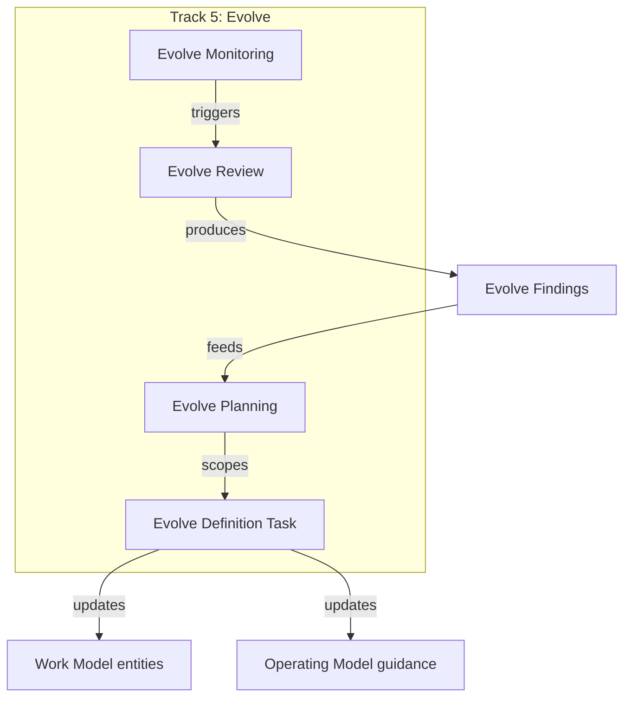

# Track 5: Evolve and Artifact Type Catalog

## Context

The Work Model currently has 4 tracks (Discovery, Build, Run, Win). Discussion established that the model must account for its own evolution --- a model that cannot evolve is dead. Process evolution work has goals, work types, artifacts, participants, and a lifecycle, so it qualifies as a full track, not a "bridge document." It connects the Work Model and Operating Model by being the only track whose outputs directly mutate both models.

Separately, the artifact taxonomy in `draft-work-execution-framework.md` has 5 top-level categories (Decision, Evidence, Specification, Delivery, Assessment) but no named subtypes or assessment criteria per type. The user wants a richer catalog with named artifact types per track and assessment criteria fields.

---

## Part A: Track 5 --- Evolve (Process Evolution)

### Track Definition

- **Name:** Track 5: Evolve (Process Evolution)
- **Goal:** Continuously assess, define, and refine the Work Model and Operating Model --- work entity definitions, artifact type definitions, DoD criteria, guidance structures, and organizational practices.
- **Primary Owner:** Process Leads, Product Ops, Engineering Managers.
- **Bridge characteristic:** The only track whose outputs directly modify both the Work Model (entity/artifact definitions) and the Operating Model (guidance content, ceremonies, roles).

### Track 5 Entity Types




1. **Evolve Planning** --- Work to plan evolution cycles: which processes to review, which artifact types to define/refine, which guidance to develop. Aligns to strategic or operational improvement objectives.
2. **Evolve Review** --- Structured assessment of current process effectiveness, artifact quality, and guidance adequacy. Reviews produce **Evolve Findings** (the track's transitional artifact, analogous to Feedback in Track 4). Types: Process Effectiveness Review, Artifact Quality Review, Guidance Adequacy Review, Cross-Track Handoff Review.
3. **Evolve Definition Task** --- Work to create or update: (a) Work Model entity definitions (fields, statuses, relationships), (b) artifact type definitions and assessment criteria, (c) DoD criteria, (d) Operating Model guidance structures (playbooks, ceremony definitions, role descriptions). This is the core meta-work entity.
4. **Evolve Monitoring** --- Continuous tracking of process adherence, artifact quality trends, DoD compliance rates, and guidance usage. Triggers Evolve Review when thresholds are breached.

**Transitional Artifact:**

- **Evolve Findings** --- Structured observations from Evolve Reviews. Born in Track 5; consumed by Track 5 (Evolve Definition Task) or by Discovery Track when a process gap reveals a product-level Signal. Analogous to Feedback (Track 4 -> Track 1).

### Files to Create (Track 5 entities)

All under `entities/work-model/`:

- `track5-evolve-planning.md`
- `track5-evolve-review.md`
- `track5-evolve-definition-task.md`
- `track5-evolve-monitoring.md`
- `track5-evolve-findings.md` (transitional artifact)

### Files to Modify (Track 5 integration)

- [draft-work-model.md](org-8.0/product-information-model/draft-work-model.md) --- Add Track 5 section (parallel structure to Tracks 1-4), update header from "4 Tracks" to "5 Tracks", update Scope Boundary Note
- [README.md](org-8.0/product-information-model/README.md) --- Update Work Model table (add Track 5 row), update ASCII diagram ("5 Tracks"), update `draft-work-execution-framework.md` reference
- [entities/README.md](org-8.0/product-information-model/entities/README.md) --- Add Track 5 entity listings in directory structure and naming convention
- [draft-work-execution-framework.md](org-8.0/product-information-model/draft-work-execution-framework.md) --- Add Track 5 artifact inventory row, update iterative detailing plan (add Phase 5 for Evolve Track, renumber cross-track integration to Phase 6)

---

## Part B: Richer Artifact Type Catalog

### Current State

The artifact taxonomy in [draft-work-execution-framework.md](org-8.0/product-information-model/draft-work-execution-framework.md) Section 1 defines 5 categories with examples but no named subtypes or assessment criteria.

### Target State

Add a new **Section 1b: Artifact Type Catalog** after the existing Section 1, structured as:

- Each category has **named types per track**
- Each named type has: Name, Track, Description, Assessment Criteria (what makes a good instance of this artifact)
- Assessment criteria cover both universal aspects (template adherence, review status) and type-specific aspects (e.g., for Decision artifacts: rationale completeness, alternative consideration; for Delivery artifacts: vulnerability scan, peer review, test coverage)

### Catalog Structure (template)

```markdown
### Decision Artifacts

| Type | Track | Description | Assessment Criteria |
|---|---|---|---|
| PDR | Discovery | Product Decision Record... | Rationale includes alternatives considered; consequences stated; stakeholders acknowledged |
| Prioritization Rationale | Discovery | Ranked signal list... | Scoring criteria transparent; all active Signals considered; association decisions justified |
| Win/Loss Analysis Finding | Win | Post-deal analysis... | Both win and loss factors identified; product vs. non-product attribution; actionable patterns |
| ... | ... | ... | ... |
```

### Scope

- Introduce the catalog structure and populate it with all artifact types already identified in the Cross-Track Artifact Inventory (Section 2)
- Assessment criteria will be initial/skeletal --- the user acknowledged iterative detailing
- Track 5 artifacts will be included

### Files to Modify (Artifact Catalog)

- [draft-work-execution-framework.md](org-8.0/product-information-model/draft-work-execution-framework.md) --- Add Section 1b with the full catalog

---

## Part C: Supporting Documentation

### Decision Record

- Create `decisions/DR-022-track5-evolve-and-artifact-catalog.md` covering:
  - D1: Process evolution as Track 5 (not a bridge document or per-track addition)
  - D2: Four entity types + one transitional artifact
  - D3: Artifact type catalog with per-type assessment criteria
  - D4: Track 5 as the bridge between Work Model and Operating Model

### Narrative Seeds

- [narrative-seeds.md](org-8.0/product-information-model/narrative-seeds.md) --- Add new session covering:
  - A model must account for its own evolution
  - Process Evolution is foundational work, not overhead
  - Track vs. bridge: if it has goals, entities, artifacts, and a lifecycle, it is a track
  - Evolve Findings as transitional artifact (parallel to Feedback)
  - Artifact assessment criteria belong in the Work Model (what good looks like), not the Operating Model (how to achieve it)

### Modeling FAQs

- [draft-modeling-faqs.md](org-8.0/product-information-model/draft-modeling-faqs.md) --- Add Q62-Q65:
  - Q62: Why a dedicated Evolve Track instead of per-track evolution entities?
  - Q63: Why is Track 5 called "Evolve" and not "Process" or "Improve"?
  - Q64: How does the Evolve Track connect Work Model and Operating Model?
  - Q65: Why assessment criteria on artifact types rather than just DoD?

### Decisions Index

- [decisions/README.md](org-8.0/product-information-model/decisions/README.md) --- Add DR-022 row

---

## Summary of All Changes

**New files (6):**

- `entities/work-model/track5-evolve-planning.md`
- `entities/work-model/track5-evolve-review.md`
- `entities/work-model/track5-evolve-definition-task.md`
- `entities/work-model/track5-evolve-monitoring.md`
- `entities/work-model/track5-evolve-findings.md`
- `decisions/DR-022-track5-evolve-and-artifact-catalog.md`

**Modified files (7):**

- `draft-work-model.md`
- `README.md`
- `entities/README.md`
- `draft-work-execution-framework.md`
- `narrative-seeds.md`
- `draft-modeling-faqs.md`
- `decisions/README.md`

