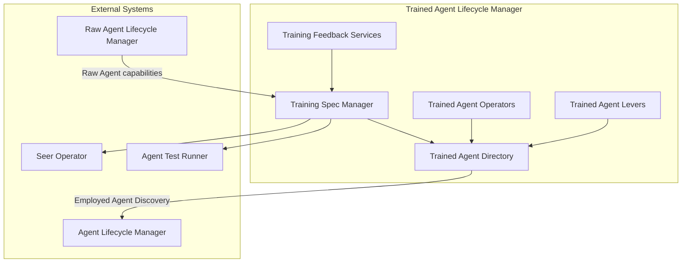
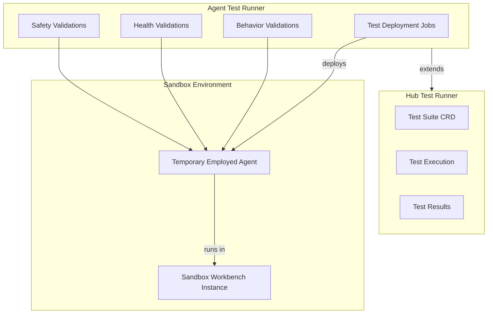

# Trained Agent Lifecycle Manager & Agent Test Runner Detailed Design

Create comprehensive C2-level design documentation for two subsystems: **Trained Agent Lifecycle Manager** and **Agent Test Runner**. Follow the patterns established by the [Seer Sidecar design](.cursor/plans/seer_sidecar_detailed_design_cc77614a.plan.md) and [Raw Agent Subsystems design](.cursor/plans/raw_agent_subsystems_design_0cdeffd5.plan.md).

## Subsystem 1: Trained Agent Lifecycle Manager

Follow the same sub-component pattern as Raw Agent Lifecycle Manager, with parallel structure:

### Sub-Components

| Component | Description | Key Capabilities |

|-----------|-------------|------------------|

| **Training Spec Manager** | Training Spec CRD structure, validation rules, Raw Agent compatibility | Spec structure, validation, immutability enforcement (guardrails) |

| **Trained Agent Directory** | Registry, search, Employed Agents Discovery | Search by capabilities, version tracking, dependency queries |

| **Trained Agent Operators** | Lifecycle management via Seer Operator | Registration, validation, versioning, state transitions |

| **Trained Agent Levers** | Publication controls, version management | Publish/unpublish, deprecation, version freeze (affects derived Employed Agents) |

| **Training Feedback Services** | Feedback collection and routing | COS/Developer feedback, APO/PA feedback, team feedback on improvements |

### Key Design Decisions

- **Guardrail Immutability**: Training Spec guardrails are immutable once published (cannot be relaxed at Employment)
- **Raw Agent Integration**: Training Specs reference Raw Agents; Raw Agent capabilities constrain Training Spec options
- **Seer Operator Boundary**: TALM is business logic; Seer Operator reconciles CRDs to Kubernetes state
- **Employed Agent Discovery**: Query capability in Directory (not separate service)

### Files to Create

| File | Description |

|------|-------------|

| [`trained-agent-lifecycle-manager/training-spec-manager.md`](olympus-seer-docs/seer-design/subsystems/trained-agent-lifecycle-manager/training-spec-manager.md) | Spec structure, validation, Raw Agent compatibility |

| [`trained-agent-lifecycle-manager/trained-agent-directory.md`](olympus-seer-docs/seer-design/subsystems/trained-agent-lifecycle-manager/trained-agent-directory.md) | Registry, search, Employed Agent discovery |

| [`trained-agent-lifecycle-manager/trained-agent-operators.md`](olympus-seer-docs/seer-design/subsystems/trained-agent-lifecycle-manager/trained-agent-operators.md) | Lifecycle management, state transitions |

| [`trained-agent-lifecycle-manager/trained-agent-levers.md`](olympus-seer-docs/seer-design/subsystems/trained-agent-lifecycle-manager/trained-agent-levers.md) | Publication controls, deprecation |

| [`trained-agent-lifecycle-manager/training-feedback-services.md`](olympus-seer-docs/seer-design/subsystems/trained-agent-lifecycle-manager/training-feedback-services.md) | Feedback collection from COS, Developer, APO/PA, team |

| [`trained-agent-lifecycle-manager/SCOPE.md`](olympus-seer-docs/seer-design/subsystems/trained-agent-lifecycle-manager/SCOPE.md) | Coverage summary, design status |

---

## Subsystem 2: Agent Test Runner

Extends Hub Test Runner with agent-specific testing capabilities for temporary Employed Agent deployments in sandbox workbench instances.

### MVP Scope (Validations)

| Validation Type | Description | Go/No-Go Check |

|-----------------|-------------|----------------|

| **Behavior Consistency** | Agent responds consistently to same inputs | Pass/Fail |

| **Behavior Quality** | Basic output quality checks (completeness, format) | Pass/Fail |

| **Health** | Pod health, model connectivity, memory stability | Pass/Fail |

| **Safety** | Guardrail enforcement, prohibited actions blocked | Pass/Fail |

### Parked Scope (Evaluations) - Deferred per ADR-0077

- Quality scoring and benchmarks
- Regression testing across versions
- Adversarial testing
- CI/CD quality gates

### Key Design Decisions

- **Temporary Deployment Model**: Creates temporary Employment Spec + deploys in sandbox workbench
- **Extends Hub Test Runner**: Adds agent-specific Test CRD types and assertions
- **Sandbox Isolation**: All tests run in sandbox workbench instances with isolated data

### Files to Create

| File | Description |

|------|-------------|

| [`agent-test-runner/test-deployment-jobs.md`](olympus-seer-docs/seer-design/subsystems/agent-test-runner/test-deployment-jobs.md) | Temporary Employed Agent deployment for testing |

| [`agent-test-runner/behavior-validations.md`](olympus-seer-docs/seer-design/subsystems/agent-test-runner/behavior-validations.md) | Consistency and quality validations |

| [`agent-test-runner/health-validations.md`](olympus-seer-docs/seer-design/subsystems/agent-test-runner/health-validations.md) | Pod health, connectivity, stability checks |

| [`agent-test-runner/safety-validations.md`](olympus-seer-docs/seer-design/subsystems/agent-test-runner/safety-validations.md) | Guardrail enforcement validation |

| [`agent-test-runner/SCOPE.md`](olympus-seer-docs/seer-design/subsystems/agent-test-runner/SCOPE.md) | Coverage summary, MVP vs parked scope |

---

## Integration Points

### Trained Agent Lifecycle Manager

| Integration | Direction | Purpose |

|-------------|-----------|---------|

| Raw Agent Lifecycle Manager | Inbound | Raw Agent capabilities constrain Training Spec |

| Agent Lifecycle Manager | Outbound | Employed Agent Discovery queries |

| Seer Operator | Outbound | CRD reconciliation |

| Agent Test Runner | Outbound | Training Spec validation testing |

| Context Compiler | Outbound | Retriever configurations in Training Spec |

### Agent Test Runner

| Integration | Direction | Purpose |

|-------------|-----------|---------|

| Hub Test Runner | Extends | Test Suite CRD, execution framework |

| Trained Agent Lifecycle Manager | Inbound | Training Spec for test deployment |

| Agent Runtime | Outbound | Temporary Employed Agent deployment |

| Sandbox Workbench | Outbound | Test execution environment |

---

## Implementation Details Deferred

Following the pattern from other subsystem designs:

- Detailed CRD schemas
- Complete API specifications (REST/gRPC endpoints)
- Storage backends and indexing strategies
- Specific algorithm implementations
- Error code taxonomies
- Wire format details