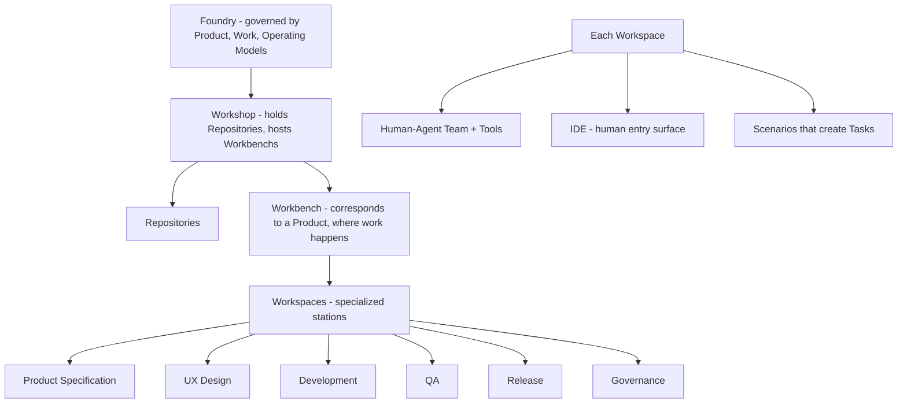

# ACE — Agent-Centric Engineering

**For the Engineers, By the Engineers.**

ACE is an agent-centric product development system. It exists because employing AI agents *effectively* in a real software organization requires more than tools: it requires a shared understanding of what the product is, what work exists, and how the organization runs — and an environment that turns those models into reliable delivery.

This folder is the entry point for the ACE theory. [UPIM](../product-information-model/README.md) gives ACE formal information structure; the [Foundry Platform](../foundry-platform/README.md) delivers ACE and UPIM capabilities; [Engagement Engineering](../engagement-engineering/README.md) extends ACE for client delivery.

## What ACE is, in one paragraph

ACE asserts that effective use of agents in software engineering depends on three governing models — a Product Model that says what we are building, a Work Model that says what work exists and how it transitions, and an Operating Model that says how the organization runs the work. These three models supply *meaning*. ACE then supplies *structure and motion*: a Foundry hosts Workshops; each Workshop is the body of work owned by a team or organization and hosts Workbenchs; each Workbench corresponds to a Product in UPIM and is the venue where that Product is evolved through specialized Workspaces in which Human–Agent Teams act on Scenarios that create Tasks. Across all of this flows Product Intent — the thread that turns intent into delivered software. Every transition of intent triggers governance. The result is a system that behaves like an assembly line for product evolution, with agents as members of the workforce rather than tools attached to it.

## Foundry vs Foundry Platform

Two senses of the word "Foundry" appear across these documents.

- **Foundry (concept).** The architectural construct described in [ace-model.md](ace-model.md): the place where software products are crafted, governed by Product, Work, and Operating models. A Foundry is owned by an Organization; an Organization may have one or more Foundries.
- **Foundry Platform.** The implementation being engineered — the software that delivers ACE and UPIM capabilities (modules, deployment, security, observability, CI, and UPIM-backed data). Always written capitalized in our docs to avoid collision.

When in doubt, see [../glossary.md](../glossary.md).

## Containment hierarchy

The same containment, in prose: a **Foundry** hosts multiple **Workshops**. A Workshop holds multiple **Repositories** and hosts multiple **Workbenchs**. A **Workbench** corresponds to a Product in UPIM — it is the venue where that Product is evolved; it contains multiple **Workspaces**, one per functional team. Each Workspace has a **Human–Agent Team and tools**, is interfaced by humans through an **IDE**, owns well-defined **Scenarios**, and produces **Tasks** completed by its team. Workspaces use and update the workshop's repositories. See [ace-model.md](ace-model.md) for the source.

## The six workspace types

| Workspace | Role |
|---|---|
| Product Specification | Translates Product Intent into specifications. |
| UX Design | Designs user experience for specified intent. |
| Development | Builds the specified solution. |
| QA | Verifies and validates what is built. |
| Release | Manages and produces Product Delivery. |
| Governance | Validates every transition of Product Intent. |

Per-workspace detail lives in [workspaces/](workspaces/README.md).

## The Product Evolution Cycle

Product Intent is the thread that moves through the workspaces from idea to delivery:

1. **A Product Intent is published from Release Workspace.** Direction, evidence, and lessons from the previous cycle are gathered into the Product Intent for the next.
2. **Product Specification Workspace translates the Product Intent to a Product Specification document.** This is where intent becomes the formal specification of what to build.
3. **Product Specification Workspace and UX Design Workspace exchange the Product Intent back and forth.** The specification and the user experience evolve together until both converge.
4. **Development Workspace and QA Workspace begin work on the Product Intent in parallel.** Once the Product Specification document is ready, Development Workspace starts building while QA Workspace prepares verification — both begin at the same time.
5. **Development Workspace passes built artifacts to QA Workspace.** QA Workspace verifies the build against the Product Specification document.
6. **QA Workspace passes verified work to Release Workspace as Product Delivery.** Release Workspace packages and ships the verified product.
7. **Product Intent can return to Product Specification Workspace.** If Development Workspace or QA Workspace finds that the specification must change, the Product Intent returns to Product Specification Workspace for revision.
8. **Governance Workspace runs Scenarios on every transition above.** It validates each transition — preconditions met, policy applied, evidence captured.

Detail in [product-evolution-cycle.md](product-evolution-cycle.md). Governance treatment in [governance.md](governance.md).

## How ACE relates to UPIM

ACE names three governing models. **UPIM is a concretization layer of ACE** — it gives those three models formal information structure (entities, dimensions, tracks, lifecycles) so the things ACE moves around have shape. UPIM also stands on its own: an organization could adopt UPIM without adopting ACE. UPIM is one concretization, not the only or final one — it can be further specialized for specific products.

| ACE model | UPIM layer | What it answers |
|---|---|---|
| Product Model | Definition Model (with strategy & intent dimensions) | What the product is and is aiming at. |
| Work Model | Work Model (5 tracks: Discovery, Build, Run, Win, Evolve) | What work exists and how it transitions. |
| Operating Model | Operating Model (coordination + organization) | How the org executes the work. |

ACE adds workspaces, IDE-mediated entry, scenarios, tasks, intent routing, and governance — concerns UPIM does not address. UPIM gives entities and lifecycles to the repositories and workforces that ACE operates on. Detailed mapping in [relationships.md](relationships.md).

## How ACE relates to the Foundry Platform

ACE is the system of practice. The **Foundry Platform** is the software that **delivers ACE and UPIM capabilities**: workshops, repositories, workspace runtimes, IDE integrations, intent routing, governance hooks, observability, and CI — together with the storage and mutation of UPIM-defined entities. Builders working on the platform should treat the docs in this folder as the *requirements grammar* — not a specification, but the meaning the platform must preserve. See [../foundry-platform/README.md](../foundry-platform/README.md).

## How ACE relates to Engagement Engineering

ACE describes intra-organization product development. When software is delivered to a client — multi-tenant, program-managed, with customer-side feedback channels and evidence requirements — an extension is needed. **Engagement is modeled as a Workshop**; each Product Zeta builds for that client is evolved in a **Workbench** inside it. The vocabulary that handles Products spanning multiple Workshops (Home Workshop, Home Workbench, Engagement Workbench, Contributing Workbench) is defined in [../engagement-engineering/extension-to-ace.md](../engagement-engineering/extension-to-ace.md). **Engagement Engineering** is documented in [../engagement-engineering/](../engagement-engineering/README.md) and the explicit extension argument in [../engagement-engineering/extension-to-ace.md](../engagement-engineering/extension-to-ace.md).

## What this folder contains

| File | Purpose |
|---|---|
| [ace-model.md](ace-model.md) | The original, terse formal model — the source of truth for the bullet structure. |
| [why.md](why.md) | The motivation for ACE: why models alone are insufficient, why agents need an environment. |
| [objectives.md](objectives.md) | What ACE aims to achieve, and explicit non-goals. |
| [concepts.md](concepts.md) | The formal model in narrative form, with cross-references to UPIM and the engagement extension. |
| [product-evolution-cycle.md](product-evolution-cycle.md) | The intent flow in detail, with diagrams. |
| [governance.md](governance.md) | Governance Workspace and the rule that every transition invokes governance scenarios. |
| [workspaces/](workspaces/README.md) | One short doc per workspace type. |
| [relationships.md](relationships.md) | ACE ↔ UPIM ↔ Foundry Platform mapping. |
| [repositories.md](repositories.md) | Canonical UPIM-aligned repository inventory. |
| [illustrations/](illustrations/README.md) | Illustration prompts and rendered frames. |
| [references/](references/README.md) | SE 3.0 framing and reading list (currently stubs). |

## Read next

- New to ACE? Start with [why.md](why.md), then [concepts.md](concepts.md), then [product-evolution-cycle.md](product-evolution-cycle.md).
- Building a platform module? Start with [concepts.md](concepts.md), then [repositories.md](repositories.md), then [relationships.md](relationships.md).
- Working with a customer engagement? Read this README, then jump to [../engagement-engineering/extension-to-ace.md](../engagement-engineering/extension-to-ace.md).
