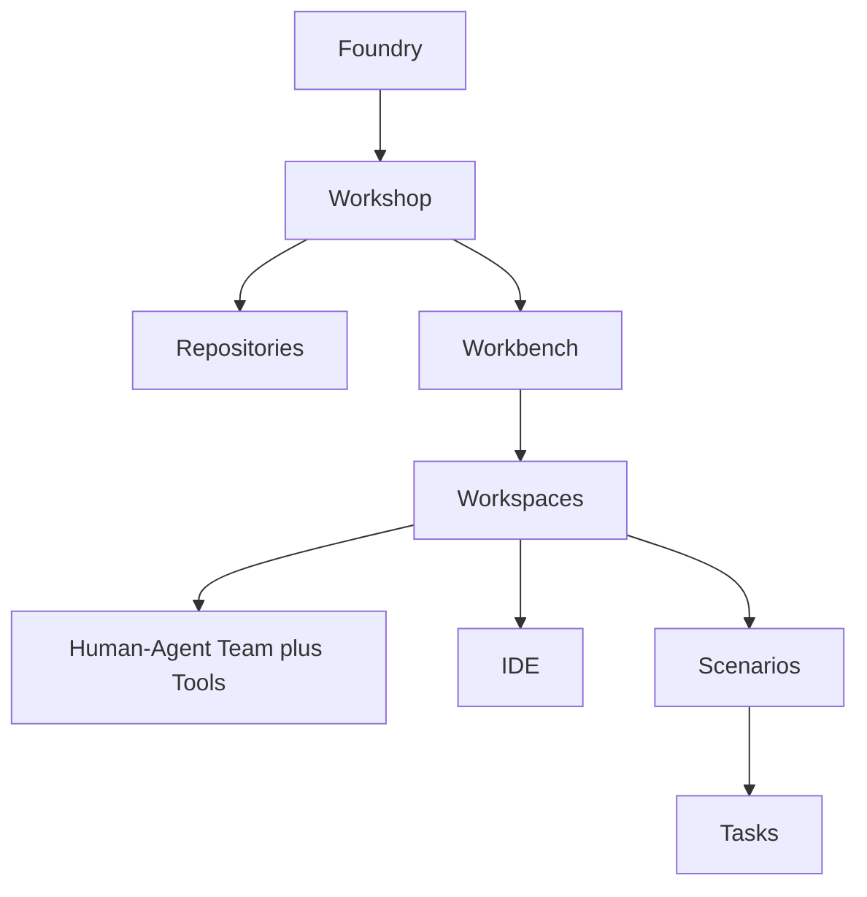

# ACE Concepts

This document is the formal model of ACE in narrative form. It is built directly from [ace-model.md](ace-model.md) and the conceptual notes in [../1.TODO](../1.TODO), with cross-references to UPIM and the engagement extension where relevant. Where this document and `ace-model.md` differ, `ace-model.md` is the source of truth for the concepts; this document is the readable elaboration.

## Containment hierarchy

> **Naming convention.** The structural entities above — Foundry, Workshop, Workbench, Workspace — do not use "Project" in their names. In ACE, "Project" is reserved for **time-bound collections of work items** with a specific goal (e.g., a migration project). This is why the former "Workshop Project" was renamed to **Workbench**. See [../glossary.md](../glossary.md) for the full convention.

## Foundry

A **Foundry** is the place where software products are crafted. It is the architectural construct named in [ace-model.md](ace-model.md) line 6.

A Foundry is governed by three models:

- **Product Model** — what the product is and where it is going.
- **Work Model** — what work exists; entities, artifacts, state transitions.
- **Operating Model** — how the organization runs the work; coordination and organization.

These three are the foundational claim of ACE: that effective use of agents at scale requires all three to be explicit and shared. Their **formal information articulation** is provided by [UPIM](../product-information-model/README.md) — a concretization layer of ACE that gives entities, dimensions, tracks, and lifecycles to what ACE governs. UPIM can also stand independently of ACE; ACE references UPIM rather than embedding it. UPIM is not the most concrete form of that information: it can be further specialized for specific products. See [relationships.md](relationships.md) for the mapping.

A Foundry **hosts multiple Workshops**.

> **Multiple Foundries.** An Organization typically owns one or more Foundries. The reference model accommodates this without privileging the single-Foundry case. Source: [../1.TODO](../1.TODO) line 21. Foundry is a software-product manufacturing construct; how operating-model entities are realized in production operations is a separate concern (see [../engagement-engineering/extension-to-ace.md](../engagement-engineering/extension-to-ace.md) for the engagement / Estate boundary only).

## Workshop

A **Workshop** is the body of work owned by a product team, product suite, or organization inside a Foundry — not a single Product. A Workshop:

- has multiple **Repositories**;
- hosts multiple **Workbenches**.

The repositories represent the workshop's accumulated state — what it knows (Knowledge), how it works (Skills/Practitioner), what it produces (Artifacts), and what it remembers (History). The repository taxonomy is part of ACE itself, with two levels of detail in this folder. The seed list in [ace-model.md](ace-model.md) lines 16-28 enumerates 12 types: Domain Knowledge, Practitioner, Skill, Product Intent, Product Ontology, Design, Product Evolution, Feedback, Source, Artifact, Quality & Verification, Work, and Workforce. The canonical conceptual specification expands these into 15 entries (with PFR sub-partitions) and gives codes (PIR, DKB, DAR, POR, CAR, QVS, OPR, PFR, PPR, WR, WFR, ESR, PEIR) along with UPIM dimension/track alignment — see [repositories.md](repositories.md). Both documents are ACE-native; UPIM provides alignment, not derivation.

> **Repository scope.** Some repositories are **Foundry-scoped** (e.g. WFR — the Workforce Repository), shared across all workshops in a Foundry. Others are **Workshop-scoped**. The distinction matters for storage, access control, and replication. Source: [../1.TODO](../1.TODO) line 9.

> **Engagement extension.** For client delivery, an **Engagement is a Workshop** (e.g. a Bank-X Engagement is a Workshop named for that client). Each Product Zeta builds for that client corresponds to a **Workbench** inside that Workshop. **Home Workshop**, **Home Workbench**, **Engagement Workbench**, and **Contributing Workbench** are defined in [../engagement-engineering/extension-to-ace.md](../engagement-engineering/extension-to-ace.md).

## Workbench

A **Workbench** corresponds to a **Product** in UPIM: it is the venue — the locus — where that Product is evolved through workspaces and scenarios; it is **not** the Product itself. It contains multiple **Workspaces**, each owned by a distinct functional team.

A Workbench is the unit at which most operational metrics are captured: KPIs (Say/Do, Cost per Story Point, Velocity, Quality), agent efficiency and effectiveness, scenarios and tasks management, project-level reporting and analytics. Source: [../foundry-platform/platform.TODO](../foundry-platform/platform.TODO) lines 14-17.

> **Engagement Workshop.** Inside an Engagement Workshop, each Product under delivery is evolved in an **Engagement Workbench**. A **Contributing Workbench** is an Engagement Workbench that references a **Home Workbench** elsewhere; standalone engagement-specific Products exist only as Engagement Workbenches whose Home Workshop is the Engagement Workshop itself. Full treatment: [../engagement-engineering/extension-to-ace.md](../engagement-engineering/extension-to-ace.md).

## Workspace

A **Workspace** is a specialized station inside a Workbench, owned by a single functional team. Each Workspace:

- has a **Human–Agent Team** and tools;
- is interfaced by humans through an **IDE**;
- has well-defined **Scenarios**;
- creates **Tasks** from scenarios;
- has those tasks completed by its Human–Agent Team;
- uses and updates the workshop's repositories.

Source: [ace-model.md](ace-model.md) lines 42-48.

### The six workspace types

ACE defines six workspace types, each owning a distinct concern:

| Workspace | Concern |
|---|---|
| **Product Specification** | Refine Product Intent into PSDs and specification artifacts. |
| **UX Design** | Design the user experience for specified intent. |
| **Development** | Build the specified solution. |
| **QA** (Quality Assurance) | Verify and validate what is built. |
| **Release** | Manage and produce Product Delivery. |
| **Governance** | Validate every transition of Product Intent. |

Per-workspace detail is in [workspaces/](workspaces/README.md).

### Human–Agent Team

A workspace's team is composed of human practitioners and AI agents working on the same scenarios and tasks. Both kinds of participants are members of the Workforce; both have role bindings, skills, availability, and governance recorded in the Workforce Repository. Agents are not a layer added to a human team; they are members of it. Source: [ace-model.md](ace-model.md) line 43; UPIM repository description for WFR in [repositories.md](repositories.md).

### IDE

The IDE is the human's entry surface into a Workspace. ACE treats each Workspace as having its own IDE context — meaning the same human can step into different Workspaces and find different views, plugins, repository bindings, and behaviors. The IDE per workspace is specified by ACE; the concrete realization in Zeta tooling is **Olympus Rocket** with Workshop-driven profiles, sitting inside an **Olympus Workspace** (one or more per Workshop). The Workshop also presents itself as an **Olympus Hub Workbench** view. Source: [../engagement-engineering/tenant-developer-tooling/TD.TODO](../engagement-engineering/tenant-developer-tooling/TD.TODO).

### Scenarios and Tasks

A **Scenario** is a well-defined situation a Workspace is set up to handle. When a scenario triggers, it creates one or more **Tasks**. Tasks are the unit of work completed by the Human–Agent Team.

Scenarios are not free-form prompts. They are defined entities, with inputs, expected outcomes, and the workspace they belong to. The Foundry Platform engineers scenario and task management explicitly. Source: [../foundry-platform/platform.TODO](../foundry-platform/platform.TODO) line 17.

## Repositories

Repositories are how a Workshop persists what it knows, what it produces, and what it remembers. The conceptual repository list in [ace-model.md](ace-model.md) names the types in plain terms; the canonical inventory in [repositories.md](repositories.md) gives codes and UPIM dimension/track mappings.

For executive narrative — including the four-frame illustrations in [illustrations/](illustrations/README.md) — repositories are clustered into four themes:

- **Knowledge** — domain facts, ontology, standards.
- **Skills** — practitioner-grade methods and playbooks.
- **Artifacts** — outputs the workshop produces (specs, designs, code, tests).
- **History** — decisions, feedback, evolution, audit trail.

These four are presentation clusters, not a substitute for the formal taxonomy. The mapping between presentation clusters and the formal repository codes is straightforward: Domain Knowledge and Product Ontology fall under Knowledge; Practitioner and Skill under Skills; Source, Artifact, Design, Product Intent under Artifacts; Work, Feedback, Product Evolution, Workforce, Quality & Verification under History (because they record what happened, what was decided, who did it, and what was verified).

## Product Intent

**Product Intent** is the hybrid bridge entity that flows through the workspaces. It is definition-bearing, work-triggering, and ACE-routable: Discovery and product decisions establish or update it in the Product Intent Repository, Product Specification refines it through PSDs, and Release renews it for the next cycle. Product Intent is not a ticket and not a PSD; it is the decision-to-evolution carrier that Workspaces act on. The full flow is detailed in [product-evolution-cycle.md](product-evolution-cycle.md).

Product Intent items are owned. In the engagement view, the Engagement Workshop owns Product Intent items at the umbrella level — program-managed consolidation of intent for one or more Products (each evolved in its Workbench). Source: [../1.TODO](../1.TODO) line 11.

## Governance Workspace

The **Governance Workspace** is the workspace whose Scenarios are invoked on **every transition** of Product Intent. It does not own the work being transitioned; it owns the discipline of the handoff itself. See [governance.md](governance.md) for detail.

## Three governing models, restated

The Product, Work, and Operating Models are the substrate ACE depends on. They are not workspace types and they are not repositories — they are the *grammar* in which workspaces, scenarios, tasks, and repositories make sense. UPIM is the formal articulation of these three at Zeta; ACE consumes them.

> **Terminology note.** Earlier drafts of ACE referred to the third model as the "Org Model". This name is deprecated because it implied roles-and-team-structures only and omitted coordination (ceremonies, cadences, decision rhythms). The replacement is **Operating Model**, consistent with UPIM. See [../glossary.md](../glossary.md).

## What this document does not cover

- **The detailed flow of Product Intent.** That is in [product-evolution-cycle.md](product-evolution-cycle.md).
- **The detailed governance discipline.** That is in [governance.md](governance.md).
- **The mapping to UPIM and to the Foundry Platform.** That is in [relationships.md](relationships.md).
- **The engagement extension** (Engagement as Workshop, Workbench ↔ Product, Home Workbench, Contributing Workbench, Estate boundary). That is in [../engagement-engineering/extension-to-ace.md](../engagement-engineering/extension-to-ace.md).
- **Production operations / runtime deployment ontology.** Out of scope of this folder; the **Estate** boundary appears only where Engagement Engineering hands off to production operations. See [../engagement-engineering/extension-to-ace.md](../engagement-engineering/extension-to-ace.md).
