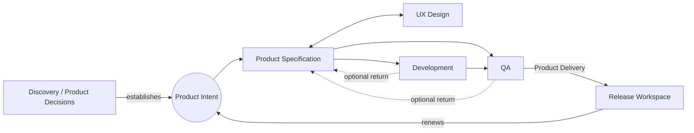

# Product Evolution Cycle

The Product Evolution Cycle is the path along which **Product Intent** moves through the six workspaces. It is the dynamic counterpart to the static structure described in [concepts.md](concepts.md). The flow is the source of truth for how work proceeds in any Workbench; deviations are not optional flavor — they are events for the [Governance Workspace](governance.md) to validate.

The cycle is named in [ace-model.md](ace-model.md) lines 51-58. This document elaborates it and clarifies the Product Intent provenance now captured in UPIM.

## The flow

In words:

1. **Discovery and product decisions establish Product Intent.** Signals, Ideas, and PDRs crystallize into Product Intent — the committed evolution thread that should enter workspace execution.
2. **Product Specification triggers on intent.** Intent arriving at Specification triggers Scenarios in the Specification Workspace; PSDs and related specification artifacts refine the Product Intent.
3. **Specification ↔ UX Design.** Intent moves between Specification and UX Design as specifications and the user experience co-evolve. The relationship is bidirectional by construction; either workspace may pull intent from the other.
4. **Specification → Development and QA in parallel.** Once specifications are ready, intent fans out to both Development and QA simultaneously. QA is not a downstream stage — it is a parallel workspace that picks up intent at the same time Development does.
5. **Development → QA.** Built artifacts move from Development to QA for verification and validation.
6. **QA → Release as Product Delivery.** Verified intent reaches Release, where it becomes Product Delivery — the deliverable form of intent that closes the cycle.
7. **Optional return to Specification.** From Development or QA, intent may return to Specification when learnings demand revision of what was specified. The arrow exists by design; the cycle does not assume work always proceeds forward.

## The role of each workspace

| Workspace | Role in the cycle |
|---|---|
| **Release** | Receives Product Delivery at cycle end; renews Product Intent for the next cycle. |
| **Product Specification** | Refines Product Intent into PSDs and specification artifacts; co-evolves with UX Design. |
| **UX Design** | Designs experience for specified intent; works with Specification bidirectionally. |
| **Development** | Builds the specified solution; sends artifacts to QA; may return intent to Specification. |
| **QA** | Verifies and validates built artifacts; releases verified intent to Release; may return intent to Specification. |
| **Governance** | Validates every transition of intent across the workspaces above (see [governance.md](governance.md)). |

## Key properties of the flow

### Intent is the bridge asset

The thing that moves is **Product Intent** — not a ticket, not a PSD, not an artifact alone, not a deliverable. Tickets, artifacts, PSDs, and deliverables are evidence or refinements of intent at various stages; intent itself is the hybrid bridge entity with provenance, ownership, lifecycle state, and a path. The repository inventory in [repositories.md](repositories.md) provides the Product Intent Repository (PIR) as the canonical store.

### Parallel, not sequential, between Specification and Dev/QA

Intent moves from Specification to Development **and** to QA at the same time. This parallelism is intentional: QA participates from the moment specifications are available, not when Development hands off built artifacts. The Development → QA edge is for the artifacts; the Specification → QA edge is for the intent. Modeling these as one sequential edge would lose information.

### Bidirectional Specification ↔ UX

Specification and UX Design have a co-evolving relationship. Either can hold intent, push it to the other, and pull it back. This is the only bidirectional pair in the base flow; treating it as bidirectional is necessary because design and specification rarely converge in one direction.

### Optional return is a property, not an exception

Returning intent from Development or QA to Specification is a **defined edge in the cycle**, not a deviation. A Workbench where intent never returns to Specification is one where downstream learnings have not been used; that may be by design or it may be a problem, but the path is provided either way.

### The cycle closes at Release

The cycle is *cyclic* in the sense that Release consumes Product Delivery and can **renew** Product Intent for a subsequent iteration. One pass through the cycle does not exhaust it. Greenfield intent still originates from Discovery and product decisions; Release renewal incorporates delivery evidence, feedback, and learnings into the next cycle.

## Governance on transitions

Every edge in the diagram above is a **transition**. Every transition invokes Scenarios in the Governance Workspace. This is not stage-gating; it is the assertion that handoffs are first-class, observable events that carry validation responsibility. The governance treatment is in [governance.md](governance.md).

The implication for the Foundry Platform is that intent routing and governance hooks are not separable concerns. A platform that routes intent without invoking governance has implemented half of the cycle. Source: [ace-model.md](ace-model.md) line 62; [../foundry-platform/platform.TODO](../foundry-platform/platform.TODO) line 14 ("Move Product Intent across Workspaces").

## How the cycle relates to UPIM tracks

UPIM organizes work into five tracks: Discovery, Build, Run, Win, Evolve. Discovery establishes Product Intent from product decisions. The cycle described here is concentrated in **Build** after that handoff (Specification → UX → Development → QA → Release), with Win and operational feedback informing Release renewal. Run (deployment, incidents) is handled outside the workspaces in this folder — see the engagement and Estate notes in [../engagement-engineering/extension-to-ace.md](../engagement-engineering/extension-to-ace.md). Evolve is a cross-cutting track that mutates the model itself; it is not on the cycle but it can produce or change intent.

The mapping is sketched here so readers do not assume the cycle and the tracks are the same thing. Detailed mapping is in [relationships.md](relationships.md).

## Implementation expectations

For the Foundry Platform, this cycle implies:

- A first-class **Product Intent** entity, definition-bearing, work-triggering, routable across workspaces, and observable in the Product Intent Repository (PIR).
- **Per-workspace scenarios** that can be triggered by intent arrival.
- **Governance hooks** on every workspace-to-workspace transition.
- **Bidirectional and parallel routing** as built-in capabilities — not modeled as exceptions to a sequential pipeline.
- **Optional return paths** as defined operations, not retries or rollbacks.

These expectations are captured under "Workbench Engineering" in [../foundry-platform/platform.TODO](../foundry-platform/platform.TODO) and detailed further in module specifications under [../foundry-platform/](../foundry-platform/README.md) over time.
