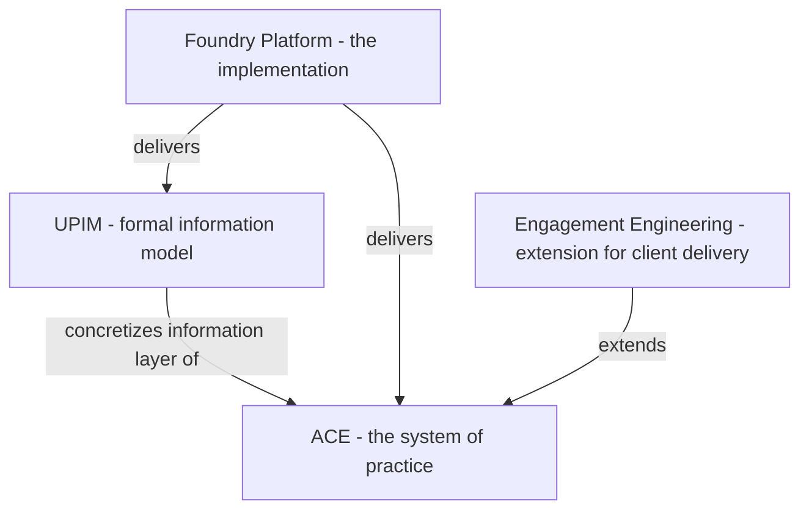

# Relationships: ACE, UPIM, and the Foundry Platform

ACE is the system of practice. UPIM is a formal information model that gives ACE its concrete vocabulary. The Foundry Platform is the software that delivers both. These three are layered, not parallel: **UPIM and the Foundry Platform are concretization layers of ACE** — they turn the system from an idea into something that can be operated. UPIM also has standalone value: an organization can adopt UPIM without adopting ACE. UPIM is one concretization of ACE's information needs but not the most concrete form; it can be further specialized for specific products.

This document explains how those three relate, where their boundaries are, and how a builder should reason about which one to consult when.

It also names **Engagement Engineering** at the boundary of ACE, so readers know what is in scope of this folder and what is not.

## The three layers, at a glance

- **ACE** says *what to build, how to organize, and how work moves.* It defines workspaces, IDE-mediated entry, scenarios, tasks, intent flow, governance. ACE is the conceptual frame.
- **UPIM** says *what we record, in what shape, and how it relates.* It gives ACE the formal entities, dimensions, tracks, and lifecycles that ACE's repositories and workspaces operate on. UPIM is **a concretization layer**: it turns ACE's named repositories and workforce into a working information schema. UPIM is **independent of ACE in principle** — its formal structure could be adopted by another system of practice — but at Zeta it is the layer ACE relies on. UPIM can be further specialized for specific products beyond the shared UPIM baseline.
- **The Foundry Platform** is *the software that delivers ACE and UPIM capabilities.* It implements workshops, repositories, workspace runtimes, IDE integrations, intent routing, governance hooks, observability, and CI. It is **another concretization layer**: it turns ACE's workspaces and cycle into running software, and it stores and mutates the entities UPIM defines.

ACE without concretization layers is a model on paper. The Foundry Platform without ACE is software in search of a purpose. UPIM without ACE is a vocabulary that other systems of practice could still consume.

## ACE ↔ UPIM mapping

ACE names three governing models. UPIM expresses them as three information layers.

| ACE model | UPIM layer | What it answers | Source |
|---|---|---|---|
| **Product Model** | Definition Model + strategy/intent dimensions | What the product is and is aiming at. | [ace-model.md](ace-model.md) line 9; [../product-information-model/README.md](../product-information-model/README.md) "Definition Model". |
| **Work Model** | Work Model (5 tracks) | What work exists and how it transitions. | Same. |
| **Operating Model** | Operating Model (coordination + organization) | How the org executes the work. | Same. |

Three notes on this mapping:

1. **Names are not identical.** ACE's "Product Model" is broader than UPIM's "Definition Model" alone — it includes the strategy and intent dimensions UPIM places in Dimension 1 (Strategy & Intent) and the related dimensions (Vendor Value, Customer Value). When ACE says "Product Model", it means *the product as it is and as it intends to be*. UPIM splits the *as it is* part (Definition Model) from the *as it intends to be* part (the strategy dimensions inside the Definition Model). Either reading is consistent if you read with that in mind.
2. **"Operating Model" is the corrected name.** Earlier ACE drafts called this "Org Model"; that name is deprecated. The replacement is consistent with UPIM. See [../glossary.md](../glossary.md).
3. **UPIM's three-not-four design.** UPIM treats coordination and organization as entangled facets of a single Operating Model rather than separate layers. ACE's "Operating Model" inherits that view. See UPIM README "Why Three Models, Not Four?".

**Workbench and Product.** In UPIM, **Product** is a Definition Model entity. In ACE, a **Workbench** corresponds to a Product: it is the locus where that Product is evolved; it is not the Product itself.

## Repositories: ACE concept and UPIM alignment

The repository taxonomy is part of ACE itself, not a derived UPIM artifact. [repositories.md](repositories.md) is the **canonical conceptual specification** of the Foundry's repositories — names, intent, contents, information flow. It is also the natural expansion of the seed list in [ace-model.md](ace-model.md) lines 16-28 (the seed is 12 names; the canonical spec elaborates to 15 with sub-partitions of PFR).

What UPIM contributes is **alignment**: each repository's content can be expressed in UPIM dimensions and tracks. The "UPIM Mapping" column in [repositories.md](repositories.md) records this alignment without making the repositories UPIM-derived. The Foundry Platform implements the repository spec; UPIM gives the entities that live inside.

A small subset of the table (see [repositories.md](repositories.md) for the complete listing):

| ACE name | Canonical code | UPIM mapping |
|---|---|---|
| Product Intent Repository | PIR | Dimensions 1, 2, 3 |
| Domain Knowledge Repository | DKB | Dimension 9 |
| Design Repository | DAR | Dimensions 5, 6, 7 |
| Product Ontology Repository | POR | Dimension 8 |
| Source Repository | CAR | Track 2 + Track 3 engineering code |
| Quality & Verification Repository | QVS | Track 2 quality verification |
| Work Repository | WR | Work Model instances |
| Workforce Repository | WFR | Operating Model |
| Practitioner Repository | PPR | Operating Model + Track 5 |
| Product Evolution Repository | PEIR | Traceability |

ACE specifies the repositories; UPIM specifies the entities and lifecycles that live in them.

## ACE ↔ Foundry Platform: who owns what

The boundary between ACE (the model) and the Foundry Platform (the implementation) is the same as the boundary between *requirements* and *modules*. ACE does not specify modules; the platform does not invent semantics.

| Concern | ACE owns | Foundry Platform owns |
|---|---|---|
| Workspaces | The six workspace types and their roles. | Per-workspace runtime engineering (Release Workspace Engineering, Development Workspace Engineering, etc. — see [../foundry-platform/platform.TODO](../foundry-platform/platform.TODO) lines 18-27). |
| Repositories | What types exist, their conceptual purpose. | Authoring, storage, and serving infrastructure ([../foundry-platform/platform.TODO](../foundry-platform/platform.TODO) line 11). |
| IDE | That an IDE per workspace is the human entry surface. | The IDE realization (Olympus Rocket profiles, plugins, views) per [../engagement-engineering/tenant-developer-tooling/TD.TODO](../engagement-engineering/tenant-developer-tooling/TD.TODO). |
| Scenarios and Tasks | That work is scenario-driven and decomposes into tasks. | Scenarios and Tasks Management ([../foundry-platform/platform.TODO](../foundry-platform/platform.TODO) line 17). |
| Product Intent | The asset, the cycle, the flow. | Routing of intent across workspaces ([../foundry-platform/platform.TODO](../foundry-platform/platform.TODO) line 14). |
| Governance | That every transition invokes governance. | Governance Workspace Engineering ([../foundry-platform/platform.TODO](../foundry-platform/platform.TODO) line 24). |
| Security, compliance, audit, observability | That these are first-class concerns. | Foundry Specification ([../foundry-platform/platform.TODO](../foundry-platform/platform.TODO) lines 1-9). |
| CI | (not specified by ACE; CI is consumed) | Foundry CI ([../foundry-platform/ci/](../foundry-platform/ci/README.md)). |
| Metrics & KPIs | Agent effectiveness as a goal ([objectives.md](objectives.md)). | Concrete metrics: Say/Do, Cost per Story Point, Velocity, Quality, etc. ([../foundry-platform/platform.TODO](../foundry-platform/platform.TODO) line 15). |

## Foundry Platform ↔ UPIM

The Foundry Platform stores and mutates entities that UPIM defines. Specifically:

- The **Source Repository (CAR)** stores Track 2 + Track 3 engineering code.
- The **Quality & Verification Repository (QVS)** stores Track 2 quality verification artifacts.
- The **Operations Repository (OPR)** stores Track 3 artifacts.
- The **Product Feedback Repository (PFR)** has sub-partitions for Track 4 (Win), Track 3 (Run), Track 2 (Build).
- The **Practitioner Repository (PPR)** holds Operating Model + Track 5 (Evolve) content.
- The **Workforce Repository (WFR)** holds Operating Model content (workforce, roles, skills, governance).

When the Foundry Platform implements a module, the entities it touches are the entities UPIM defines. The platform does not introduce ontology that contradicts UPIM. When a platform need exposes a gap in UPIM, the resolution is to update UPIM (potentially via a Track 5 Evolve scenario), not to encode a divergent vocabulary in the platform.

## Engagement Engineering: ACE extended

Some parts of how Zeta delivers software are not in scope of base ACE. They live in the **Engagement Engineering extension**:

- **Engagement is a Workshop.** A client engagement (e.g. Bank-X) is modeled as a Workshop named for that engagement. Source: [../engagement-engineering/extension-to-ace.md](../engagement-engineering/extension-to-ace.md).
- **Workbench corresponds to a Product in UPIM.** Each Product built for that client is evolved in a **Workbench** inside the Engagement Workshop; the Workbench is the locus of evolution, not the Product entity itself.
- **Home Workshop and Home Workbench.** Every Workbench has a **Home Workshop** — the Workshop where it primarily lives. The **Home Workbench** is the canonical Workbench for a Product across Workshops. A **Contributing Workbench** is an **Engagement Workbench** that references a Home Workbench elsewhere; not every Engagement Workbench is Contributing (standalone engagement-specific Products exist). For Products that exist only inside one engagement, the Engagement Workshop is the Home Workshop and the sole Workbench there is the Home Workbench. Source: [../engagement-engineering/extension-to-ace.md](../engagement-engineering/extension-to-ace.md); [../1.TODO](../1.TODO) lines 5-12.
- **Win Workforce** is associated with the Foundry of the Home Workshop and directs Run-related work to the appropriate **Estate** (deployment locus) based on which Estate owns the deployment — a **production-operations boundary**, not part of ACE's software-manufacturing model. Source: [../1.TODO](../1.TODO) lines 15-17.
- **Engagement-specific repositories** are modeled as referenced or owned data for the Engagement. Source: [../1.TODO](../1.TODO) line 20.

The boundary is deliberate. Base ACE treats Workshops and Workforce uniformly within a single organization's Foundry. The engagement extension adds the constructs needed to model client delivery without breaking the base. See [../engagement-engineering/extension-to-ace.md](../engagement-engineering/extension-to-ace.md) for the full extension argument.

## A builder's quick guide

If you are about to write a module specification, use this guide to decide where to look:

1. **Need to know what entity to read or write?** → [repositories.md](repositories.md) and [../product-information-model/](../product-information-model/README.md).
2. **Need to know which workspace owns this?** → [workspaces/](workspaces/README.md) and [concepts.md](concepts.md).
3. **Need to know how intent gets to your module?** → [product-evolution-cycle.md](product-evolution-cycle.md).
4. **Need to know what governance applies?** → [governance.md](governance.md).
5. **Need to know how this changes for client delivery?** → [../engagement-engineering/extension-to-ace.md](../engagement-engineering/extension-to-ace.md).
6. **Need to know what platform-level capability you depend on?** → [../foundry-platform/README.md](../foundry-platform/README.md).
7. **Need to know what you can reuse across stacks?** → [../propeller/README.md](../propeller/README.md).

## What this document does not cover

- **The detailed UPIM dimension and track structure.** That is in [../product-information-model/README.md](../product-information-model/README.md) and the entity files under it.
- **The detailed engagement extension.** That is in [../engagement-engineering/](../engagement-engineering/README.md).
- **The detailed Foundry Platform module decomposition.** That will live under [../foundry-platform/](../foundry-platform/README.md) as module specifications are written.
- **Production operations ontologies** (deployment locus, SRE workforce, runtime topology beyond the Estate boundary named in Engagement Engineering). Out of scope of ACE; see [../engagement-engineering/extension-to-ace.md](../engagement-engineering/extension-to-ace.md) for the handoff surface only.
