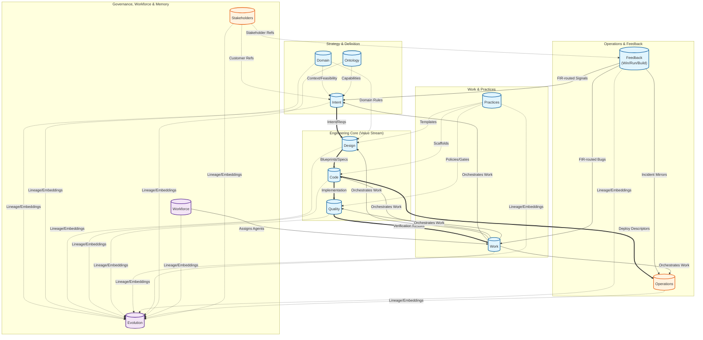

# Foundry Repository Architecture -- Unified Product Information Model

## Table of Contents

- [Introduction](#introduction)
- [Repository Landscape Overview](#repository-landscape-overview)

### Strategy & Definition
- [Product Intent Repository](#product-intent-repository)
- [Domain Repository](#domain-repository)
- [Ontology Repository](#ontology-repository)

### Engineering Core
- [Design Repository](#design-repository)
- [Code Repository](#code-repository)
- [Quality Repository](#quality-repository)

### Operations & Feedback
- [Operations Repository](#operations-repository)
- [Feedback Repository](#feedback-repository)

### Work & Practices
- [Work Repository](#work-repository)
- [Practices Repository](#practices-repository)

### Governance, Workforce & Memory
- [Workforce Repository](#workforce-repository)
- [Stakeholders Registry](#stakeholders-registry)
- [Evolution Repository](#evolution-repository)

### Cross-Cutting
- [End-to-End Information & Value Flow](#end-to-end-information--value-flow)


---

## Introduction

This guide defines the repository architecture for the Foundry -- the knowledge infrastructure that supports the Unified Product Information Model (UPIM). These repositories (12 primary, with Feedback having 3 partitions) are the collaborative foundation for both AI and human agents throughout the product lifecycle. Each section summarizes a repository's **intent**, **contents**, **best practices**, **information flow**, and UPIM mapping.

> **Terminology:** See DR-033 for the decisions behind repository naming and scope. See DR-034 for the Role vs. Agent separation that shapes Workforce and Stakeholders scope.

---

## Repository Landscape Overview

| Repository Area               | Repository         | Scope                                                                                                                         | UPIM Mapping                     |
|------------------------------|--------------------|-------------------------------------------------------------------------------------------------------------------------------|----------------------------------|
| **Strategy & Definition**    | **Intent**         | Strategy, Business Model, Customer Value, Signals, Ideas, Product Intents, PSDs                                               | Strategy & Intent, Vendor Value, Customer ROI |
|                              | **Domain**         | Domain knowledge, glossaries, ontologies, business rules                                                                      | Domain Knowledge                 |
|                              | **Ontology**       | Product structure, capabilities, features, maturity                                                                           | Structural Topology              |
| **Engineering Core**         | **Design**         | Architecture, API models, infrastructure, operational specs                                                                   | Technical, Ecosystem, Operational (definitions) |
|                              | **Code**           | Source code, build artifacts                                                                                                  | Build + Run engineering code     |
|                              | **Quality**        | Test cases, acceptance tests, build-time quality evidence                                                                     | Build quality verification       |
| **Operations & Feedback**    | **Operations**     | Deployment descriptors/records, incidents, post-incident reports, operational artifact versions                               | Run artifacts                    |
|                              | **Feedback**       | Product-in-operation feedback across Win, Run, and Build perspectives                                                         | Build, Run, Win feedback         |
|                              | – Feedback (Win)   | FIRs (universal intake), Win Cases, customer communication records                                                            | Win reactive inputs              |
|                              | – Feedback (Run)   | Incident mirrors (references Operations), operational observation summaries                                                   | Run feedback view                |
|                              | – Feedback (Build) | Bug report mirrors (references Work), technical debt observations                                                             | Build feedback view              |
| **Work & Practices**         | **Work**           | All live work instances across all 5 tracks                                                                                   | Work Model instances             |
|                              | **Practices**      | Standards, templates, practices, verification policies                                                                        | Operating Model + Evolve         |
| **Governance, Workforce & Memory** | **Workforce**    | Internal agents (human + AI), role bindings, skills, availability, governance                                                 | Operating Model                  |
|                              | **Stakeholders**   | Customer/partner/prospect identity, contacts, communication preferences (reference layer)                                     | Cross-cutting                    |
|                              | **Evolution**      | Lineage, impact graphs, historical metrics, cross-repo knowledge graph                                                        | Traceability                     |

---

## Product Intent Repository

**UPIM Mapping:** Strategy & Intent, Vendor Value, Customer ROI

**Intent:** The comprehensive ledger of strategic direction, business models, customer value propositions, signals, ideas, Product Intents, and product specifications.

**Contents (organized by section):**

| Section | UPIM Mapping | Content |
|---|---|---|
| **Strategy** | Strategy & Intent | Strategic Themes, Objectives, Initiatives, Customer Release Intents, Lever Mix definitions |
| **Business Model** | Vendor Value | Business Model, Pricing Tiers/Packages, Value Metrics, Lever Portfolio, Business KPIs, Cost KPIs, Win Outcomes, Win Barriers, Delivery Frictions, Win Stakeholder role definitions |
| **Customer Value** | Customer ROI | Customer Promises (Value Propositions, Service Commitments, Compliance Posture), Customer Value Metrics, Buying Personas, Business Outcomes, Customer Segments |
| **Signals & Ideas** | Strategy & Intent (flowing items) | Problems, Needs, Opportunities (routed from FIRs or created directly), Ideas (Hypotheses), PDRs |
| **Product Intent** | Strategy & Intent (ACE bridge entity) | Routable Product Intent records created or updated by product decisions and renewed by Release |
| **Specifications** | Strategy & Intent (PSDs) | Product Specification Documents that refine Product Intent, PSD templates by module archetype |

**Purpose:** Central workspace for strategic direction and the Product Intent bridge entity, empowering agents to evaluate opportunities, model business value, define customer promises, and route committed intent into ACE workspace execution.

> **Renamed from Product Idea Repository.** Intent now encompasses Strategy & Intent, Vendor Value, and Customer ROI. See DR-033 D1.

**Best Practices**
- **Do:**
  - Keep Signals lightweight until validated through Discovery
  - Track version history as standing definitions evolve
  - Use standing vs. flowing classification to manage content lifecycle
- **Don't:**
  - Include design/implementation details (Design)
  - Store customer complaints or FIRs (Feedback Win)
  - Store deployment or operational artifacts (Operations)


---

## Domain Repository

**UPIM Mapping:** Domain Knowledge

**Intent:** Establish a shared, canonical understanding of the business and domain.

**Contents:**
- Glossaries, ontologies, taxonomies
- Business rules, models, event definitions
- Regulatory and policy frameworks
- Contextual and background knowledge

**Purpose:** Stabilizes semantic grounding for requirements and architecture.

**Best Practices**
- **Do:**
  - Keep definitions canonical and domain-wide
  - Use structured formats (e.g. ontologies)
- **Don't:**
  - Store product-specific requirements or implementation artifacts

---

## Ontology Repository

**UPIM Mapping:** Structural Topology

**Intent:** Define the structure, capabilities, and maturity states of the shipped product.

**Contents:**
- Formal ontology of shipped products
- Capability catalog and feature hierarchy
- Maturity stages (e.g. Beta, GA, Deprecated)
- Dependency mapping (capabilities & features)
- Customer-facing specifications
- Internal feature models (variants, constraints, entitlements)
- Value Stream definitions

**Purpose:** Serves as canonical source for product structure -- supports agent reasoning for product evolution, entitlement, and configuration.

**Best Practices**
- **Do:**
  - Maintain a single canonical product ontology
- **Don't:**
  - Store detailed requirements (these belong in Intent)

---

## Design Repository

**UPIM Mapping:** Technical, Ecosystem & Extensibility, Operational -- definitions only

**Intent:** Capture the structural and behavioral design blueprints.

**Contents:**
- Architecture diagrams (C4, layered, events, data flow)
- Sequence diagrams
- Component & API models (Technical System/Component definitions, Ecosystem API Module/Operation/Contract definitions)
- Data/event models
- UX flow artifacts
- Architecture decision records (ADRs)
- Interface definitions
- Infrastructure models and operational specifications (Operational Deployment Environment, Deployment Train, Module/Product Package specifications)

**Purpose:** Reference for Architect, Developer, API, and Verifier Agents. Holds the "what it is" definitions across Technical, Ecosystem, and Operational.

**Best Practices**
- **Do:**
  - Align architecture with Intent and Domain
  - Record decisions in ADRs
- **Don't:**
  - Store code or test cases (Code, Quality)
  - Store deployment records or runtime artifacts (Operations)

---

## Code Repository

**UPIM Mapping:** Build + Run engineering code

**Intent:** Store the system's implementation artifacts -- source code and build-time artifacts only.

**Contents:**
- Source code (scaffolds, stubs)
- Developer test code (unit and module tests; excludes Product Acceptance Tests)
- Local code embeddings indices for this sub-repository (non-authoritative; for developer tooling)
- Build scripts, local configs
- Generated code artifacts
- Service mocks/stubs
- CI pipeline definitions for non-release builds (feature/dev branches)

> **Note:** Code contains only build-time and development-time artifacts. All runtime concerns (deploy configs, SLOs, production rollout, deployment descriptors) are managed by Operations.
>
> **Note:** Code hosts unit and module tests required for developer workflows. Product Acceptance Tests and release CI pipelines are governed by Quality. Quality defines coverage policies and gates that apply to Code tests and consumes their coverage evidence.
>
> **Note:** Code embeddings are intended for local code intelligence (IDE/agent tooling) within this sub-repository. Evolution owns the cross-repo knowledge graph, global embedding registry, and aggregated vector indices.

**Best Practices**
- **Do:**
  - Make code modular and traceable to design
  - Maintain semantic code embeddings for agent comprehension
- **Don't:**
  - Store deployment/runtime configs or deployment descriptors (Operations)
  - Store acceptance test artifacts or release pipeline definitions (Quality is source of truth for acceptance tests, verification policies, and release CI)
  - Store incident records or operational artifact versions (Operations)

---

## Quality Repository

**UPIM Mapping:** Build quality verification (build-time evidence)

**Intent:** The authoritative source for build-time software correctness and compliance evidence.

**Contents:**
- Acceptance test code (automated Product Acceptance Tests)
- Test cases/test suites
- Auto-generated tests
- Test coverage reports
- Static analysis results
- Security/compliance scans
- Performance benchmarks
- Linting rules
- Review & audit logs
- Policy manifests pinned from Practices (verification policies, thresholds, gates)
- Release CI pipeline definitions (build, test, quality gates) consuming Practices policies

> **Note:** Practices is the source of truth for verification policy specifications and thresholds. Quality consumes and pins policy versions from Practices, executes gates in release CI, and stores evidence/results. Unit and module tests live in Code for developer workflows; Quality enforces gates and consumes their coverage and results as evidence.

> **Verification evidence split:** Quality owns build-time quality evidence (tests, scans, benchmarks). Operations owns run-time quality evidence (deployment verification results, post-deployment SLA checks). See DR-033 D6.

**Best Practices**
- **Do:**
  - Align all tests to intent from Intent and design from Design
  - Ensure verification logic is fully machine-readable
  - Define coverage thresholds and quality gates; enforce them in release CI pipelines
- **Don't:**
  - Store production telemetry/logs (Operations)
  - Store deployment verification evidence (Operations)

---

## Operations Repository

**UPIM Mapping:** Run artifacts

**Intent:** Store all Run Track artifacts -- deployment descriptors, deployment records, incidents (system of record), Post-Incident Reports, operational artifact versions, and deployment verification evidence.

**Contents:**
- Deployment descriptors (SDD/MDD/PDD versions)
- Deployment records (which descriptor applied, where, when, by whom, verification results)
- Incident records (system of record -- SEV-0 through SEV-4)
- Post-Incident Reports (timeline, RCA, corrective actions)
- Operational artifact versions (Module Package Versions, Product Package Versions)
- Deployment verification evidence (post-deployment SLA checks, verification results)
- Deployment runbooks and operational procedures

> **Separation from Code.** Code holds source code and build artifacts only. Deployment descriptors, incident records, and operational artifact versions have different ownership (SRE/DevOps vs. developers), lifecycle, and governance. See DR-033 D4.

> **Verification evidence split.** Quality owns build-time quality evidence (tests, scans); Operations owns run-time quality evidence (deployment verification). See DR-033 D6.

> **Incident system of record.** Operations owns the authoritative incident records. Feedback (Run) holds references/mirrors for the feedback perspective. See DR-033 D5.

**Best Practices**
- **Do:**
  - Maintain strict versioning on all deployment descriptors and operational artifacts
  - Link incident records to affected systems, modules, environments, and tenants
  - Record deployment verification results alongside deployment records
- **Don't:**
  - Store source code or build artifacts (Code)
  - Store build-time test results or security scans (Quality)
  - Store customer-facing feedback or FIRs (Feedback Win)

---

## Feedback Repository

**UPIM Mapping:** Win reactive inputs, Run/Build feedback views

**Intent:** Capture, categorize, and route real-world product-in-operation feedback. Feedback is sub-partitioned by track affinity and team ownership.

### Feedback (Win) -- Primary, Universal Intake

**Contents:**
- **FIRs (First Information Reports)** -- the primary entity; universal intake for all product-in-operation feedback (DR-032)
- Win Cases (Queries, Service Requests, Complaints, Escalations) -- always sub-items of FIRs
- Customer communication records
- NPS/CSAT data
- Qualitative customer input (chat/email transcripts)

**Owner:** Win Team (Customer Support, Customer Success)

### Feedback (Run) -- Operational Feedback View

**Contents:**
- Incident mirrors -- references to Operations Incidents (Operations is the system of record)
- Operational observation summaries
- Run-team-created FIR references (FIRs created by Run teams reside in Feedback Win; Feedback Run holds the feedback/customer-impact view)

**Owner:** SRE, DevOps (Operations owns the records; Feedback Run provides the feedback perspective)

### Feedback (Build) -- Quality Feedback View

**Contents:**
- Bug report mirrors -- references to Work/Build Bugs (Work is the system of record)
- Technical debt observations
- Quality regression reports

**Owner:** QA, Engineering (Work owns the records; Feedback Build provides the feedback perspective)

> **Feedback Discovery removed.** Signals are routed directly from FIRs (via triage) into Intent. See DR-033 D5.

**Purpose:** Feed the quality-improvement loop -- detects pain points, drives updates to intents (Intent) and test plans (Quality/Work). Feedback Win is the comprehensive origination point for all operational feedback.

**Best Practices**
- **Do:**
  - Enforce FIR-first: every feedback event starts as an FIR in Feedback Win (DR-032)
  - Use consistent tagging/categorization for agent triage
  - Maintain references (not copies) for Feedback Run and Feedback Build mirrors
- **Don't:**
  - Store product intents or architecture change records (Intent, Design)
  - Store deployment artifacts (Operations)
  - Duplicate incident or bug data -- Feedback Run and Feedback Build hold references only

---

## Work Repository

**UPIM Mapping:** All tracks (Discovery, Build, Run, Win, Evolve)

**Intent:** Represent all actual work performed by human and AI agents across all tracks.

### A. Work Objects
- Epics, stories, tasks, subtasks (Build)
- Run Epics, Run Stories, Deployment Tasks, Change Requests, Maintenance Tasks (Run)
- Signal Exploration, Deliberation, Research, Experiments (Discovery)
- Win Cases, Win Reviews, Win Engagements (Win)
- Evolve Reviews, Evolve Definition Tasks (Evolve)
- Automated and human-assigned tasks
- Cross-team work items

### B. Work Breakdown & Planning
- Task decomposition and dependency graphs
- Critical paths, assigned agent(s), required artifacts
- Deliverables, time estimates/SLAs
- Workflows, sequences

### C. Execution State
- Status (planned, in-progress, blocked, completed, etc.)
- Timestamps (start, finish, update cadence) in UTC
- Artifacts produced (store canonical URIs to artifacts; no binaries)
- Verification outcomes
- Effort logs, failure modes, retries, escalations

### D. Responsibility & Attribution
- Internal agents (human + AI) assigned from Workforce
- Role bindings referenced from Definition Model

### E. Workflow Memory
- Origin/rationale for tasks
- Decomposition/decision history
- Lessons learned
- Feedback integration (into Feedback)

**Best Practices**
- **Do:**
  - Make all task structures machine-readable
  - Maintain bi-directional traceability to Intent, Design, Code, Quality, Operations
- **Don't:**
  - Embed code, binaries, or design artifacts directly (store URIs only)
  - Use Work as a long-term archive (apply rolling retention; lineage is archived in Evolution)

> **Notes:**
> - Work is the system of record for live, mutable operational state.
> - Evolution holds immutable lineage snapshots of Work changes; corrections in Evolution are modeled via "supersedes/corrects."
> - Evidence (e.g., Quality test reports) is referenced by URI from Work; binaries remain in their source repositories.

---

## Practices Repository

**UPIM Mapping:** Operating Model + Evolve

**Intent:** Curate reusable standards, templates, and professional practices.

**Contents:**
- Best practices/playbooks
- Prompt/UX/component templates
- Architecture templates
- Boilerplate code scaffolds
- Coding/testing/design standards
- Verification policy specifications and reusable policy templates (coverage thresholds, gate definitions, evidence contracts)
- Editorial/documentation conventions

**Purpose:** Houses reusable, domain-agnostic professional knowledge (practices), distinct from domain content in Domain.

**Best Practices**
- **Do:**
  - Keep artifacts general-purpose and reusable
- **Don't:**
  - Store product/domain-specific rules

---

## Workforce Repository

**UPIM Mapping:** Operating Model (internal workforce)

> **Renamed from Agent & Workforce Repository.** "Workforce" naturally encompasses both human and AI workers without privileging either category. See DR-033 D2.

### 1. Purpose

Workforce is the system of record for all internal human and AI agent identities, capabilities, role bindings, governance, and workforce planning -- enabling scalable, governed human-AI collaboration.

> **Role vs. Agent separation:** Roles are defined in the Definition Model (Win Stakeholder in Vendor Value, User Persona in User Experience, Developer/Programmatic Persona in Ecosystem, Operational Persona in Operational). Workforce agents reference these role definitions via role bindings. Workforce does not define roles -- it assigns agents to roles defined elsewhere. See DR-034.

### 2. Scope

Covers these conceptual areas:
- **Agent Registry:** All internal agent identities (AI and human)
- **Role Binding:** Assignment of agents to Definition Model role definitions (Vendor Value, User Experience, Ecosystem, Operational)
- **Responsibility Allocation Ledger:** Assignment traceability
- **Workforce Allocation:** Loads, availability, assignment rules
- **Behavioral & Performance Metrics:** Telemetry, drift, quality
- **Governance & Safety:** Permissions, escalation, boundaries

### 3. Agent Registry Model

Workforce tracks:

**For AI Agents:**
- Agent ID/version/description
- Underlying model identity (e.g. LLM version)
- Capabilities/tools
- Repository access permissions
- Safety and operational constraints
- Workload quotas, behavioral metrics, drift and health data

**For Human Agents:**
- Role-based (non-PII) identity
- Skills and expertise matrix
- Functional domain (engineering, QA, PM, etc.)
- Proficiency tier
- Availability windows
- Assignment and review authorities

### 4. Role Binding Model

Maps agents to Definition Model roles:
- **Win Stakeholder roles** (Vendor Value): Pre-Sales Engineer, CS Manager, Account Executive, etc.
- **User Persona roles** (User Experience): Internal testers, dogfood participants
- **Developer/Programmatic Persona roles** (Ecosystem): Internal API consumers
- **Operational Persona roles** (Operational): SRE, Platform Engineer, Security Operator, etc.
- Track access: which tracks the agent can pick up work in
- Governance: permissions, escalation authority, delegation rules

### 5. Responsibility Allocation Ledger

Stores, for every work item:
- Assigned agent(s)
- Responsibility type (plan/execute/verify/approve)
- Execution logs (timestamped)
- Delegation/escalation chains
- Approvals and verification signatures
- Outcome summaries and quality stats

*Integrates with WR for full traceability.*

### 6. Workforce Allocation Model

Tracks and allocates:
- Workload per agent
- Active assignments, idle capacity
- Overutilization alerts
- Skill-based and SLA-driven assignment rules
- Human-AI workload balancing

### 7. Behavioral & Performance Metrics

Workforce aggregates:
- Task success/rework rates
- Quality scores (from Quality)
- Collaboration effectiveness
- Reliability, drift, and human agent growth

### 8. Governance & Safety Framework

Implements:
- Role-based access control (RBAC)
- Per-agent repository permissions
- Restricted/oversight domains
- Segregation-of-duties enforcement
- Escalation and override protocols
- Audit policies and explainability requirements

### 9. Integration with Other Repositories

Workforce orchestrates agent interaction and access throughout the system:
- **Intent:** Assigns PM/Planner for idea refinement
- **Domain:** Aligns access with roles/capabilities
- **Design:** Identifies authorized Architect/Designer
- **Code:** Controls Developer agent permissions
- **Quality:** Defines QA/SDET roles for verification
- **Operations:** Controls SRE/DevOps agent permissions for operational artifacts
- **Work:** Manages all agent work assignments
- **Feedback:** Routes feedback to responsible agents (FIR triage assignments)
- **Evolution:** Links agent identity to lineage/impact records
- **Ontology:** Controls ontology/capability access per role
- **Stakeholders:** Workforce agents reference Stakeholders for external stakeholder identity when processing work items

### 10. Information Flow Involving Workforce

1. New task enters Work
2. Work queries Workforce for eligible agents (role binding, skills, availability, safety)
3. Workforce assigns the task
4. Agent executes and updates Work/Quality/Operations
5. Workforce logs responsibility, updates metrics
6. Changes propagate to Evolution for lineage/history
7. Governance / safety checks run

---

## Stakeholders Registry

**UPIM Mapping:** Cross-cutting (reference layer)

> **New repository.** Stakeholders is introduced as a reference layer for external parties. See DR-033 D3 and DR-034 D4.

### 1. Purpose

Stakeholders provides a single, UPIM-internal reference point for external stakeholders -- customers, partners, prospects, and third-party developers -- who are referenced in work items but are not internal workers.

### 2. Nature: Reference Layer, Not System of Record

Stakeholders is a **projection** (reference layer), not a system of record. The system of record for customer data remains the organization's CRM/subscription management system. Stakeholders holds the minimum identity and reference pointers needed by the UPIM:

- **Customer identity:** Organization name, segment classification (Customer ROI), primary contacts
- **Partner identity:** Partner name, partnership type, integration scope
- **Prospect identity:** Prospect name, engagement stage
- **Developer identity:** External developers with sandbox access or partnership agreements (Ecosystem)
- **Communication preferences:** Preferred channels, notification subscriptions
- **CRM/Source system reference:** Pointer back to the authoritative external system

### 3. Why Not Workforce?

External parties are *consumers* of the product, not agents in the product organization's work model. They do not pick up work across tracks. Mixing them with internal workers in Workforce would conflate workforce management with customer/partner management. See DR-034 D4.

### 4. Cross-References from Other Repositories

Stakeholders is referenced by:
- **Feedback (Win):** FIR reporters, Win Case customers
- **Operations:** Incident affected tenants (via Tenant -> Customer -> Stakeholders)
- **Intent:** Need requesting customers, Customer Segment instances
- **Work:** Work item customer/partner references

### 5. Best Practices
- **Do:**
  - Keep Stakeholders lightweight -- minimum identity required for UPIM references
  - Maintain CRM/source system reference pointers for authoritative data
  - Synchronize periodically with source systems
- **Don't:**
  - Duplicate full CRM data into Stakeholders
  - Track internal agents (Workforce)
  - Use Stakeholders as a billing or subscription management system

---

## Evolution Repository

**UPIM Mapping:** Traceability (cross-cutting)

**Intent:** Ensure traceability, lineage, and change impact reasoning.

**Contents:**
- Knowledge graph (product, design, code, tests, issues)
- Change history (intent, architecture, code diffs)
- Release lineage
- Impact/downstream effect graphs
- Agent reasoning and decision logs
- Regression histories
- Negative learning ("regret logs")
- Global embedding registry (artifact URIs to vector metadata, provenance, model/version pins)
- Cross-repo vector indices and semantic graph projections (authoritative, queryable)
- Embeddings for all product-evolution artifacts across repositories

**Purpose:** Acts as time-aware, causal memory for agents -- enabling continuity and avoidance of regressions.

**Best Practices**
- **Do:**
  - Enforce strict versioning and artifact lineage
  - Maintain consistency of artifact relationships
  - Record immutable lineage snapshots and edges; corrections use "supersedes/corrects" relations
  - Ingest evidence as references (e.g., to Quality reports) rather than storing binaries
  - Compute durable historical metrics (cycle time, rework) from lineage
- **Don't:**
  - Store speculative/early ideas (should reside in Intent)
  - Store mutable operational state (Work is the source of truth for live state)

---

## End-to-End Information & Value Flow



### Value Flow Narrative

1. Discovery captures Signals and Ideas in **Intent**; product decisions (PDRs) establish or update **Product Intent**; PSDs refine Product Intent
2. **Domain** checks domain feasibility and provides business rules
3. **Design** produces architectural blueprints, API models, and infrastructure specifications
4. **Code** implements design as code
5. **Quality** verifies code correctness with build-time quality evidence
6. **Operations** receives deployment descriptors and records deployments; stores run-time verification evidence and incident records
7. **Feedback** ingests product-in-operation feedback via FIRs (Feedback Win), with mirrors in Feedback Run (incidents) and Feedback Build (bugs)
8. **Evolution** logs evolution and relationships across all repositories
9. **Practices** provides reusable standards/practices influencing all design/code/verification
10. **Work** coordinates, executes, and tracks agent work through the lifecycle across all 5 tracks
11. **Workforce** assigns internal agents (human + AI) to work based on role bindings, skills, and availability
12. **Stakeholders** provides external stakeholder references for FIR reporters, Win Case customers, and Incident-affected tenants

---

## Landscape Topology & Discovery

**Scope:** All repositories are scoped to a Landscape.

### Definition (C4-inspired)
A Landscape is the C4 System Landscape boundary for a product/program within an enterprise. It encompasses the people and software systems (internal and external) that collaborate to deliver the product's capabilities. The Landscape serves as the highest-level context boundary for repositories, policies, identities, and lineage in this guide.

- Purpose: provide a coherent semantic, architectural, and governance scope for a product/program.
- Boundaries: aligns with C4 System Landscape; external systems are modeled as dependencies but remain outside the Landscape boundary.
- Isolation: repositories, policies, and identities default to Landscape-local scope; cross-landscape links require explicit URIs and approvals.
- Identity: all artifact URIs are prefixed with `<landscape>` to ensure global uniqueness and traceability.

### Mono vs Poly within a Landscape
- Mono-repos (one per repo-type per landscape): `Intent`, `Domain`, `Design`, `Evolution`, `Practices`, `Ontology`, `Feedback`, `Workforce`, `Operations`, `Stakeholders`
- Poly-repos (multiple per repo-type per landscape): `Code`, `Quality`, `Work`

### Discovery Index
- Maintain a per-landscape discovery index mapping:
  - `<repo-type> -> <repo-id> -> location, owners, ACL class`
  - Exposed as a machine-readable manifest (YAML/JSON) and registered in Evolution for lineage.
- Constraints:
  - `<repo-id>`: DNS-safe kebab-case, unique within `<repo-type>` in the landscape.
  - URIs MUST include `<landscape>` to avoid collisions across landscapes.

### Policy Distribution
- Verification policy specifications live in `Practices` (SoT), versioned and reusable across the landscape.
- `Quality` repos pin specific `Practices` policy versions and execute gates; evidence flows back to `Quality` and lineage to `Evolution`.

## Global Identity & Referencing

**Purpose:** Provide a universal, stable way to reference any artifact across repositories to enable unambiguous traceability, policy enforcement, and automation.

### URI Scheme

Use canonical artifact URIs for all cross-repository references. Repositories are scoped to a Landscape, and multiple sub-repositories can exist under each repo-type:

```text
artifact://<landscape>/<repo-type>/<repo-id>/<artifact-type>/<artifact-name>|<artifact-id>@<version>
# Components
# - <landscape>: the landscape identifier (e.g., 'eon')
# - <repo-type>: one of Intent, Domain, Design, Code, Quality, Evolution, Practices, Ontology, Feedback, Work, Workforce, Operations, Stakeholders
# - <repo-id>: identifier of the sub-repository within that type (e.g., 'core', 'payments', 'platform')
# - <artifact-type>: repo-defined category (e.g., adr, api, test, capability, policy, work-item, fir, incident, agent)
# - <artifact-name>|<artifact-id>: human-readable name OR opaque stable id (prefer name + stable id when available)
# - @<version>: semantic version or immutable revision hash; omit only if strictly immutable
```

### Rules
- Every artifact that can be referenced MUST have a stable identity; prefer semantic versioning for human-authored specs and immutable digests for generated outputs.
- Cross-repo links MUST use canonical URIs (no relative paths). Work, Evolution, Quality, and Operations MUST reference artifacts via URIs.
- Repo types own their `<artifact-type>` taxonomy. Each sub-repo MUST document its taxonomy in its README and register `<repo-id>` in a discovery index.
- `<repo-id>` MUST be unique within a `<repo-type>` namespace and resolvable via the discovery index.
- Evolution MUST record lineage edges using URIs and include timestamps in UTC, provenance, and justification.

### Examples
- Design ADR (core designs):
  `artifact://eon/Design/design-core/adr/choose-message-bus@1.2.0`
- Quality Test Case (checkout test suite):
  `artifact://eon/Quality/quality-checkout/test/payment-declined@3.1.0`
- Code Service API (payments service):
  `artifact://eon/Code/code-payments/api/payments-service@2.4.1`
- Ontology Capability (global ontology):
  `artifact://eon/Ontology/ontology-global/capability/checkout/payment-processing@1.0.0`
- Work Item (program code 'pushpa' repo):
  `artifact://eon/Work/work-pushpa/work-item/EPIC-1234@2025.12.10`
- Operations Incident:
  `artifact://eon/Operations/operations-core/incident/INC-2026-0847@1`
- Operations Deployment Record:
  `artifact://eon/Operations/operations-core/deployment/DEP-2026-0312@1`
- Feedback FIR (Win feedback):
  `artifact://eon/Feedback/feedback-win/fir/FIR-2026-04291@1`
- Workforce Agent:
  `artifact://eon/Workforce/workforce-core/agent/sre-john-doe@1`
- Stakeholders Customer:
  `artifact://eon/Stakeholders/stakeholders-core/customer/globalpay-sa@1`

### Evolution Lineage Record (fields)
- from_uri, to_uri, relation (e.g., derives_from, verifies, implements, routes_to, originates_from)
- version_info (both ends)
- timestamp_utc
- source (pipeline/agent)
- rationale (short text or pointer)

---

## Embeddings & Knowledge Graph: Ownership and Synchronization

**Objective:** Eliminate ambiguity between local, developer-facing embeddings and the authoritative, cross-repo knowledge graph and indices.

### Ownership
- **Code (per `<repo-type>/<repo-id>`):**
  - Generates and stores local embeddings for source code, API specs, and developer docs within that sub-repo.
  - Purpose: accelerate IDE and agent-local features (navigation, autocomplete, local semantic search).
  - Scope: non-authoritative; limited to sub-repo content; versioned with code.
- **Evolution (global):**
  - Owns the cross-repo knowledge graph and the authoritative embedding registry.
  - Aggregates embeddings across all repositories and artifact types; builds queryable vector indices keyed by canonical artifact URIs.
  - Records provenance: model identity, parameters, source commit(s), creation timestamp (UTC), and toolchain version.

### Artifact Scope (Evolution)
- Product intents, strategy, business models (Intent)
- Domain ontologies, glossaries, rules (Domain)
- Architecture artifacts: ADRs, diagrams (textual sources), models (Design)
- Source code and APIs (Code)
- Tests, policies, coverage/evidence (Quality)
- Deployment descriptors, incidents, operational artifacts (Operations)
- Practitioner templates and standards (Practices)
- Product ontology and capabilities (Ontology)
- Feedback, FIRs, Win Cases (Feedback)
- Work items, decomposition, decision summaries (Work)
- Agent roles, metrics, governance specs (Workforce)
- External stakeholder references (Stakeholders)
- Lineage records and reasoning logs (Evolution)

### Modalities & Extractors
- Text-first embeddings from canonical textual forms (Markdown, YAML/JSON, code).
- Diagrams/graphics: embed textual sources (e.g., PlantUML/Mermaid); for binaries, extract structured captions/labels before embedding.
- Ontologies/graphs: embed concept labels and relation phrases; retain structured graph in Evolution for hybrid search.
- Policies/tests: embed descriptions and assertions while preserving executable sources as artifacts.

### Synchronization & Events
- Triggers:
  - Code changes merged to main -> emit event to Evolution to (re)ingest and refresh global indices.
  - New or updated artifacts in any repo (Intent, Domain, Design, Quality, Ontology, Feedback, Work, Workforce, Operations, Stakeholders) -> emit ingestion events to Evolution.
  - Model/policy changes in Evolution (e.g., new embedding model) -> Evolution schedules reindex jobs and records new versions.
- Mechanism:
  - Event payloads MUST include canonical URIs, commit SHAs, and embedding manifest references.
  - Idempotent ingestion: Evolution deduplicates by (URI, version, model-id, params-hash).

### Versioning & Reproducibility
- Embeddings MUST be tied to the artifact URI including `@<version>`.
- Embedding manifests MUST include:
  - `artifact_uri`, `artifact_version`
  - `model_id`, `model_version`, `parameters_hash`
  - `source_commit`, `toolchain_version`, `created_at_utc`
- Evolution keeps historical embeddings for lineage; the "active" index is the latest policy-compliant version.

### Security & Governance
- Workforce governs access to embeddings and indices by role; sensitive artifacts MUST be excluded or redacted upstream.
- Code MUST avoid embedding PII or restricted content; Evolution enforces redaction policies during ingestion.
- Export controls: cross-tenant export disabled by default; audit logs recorded in Evolution.

### File & Location Conventions
- Code:
  - Store manifests under `artifact://<landscape>/Code/<repo-id>/embedding-manifest/<name>|<id>@<version>`
  - Store local indices under `artifact://<landscape>/Code/<repo-id>/embedding-index/<name>|<id>@<version>`
- Evolution:
  - Register global entries under `artifact://<landscape>/Evolution/global-embedding-registry/<artifact-id>@<version>`
  - Expose queryable indices under `artifact://<landscape>/Evolution/vector-index/<domain>|<scope>@<version>`

---

## Work <-> Evolution Boundaries and Defaults

**Source of Truth**
- Work: live, mutable operational state (status, assignee, ETA, notes, current artifact URIs).
- Evolution: immutable lineage snapshots and edges; corrections via "supersedes/corrects."

**Snapshot Cadence**
- Event-driven deltas emitted on: create, assignment/status change, PR merge, Quality gate pass/fail, reopen/close.
- Nightly full snapshot for reconciliation.

**Granularity**
- One node per Work item, plus per-change lineage edges in Evolution.

**Identity & Versioning**
- Work maintains a mutable record with internal revision.
- Evolution snapshot URIs: `artifact://Work/<repo-id>/work-item/<key>@<event-seq>`
  (one version per emitted event).

**Evidence & Attachments**
- Quality is source of truth for build-time reports/logs; Operations is source of truth for run-time reports. Work stores URIs only.
- Evolution references evidence via edges; no binaries stored.

**Timestamps (UTC)**
- Work: `created_at`, `updated_at`, `due_at`.
- Evolution: `event_at` (primary), `snapshot_at`, `ingested_at`.
- Ordering by (`event_at`, sequence); tolerate minor clock skew.

**Corrections & Deletions**
- Work edits and soft-deletes allowed.
- Evolution never deletes; uses "terminated" edges and "corrects/supersedes" relations.

**Access Control**
- Work writes by assignees/leads under Workforce.
- Evolution writes only via ingestion pipeline; backfills require Workforce-approved roles.

**Retention**
- Work: rolling 12-24 months (configurable).
- Evolution: long-term archival and regulated retention policies.

**Event Model & Idempotency**
- Payload includes artifact URI, previous/new version, change-set hash, actor, `event_at`.
- Idempotency key: (URI, version/hash); retries deduplicated.

**Linking to Other Repositories**
- Work stores only canonical URIs.
- Evolution materializes edges to Intent, Domain, Design, Code, Quality, Ontology, Feedback, Workforce, Operations, Stakeholders.

**Metrics Ownership**
- Work: live dashboards.
- Evolution: durable historical metrics (cycle time, rework, DORA-like), recomputed on late events.

**Embeddings**
- Work stores no vectors.
- Evolution embeds Work titles/descriptions/decision notes on significant updates.

---

## Future Clarifications

- Workforce-driven ACL reconciliation across poly repos (Code/Quality/Work): Automate repo ACLs from Workforce role model; periodic reconciliation and audit attestations.
- Cross-repo events & automation: Standardize event types (PR merge, policy update, test results, FIR creation, incident creation), payload schema (URIs, versions, hashes, event_at), handlers, retries, and idempotency keys.
- File formats & schemas: Mandate canonical machine-readable formats per repo and publish minimal JSON Schemas (Intent items, Design ADRs/models, Code artifact manifests, Quality test metadata/policies, Operations deployment records/incidents, Work items, Workforce agent profiles, Stakeholders references, Evolution lineage edges).
- Quality gates & policy linkage: Author verification policies in Practices; define linkage to Ontology capabilities and Intent intents; Quality pins versions and executes build-time gates; Operations executes run-time gates.
- Access & approval matrix: Define Workforce roles -> repo write/approve rights -> gate responsibilities; derive branch protections from matrix.
- Time & retention defaults: Confirm UTC-only timestamps everywhere; define per-repo retention and archival (Work rolling; Evolution long-term; Operations incident archival); reconcile clock skew rules.
- Security & compliance: Classification levels, redaction policies (especially for Evolution ingestion), export controls, and Workforce-governed access patterns.
- Golden path lifecycle: End-to-end example with PR sequence, artifact URIs, gate checks, event emissions, and lineage snapshots.
- Ontology <-> Design mapping: Enforce mapping of architecture elements to Ontology capabilities; validate in Code CI and record mapping edges in Evolution.
- Operations <-> Work boundary: Define which Run entities are work items (Work) vs. artifacts/records (Operations). See OperatingModel.TODO.
- Feedback (Run) mirror synchronization: Define the reference mechanism from Feedback (Run) to Operations incidents. See OperatingModel.TODO.
- Stakeholders synchronization: Define periodic sync mechanism from CRM/source systems to Stakeholders projections.
