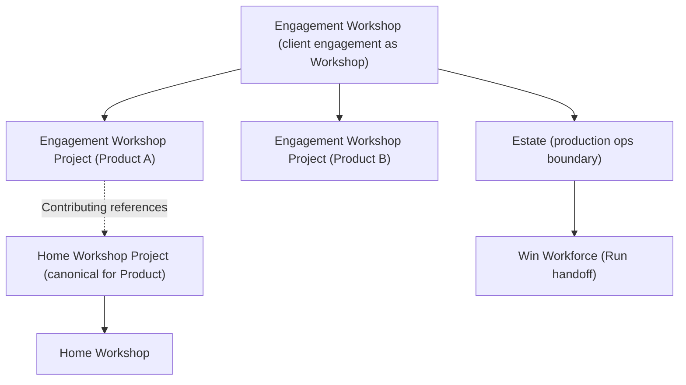

# Engagement Engineering — Extension to ACE

## What this document is

Base ACE — the model in [`../ace/`](../ace/) — describes how an organization develops software with human–agent teams in workshops, workshop projects, and workspaces. It is sufficient when the organization that builds the software is also the organization that runs it in a single-tenant mental model.

When software is **delivered to a client** — typically a Bank, in Zeta's case — additional concepts and machinery are needed. This document is the explicit argument for those additions, and the boundary that separates them from base ACE.

The goal is to keep base ACE simple and to push the multi-tenant / program-managed / customer-facing concerns into this extension cleanly, so that:

- Base ACE is unaffected by extension changes.
- Extension changes do not require rewriting base concepts.
- A reader can decide which model applies based on their context.

## What changes when there is a client

Base ACE assumes one Organization, one body of practice, one workforce, one Foundry. Client delivery reframes **where Products live** and **how Engagements are modeled**, without changing the six workspace types or the Product Evolution Cycle.

### 1. Engagement is a Workshop

An **Engagement** (e.g. Bank-X) is modeled as a **Workshop** — the same ACE construct as an internal product-team Workshop, but scoped to the client program. The Engagement Workshop is program-managed and consolidates Velocity, Predictability, Quality, Cost, and Risk across the Products delivered under it. Source: [`../1.TODO`](../1.TODO) lines 5-12.

### 2. Workshop Project corresponds to a Product; Products inside an Engagement

In UPIM, **Product** is a Definition Model entity. In ACE, a **Workshop Project** corresponds to a Product: it is the **locus where that Product is evolved**; it is **not** the Product itself.

Each Product Zeta builds for Bank-X is evolved in an **Engagement Workshop Project** — a Workshop Project **inside** the Bank-X Engagement Workshop. That Workshop Project contains the same six workspace types and the same Product Evolution Cycle as base ACE.

### 3. Home Workshop, Home Workshop Project, Contributing Workshop Project

- **Home Workshop** — The Workshop in which a given Workshop Project **primarily lives**. Every Workshop Project has a Home Workshop.
- **Home Workshop Project** — The **canonical** Workshop Project for a Product when that Product spans multiple Workshops over time. Evolution, objectives, maturity, and success for the Product are anchored at the Home Workshop Project's repositories and workspaces.
- **Engagement Workshop Project** — Any Workshop Project that lives inside an **Engagement Workshop**.
- **Contributing Workshop Project** — A **special** Engagement Workshop Project that holds a **reference** to a Home Workshop Project elsewhere (the Product's canonical locus). Contributing Workshop Projects reuse non-work repository data from the Home Workshop per product policy; work repositories diverge by Workshop where needed. Source: [`../1.TODO`](../1.TODO) lines 7-8 (historical "Contributing Workshop" phrasing maps to Contributing Workshop Project).

**Standalone engagement-only Products** — Products that exist only inside one client engagement — have no separate Home Workshop Project outside the Engagement Workshop. In that case the **Engagement Workshop is the Home Workshop** for their Workshop Project, and that sole Engagement Workshop Project is **trivially** the Home Workshop Project for that Product.

**Products that span internal and client work** — A Product may have a Home Workshop Project in a permanent internal Workshop and one or more Contributing Workshop Projects in Engagement Workshops. The Home Workshop Project remains canonical; Contributing Workshop Projects reference it.

### 4. Workforce expansion

Base ACE has the Workforce Repository (WFR) holding internal agents (human and AI), role bindings, and skills. The engagement extension adds:

- **Win Workforce** is associated with the Foundry where a Product's Home Workshop lives. It is the workforce concerned with realizing customer Win Outcomes (UPIM Win Track). Source: [`../1.TODO`](../1.TODO) line 15.
- **Win Workforce directs Run-related work** to the appropriate **Estate** (deployment locus) based on which Estate owns the relevant deployment of the Product. This is a **production-operations boundary** — not part of ACE's software-manufacturing ontology. Source: [`../1.TODO`](../1.TODO) lines 16-17.
- **Workforce in a Foundry is associated with Engagements** for a period of time. Productivity is measured through the Engagement program; work-done is seen through Workshops and the Estate boundary. Source: [`../1.TODO`](../1.TODO) lines 27-28.

**Win Engineering (aka Product Operations Engineering)** is a **UPIM** construct (tooling for Support, Advocacy, Feedback, Product Analytics). It is **not** Engagement Engineering; do not conflate client-delivery extension with UPIM's Win Track engineering body. See [`../glossary.md`](../glossary.md).

### 5. Estate as the production-operations boundary

An **Estate** is the deployment locus where a Product is run. It contains the SRE workforce. A single Product may be deployed across multiple Estates. The engagement extension names Estate so that Run-related work and operational metrics have a clear handoff surface from software manufacturing to production operations. Source: [`../1.TODO`](../1.TODO) lines 14, 17.

The extension **does not** fully specify production-operations ontology (e.g. Zeta-internal naming for worlds and landlords). That body of work is intentionally **out of scope** of this folder.

### 6. Engagement-specific repositories and references

Engagement Engineering must define which data is **owned** by the Engagement Workshop and which data is **referenced** from elsewhere (Home Workshop Project, Estate, etc.). Engagement-specific repositories are modeled accordingly. Source: [`../1.TODO`](../1.TODO) line 20.

Operational metrics from Estates are relevant for Engagement. The Win Track ensures that relevant operational metrics are pushed to the appropriate Engagement repositories — which requires Engagement to reference the relevant Estates and the Product Deployments within them. Source: [`../1.TODO`](../1.TODO) line 19.

### 7. Customer-facing release artifacts

Release in an Engagement context produces customer-facing artifacts that base ACE does not require:

- Customer Product Artifacts
- Studio Component Artifacts
- Verification Artifacts
- Documentation Artifacts (Admin Guides, User Guides, Developer Guides)
- Evidence Artifacts
- Knowledge Base

Source: [`1.TODO`](1.TODO) lines 17-26.

The Release Workspace's behavior is unchanged in shape but extended in artifact catalog. Governance scenarios on the QA → Release transition gain customer-evidence requirements.

## Engagement engineering objectives

Translating the model above into an engineering program, the objectives stated in [`1.TODO`](1.TODO) lines 7-14 are:

- Quality coverage, monitoring, and enforcement.
- Project health monitoring and enforcement.
- Requirements health monitoring.
- Sprint health monitoring.
- Release plan risk monitoring and enforcement.
- Provide Tempus-like visibility to the Workshop.
- Track experience of people by their involvement in Workshops.

These objectives are stated in concrete tooling language because they are operational; they cash out as scenarios on the Workspaces in an Engagement Workshop Project.

## Engineering approach

The approach in [`1.TODO`](1.TODO) lines 28-37:

- Bring all data to **Data Marts**.
- Build **event streams** from various sources.
- Model the Workshop as a **Hub** — Machines, Tools, Teams, Channels, Scenarios. (This aligns with the ACE Workshop concept; the engagement extension realizes it concretely as Olympus Hub Workbench.)
- Build **data applications, reports, dashboards, alerts**.
- **Agents to monitor, enforce, and recommend** — extending the Human-Agent Team pattern into the cross-Workshop monitoring layer.
- **Agent skills** corresponding to Engagement Operating Model and Studio Operating Model (rituals, reviews).
- **Jira automation**, **Foundry CI automation**, **Weave CD automation** — concrete integration points.

This approach is engineering-shape — it identifies where extension capabilities meet existing systems.

## Concrete tooling

Tenant developer tooling is the most visible concrete realization of Engagement Engineering. From [`tenant-developer-tooling/TD.TODO`](tenant-developer-tooling/TD.TODO):

- **Olympus Workspace** for each Foundry Workshop (multiple workspaces per workshop).
- **Olympus Rocket (IDE)** for each Foundry Workshop.
- Workshop → Workspace → Rocket (IDE) hierarchy.
- Editing content across all the foundry repositories.
- Foundry Workshops for Tenants — i.e., tenants can have their own Workshops.
- Workshop is also viewable as an **Olympus Hub Workbench**.
- Workshop has a **Rocket profile** that determines default IDE plugins, views, and settings.

## Per-workspace effects (brief)

Each base ACE workspace is unchanged in shape but may have engagement-extended scenarios:

- **Product Specification.** When a Product has a Home Workshop Project and Contributing Workshop Projects, specifications are anchored at the **Home Workshop Project**; Contributing Workshop Project specifications reference non-work repositories at Home per repository policy.
- **UX Design.** Largely unchanged in shape; design system standards may be tenant-aware.
- **Development.** Cross-Workshop work needs explicit orchestration. A Product evolving across multiple Workshop Projects needs intent routing that respects Home / Contributing distinctions.
- **QA.** Tenant-specific verification requirements feed into governance scenarios on the QA → Release transition. Tempus-like visibility requirements (project health, sprint health, requirements health) are realized as QA scenarios.
- **Release.** Customer-facing artifact production (Customer Product Artifacts, Documentation Artifacts, Evidence Artifacts, Knowledge Base) is added.
- **Governance.** Customer-evidence requirements add governance scenarios on every transition where customer-facing evidence must be captured.

These are *direction-of-travel* notes; per-workspace engineering for the engagement context grows as engagement-aware scenarios are specified.

## What this extension does not change

The extension does **not** change:

- The six workspace types in ACE.
- The Product Evolution Cycle (intent flow). Customer-side concerns add scenarios; they do not change the cycle's edges.
- The base repository taxonomy. New repositories may be added (Engagement-specific repositories), but base repositories remain.
- The fundamental claim of ACE that effective use of agents requires explicit Product, Work, and Operating models.

## Read next

- [`README.md`](README.md) — engagement-engineering folder overview.
- [`1.TODO`](1.TODO) — current engagement-engineering backlog.
- [`tenant-developer-tooling/TD.TODO`](tenant-developer-tooling/TD.TODO) — concrete tenant tooling.
- [`../ace/relationships.md`](../ace/relationships.md) — placement of this extension relative to ACE, UPIM, and the Foundry Platform.
- [`../1.TODO`](../1.TODO) — top-level conceptual notes that source much of this extension argument.
