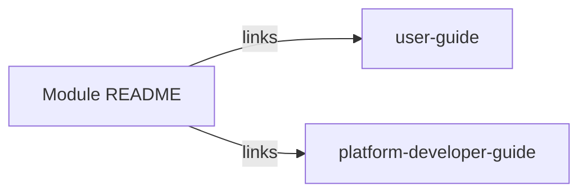

# Foundry Platform documentation style guide

This guide defines voice, structure, and cross-linking rules for all documentation under [`foundry/foundry-platform/`](../README.md). Use it when authoring new docs, normalizing indexes after a restructure, or planning substantive rewrites (see [`REWRITE-TODO.md`](../REWRITE-TODO.md)).

## Three documentation tracks

Every platform module (except content-only folders such as `work-catalogues/platform-defaults/`) organizes documentation into three tracks:

| Track | Location | Primary audience | Purpose |
|-------|----------|------------------|---------|
| **Concepts** | `{module}/README.md` | Anyone | What the module is, boundaries, architecture summary, links to deeper docs |
| **User guide** | `{module}/user-guide/` | Admins, builders, operators | Task-oriented how-to: accomplish a goal in the product |
| **Foundry Platform developer guide** | `{module}/platform-developer-guide/` | Engineers building Foundry | Implementation specs: requirements, APIs, schemas, design discussions |



**Naming:** Use **Foundry Platform developer guide** in headings and index tables. The folder is `platform-developer-guide/`; do not use bare "developer guide" in user-facing text.

**Out of scope for module trees:** `_deferred/`, `platform-defaults/` content artifacts, and backlog files (`*.TODO`) — they follow their own conventions.

## ACE and UPIM alignment

All three tracks should respect the platform’s relationship to the model and schema:

- **ACE** ([`foundry/ace/`](../../ace/README.md)) — architectural constructs the platform realizes (Workshops, Workbenches, Workspaces, governance, repositories). Cite [`foundry/ace/concepts.md`](../../ace/concepts.md), [`foundry/ace/repositories.md`](../../ace/repositories.md), or [`foundry/ace/governance.md`](../../ace/governance.md) when a doc operationalizes an ACE concept.
- **UPIM** ([`foundry/product-information-model/`](../../product-information-model/README.md)) — formal entities the platform stores and mutates. Cite the relevant entity files. The platform must not introduce divergent ontology.

**Foundry vs Foundry Platform:** Bare "Foundry" in prose refers to the ACE architectural construct; **Foundry Platform** refers to this implementation. See [`foundry/glossary.md`](../../glossary.md).

**Track-specific emphasis:**

| Track | ACE/UPIM usage |
|-------|----------------|
| Module README | Explain *what* ACE concepts the module realizes and *which* UPIM entities it touches; link, do not duplicate full specs |
| User guide | Mention ACE/UPIM terms only when needed for the task (e.g. "Product Intent", "Scenario"); link to ACE/UPIM for definitions |
| Foundry Platform developer guide | Open specs with ACE concept + UPIM entities; requirements and data models must trace to UPIM |

## Cross-linking rules

1. **Module README** is the router: link to `user-guide/README.md` and `platform-developer-guide/README.md`, not to every leaf doc unless highlighting a key entry point.
2. **Prefer relative links** within `foundry-platform/` and `foundry/` (e.g. `../../ace/concepts.md`, `../management/platform-developer-guide/requirements.md`).
3. **Do not duplicate** another module’s spec in prose — link to the owning module’s Foundry Platform developer guide (e.g. Work Catalog Management engine specs live under `management/platform-developer-guide/`, not `work-catalogues/`).
4. **User guide ↔ platform developer guide:** User tasks may link to specs for "how it works under the hood"; spec docs may link to user guides for operational context. Avoid circular "see also" chains longer than one hop.
5. **Upstream context:** Platform-wide readers start at [`foundry-platform/README.md`](../README.md); module docs need not repeat the full platform mission.
6. **External references** (foundry-work-plan, engagement-engineering, propeller): link when the module depends on them; keep engagement and Propeller boundaries as in the platform README.

## Track 1: Module README (concepts)

**Voice:** Neutral, explanatory third person. Describe what the module does and why it exists in the platform.

**Include:**

- Module scope and boundaries (what is in / out of this folder)
- Relationship to ACE concepts and UPIM entities (summary + links)
- Architecture or behavior summary (diagrams welcome)
- Key design decisions or invariants (short bullets)
- **Documentation** index table (required at end of every module README)

**Do not include:**

- Step-by-step tasks (belong in `user-guide/`)
- API field lists, OpenAPI fragments, or FR-/NFR-style requirements (belong in `platform-developer-guide/`)
- Long journey narratives without a concepts framing (move to user guide or split per REWRITE-TODO)

**Standard closing section:**

```markdown
## Documentation

| Guide | Audience | Index |
|-------|----------|-------|
| Concepts | Anyone | This README |
| [User guide](user-guide/) | Admins, builders | Task-oriented usage |
| [Foundry Platform developer guide](platform-developer-guide/) | Platform engineers | Implementation specs |
```

Omit the platform-developer-guide row only when the module has no implementation specs (e.g. `work-catalogues` — engine specs live under `management/`).

## Track 2: User guide

**Voice:** Second person ("you"). Imperative steps. Assume the reader uses Foundry Web App, IDE, or CLI — not that they are implementing the platform.

### `user-guide/README.md`

- Short purpose paragraph
- **Audience** table (role → primary interest)
- **Guide contents** index table (document → description)
- Optional quick-start paths (goal → first doc)

### Individual task documents

Use this section order (add empty headers during normalization if missing; full rewrites may reorder in REWRITE-TODO):

| Section | Required | Notes |
|---------|----------|-------|
| **Purpose** | Yes | One paragraph: what the reader will accomplish |
| **Audience** | Yes | Who should use this doc (can be a sentence or table) |
| **Prerequisites** | Yes | Access, tools, prior reading |
| **Steps** | Yes | Numbered or phased; one action per step where possible |
| **Expected outcome** | Yes | How to verify success |
| **Related** | Recommended | Links to other user guides, module README, ACE/UPIM |
| **Troubleshooting** | If applicable | Common failures; link to dedicated troubleshooting doc when one exists |

**Do not:** Paste full YAML schemas, internal service names, or implementation todos — link to the Foundry Platform developer guide instead.

## Track 3: Foundry Platform developer guide

**Voice:** Specification style — precise, testable statements; third person; present tense for behavior ("The service returns…").

### `platform-developer-guide/README.md`

- Implementation overview (how this module fits the platform)
- ACE/UPIM alignment summary
- **Specification index** table (document → scope)
- Dependencies on other modules, Propeller, or engagement extensions (with links)

### Individual specification documents

Use this section order (sections may be empty placeholders during migration; substantive content tracked in REWRITE-TODO):

| Section | Required | Notes |
|---------|----------|-------|
| **Overview** | Yes | Module/subsystem role; scope of this spec |
| **ACE alignment** | Yes | Which ACE concepts this realizes; citations to `foundry/ace/` |
| **Requirements** | Yes | Functional and non-functional; use FR-/NFR- IDs when hardened (rewrite backlog) |
| **Architecture** | Yes | Components, boundaries, diagrams |
| **Interfaces** | If applicable | APIs, events, CLI, extension points |
| **Data model** | If applicable | UPIM entities, storage, lifecycles |
| **Integration** | If applicable | Other modules, git, CI, external systems |
| **Observability** | If applicable | Metrics, logs, traces, SLOs |

**Design discussions** live under `platform-developer-guide/design-discussions/` until promoted to ADRs. Label them as exploratory, not normative spec.

**Do not:** Builder-facing click paths or admin onboarding journeys — those belong in the user guide.

## FR/NFR ID convention

Assign unique IDs to verifiable requirement statements in `platform-developer-guide/requirements.md` files. This enables traceability from requirements to tests, ADRs, and implementation.

### Format

```
{MODULE}-FR-{0001}   # Functional Requirement
{MODULE}-NFR-{0001}  # Non-Functional Requirement
```

### Module codes

| Code | Module |
|------|--------|
| MGT | Management |
| WCM | Work Catalog Management |
| VAL | Validation |
| ORC | Orchestrator |
| WOR | Work Order Runtime |
| AGF | Agent Fabric |
| IDE | IDE |
| RLS | Release Tools |
| FWA | Foundry Web App |
| ADM | Platform Admin Web App |

### Usage

- Use 4-digit sequential numbers starting at 0001 per module
- Apply IDs to verifiable statements: SHALL, MUST, capability bullets, explicit behaviors
- FR = Functional Requirement (what the system does)
- NFR = Non-Functional Requirement (performance, security, scalability, availability)

**Example:**

```markdown
**ORC-FR-0001:** The Workflow Engine SHALL evaluate handlers in declaration order.

**AGF-NFR-0003:** Skill version resolution MUST complete in < 200ms (p99).
```

## Templates

Copy and rename files from this folder:

| Template | Use for |
|----------|---------|
| [`module-README.template.md`](module-README.template.md) | New or restructured module landing page |
| [`user-guide-README.template.md`](user-guide-README.template.md) | `user-guide/README.md` index |
| [`user-guide-doc.template.md`](user-guide-doc.template.md) | Individual user task doc |
| [`platform-developer-guide-README.template.md`](platform-developer-guide-README.template.md) | `platform-developer-guide/README.md` index |
| [`platform-developer-guide-doc.template.md`](platform-developer-guide-doc.template.md) | Individual spec doc |

Replace `{placeholders}` with module-specific names and paths. Delete optional sections that do not apply rather than leaving "TBD" stubs in published docs.

## Restructure vs rewrite

| During documentation restructure (moves/indexes) | During rewrite backlog (REWRITE-TODO) |
|--------------------------------------------------|--------------------------------------|
| Add guide READMEs from templates | Split mixed-audience files |
| Add Documentation index table to module README | Convert journeys to task steps |
| Fix links after moves | Dedupe overlapping docs |
| Add missing section headers only | Add FR-/NFR- IDs, new prose |

When in doubt, move and index first; improve prose in a follow-up tracked in REWRITE-TODO.
