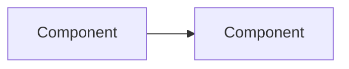

# {Module display name}

**Module scope:** {One sentence: what this folder documents and what it does not cover.}

## What this module does

{2–4 paragraphs: purpose in the Foundry Platform, primary responsibilities, and how it fits adjacent modules.}

## ACE concepts realized

{Which ACE constructs this module operationalizes. Link rather than restate full definitions.}

- [{Concept name}](../../ace/concepts.md) — {how this module realizes it}
- [{Repository or governance topic}](../../ace/repositories.md) — {if applicable}

See [ACE overview](../../ace/README.md) for the full model.

## UPIM entities involved

{Which UPIM layers and entities this module stores, mutates, or exposes.}

| UPIM area | Entities / artifacts | Role in this module |
|-----------|----------------------|---------------------|
| {Layer} | {Entity names} | {Brief role} |

See [Product Information Model](../../product-information-model/README.md) and relevant entity files under that folder.

## Boundaries

**In scope for this module:**

- {Bullet}
- {Bullet}

**Out of scope (documented elsewhere):**

- {Bullet} — see [{other module}](../{other-module}/README.md)
- {Bullet}

## Architecture summary

{High-level diagram or prose: main components, data/control flow, key invariants.}

### Key design decisions

- **{Decision}** — {Rationale in one or two sentences.}
- **{Decision}** — {Rationale.}

## Dependencies

| Dependency | Relationship |
|------------|--------------|
| [{Module}](../{module}/README.md) | {Consumes / provides / coordinates} |
| [Propeller](../../propeller/README.md) | {If applicable} |
| [Engagement Engineering](../../engagement-engineering/README.md) | {If engagement-specific behavior} |

## Documentation

| Guide | Audience | Index |
|-------|----------|-------|
| Concepts | Anyone | This README |
| [User guide](user-guide/) | Admins, builders | Task-oriented usage |
| [Foundry Platform developer guide](platform-developer-guide/) | Platform engineers | Implementation specs |
