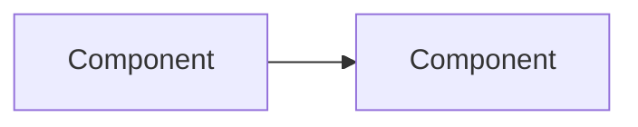

# {Specification title}

## Overview

{Module or subsystem role; scope of this spec. One or two paragraphs.}

## ACE alignment

{Which ACE concepts this specification realizes. Link to `foundry/ace/` rather than restating definitions.}

| ACE concept | Realization in this spec |
|-------------|-------------------------|
| [{Concept}](../../ace/concepts.md) | {Brief mapping} |

## Requirements

{Functional and non-functional requirements. Use FR-/NFR- IDs when hardened (see REWRITE-TODO).}

### Functional requirements

- **FR-{id}** — {Requirement statement}

### Non-functional requirements

- **NFR-{id}** — {Requirement statement}

## Architecture

{Components, boundaries, control/data flow. Diagrams welcome.}

## Interfaces

{APIs, events, CLI commands, extension points — if applicable.}

| Interface | Purpose |
|-----------|---------|
| {Name} | {Description} |

## Data model

{UPIM entities, storage, lifecycles — if applicable.}

| Entity / artifact | Role |
|-------------------|------|
| {Name} | {Stored / mutated / exposed} |

See [Product Information Model](../../product-information-model/README.md).

## Integration

{Dependencies on other modules, git, CI, external systems — if applicable.}

| System / module | Integration |
|-----------------|-------------|
| [{Module}](../{module}/platform-developer-guide/) | {Contract or flow} |

## Observability

{Metrics, logs, traces, SLOs — if applicable.}

| Signal | Purpose |
|--------|---------|
| {Metric / log} | {What it indicates} |

## Related documentation

- [Foundry Platform developer guide index](README.md)
- [{Module} concepts](../README.md)
- [{Module} user guide](../user-guide/) — operational context
