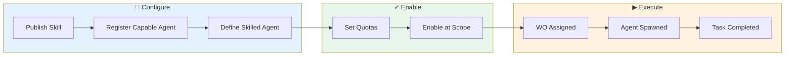
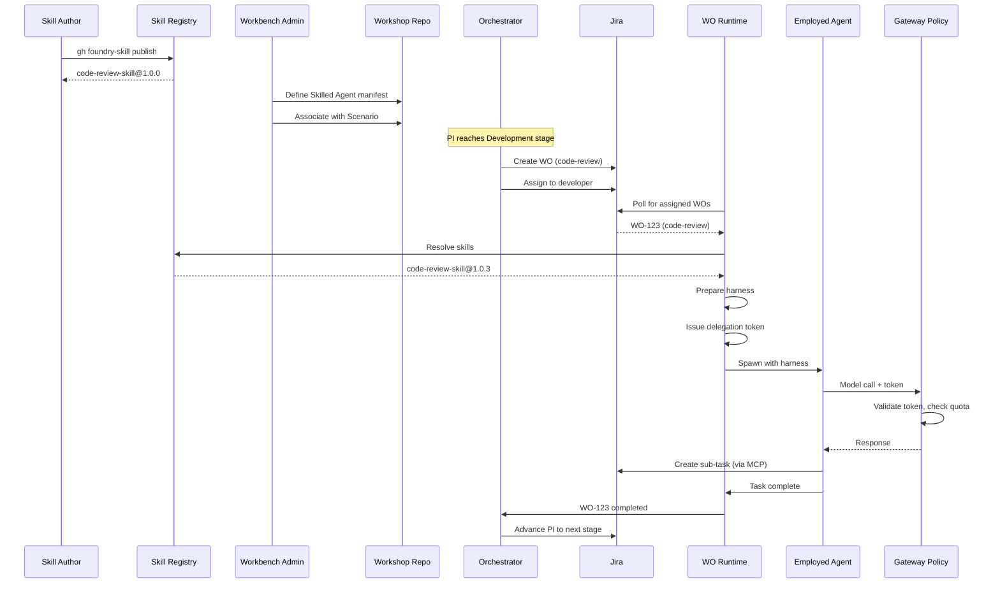

# Agent Lifecycle

## Purpose

Understand how agents are configured, enabled, and used in Foundry—from publishing a Skill to tracking an Employed Agent's task completion. This guide helps you configure the Agent Fabric infrastructure that powers automation.

## Audience

| Role | When to use this guide |
|------|------------------------|
| Foundry Admin | Configuring Capable Agents at Foundry level, managing quotas |
| Workshop Admin | Enabling/disabling agents at Workshop level, reviewing usage |
| Workbench Manager | Configuring Skilled Agents for Workspaces, monitoring agent costs |

## Prerequisites

- Access to the [Agent Console](../../foundry-web-app/platform-developer-guide/pages/consoles/workforce/agent-console.md) in the Foundry Web App
- Understanding of [ACE Agent concepts](../../../ace/concepts.md) — Capable Agent, Skilled Agent, Employed Agent
- Familiarity with Workspace Sessions and Work Orders

## Lifecycle overview



The journey involves three modules:
- **Agent Fabric** — Skills, Capable Agents, quotas, gateway policy
- **WO Runtime** — Agent spawning, task execution, session management
- **Orchestrator** — WO creation, assignment, completion handling

## Phase 1: Skill Publication

**Location:** Developer workstation  
**Actor:** Skill Author (developer creating reusable capabilities)

### Step 1.1: Create Skill Package

The author scaffolds a new skill:

```bash
gh foundry-skill init code-review-skill
```

This creates the standard structure:

```
code-review-skill/
├── SKILL.md           # Skill manifest (required)
├── prompts/           # Prompt templates
│   └── review.md
├── rules/             # Cursor rules, constraints
│   └── review-rules.mdc
├── templates/         # Code templates, examples
└── tests/             # Evaluation test cases
    └── eval.yaml
```

### Step 1.2: Build and Test

```bash
gh foundry-skill build
gh foundry-skill test
```

The test command runs the evaluation harness against sample inputs.

### Step 1.3: Publish to Registry

```bash
# Publish to Foundry registry (private)
gh foundry-skill publish --registry foundry

# Or publish to Global registry (public)
gh foundry-skill publish --registry global
```

The skill is now available as `code-review-skill@1.0.0` in the registry.

## Phase 2: Skilled Agent Definition

**Location:** Workshop Definition Repository  
**Actor:** Workshop/Workbench Admin

### Step 2.1: Define Skilled Agent Manifest

In the Workbench's workspace scenarios folder:

```yaml
# workbenches/checkout/workspaces/development/skilled-agents/code-reviewer.yaml

name: code-reviewer
description: Reviews code changes for quality and standards

capable-agents:
  - cursor-agent
  - claude-code
  fallback-order: [cursor-agent, claude-code]

skills:
  - name: code-review-skill
    version: "^1.0.0"
    registry: foundry
  - name: language-standards
    version: "^2.0.0"
    registry: global

guardrails:
  max-files-per-review: 20
  require-human-approval-for: [security-critical]
  
evaluation:
  min-coverage: 0.8
  required-checks: [lint, security-scan]
```

### Step 2.2: Associate with Scenario

```yaml
# workbenches/checkout/workspaces/development/scenarios/code-review.yaml

name: code-review
description: Review pull request for code quality

skilled-agent: code-reviewer

inputs:
  - pull-request-url
  - review-type  # quick | thorough

outputs:
  - review-comments
  - approval-status
```

## Phase 3: Work Order Assignment

**Location:** Orchestrator  
**Actor:** Orchestrator (automated) or User (manual)

### Step 3.1: WO Created

When a Product Intent reaches the Development Workspace:

1. Orchestrator evaluates workflow and matches `work-order-completed` event
2. Workflow action creates a WO for `code-review` scenario
3. WO created in Jira with `foundry-scenario: code-review`

### Step 3.2: WO Assigned

Orchestrator assigns the WO:

1. Identify candidate users (Development Workspace members)
2. Filter by skill match (users who can do code-review)
3. Score by capacity and affinity
4. Assign to selected developer

### Step 3.3: Session Activation

If the developer's session is not running:

1. Check auto-activation config
2. If enabled and scenario matches triggers, activate session
3. Send activation message to Coder via message queue

## Phase 4: Workspace Session Creation

**Location:** WO Runtime  
**Actor:** WO Runtime Daemon

### Step 4.1: Session Provisioned

When the session activates:

1. WO Runtime reads Workshop Definition Repo
2. Merges Workshop + Workbench workspace configuration
3. Provisions Coder workspace with merged devcontainer

### Step 4.2: Skills Installed

At session start:

```
1. WO Runtime collects all Skilled Agent manifests for this Workspace
2. For each skill reference:
   - Check Foundry registry first
   - Fall back to Global registry
   - Resolve version constraint (^1.0.0 → 1.0.3)
   - Download if not cached
3. Install to ~/.foundry/skills/{skill}@{version}/
4. Set FOUNDRY_SKILLS_PATH environment variable
```

### Step 4.3: WO Runtime Daemon Starts

The daemon begins polling Jira for assigned WOs:

```
┌─────────────────────────────────────────────┐
│          WO Runtime Daemon                  │
│                                             │
│   1. Poll Jira (via MCP) for WOs           │
│   2. Find WO-123 assigned to this user     │
│   3. Load Scenario definition              │
│   4. Prepare to spawn agent                │
└─────────────────────────────────────────────┘
```

## Phase 5: Employed Agent Spawning

**Location:** WO Runtime (Workspace Session)  
**Actor:** WO Runtime Daemon

### Step 5.1: Resolve Capable Agent

```
1. Read Skilled Agent manifest (code-reviewer)
2. Get fallback order: [cursor-agent, claude-code]
3. Check Capable Agent registry:
   - Is cursor-agent enabled at Foundry level? Yes
   - Is cursor-agent enabled at Workbench level? Yes
   - Are credentials available? Yes
4. Select cursor-agent as the Capable Agent
```

### Step 5.2: Check Quota

```
1. Get applicable quotas:
   - Foundry: $50K/month, used $12K → $38K remaining
   - Workbench (Checkout): $2K/month, used $800 → $1.2K remaining
   - (Workbench, User): $500/month, used $120 → $380 remaining
2. Effective quota = min($38K, $1.2K, $380) = $380
3. Quota sufficient? Yes → proceed
```

### Step 5.3: Prepare Harness

WO Runtime assembles the execution environment:

```
┌─────────────────────────────────────────────────────────────────┐
│                    Agent Harness                                 │
│                                                                  │
│  Environment Variables:                                          │
│    FOUNDRY_WO_ID=WO-123                                         │
│    FOUNDRY_SCENARIO=code-review                                 │
│    FOUNDRY_WORKBENCH=checkout                                   │
│    FOUNDRY_SKILLS_PATH=~/.foundry/skills                        │
│    FOUNDRY_DELEGATION_TOKEN=eyJ...                              │
│                                                                  │
│  MCP Connectors:                                                 │
│    - jira-mcp (for task management)                             │
│    - github-mcp (for PR access)                                 │
│                                                                  │
│  Skills Loaded:                                                  │
│    - code-review-skill@1.0.3                                    │
│    - language-standards@2.1.0                                   │
│                                                                  │
│  Knowledge Context:                                              │
│    - Workshop: coding standards, review guidelines              │
│    - Workbench: Checkout architecture, conventions              │
│    - WO: PR details, related PI context                         │
└─────────────────────────────────────────────────────────────────┘
```

### Step 5.4: Issue Delegation Token

```
1. WO Runtime requests delegation token from Agent Fabric
2. Token encodes:
   - Session owner identity
   - WO scope (WO-123)
   - Quota allocation
   - Expiry time
3. Token passed to agent as FOUNDRY_DELEGATION_TOKEN
```

### Step 5.5: Spawn Agent Process

```bash
# WO Runtime spawns Cursor Agent with harness
cursor-agent \
  --scenario code-review \
  --skills-path ~/.foundry/skills \
  --delegation-token $FOUNDRY_DELEGATION_TOKEN \
  --context-file /tmp/wo-123-context.json
```

The Employed Agent is now running.

## Phase 6: Task Execution

**Location:** Workspace Session  
**Actor:** Employed Agent

### Step 6.1: Agent Receives Task

The agent reads its task from the Scenario definition:

```
Task: Review PR #456 for code quality
Inputs:
  - pull-request-url: https://github.com/acme/checkout/pull/456
  - review-type: thorough
```

### Step 6.2: Agent Executes with Skills

The agent uses loaded skills:

```
1. Load code-review-skill prompts
2. Fetch PR diff via github-mcp
3. Apply language-standards rules
4. Generate review comments
5. Check against guardrails (max 20 files? yes)
```

### Step 6.3: Model Calls via Gateway

All LLM calls go through the Gateway Policy Layer:

```
Agent → Gateway Policy Layer → LiteLLM → Claude API
                │
                ├── Validate delegation token
                ├── Check quota (decrement $0.15)
                ├── Inject credentials
                ├── Log for audit
                └── Return response
```

### Step 6.4: Create Sub-Tasks (if needed)

If the agent identifies work requiring human input:

```
1. Agent calls jira-mcp to create sub-task
2. Sub-task created with:
   - foundry-parent-wo: WO-123
   - foundry-task-type: human
   - Description: "Review security-critical change in auth.ts"
3. WO Runtime detects human task, surfaces in IDE
```

### Step 6.5: Task Completion

Agent completes and reports:

```json
{
  "task_id": "TASK-789",
  "status": "completed",
  "outputs": {
    "review-comments": ["..."],
    "approval-status": "approved-with-comments"
  },
  "metrics": {
    "files_reviewed": 12,
    "comments_generated": 8,
    "model_cost_usd": 0.45
  }
}
```

## Phase 7: Work Order Completion

**Location:** WO Runtime → Orchestrator  
**Actor:** WO Runtime Daemon

### Step 7.1: WO Runtime Reports Completion

```json
{
  "work_order": "WO-123",
  "verdict": "success",
  "completed_at": "2026-05-28T15:30:00Z",
  "metrics": {
    "total_tasks": 3,
    "agent_tasks": 2,
    "human_tasks": 1,
    "agent_cost_usd": 0.45
  }
}
```

### Step 7.2: Orchestrator Advances Item

1. Orchestrator receives completion notification
2. Updates orchestration item history
3. Evaluates next workflow handlers
4. Advances Product Intent to next stage (if gates pass)

### Step 7.3: Usage Analytics Updated

Agent Fabric records:

```
- Skill invocation: code-review-skill@1.0.3, 1 invocation
- Cost attribution: Workbench=Checkout, User=alice, $0.45
- Automation coverage: code-review scenario = automated
```

## Sequence Diagram



## Error Scenarios

### Quota Exhausted

```
1. Agent makes model call
2. Gateway checks quota → exhausted
3. Gateway returns quota error
4. WO Runtime pauses task with "quota-exhausted" status
5. Task resumes when quota replenishes (next billing cycle or manual top-up)
```

### Capable Agent Unavailable

```
1. WO Runtime checks cursor-agent → disabled at Workbench level
2. Fallback to claude-code → enabled, credentials available
3. Spawn with claude-code instead
4. Task executes normally
```

### Skill Not Found

```
1. WO Runtime resolves code-review-skill@^1.0.0
2. Not found in Foundry registry
3. Not found in Global registry
4. Task fails with "skill-not-found" error
5. Admin notified to publish or update manifest
```

## Key Touchpoints

| Phase | Module | Service/Component |
|-------|--------|-------------------|
| Skill Publication | Agent Fabric | Skill Registry |
| Skilled Agent Definition | Agent Fabric | Skilled Agent manifest |
| WO Assignment | Orchestrator | Workflow Engine |
| Session Creation | WO Runtime | Session Manager |
| Skill Installation | WO Runtime + Agent Fabric | Skill Registry |
| Agent Spawning | WO Runtime | Agent Spawner |
| Delegation Token | Agent Fabric | Gateway Policy |
| Task Execution | WO Runtime | Employed Agent |
| Model Calls | Agent Fabric | Gateway Policy Layer |
| Completion | WO Runtime → Orchestrator | Completion Reporter |

## Expected outcome

After following this guide, you should understand:
- How to configure Capable Agents at each hierarchy level
- Where to manage agent quotas and monitor costs
- How to define Skilled Agents for Workspaces
- How to troubleshoot agent availability and quota issues

## Related

### Concepts

- [Agent Model](../../concepts/agent-model.md) — Three-tier hierarchy (Capable → Skilled → Employed)
- [Skill](../../concepts/skill.md) — Reusable capability package for agents
- [Delegation](../../concepts/delegation.md) — Authority transfer from human to agent via tokens
- [Work Order](../../concepts/work-order.md) — Instantiation of a Scenario for execution
- [Scenario](../../concepts/scenario.md) — Ingress contract defining what work a Workspace accepts
- [Capable Agent](../concepts/capable-agent.md) — Whitelisted agent system (module-specific)
- [Skilled Agent](../concepts/skilled-agent.md) — Local manifest combining skills + guardrails (module-specific)
- [Quota Management](../concepts/quota-management.md) — Configurable limits (module-specific)

### Guides and Consoles

- [Agent Console](../../foundry-web-app/platform-developer-guide/pages/consoles/workforce/agent-console.md) — Web App console for agent management
- [Workforce Overview](../../foundry-web-app/platform-developer-guide/pages/consoles/workforce/workforce-overview.md) — Team and agent capacity summary
- [Module README](../README.md) — Agent Fabric boundaries and architecture
- [Skilled Agents spec](../platform-developer-guide/skilled-agents.md) — Implementation specs for Skilled Agents
- [Capable Agents spec](../platform-developer-guide/capable-agents.md) — Capable Agent registry schema
- [Gateway Policy spec](../platform-developer-guide/gateway-policy.md) — Gateway configuration details
- [Work Order lifecycle](../../work-order-runtime/user-guide/work-order-lifecycle.md) — How agents execute Work Orders
- [Product Intent journey](../../orchestrator/user-guide/product-intent-journey.md) — How agents fit in the PI flow

## Troubleshooting

| Symptom | Likely cause | What to do |
|---------|--------------|------------|
| Agent not spawning | Capable Agent disabled at Workbench level | Check Agent Console > enable cascade status |
| Quota exceeded mid-task | Usage hit limit before task completed | Task enters recoverable failure; resumes when quota refreshes |
| Skill not found | Skill not published or version constraint unresolvable | Check Skill Registry; verify version constraints in Skilled Agent manifest |
| Fallback not working | No alternative Capable Agent enabled | Enable fallback agents at appropriate scope level |
| Agent cost unexpectedly high | Task using expensive model | Review model selection in Skilled Agent manifest; adjust cost caps |
