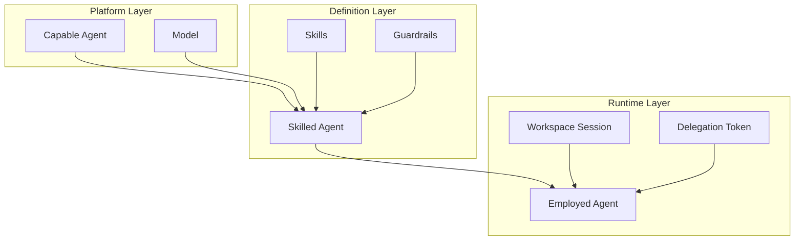

# Agent Model

**Module scope:** Agent architecture — Capable Agents, Skilled Agents, Employed Agents, and the Access Gateway.

## Overview

Foundry uses a three-tier agent model that separates platform capabilities from domain expertise and runtime execution. This model enables:

- **Flexible agent selection** — Different capable agents (Cursor, Copilot, Claude Code) can be used based on availability and preference
- **Reusable skills** — Skills are defined once and can be used by any compatible capable agent
- **Delegated authority** — Employed agents act on behalf of session owners with proper attribution
- **Centralized governance** — Access Gateway enforces quotas, accounting, and audit

## Agent Hierarchy

| Layer | Entity | Scope | Lifecycle |
|-------|--------|-------|-----------|
| **Platform** | Capable Agent | Foundry / Workshop / Workbench | Long-lived, whitelisted |
| **Platform** | Model | Per Capable Agent | Configured per level |
| **Definition** | Skilled Agent | Per Workspace Type, per Scenario | Versioned with Workshop repo |
| **Runtime** | Employed Agent | Per Workspace Session | Ephemeral, session-bound |

## Agent Types

### Capable Agent

A whitelisted frontier model or agent system that provides core capabilities: context compilation, orchestration, tool use, swarm formation, memory.

**Examples:** Cursor Agent, Copilot, Claude Code, Codex CLI

**Managed at:** Foundry, Workshop, or Workbench level with enable/disable cascade and credential resolution.

→ [capable-agents.md](capable-agents.md)

### Skilled Agent

An agent definition that combines a Capable Agent with specific Skills, Guardrails, and Evaluation criteria. Defined per (Workspace Type, Scenario).

**Components:**
- Compatible Capable Agents and Models
- Skill packages (SKILL.md + supporting files)
- Guardrails (constraints on behavior)
- Evaluation metrics

→ [skilled-agents.md](skilled-agents.md)

### Employed Agent

A Skilled Agent instantiated in a Workspace Session to perform work. Acts on delegated authority of the session owner.

**Properties:**
- Scoped to one Workspace Session
- Uses session owner's credits and quota
- Peer or assistant role (based on skill autonomy)
- All activity attributed to session owner

→ [employed-agents.md](employed-agents.md)

## Access Gateway

The Foundry Agent Access Gateway is the centralized entry point for all model calls from Employed Agents. It handles:

- **Token translation** — Delegation tokens → provider-specific tokens
- **Quota enforcement** — Per session owner limits
- **Accounting** — Cost attribution to session owner
- **Audit** — All calls logged with session owner attribution

→ [access-gateway.md](access-gateway.md)

## Relationship to Seer Agent Model

The Foundry agent model is inspired by but distinct from the [Seer/Olympus Hub agent model](../../../olympus-hub-docs/02-system-design/agent-model.md):

| Seer Concept | Foundry Equivalent | Notes |
|--------------|-------------------|-------|
| Capable AI Agent | Capable Agent | General capabilities |
| Skilful AI Agent | Skilled Agent | Domain expertise via skills |
| Scenario as Agent | Employed Agent (via Scenario) | Runtime instantiation |
| Delegation Access Token | Delegation Token | Authority model |

Key difference: Foundry agents operate in product development workspaces; Seer agents operate in customer operations.

## Read Next

- [capable-agents.md](capable-agents.md) — Capable Agent registry and management
- [skilled-agents.md](skilled-agents.md) — Skilled Agent definition and skills
- [employed-agents.md](employed-agents.md) — Runtime instantiation and delegation
- [access-gateway.md](access-gateway.md) — Token flow, quota, and audit
- [../work-order-runtime/](../work-order-runtime/README.md) — How agents execute Work Orders
