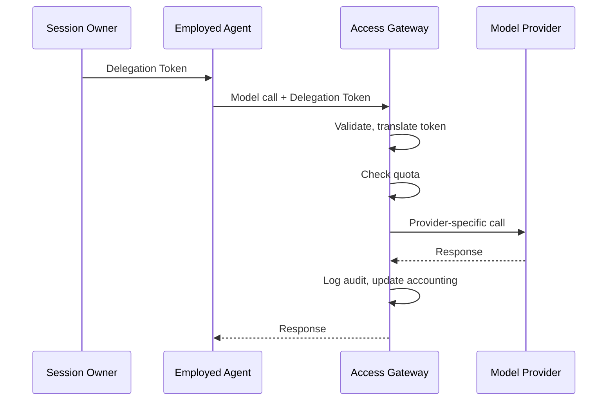

# Foundry Agent Access Gateway

The Foundry Agent Access Gateway is the centralized entry point for all model calls from Employed Agents. It provides token translation, quota enforcement, cost accounting, and audit logging.

## Purpose

The Access Gateway serves several critical functions:

| Function | Description |
|----------|-------------|
| **Token Translation** | Converts Delegation Tokens to provider-specific tokens |
| **Quota Enforcement** | Enforces per-session-owner limits |
| **Cost Accounting** | Attributes costs to session owners |
| **Audit Logging** | Records all model calls with full attribution |

## Architecture



## Access Model

The Access Gateway exposes a standard HTTPS API that each Capable Agent expects. There is no client library required in the workspace — agents call the gateway directly.

```
┌───────────────────────────────────────────────────────────────────┐
│  Employed Agent (in Workspace Session)                            │
│                                                                   │
│  Cursor Agent ───────────────────┐                               │
│  Claude Code ────────────────────┼──► Access Gateway (HTTPS)     │
│  Copilot ────────────────────────┘                               │
│  Codex CLI ──────────────────────                                │
└───────────────────────────────────────────────────────────────────┘
                                           │
                                           │ Provider-specific calls
                                           ▼
┌───────────────────────────────────────────────────────────────────┐
│  Model Providers                                                  │
│                                                                   │
│  Anthropic  ←── Claude models                                    │
│  OpenAI     ←── GPT models, Codex models                        │
│  Google     ←── Gemini models                                    │
│  Azure      ←── Azure OpenAI models                              │
└───────────────────────────────────────────────────────────────────┘
```

## Delegation Token Flow

### Token Structure

The Delegation Token contains:

```json
{
  "session_owner": "alice@example.com",
  "session_id": "ws-dev-12345",
  "workbench_id": "product-abc",
  "workspace_type": "development",
  "granted_scopes": [
    "model:claude-opus",
    "model:claude-sonnet",
    "model:gpt-5",
    "tool:jira-mcp",
    "tool:github-mcp"
  ],
  "quota_allocation": {
    "daily_tokens": 1000000,
    "monthly_cost_usd": 500
  },
  "issued_at": "2026-05-28T02:00:00Z",
  "expires_at": "2026-05-28T14:00:00Z",
  "signature": "..."
}
```

### Token Lifecycle

1. **Issuance** — WO Runtime generates Delegation Token for Employed Agent
2. **Usage** — Agent includes token in every model call to Access Gateway
3. **Validation** — Gateway validates signature, expiry, and scopes
4. **Translation** — Gateway translates to provider-specific auth
5. **Expiry** — Token expires; agent must request refresh

### Token Translation

The Gateway translates Delegation Tokens to provider-specific authentication:

| Provider | Translation |
|----------|-------------|
| Anthropic | API key header (`x-api-key`) |
| OpenAI | Bearer token header (`Authorization: Bearer ...`) |
| Google | OAuth token / API key |
| Azure | Azure AD token / API key |

The provider credentials are resolved from the [Capable Agent hierarchy](capable-agents.md) (Workbench → Workshop → Foundry).

## Quota Enforcement

### Quota Types

| Quota Type | Scope | Description |
|------------|-------|-------------|
| **Token limit** | Daily / Monthly | Maximum tokens consumed |
| **Cost limit** | Monthly | Maximum USD spend |
| **Request rate** | Per minute | Maximum API calls |
| **Concurrent** | Session | Maximum concurrent model calls |

### Quota Sources

Quotas are configured at multiple levels:

```
Foundry (global limits)
    │
    └── Workshop (team limits)
            │
            └── Workbench (product limits)
                    │
                    └── User (personal limits)
```

Effective quota = minimum of all applicable limits.

### Quota Enforcement Flow

```
1. Receive model call with Delegation Token
2. Extract session owner from token
3. Look up effective quota (Foundry → Workshop → Workbench → User)
4. Check current usage against quota
5. If quota exceeded:
   - Return 429 (quota exceeded)
   - Log event
6. If quota available:
   - Forward request to provider
   - Decrement quota
```

### Quota Exhaustion Behavior

| Configuration | Behavior |
|---------------|----------|
| `hard-stop` | Reject all subsequent calls (429) |
| `graceful` | Allow completion of current task, then stop |
| `warn-only` | Log warning but continue |

## Cost Accounting

### Cost Calculation

Costs are calculated per model call:

```
Cost = (input_tokens × input_price) + (output_tokens × output_price)
```

Model pricing is maintained by Foundry Admin:

```yaml
# pricing.yaml
models:
  claude-opus:
    input_price_per_1k: 0.015
    output_price_per_1k: 0.075
  claude-sonnet:
    input_price_per_1k: 0.003
    output_price_per_1k: 0.015
  gpt-5:
    input_price_per_1k: 0.010
    output_price_per_1k: 0.050
```

### Cost Attribution

Costs are attributed at multiple levels:

```
Session Owner ← Employed Agent ← Task ← Work Order ← Orchestration Item

alice@example.com
    └── $5.23 total
        ├── WO-123: $3.12
        │   ├── TASK-456: $2.10
        │   └── TASK-457: $1.02
        └── WO-124: $2.11
            └── TASK-458: $2.11
```

### Billing Reports

The Gateway provides billing reports:

- **Per user** — Total cost per session owner
- **Per workbench** — Total cost per product
- **Per workshop** — Total cost per team
- **Per model** — Total cost per model type

## Audit Logging

### Audit Record Structure

Every model call generates an audit record:

```json
{
  "timestamp": "2026-05-28T02:30:00.123Z",
  "request_id": "req-abc123",
  
  "session_owner": "alice@example.com",
  "session_id": "ws-dev-12345",
  "workbench_id": "product-abc",
  "workspace_type": "development",
  
  "employed_agent": "feature-implementation-agent",
  "capable_agent": "cursor-agent",
  "model": "claude-opus",
  
  "work_order": "WO-567",
  "task": "TASK-890",
  
  "input_tokens": 5234,
  "output_tokens": 2341,
  "cost_usd": 0.254,
  "latency_ms": 3421,
  
  "status": "success",
  "provider_request_id": "prov-xyz789"
}
```

### Audit Retention

| Retention Level | Duration |
|-----------------|----------|
| Full records | 90 days |
| Aggregated metrics | 1 year |
| Cost summaries | 7 years (compliance) |

### Audit Queries

The Gateway supports audit queries:

- By session owner
- By time range
- By work order / task
- By model
- By cost threshold

## API Specification

### Model Call Endpoint

```http
POST /v1/chat/completions
Authorization: Bearer <delegation_token>
Content-Type: application/json

{
  "model": "claude-opus",
  "messages": [
    {"role": "system", "content": "..."},
    {"role": "user", "content": "..."}
  ],
  "context": {
    "work_order": "WO-567",
    "task": "TASK-890"
  }
}
```

### Response

```http
HTTP/1.1 200 OK
X-Request-Id: req-abc123
X-Tokens-Remaining: 994766

{
  "id": "chat-xyz",
  "model": "claude-opus",
  "choices": [...],
  "usage": {
    "input_tokens": 5234,
    "output_tokens": 2341,
    "total_tokens": 7575
  }
}
```

### Error Responses

| Status | Code | Description |
|--------|------|-------------|
| 401 | `invalid_token` | Delegation token invalid or expired |
| 403 | `scope_denied` | Requested model not in granted scopes |
| 429 | `quota_exceeded` | Quota limit reached |
| 502 | `provider_error` | Upstream provider error |

## Security

### Token Validation

- Signature verification (JWT RS256)
- Expiry check
- Scope matching
- Session validation (is session still active?)

### Request Filtering

- No PII forwarding to providers (unless explicitly allowed)
- Prompt injection detection (optional)
- Rate limiting per session

### Credential Isolation

- Provider credentials never exposed to agents
- Credentials resolved server-side in Gateway
- Workspace has no direct provider access

## High Availability

- Gateway deployed across multiple regions
- Active-active configuration
- Automatic failover
- Request routing to nearest region

## Read Next

- [employed-agents.md](employed-agents.md) — How Delegation Tokens are used
- [capable-agents.md](capable-agents.md) — How credentials are managed
- [../work-order-runtime/agent-spawning.md](../work-order-runtime/agent-spawning.md) — How tokens are provisioned
