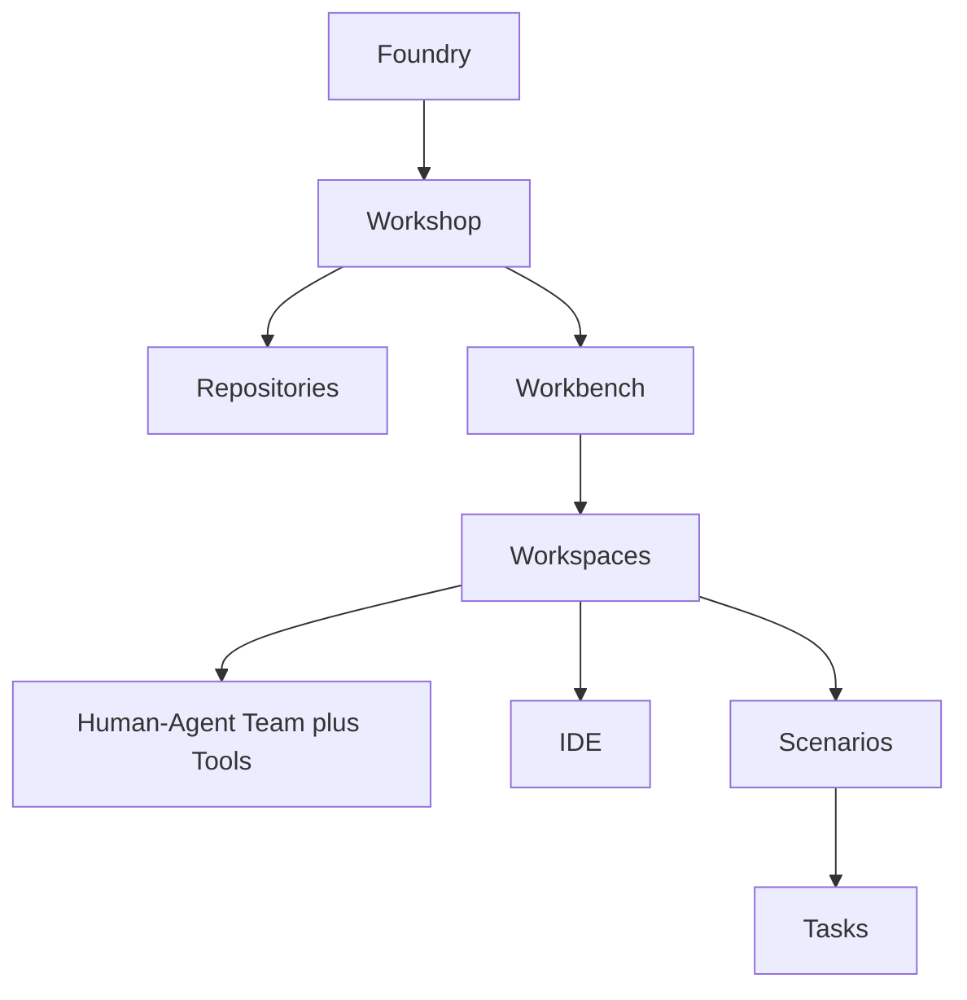

# Containment Hierarchy

The Containment Hierarchy is the Foundry → Workshop → Workbench → Workspace nesting structure that organizes products, teams, and work within the Foundry Platform.

## What it is

ACE defines a four-level containment hierarchy that structures how software products are organized and evolved:

**Foundry** is the place where software products are crafted. An Organization typically owns one or more Foundries. Each Foundry is governed by three models: Product Model (what the product is), Work Model (what work exists), and Operating Model (how the organization runs work).

**Workshop** is the body of work owned by a product team, product suite, or organization — not a single Product. A Workshop has multiple Repositories (persisting what it knows, produces, and remembers) and hosts multiple Workbenches.

**Workbench** corresponds to a Product in UPIM — it is the venue where that Product is evolved through workspaces and scenarios. A Workbench contains multiple Workspaces, each owned by a distinct functional team. Most operational metrics (KPIs, velocity, quality) are captured at the Workbench level.

**Workspace** is a specialized station inside a Workbench, owned by a single functional team. Each Workspace has a Human–Agent Team, an IDE interface, well-defined Scenarios, and creates Tasks from those scenarios.

## Where it lives in Foundry

| Level | Module Owner | Storage |
|-------|--------------|---------|
| **Foundry** | Management (provisioning, settings) | `foundry-{id}/` repo |
| **Workshop** | Management (provisioning), multiple modules (repositories) | `workshop-{id}/` repo |
| **Workbench** | Management (provisioning), Orchestrator (WO creation) | Workshop repo subdirectory |
| **Workspace** | WO Runtime (session management), Web App (views) | Session containers |

The [Metadata Service](metadata-service.md) stores and serves configuration for all levels. Configuration changes flow through the Validation module and Workshop Sync service.

## ACE/UPIM alignment

| ACE Concept | Foundry Platform Realization |
|-------------|------------------------------|
| [Foundry](../../ace/concepts.md#foundry) | Management module provisions, Foundry Admin Web App manages |
| [Workshop](../../ace/concepts.md#workshop) | Management module provisions; repositories owned by workshop teams |
| [Workbench](../../ace/concepts.md#workbench) | Corresponds to UPIM Product; Management provisions integrations |
| [Workspace](../../ace/concepts.md#workspace) | Six types: Product Specification, UX Design, Development, QA, Release, Governance |

**Naming convention:** The structural entities above do not use "Project" in their names. In ACE, "Project" is reserved for time-bound collections of work items with a specific goal. This is why "Workshop Project" was renamed to "Workbench."

## Related concepts

- [Repositories](repositories.md) — What a Workshop persists
- [Knowledge Hierarchy](knowledge-hierarchy.md) — How knowledge inherits through the hierarchy
- [Work Catalog](work-catalog.md) — How work definitions inherit through the hierarchy
- [Workspace Session](workspace-session.md) — Runtime environment within a Workspace
- [Metadata Service](metadata-service.md) — Configuration store for the hierarchy

## Further reading

- [../management/README.md](../management/README.md) — Provisioning and configuration
- [../management/platform-developer-guide/foundry-management/README.md](../management/platform-developer-guide/foundry-management/README.md) — Foundry lifecycle
- [../management/platform-developer-guide/workshop-repository.md](../management/platform-developer-guide/workshop-repository.md) — Workshop Definition Repository structure
- [../../ace/concepts.md](../../ace/concepts.md) — ACE concept definitions
