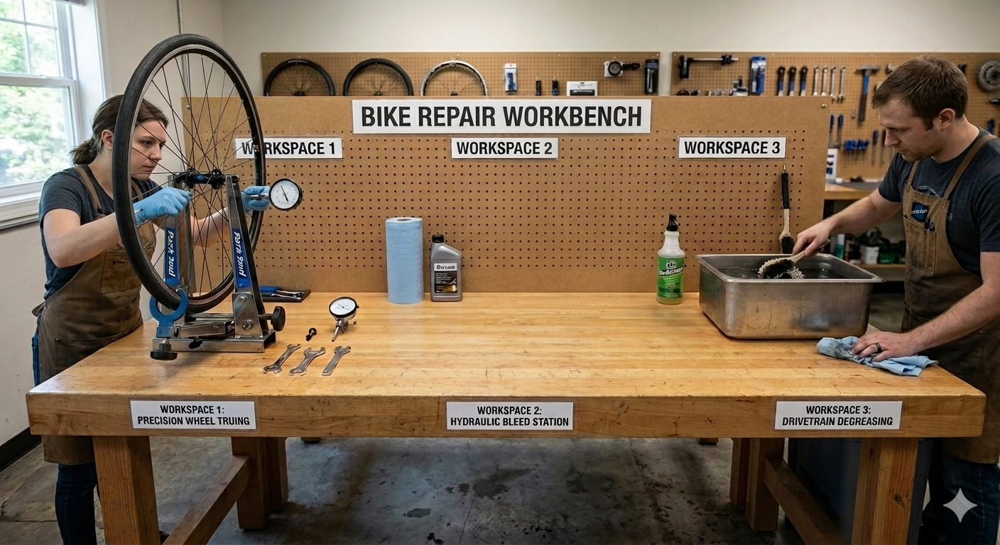

# Foundry Management

**Module scope:** Admin plane — Workshops, Workbenches, repositories, teams, configuration services, scenario management, and external tool integrations.

## Purpose

Foundry Management is the administrative foundation that makes everything else possible. Before any Work Order can execute, before any agent can be spawned, before any code can be committed — someone must provision the Workbench, configure the repositories, set up the team, and integrate the tools. That's Management.

The module treats infrastructure as configuration. A Workbench is not just a database entry — it's a GitHub org, a Jira project, a TestRail instance, a Figma workspace, all wired together. Management handles this complexity by providing declarative provisioning: admins describe what they want, and the module creates and connects all the pieces.

Management also owns the configuration pipeline: when Workshop Definition Repos are updated, Management validates the changes, syncs them to the Metadata Service, and makes them available to the platform. Orchestrator, WO Runtime, and other modules query Management for configuration — they never read from git directly.

## What this module does

- **Workshop provisioning** — create and configure Workshops (divisions/units)
- **Workbench provisioning** — create and configure Workbenches for Products
- **Repository management** — repositories as services with injection/access interfaces
- **Configuration services** — validate, sync, and serve Workshop/Workbench configuration
- **Work Catalog Management** — OI Workflow and Scenario schemas, validation, resolution, and agent recommendations
- **Work Catalog provisioning** — Foundry, Workshop, Workbench, and User Work Catalog repositories
- **Team management** — teams, roles, permissions
- **Knowledge Management** — Domain, Ontology, Practices repositories with hierarchical inheritance
- **Tenancy** — tenant provisioning, isolation, configuration, quotas
- **External tool integrations** — GitHub, Figma, TestRail, Jira, Olympus Weave

## What this module does NOT do

| Boundary | Owned By |
|----------|----------|
| Execute Work Orders | WO Runtime |
| Orchestrate work / route items | Orchestrator |
| Track WO state | Orchestrator + Jira |
| Manage agent runtime | Agent Fabric (Skills/quotas), WO Runtime (spawning) |
| Store product artifacts | Repositories (which Management provisions) |
| Define scenario templates | work-catalogues module |

## Architecture

```
┌─────────────────────────────────────────────────────────────────────────────────┐
│                              Foundry Management                                  │
│                                                                                  │
│  ┌────────────────────────────────────────────────────────────────────────────┐ │
│  │                        Configuration Services                               │ │
│  │                                                                             │ │
│  │  ┌─────────────────┐  ┌─────────────────┐  ┌─────────────────┐            │ │
│  │  │    Workshop     │  │    Workshop     │  │    Metadata     │            │ │
│  │  │   Validation    │  │      Sync       │  │    Service      │            │ │
│  │  │    Service      │  │    Service      │  │                 │            │ │
│  │  └────────┬────────┘  └────────┬────────┘  └────────┬────────┘            │ │
│  │           │ validates          │ writes             │ serves              │ │
│  │           │                    │                    │                     │ │
│  │           └────────────────────┴────────────────────┘                     │ │
│  └────────────────────────────────────────────────────────────────────────────┘ │
│                                                                                  │
│  ┌────────────────────────────────────────────────────────────────────────────┐ │
│  │                        Provisioning Services                                │ │
│  │                                                                             │ │
│  │  ┌─────────────┐  ┌─────────────┐  ┌─────────────┐  ┌─────────────┐       │ │
│  │  │  Workshop   │  │  Workbench  │  │ Repository  │  │   Foundry   │       │ │
│  │  │Provisioning │  │Provisioning │  │  Manager    │  │Provisioning │       │ │
│  │  └─────────────┘  └─────────────┘  └─────────────┘  └─────────────┘       │ │
│  └────────────────────────────────────────────────────────────────────────────┘ │
│                                                                                  │
│  ┌────────────────────────────────────────────────────────────────────────────┐ │
│  │                          Subsystems                                         │ │
│  │                                                                             │ │
│  │  ┌───────────────────┐  ┌───────────────────┐  ┌───────────────────┐      │ │
│  │  │ Foundry Mgmt      │  │ Team Management   │  │ Work Catalog Mgmt │      │ │
│  │  │                   │  │                   │  │                   │      │ │
│  │  │ • Lifecycle       │  │ • Users, teams    │  │ • OI/Scenario     │      │ │
│  │  │ • Tenancy         │  │ • Roles, perms    │  │   schemas         │      │ │
│  │  │ • Settings        │  │ • Authorization   │  │ • Resolution      │      │ │
│  │  │                   │  │                   │  │ • Validation      │      │ │
│  │  └───────────────────┘  └───────────────────┘  └───────────────────┘      │ │
│  │                                                                             │ │
│  │  ┌───────────────────┐  ┌───────────────────────────────────────────┐    │ │
│  │  │ Knowledge Mgmt    │  │                Ontology Service            │    │ │
│  │  │                   │  │    Product structure, capabilities         │    │ │
│  │  │ • Domain          │  └───────────────────────────────────────────┘    │ │
│  │  │ • Practices       │                                                    │ │
│  │  │ • Inheritance     │                                                    │ │
│  │  └───────────────────┘                                                    │ │
│  └────────────────────────────────────────────────────────────────────────────┘ │
│                                                                                  │
│  ┌────────────────────────────────────────────────────────────────────────────┐ │
│  │                       External Integrations                                 │ │
│  │  ┌─────────┐  ┌─────────┐  ┌─────────┐  ┌─────────┐  ┌─────────┐         │ │
│  │  │ GitHub  │  │  Jira   │  │TestRail │  │  Figma  │  │ Olympus │         │ │
│  │  │  App    │  │  OAuth  │  │  OAuth  │  │  OAuth  │  │  Weave  │         │ │
│  │  └─────────┘  └─────────┘  └─────────┘  └─────────┘  └─────────┘         │ │
│  └────────────────────────────────────────────────────────────────────────────┘ │
└─────────────────────────────────────────────────────────────────────────────────┘
           │                              ▲
           │ webhooks                     │ queries
           ▼                              │
    ┌─────────────┐               ┌───────┴───────┬───────────────┐
    │  Workshop   │               │               │               │
    │Definition   │               │ Orchestrator  │  WO Runtime   │
    │   Repo      │               │               │               │
    └─────────────┘               └───────────────┴───────────────┘
```

## The Workbench Concept

A Workbench is the locus where a Product is evolved. Think of it like a physical workbench in a repair shop:



Just as a bike repair workbench has dedicated workspaces for different tasks — precision wheel truing, hydraulic work, drivetrain cleaning — a Foundry Workbench has six standard Workspaces (Product Specification, UX Design, Development, QA, Release, Governance). Each Workspace has specialized tools (Scenarios) and specialists (Skilled Agents).

The Workbench provides shared infrastructure: repositories (the work surface), Capable Agents (tool storage), Ontology (parts catalog), and Jira integration (work tracking). Management provisions all of this as a single coordinated unit.

→ [workbench-architecture.md](workbench-architecture.md) for detailed Workbench architecture

## Key Services

### Configuration Services

These services manage the flow of configuration from Workshop Definition Repos to platform consumers.

| Service | Purpose | Documentation |
|---------|---------|---------------|
| **Workshop Validation** | Validates PRs, gates merges to main | [services/workshop-validation.md](services/workshop-validation.md) |
| **Workshop Sync** | Processes webhooks, populates Metadata Service | [services/workshop-sync.md](services/workshop-sync.md) |
| **Metadata Service** | Central config store, ID generation, query APIs | [services/metadata-service.md](services/metadata-service.md) |

**Configuration flow:**

```
Workshop Repo (Git)
       │
       │ PR opened
       ▼
Workshop Validation Service ──── gates merge
       │
       │ merge to main (webhook)
       ▼
Workshop Sync Service
       │
       │ writes
       ▼
Metadata Service ◄──── queries ──── Orchestrator, WO Runtime, Web App
```

→ [services/README.md](services/README.md) for service architecture details

### Metadata Service

Central configuration store for all Foundry, Workshop, Workbench, Workspace, and Scenario configuration:

| Capability | Description |
|------------|-------------|
| **ID Generation** | Unique IDs for PI, WO, RI, DC, RC |
| **Commit Tracking** | Track commits to Intent, Design, Code repos |
| **Config Store** | All Workshop/Workbench/Workspace/Scenario config |
| **Query APIs** | REST APIs for platform consumers |

→ [services/metadata-service.md](services/metadata-service.md) for full details

### Foundry Management

Subsystem for Foundry-level administration (Foundry = Tenant):

| Capability | Description |
|------------|-------------|
| **Lifecycle Management** | Create, activate, archive, delete Foundries |
| **Tenant Provisioning** | Database, storage, repos, identity registration |
| **Tenant Isolation** | Enforce data separation across all layers |
| **Foundry Settings** | Identity, agents, integrations, governance, defaults |
| **Resource Quotas** | Limits on storage, users, workbenches, model usage |
| **Admin Console** | UI for Foundry configuration |

→ [foundry-management/README.md](foundry-management/README.md) for Foundry management details

### Team Management

Subsystem for users, teams, roles, and permissions:

| Capability | Description |
|------------|-------------|
| **User Management** | Provision and sync users from Olympus Cipher |
| **Team Management** | Create teams, manage membership |
| **Role Management** | Built-in and custom roles with permission sets |
| **Permission Management** | Assign roles at Foundry/Workshop/Workbench/Workspace scopes |
| **Authorization Service** | Real-time permission checks for all services |

→ [team-management/README.md](team-management/README.md) for team management details

### Work Catalog Management

Subsystem that manages OI Workflows and Scenarios — the executable content of Work Catalogs:

| Capability | Description |
|------------|-------------|
| **Schema Definition** | YAML schemas for Scenarios and OI Workflows |
| **Validation Logic** | Rules for validating Work Catalog content |
| **Resolution Algorithm** | Hierarchy resolution (Platform → Foundry → Workshop → Workbench → User) |
| **Agent Recommendations** | Match scenarios to suitable Skilled Agents |
| **Catalog Sync** | Sync Work Catalog repos to Metadata Service |

→ [work-catalog-management/README.md](work-catalog-management/README.md) for Work Catalog management details

### Work Catalog Repository Provisioning

Work Catalog repositories are provisioned at multiple levels:

| Level | Repository | Provisioned By | Purpose |
|-------|------------|----------------|---------|
| **Foundry** | `foundry-{id}/work-catalog/` | Foundry Admin | Foundry-wide defaults |
| **Workshop** | `workshop-{id}/work-catalog/` | Workshop Admin | Workshop-level defaults |
| **Workbench** | Workbench config in Workshop repo | Workbench Manager | Product-specific overrides |
| **User** | `user-work-catalog-{user-id}/` | User (auto-provisioned) | Personal experimentation |

User Work Catalog repos are auto-provisioned on first activation (one per user per Foundry).

→ [git-infrastructure.md](git-infrastructure.md) for repository conventions

### Knowledge Management

Subsystem that manages Domain, Ontology, and Practices repositories:

| Capability | Description |
|------------|-------------|
| **Repository Provisioning** | Create Domain, Practices folders; provision Ontology Service |
| **Inheritance Resolution** | Merge knowledge from Foundry → Workshop → Workbench |
| **Workspace Scope** | Resolve universal vs workspace-specific knowledge |
| **Query APIs** | Serve resolved knowledge to WO Runtime and agents |

Knowledge follows a three-level hierarchy (Foundry → Workshop → Workbench), with workspace-specific content overriding universal at each level.

→ [knowledge-management/README.md](knowledge-management/README.md) for knowledge management details

### Ontology Service

- **Independent** of Metadata Service
- Auto-provisioned when Workbench is created
- Manages product structure, capabilities, features

## GitHub Integration

Foundry operates as a **GitHub App** registered in the organization:

| Aspect | Detail |
|--------|--------|
| Integration type | GitHub App (not OAuth) |
| Org sharing | Multiple Workbenches can share one GitHub Org |
| Repo tagging | FoundryID, Workshop, Workbench, Product Code |
| Repo creation | All repos created through Workbench interfaces |
| PR validation | Workshop Validation Service runs checks |
| Merge control | Only Validation Service can merge to main |

## External Tool Integrations (Phase 1)

| Tool | Integration Type | Purpose |
|------|------------------|---------|
| **GitHub** | GitHub App | Org management, repo creation, PR validation |
| **Figma** | OAuth | Design asset linking |
| **TestRail** | OAuth | Test case management (Quality repo SoT) |
| **Jira** | OAuth | Operations (JSM), Feedback, Work repositories |
| **Olympus Weave** | OAuth | Publish, deploy, track versions, EoS |

**Workbench ID** is used as the OAuth client ID for all integrations.

## Repository Architecture

| Repository | Storage | Service Role |
|------------|---------|--------------|
| **Intent** | Git repo (GitHub Org) | Metadata Service: PI ID generation, commit tracking |
| **Design** | Git repo (GitHub Org) | Metadata Service: commit tracking |
| **Code** | Multiple git repos (GitHub Org) | Metadata Service: reference management, commit tracking |
| **Ontology** | Native service | Independent (auto-provisioned) |
| **Quality** | TestRail + Git | Quality Service: unified access wrapper |
| **Operations** | Jira (JSM) | Label-filtered; linked at setup |
| **Feedback** | Jira | Label-filtered; linked at setup |
| **Work** | Jira | Label-filtered; linked at setup |
| **Evolution** | TBD | Deferred (not Phase 1) |

→ [workbench-architecture.md](workbench-architecture.md) for detailed repository storage model

## ACE Concepts Realized

| Concept | How Management realizes it |
|---------|---------------------------|
| **Workshop** | Provisions divisions/units in a Foundry |
| **Workbench** | Provisions Product containers with all integrations |
| **Repositories** | Provisions and connects the 15 canonical repositories |
| **Workforce** | Manages teams, roles, permissions |
| **Scenario** | Schema, validation, storage via Scenario Management |
| **Capable Agent** | Stores registry configuration (Agent Fabric uses it) |

## Key Design Decisions

- **Repositories are services, not stores.** Each repository provides interfaces to inject and access contents.
- **Configuration flows through Metadata Service.** Consumers never read from git directly.
- **Workshop Validation gates merges.** No invalid config reaches main.
- **Single Metadata Service per Workbench** handles IDs, tracking, and configuration.
- **Workbench as GitHub org manager** — team members don't have direct org management access.
- **Declarative provisioning** — admins describe desired state; module creates and connects components.
- **Scenario Management is a subsystem** — not a separate module; tightly integrated with config services.

## Open Questions

- Workbench lifecycle — creation, archival, deletion
- Repository import workflow for existing GitHub orgs
- Scenario versioning and A/B testing
- Foundry migration between PG instances
- Cross-Foundry collaboration patterns

## Module Documents

| Document | Content |
|----------|---------|
| **Configuration Services** | |
| [services/README.md](services/README.md) | Configuration services overview |
| [services/workshop-validation.md](services/workshop-validation.md) | PR validation and merge gating |
| [services/workshop-sync.md](services/workshop-sync.md) | Webhook processing and sync |
| [services/metadata-service.md](services/metadata-service.md) | Central config store |
| **Foundry Management** | |
| [foundry-management/README.md](foundry-management/README.md) | Foundry lifecycle, tenancy, settings |
| [foundry-management/foundry-onboarding-journey.md](foundry-management/foundry-onboarding-journey.md) | End-to-end Foundry creation and setup |
| [foundry-management/foundry-settings.md](foundry-management/foundry-settings.md) | Complete settings specification |
| **Team Management** | |
| [team-management/README.md](team-management/README.md) | Users, teams, roles, permissions |
| [team-management/requirements.md](team-management/requirements.md) | Implementation requirements, APIs, schema |
| **Work Catalog Management** | |
| [work-catalog-management/README.md](work-catalog-management/README.md) | Work Catalog Management subsystem |
| [work-catalog-management/scenario-schema.md](work-catalog-management/scenario-schema.md) | Scenario YAML schema |
| [work-catalog-management/oi-workflow-schema.md](work-catalog-management/oi-workflow-schema.md) | OI Workflow YAML schema |
| [work-catalog-management/resolution-algorithm.md](work-catalog-management/resolution-algorithm.md) | Hierarchy resolution implementation |
| **Knowledge Management** | |
| [knowledge-management/README.md](knowledge-management/README.md) | Knowledge Management subsystem |
| [knowledge-management/knowledge-hierarchy.md](knowledge-management/knowledge-hierarchy.md) | Inheritance model and resolution rules |
| [knowledge-management/knowledge-apis.md](knowledge-management/knowledge-apis.md) | REST API specifications |
| [foundry-definition-repository.md](foundry-definition-repository.md) | Foundry repository structure |
| **Architecture** | |
| [workbench-architecture.md](workbench-architecture.md) | Workbench repository storage model |
| [workshop-repository.md](workshop-repository.md) | Workshop Definition Repository structure |
| [git-infrastructure.md](git-infrastructure.md) | Git repositories — provisioning, access, webhooks |

## Read Next

- [../orchestrator/README.md](../orchestrator/README.md) — WO creation and routing
- [../work-order-runtime/README.md](../work-order-runtime/README.md) — WO Runtime execution engine
- [../agent-fabric/README.md](../agent-fabric/README.md) — Agent infrastructure
- [../work-catalogues/README.md](../work-catalogues/README.md) — Work Catalog overview and platform defaults
- [../foundry-platform-admin-web-app/README.md](../foundry-platform-admin-web-app/README.md) — Platform Admin interface
- [../../ace/repositories.md](../../ace/repositories.md) — the repository taxonomy
