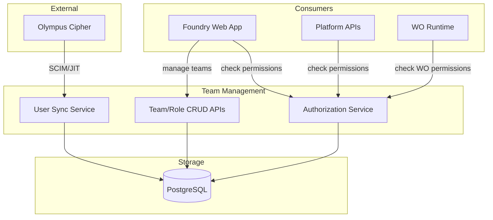

# Team Management

**Module scope:** Subsystem of Management — Users, teams, roles, and permissions within a Foundry.

## Purpose

Team Management provides user and access control within a Foundry. It bridges identity from Olympus Cipher into Foundry's permission model, enabling Foundry Admins to organize users into teams and assign roles that govern access to Workshops, Workbenches, and Workspaces.

The subsystem does not store user credentials — authentication remains with Olympus Cipher. Instead, it maintains user profiles, team memberships, and role assignments that determine what users can do within the Foundry.

## What this subsystem does

- **User management** — provision, sync, and manage user profiles from Olympus Cipher
- **Team management** — create teams, manage membership, assign to entities
- **Role management** — define roles with permission sets
- **Permission management** — assign roles at Foundry, Workshop, Workbench, Workspace levels
- **Access control** — provide APIs to check user permissions

## What this subsystem does NOT do

| Boundary | Owned By |
|----------|----------|
| User authentication | Olympus Cipher |
| Credential management | Olympus Cipher |
| Multi-factor authentication | Olympus Cipher |
| Agent credentials/API keys | Agent Fabric |

## User Model

### User Lifecycle

```
┌─────────────────────────────────────────────────────────────────────────────┐
│  Olympus Cipher                           │  Foundry Team Management        │
│                                           │                                 │
│  ┌─────────────┐                          │  ┌─────────────────────┐       │
│  │   User      │  ───── federation ─────► │  │   Foundry User      │       │
│  │  (identity) │                          │  │  (profile + roles)  │       │
│  └─────────────┘                          │  └─────────────────────┘       │
│                                           │           │                     │
│                                           │           ▼                     │
│                                           │  ┌─────────────────────┐       │
│                                           │  │   Team Memberships  │       │
│                                           │  └─────────────────────┘       │
│                                           │           │                     │
│                                           │           ▼                     │
│                                           │  ┌─────────────────────┐       │
│                                           │  │   Role Assignments  │       │
│                                           │  └─────────────────────┘       │
└───────────────────────────────────────────┴─────────────────────────────────┘
```

### User Provisioning Modes

| Mode | Description |
|------|-------------|
| **JIT (Just-in-Time)** | User created on first login via Olympus Cipher |
| **SCIM** | Users synced from Olympus Cipher via SCIM protocol |
| **Manual** | Admin manually creates user records |

### User States

| State | Description |
|-------|-------------|
| **Active** | User can access the Foundry |
| **Suspended** | User access temporarily revoked |
| **Deprovisioned** | User removed, data retained for audit |

## Team Model

Teams organize users for collective role assignment.

### Team Structure

```
Foundry
├── Team: Product Management
│   ├── User: Alice (Product Owner)
│   └── User: Bob (Product Manager)
├── Team: Development
│   ├── User: Charlie (Senior Engineer)
│   ├── User: Diana (Engineer)
│   └── User: Eve (Junior Engineer)
└── Team: QA
    ├── User: Frank (QA Lead)
    └── User: Grace (QA Engineer)
```

### Team Properties

| Property | Description |
|----------|-------------|
| `id` | Unique identifier |
| `name` | Human-readable team name |
| `description` | Team purpose |
| `members` | List of user IDs |
| `created_by` | Admin who created the team |
| `created_at` | Creation timestamp |

### Team Assignment Scope

Teams can be assigned roles at different scopes:

| Scope | Example |
|-------|---------|
| **Foundry** | "Development" team has `foundry-developer` role |
| **Workshop** | "Mobile Team" has `workshop-admin` role on "Mobile Workshop" |
| **Workbench** | "Release Engineers" has `workbench-release-manager` on "Q3 Release" |

## Role Model

Roles define sets of permissions that can be assigned to users or teams.

### Built-in Roles

#### Foundry-Level Roles

| Role | Description |
|------|-------------|
| `foundry-admin` | Full administrative access to Foundry |
| `foundry-member` | Basic access to assigned Workshops/Workbenches |
| `foundry-auditor` | Read-only access to audit logs and governance evidence |

#### Workshop-Level Roles

| Role | Description |
|------|-------------|
| `workshop-admin` | Manage Workshop configuration, Workbenches |
| `workshop-member` | Access assigned Workbenches |

#### Workbench-Level Roles

| Role | Description |
|------|-------------|
| `workbench-admin` | Manage Workbench configuration, assign work |
| `workbench-product-owner` | Manage Product Intents, prioritize work |
| `workbench-release-manager` | Manage releases, approve deployments |
| `workbench-developer` | Execute development Work Orders |
| `workbench-qa` | Execute QA Work Orders |
| `workbench-reviewer` | Execute governance reviews |

#### Workspace-Level Roles

| Role | Description |
|------|-------------|
| `workspace-owner` | Full control of Workspace configuration |
| `workspace-member` | Claim and execute Work Orders in Workspace |

### Custom Roles

Foundry Admins can create custom roles:

```yaml
custom_role:
  id: senior-developer
  name: Senior Developer
  base_role: workbench-developer
  additional_permissions:
    - workbench.wo.reassign
    - workbench.pr.approve
  description: Developer with additional review capabilities
```

## Permission Model

Permissions are granular access controls organized hierarchically.

### Permission Hierarchy

```
foundry.*
├── foundry.settings.read
├── foundry.settings.write
├── foundry.workshops.create
├── foundry.workshops.delete
├── foundry.teams.read
├── foundry.teams.write
├── foundry.roles.read
├── foundry.roles.write
├── foundry.agents.read
├── foundry.agents.configure
├── foundry.integrations.read
├── foundry.integrations.write
├── foundry.audit.read
└── foundry.governance.read

workshop.*
├── workshop.settings.read
├── workshop.settings.write
├── workshop.workbenches.create
├── workshop.workbenches.delete
├── workshop.members.read
└── workshop.members.write

workbench.*
├── workbench.settings.read
├── workbench.settings.write
├── workbench.pi.create
├── workbench.pi.update
├── workbench.pi.delete
├── workbench.wo.assign
├── workbench.wo.reassign
├── workbench.wo.execute
├── workbench.release.create
├── workbench.release.approve
├── workbench.pr.merge
├── workbench.pr.approve
└── workbench.governance.execute

workspace.*
├── workspace.settings.read
├── workspace.settings.write
├── workspace.session.create
├── workspace.session.terminate
├── workspace.wo.claim
└── workspace.wo.execute
```

### Permission Resolution

Permissions are resolved by checking assignments at all levels:

```
Has Permission?
    │
    ├── Check User's direct role assignments at this scope
    │   └── If granted → ALLOW
    │
    ├── Check User's team memberships
    │   └── For each team, check team's role assignments at this scope
    │       └── If any grants permission → ALLOW
    │
    ├── Check parent scope (e.g., Workbench → Workshop → Foundry)
    │   └── If granted at parent → ALLOW (inheritance)
    │
    └── Deny by default
```

### Permission Inheritance

Higher-scope roles grant permissions at lower scopes:

| Role | Foundry | Workshop | Workbench | Workspace |
|------|---------|----------|-----------|-----------|
| `foundry-admin` | Full | Full | Full | Full |
| `workshop-admin` | - | Full | Full | Full |
| `workbench-admin` | - | - | Full | Full |

## Architecture



## Key Services

### User Sync Service

Synchronizes users from Olympus Cipher:

- Handles JIT provisioning on login
- Processes SCIM push from Olympus Cipher
- Maps Cipher groups to Foundry teams (optional)

### Team/Role CRUD APIs

CRUD operations for teams and role assignments:

- Create, update, delete teams
- Add/remove team members
- Assign roles to users or teams
- Create custom roles

### Authorization Service

Permission checking for all Foundry services:

```
POST /api/v1/authz/check
{
  "user_id": "usr-123",
  "permission": "workbench.wo.execute",
  "resource": {
    "type": "workbench",
    "id": "wb-456"
  }
}
Response: { "allowed": true, "reason": "via role workbench-developer" }
```

## ACE Concepts Realized

| Concept | How this subsystem realizes it |
|---------|--------------------------------|
| **Foundry** | Top-level boundary for team/role management |
| **Workshop** | Scope for team and role assignments |
| **Workbench** | Scope for work execution permissions |
| **Workspace** | Scope for session and WO permissions |
| **Work Order** | Permissions govern who can claim/execute |

## Key Design Decisions

- **Olympus Cipher is the identity source.** No local password storage or authentication.
- **Teams are Foundry-scoped.** A team exists within one Foundry only.
- **Roles have fixed permission sets.** Custom roles extend built-in roles.
- **Permission inheritance flows down.** Foundry Admin has Workshop Admin permissions automatically.
- **No cross-Foundry access.** Users with access to multiple Foundries have separate profiles in each.

## Open Questions

- Should Cipher groups auto-map to Foundry teams?
- Should team membership be inherited (nested teams)?
- How to handle contractor/external user access patterns?
- Should there be time-bound role assignments?

## Module Documents

| Document | Content |
|----------|---------|
| [requirements.md](requirements.md) | Implementation requirements, APIs, database schema |

## Read Next

- [requirements.md](requirements.md) — Implementation details
- [../foundry-management/README.md](../foundry-management/README.md) — Foundry-level administration
- [../README.md](../README.md) — Management module overview
