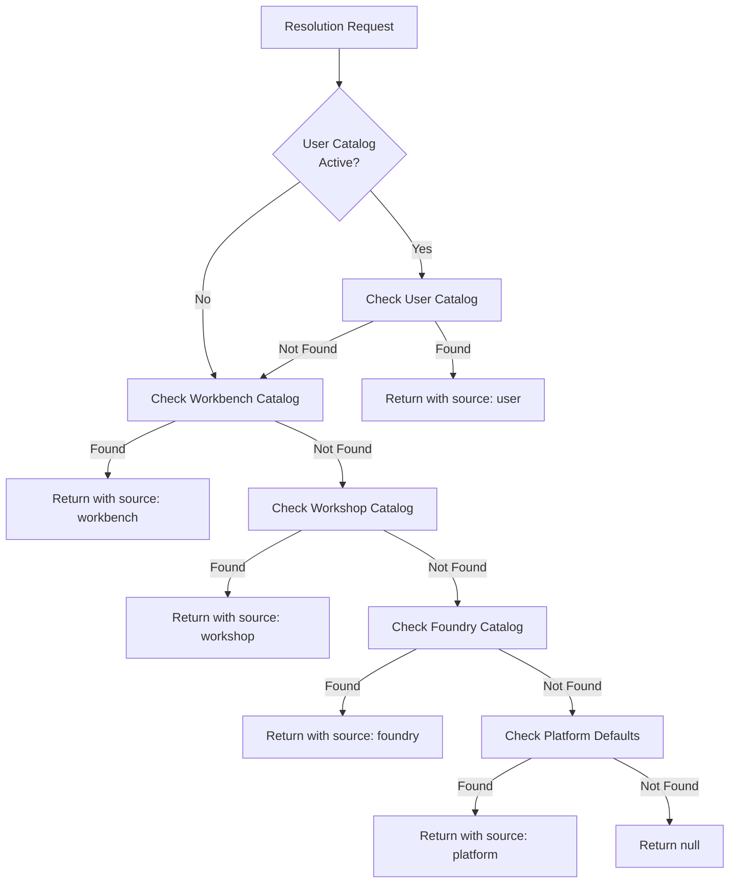

# Work Catalog Resolution Algorithm

This document specifies how the effective Work Catalog is computed by walking the hierarchy from Platform defaults down to User customizations.

## Overview

The Work Catalog hierarchy enables customization at multiple levels while providing sensible defaults:

```
Platform                    ← Platform defaults (shipped with Foundry)
    └── Foundry             ← Foundry-level overrides/additions
        └── Workshop        ← Workshop-level overrides/additions
            └── Workbench   ← Workbench-level overrides/additions
                └── User    ← User-level customizations (requires activation)
```

**Resolution rule:** Closest definition wins. A Scenario or OI Workflow defined at User level overrides the same-named artifact at Workbench level, which overrides Workshop level, and so on.

## Hierarchy Levels

### Platform Level

**Source:** `work-catalogues/platform-defaults/` in the Foundry codebase

Platform defaults are shipped with every Foundry installation. They provide baseline OI Workflows and Scenarios that work out of the box.

| Content Type | Location |
|--------------|----------|
| OI Workflows | `platform-defaults/work-catalog/{track}/{oi-type}/workflow.yaml` |
| Scenarios | `platform-defaults/work-catalog/{track}/{oi-type}/{workspace}/scenarios/*.yaml` |

### Foundry Level

**Source:** Foundry Definition Repository (`foundry-{id}/`)

Foundry-level Work Catalog content is embedded in the Foundry Definition Repository, not a separate repository. It can override or extend Platform defaults.

| Content Type | Location |
|--------------|----------|
| OI Workflows | `work-catalog/{track}/{oi-type}/workflow.yaml` |
| Scenarios | `work-catalog/{track}/{oi-type}/{workspace}/scenarios/*.yaml` |

### Workshop Level

**Source:** Workshop Definition Repository (`workshop-{id}/`)

Workshops can customize the Work Catalog for their specific domain.

| Content Type | Location |
|--------------|----------|
| OI Workflows | `work-catalog/{track}/{oi-type}/workflow.yaml` |
| Scenarios | `work-catalog/{track}/{oi-type}/{workspace}/scenarios/*.yaml` |

### Workbench Level

**Source:** Workbench section within Workshop Definition Repository

Workbenches can further customize for team-specific needs.

| Content Type | Location |
|--------------|----------|
| OI Workflows | `workbenches/{workbench}/work-catalog/{track}/{oi-type}/workflow.yaml` |
| Scenarios | `workbenches/{workbench}/work-catalog/{track}/{oi-type}/{workspace}/scenarios/*.yaml` |

### User Level

**Source:** User Work Catalog Repository (`user-work-catalog-{userId}/`, one per user per Foundry)

Users can create personal customizations for experimentation. User catalogs require explicit activation.

| Content Type | Location |
|--------------|----------|
| OI Workflows | `work-catalog/{track}/{oi-type}/workflow.yaml` |
| Scenarios | `work-catalog/{track}/{oi-type}/{workspace}/scenarios/*.yaml` |

## Resolution Algorithm

### Input Parameters

```typescript
interface ResolutionContext {
  foundryId: string;
  workshopId: string;
  workbenchId: string;
  userId?: string;           // Optional: for user catalog resolution
  userCatalogActive: boolean; // From session or user profile
}
```

### Algorithm: Resolve Single Artifact

```python
def resolve_artifact(
    artifact_type: str,      # "oi-workflow" | "scenario"
    name: str,
    context: ResolutionContext
) -> Artifact | None:
    """
    Resolve a single OI Workflow or Scenario by name.
    Returns the closest definition in the hierarchy.
    """
    
    # Level 5: User (if active)
    if context.user_catalog_active and context.user_id:
        artifact = get_from_user_catalog(
            context.user_id,
            context.foundry_id,
            artifact_type,
            name
        )
        if artifact:
            return artifact.with_source("user", context.user_id)
    
    # Level 4: Workbench
    artifact = get_from_workbench_catalog(
        context.workbench_id,
        artifact_type,
        name
    )
    if artifact:
        return artifact.with_source("workbench", context.workbench_id)
    
    # Level 3: Workshop
    artifact = get_from_workshop_catalog(
        context.workshop_id,
        artifact_type,
        name
    )
    if artifact:
        return artifact.with_source("workshop", context.workshop_id)
    
    # Level 2: Foundry
    artifact = get_from_foundry_catalog(
        context.foundry_id,
        artifact_type,
        name
    )
    if artifact:
        return artifact.with_source("foundry", context.foundry_id)
    
    # Level 1: Platform
    artifact = get_from_platform_defaults(artifact_type, name)
    if artifact:
        return artifact.with_source("platform", "default")
    
    return None
```

### Algorithm: Compute Effective Catalog

```python
def get_effective_catalog(context: ResolutionContext) -> EffectiveCatalog:
    """
    Compute the complete effective Work Catalog for a given context.
    Merges all levels, with closer levels taking precedence.
    """
    
    # Start with platform defaults
    catalog = load_platform_defaults()
    
    # Merge Foundry level (overrides platform)
    foundry_catalog = load_foundry_catalog(context.foundry_id)
    catalog = merge_catalogs(catalog, foundry_catalog, "foundry")
    
    # Merge Workshop level (overrides foundry)
    workshop_catalog = load_workshop_catalog(context.workshop_id)
    catalog = merge_catalogs(catalog, workshop_catalog, "workshop")
    
    # Merge Workbench level (overrides workshop)
    workbench_catalog = load_workbench_catalog(context.workbench_id)
    catalog = merge_catalogs(catalog, workbench_catalog, "workbench")
    
    # Merge User level if active (overrides workbench)
    if context.user_catalog_active and context.user_id:
        user_catalog = load_user_catalog(context.user_id, context.foundry_id)
        catalog = merge_catalogs(catalog, user_catalog, "user")
    
    return catalog


def merge_catalogs(
    base: Catalog,
    overlay: Catalog,
    source_level: str
) -> Catalog:
    """
    Merge overlay catalog into base catalog.
    Same-named artifacts in overlay replace those in base.
    New artifacts in overlay are added to the result.
    """
    result = Catalog()
    
    # Copy all base artifacts
    for artifact in base.artifacts:
        result.add(artifact)
    
    # Overlay artifacts (replace if same name, add if new)
    for artifact in overlay.artifacts:
        artifact_with_source = artifact.with_source(source_level, overlay.source_id)
        result.add_or_replace(artifact_with_source)
    
    return result
```

## User Catalog Activation

User catalogs are not included in resolution by default. They require explicit activation to prevent accidental production impact from experimental Scenarios.

### Activation Methods

#### Session Flag (Temporary)

User activates their catalog for a single Workspace Session:

```
POST /api/v1/sessions/{session_id}/activate-user-catalog
Response: { "active": true, "expires_at": "2026-05-28T18:00:00Z" }
```

The session flag is:
- Valid for the duration of the session
- Automatically deactivated when session ends
- Visible in IDE status bar ("User Catalog Active")

#### User Profile Setting (Persistent)

User configures persistent activation in their profile:

```
PUT /api/v1/users/{user_id}/settings
Body: { "user_catalog_active": true }
```

Profile setting is:
- Persistent across sessions
- Applies to all sessions in the Foundry
- Can be overridden by session flag (deactivation)

### Activation Check

```python
def is_user_catalog_active(session: Session, user: User) -> bool:
    """
    Check if user catalog should be included in resolution.
    Session flag takes precedence over profile setting.
    """
    
    # Session-level override (either direction)
    if session.user_catalog_flag is not None:
        return session.user_catalog_flag
    
    # Fall back to user profile setting
    return user.settings.get("user_catalog_active", False)
```

## Merge vs Override Semantics

### OI Workflows: Override

For OI Workflows, **same-named workflows completely replace parent-level workflows**.

```
Platform: product-intent-workflow.yaml (10 stages)
Foundry:  product-intent-workflow.yaml (12 stages, customized)

Effective: Foundry's 12-stage workflow (Platform version ignored)
```

Rationale: OI Workflows are complex state machines. Partial merging would create inconsistent behavior.

### Scenarios: Override

For Scenarios, **same-named scenarios completely replace parent-level scenarios**.

```
Workshop: implement-feature.yaml (4 tasks)
Workbench: implement-feature.yaml (5 tasks, customized)

Effective: Workbench's 5-task scenario (Workshop version ignored)
```

Rationale: Scenarios define complete execution paths. Partial merging would break task dependencies.

### Scenario Catalog: Merge

The **catalog of available scenarios is merged** across levels. All scenarios are visible; only same-named conflicts are resolved by override.

```
Workshop scenarios: [implement-feature, run-tests, deploy]
Workbench scenarios: [implement-feature (custom), special-deploy]

Effective catalog: [implement-feature (workbench), run-tests (workshop), 
                    deploy (workshop), special-deploy (workbench)]
```

## Source Tracking

Every artifact in the effective catalog includes source information for transparency:

```json
{
  "artifact": {
    "name": "implement-feature",
    "kind": "Scenario",
    "spec": { ... }
  },
  "source": {
    "level": "workbench",
    "id": "checkout",
    "repository": "acme/checkout-workshop-definition",
    "path": "workbenches/checkout/work-catalog/build/product-intent/development/scenarios/implement-feature.yaml",
    "commit_sha": "abc123"
  }
}
```

Source tracking enables:
- **Debugging:** "Why is this Scenario being used instead of the Workshop one?"
- **Auditing:** "Which repository is this OI Workflow from?"
- **Visualization:** UI can show inheritance hierarchy

## Cache Invalidation

Effective catalogs are cached for performance. Caches are invalidated when:

| Event | Invalidation Scope |
|-------|-------------------|
| Platform upgrade | All caches |
| Foundry catalog sync | All Workshops/Workbenches in Foundry |
| Workshop catalog sync | All Workbenches in Workshop |
| Workbench catalog sync | That Workbench only |
| User catalog sync | That User's sessions only |
| User catalog activation/deactivation | That User's active sessions |

### Invalidation Flow

```python
def on_catalog_sync(level: str, scope_id: str):
    """Handle catalog sync event and invalidate appropriate caches."""
    
    if level == "platform":
        cache.invalidate_all()
    
    elif level == "foundry":
        workshops = get_workshops_in_foundry(scope_id)
        for workshop in workshops:
            workbenches = get_workbenches_in_workshop(workshop.id)
            for workbench in workbenches:
                cache.invalidate(workbench.id)
    
    elif level == "workshop":
        workbenches = get_workbenches_in_workshop(scope_id)
        for workbench in workbenches:
            cache.invalidate(workbench.id)
    
    elif level == "workbench":
        cache.invalidate(scope_id)
    
    elif level == "user":
        sessions = get_active_sessions_for_user(scope_id)
        for session in sessions:
            cache.invalidate_session(session.id)
    
    # Emit event for subscribers
    emit_event("catalog.updated", {
        "level": level,
        "scope_id": scope_id,
        "timestamp": now()
    })
```

## API Endpoints

### Get Effective Catalog

```
GET /api/v1/work-catalog/effective
Query params:
  - foundry_id (required)
  - workshop_id (required)
  - workbench_id (required)
  - user_id (optional)
  - include_sources (optional, default: false)

Response:
{
  "oi_workflows": [
    { "name": "product-intent-workflow", "spec": {...}, "source": {...} }
  ],
  "scenarios": [
    { "name": "implement-feature", "spec": {...}, "source": {...} }
  ]
}
```

### Resolve Single Artifact

```
GET /api/v1/work-catalog/resolve
Query params:
  - type: "oi-workflow" | "scenario"
  - name (required)
  - foundry_id (required)
  - workshop_id (required)
  - workbench_id (required)
  - user_id (optional)

Response:
{
  "artifact": { "name": "implement-feature", "spec": {...} },
  "source": {
    "level": "workbench",
    "id": "checkout",
    "repository": "...",
    "path": "...",
    "commit_sha": "..."
  }
}
```

### Get Catalog Sources

```
GET /api/v1/work-catalog/sources
Query params:
  - foundry_id (required)
  - workshop_id (required)
  - workbench_id (required)
  - user_id (optional)

Response:
{
  "sources": {
    "product-intent-workflow": { "level": "foundry", "id": "acme" },
    "implement-feature": { "level": "user", "id": "alice" },
    "run-tests": { "level": "workshop", "id": "ecommerce" }
  }
}
```

## Diagram: Resolution Flow



## Read Next

- [README.md](README.md) — Work Catalog Management overview
- [apis.md](apis.md) — Full API specification
- [sync-mechanism.md](sync-mechanism.md) — How catalogs sync to Metadata Service
- [events-and-caching.md](events-and-caching.md) — Caching strategy and events
- [../../work-catalogues/README.md](../../work-catalogues/README.md) — Conceptual overview
