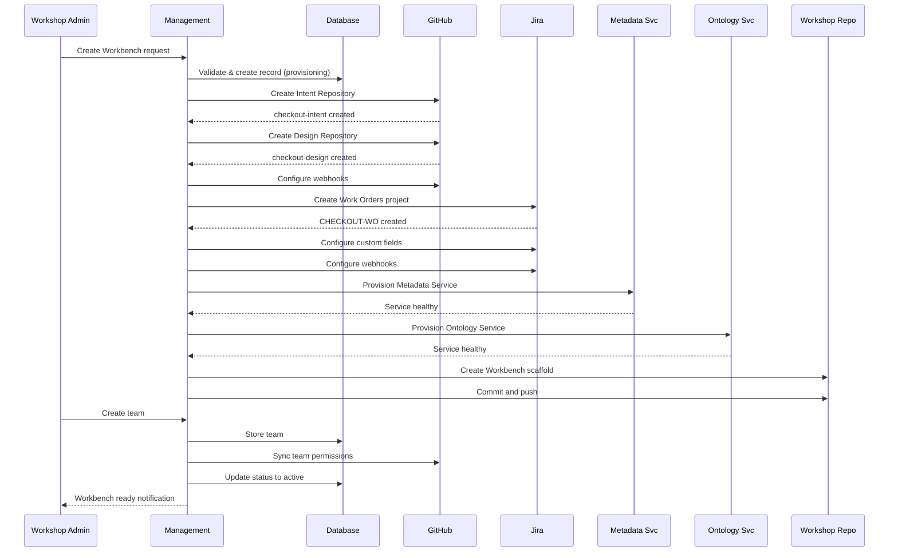

# Workbench Provisioning Journey

This document walks through the complete process of provisioning a new Workbench, from initial request to a fully operational product workspace.

## Overview

```
Request → Validate → Create Record → GitHub Setup → Jira Setup →
Metadata Service → Ontology Service → Repository Scaffold → Team Setup → Active
```

Provisioning involves:
- **Management module** — Orchestrates the entire process
- **GitHub** — Organization and repositories
- **Jira** — Projects for work tracking
- **Internal services** — Metadata Service, Ontology Service

## Prerequisites

Before provisioning a Workbench:

1. **Workshop exists** — Workbench belongs to a Workshop
2. **GitHub App installed** — Foundry GitHub App must be installed on the target org (or new org will be created)
3. **Jira connected** — Workshop must have Jira integration configured
4. **Admin permissions** — User must be Workshop Admin or higher

## Phase 1: Request and Validation

**Location:** Web Console or API  
**Actor:** Workshop Admin

### Step 1.1: Submit Provisioning Request

Admin submits a request via the web console:

```json
{
  "workshop_id": "ws-acme-retail",
  "name": "Checkout Service",
  "product_code": "checkout",
  "description": "Customer checkout and payment processing",
  "config": {
    "capable_agents": ["cursor-agent", "copilot"],
    "github_org": "acme-retail"  // existing or new
  }
}
```

### Step 1.2: Validate Request

Management validates:

```
1. Workshop exists and is active
2. Product code is unique within Workshop
3. User has Workshop Admin permissions
4. GitHub org exists OR can be created
5. Jira integration is configured at Workshop level
```

### Step 1.3: Create Workbench Record

```sql
INSERT INTO workbenches (id, workshop_id, name, product_code, status, config)
VALUES ('wb-checkout', 'ws-acme-retail', 'Checkout Service', 'checkout', 'provisioning', {...});
```

Status: **provisioning**

## Phase 2: GitHub Setup

**Location:** Management → GitHub API  
**Actor:** Management Service (automated)

### Step 2.1: Resolve GitHub Organization

**Option A: Use existing org**

```
1. Verify Foundry GitHub App is installed on org
2. Verify app has required permissions (repo:admin, org:read)
3. Tag org with Foundry metadata
```

**Option B: Create new org** (if user requested)

```
1. Create org via GitHub API (requires enterprise account)
2. Install Foundry GitHub App
3. Tag org with Foundry metadata
```

### Step 2.2: Create Intent Repository

```
POST /orgs/acme-retail/repos
{
  "name": "checkout-intent",
  "description": "Product Intent repository for Checkout Service",
  "private": true,
  "auto_init": true
}
```

Initialize with scaffold:

```
checkout-intent/
├── README.md
├── .foundry/
│   └── config.yaml
└── intents/
    └── .gitkeep
```

### Step 2.3: Create Design Repository

```
POST /orgs/acme-retail/repos
{
  "name": "checkout-design",
  "description": "Design artifacts for Checkout Service",
  "private": true,
  "auto_init": true
}
```

Initialize with scaffold:

```
checkout-design/
├── README.md
├── .foundry/
│   └── config.yaml
├── mockups/
├── visual-designs/
└── prototypes/
```

### Step 2.4: Configure Webhooks

For each repository:

```
POST /repos/acme-retail/checkout-intent/hooks
{
  "name": "web",
  "config": {
    "url": "https://foundry.acme.com/webhooks/github",
    "content_type": "json",
    "secret": "..."
  },
  "events": ["push", "pull_request"]
}
```

### Step 2.5: Update Workbench Record

```sql
UPDATE workbenches
SET config = config || '{"github_org": "acme-retail", "github_repos": ["checkout-intent", "checkout-design"]}'
WHERE id = 'wb-checkout';
```

## Phase 3: Jira Setup

**Location:** Management → Jira API  
**Actor:** Management Service (automated)

### Step 3.1: Create Work Orders Project

```
POST /rest/api/3/project
{
  "key": "CHECKOUT-WO",
  "name": "Checkout Service - Work Orders",
  "projectTypeKey": "software",
  "projectTemplateKey": "com.atlassian.jira-software-project-management:kanban"
}
```

### Step 3.2: Configure Custom Fields

Create Foundry-specific custom fields:

| Field | Type | Purpose |
|-------|------|---------|
| `foundry-scenario` | Text | Scenario identifier |
| `foundry-orchestration-item` | Text | Parent PI/DC/etc. |
| `foundry-workbench` | Text | Workbench ID |
| `foundry-wo-label` | Text | WO label for workflow |
| `foundry-wo-group` | Text | WO Group label |
| `foundry-parent-wo` | Text | Parent WO (for delegated tasks) |
| `foundry-task-workspace` | Text | Workspace session ID |

### Step 3.3: Configure Issue Types

Ensure project has:
- **Epic** — for Work Orders
- **Story** — for Root Tasks
- **Sub-task** — for Sub-tasks

### Step 3.4: Link Existing Jira Projects

If Workshop has shared Jira projects for Operations/Feedback:

```sql
UPDATE workbenches
SET integrations = integrations || '{
  "jira": {
    "work_orders_project": "CHECKOUT-WO",
    "operations_project": "ACME-OPS",
    "feedback_project": "ACME-FEEDBACK"
  }
}'
WHERE id = 'wb-checkout';
```

### Step 3.5: Configure Webhooks

```
POST /rest/webhooks/1.0/webhook
{
  "name": "Foundry Checkout",
  "url": "https://foundry.acme.com/webhooks/jira",
  "events": ["jira:issue_created", "jira:issue_updated"],
  "filters": {
    "issue-related-events-section": "project = CHECKOUT-WO"
  }
}
```

## Phase 4: Internal Services Setup

**Location:** Management → Internal Infrastructure  
**Actor:** Management Service (automated)

### Step 4.1: Provision Metadata Service

Create dedicated Metadata Service instance for this Workbench:

```yaml
MetadataServiceConfig:
  workbench_id: wb-checkout
  database:
    host: postgres-checkout.internal
    name: checkout_metadata
  sequences:
    product-intent: { prefix: PI, start: 1 }
    release-intent: { prefix: RI, start: 1 }
    work-order: { prefix: WO, start: 1 }
```

Initialize sequences:

```sql
INSERT INTO id_sequences (workbench_id, type, current_value, prefix)
VALUES
  ('wb-checkout', 'product-intent', 0, 'PI'),
  ('wb-checkout', 'release-intent', 0, 'RI'),
  ('wb-checkout', 'work-order', 0, 'WO');
```

### Step 4.2: Provision Ontology Service

Create dedicated Ontology Service instance:

```yaml
OntologyServiceConfig:
  workbench_id: wb-checkout
  database:
    host: postgres-checkout.internal
    name: checkout_ontology
  initial_schema:
    product: Checkout Service
    capabilities: []
    features: []
```

### Step 4.3: Health Check

Verify services are responding:

```
GET https://metadata.checkout.foundry.internal/health
GET https://ontology.checkout.foundry.internal/health
```

## Phase 5: Workshop Definition Repository Setup

**Location:** Management → Workshop Definition Repo  
**Actor:** Management Service (automated)

### Step 5.1: Create Workbench Scaffold

In the Workshop Definition Repository, create the Workbench folder structure:

```
workshop-acme-retail/
└── workbenches/
    └── checkout/
        ├── config.yaml
        ├── knowledge/
        │   └── README.md
        ├── workspaces/
        │   ├── product-specification/
        │   │   ├── .devcontainer/
        │   │   ├── scenarios/
        │   │   │   └── catalog.yaml
        │   │   └── skilled-agents/
        │   ├── ux-design/
        │   ├── development/
        │   ├── qa/
        │   ├── release/
        │   └── governance/
        └── integrations.yaml
```

### Step 5.2: Create Workbench Config

```yaml
# workbenches/checkout/config.yaml
name: Checkout Service
product_code: checkout
description: Customer checkout and payment processing

capable_agents:
  - cursor-agent
  - copilot

defaults:
  jira_project: CHECKOUT-WO
  github_org: acme-retail
```

### Step 5.3: Create Integrations Config

```yaml
# workbenches/checkout/integrations.yaml
github:
  org: acme-retail
  intent_repo: checkout-intent
  design_repo: checkout-design

jira:
  work_orders:
    project_key: CHECKOUT-WO
    issue_type_mapping:
      work_order: Epic
      task: Story
      subtask: Sub-task
```

### Step 5.4: Commit and Push

```bash
git add workbenches/checkout/
git commit -m "Initialize Checkout Service Workbench"
git push origin main
```

## Phase 6: Team Setup

**Location:** Web Console or API  
**Actor:** Workbench Admin

### Step 6.1: Create Default Team

```json
POST /api/v1/workbenches/wb-checkout/teams
{
  "name": "Checkout Team",
  "description": "Core team for Checkout Service development",
  "workspace_types": ["development", "qa", "release"]
}
```

### Step 6.2: Add Team Members

```json
POST /api/v1/workbenches/wb-checkout/teams/team-checkout/members
{
  "user_id": "alice@acme.com",
  "role": "admin"
}
```

### Step 6.3: Sync with GitHub

Add team members to GitHub org with appropriate permissions:

```
PUT /orgs/acme-retail/teams/checkout-devs/memberships/alice
{
  "role": "maintainer"
}
```

## Phase 7: Activation

**Location:** Management  
**Actor:** Management Service (automated)

### Step 7.1: Final Validation

```
1. GitHub repos accessible ✓
2. Jira project configured ✓
3. Metadata Service healthy ✓
4. Ontology Service healthy ✓
5. Workshop Definition Repo scaffold committed ✓
6. At least one team exists ✓
```

### Step 7.2: Update Status

```sql
UPDATE workbenches
SET status = 'active',
    updated_at = NOW()
WHERE id = 'wb-checkout';
```

### Step 7.3: Send Notifications

- Email Workbench Admin: "Checkout Service is ready"
- Slack notification to Workshop channel (if configured)

## Sequence Diagram



## Error Recovery

### GitHub Creation Failed

```
1. Log error with GitHub API response
2. If org creation failed:
   a. Clean up partial resources
   b. Mark Workbench as failed
   c. Notify admin with retry option
3. If repo creation failed:
   a. Delete any created repos
   b. Retry with exponential backoff
   c. After 3 failures, mark as failed
```

### Jira Setup Failed

```
1. Log error with Jira API response
2. GitHub resources remain (can be reused)
3. Retry Jira setup
4. If auth failed, prompt admin to re-authorize
```

### Service Provisioning Failed

```
1. Log error with service details
2. Attempt to restart service
3. If persistent failure:
   a. Alert infrastructure team
   b. Mark Workbench as degraded
   c. Allow manual completion when resolved
```

## Provisioning Timeline

| Phase | Typical Duration | Can Fail? |
|-------|------------------|-----------|
| Validation | < 1s | Yes |
| GitHub Setup | 5-15s | Yes |
| Jira Setup | 5-10s | Yes |
| Metadata Service | 2-5s | Yes |
| Ontology Service | 2-5s | Yes |
| Repository Scaffold | 3-5s | Yes |
| **Total** | **20-45s** | |

## Post-Provisioning

Once active, the Workbench Admin can:

1. **Add code repositories** — Link existing repos to the Workbench
2. **Configure integrations** — Add Figma, TestRail, etc.
3. **Define Scenarios** — Create scenario definitions in workspace folders
4. **Define Skilled Agents** — Create agent manifests for scenarios
5. **Create first Product Intent** — Start the product evolution cycle

## Read Next

- [requirements.md](requirements.md) — Detailed API and database requirements
- [workbench-architecture.md](workbench-architecture.md) — Repository storage model
- [workshop-repository.md](workshop-repository.md) — Workshop Definition Repository structure
- [../orchestrator/pi-journey.md](../orchestrator/pi-journey.md) — What happens after Workbench is ready
