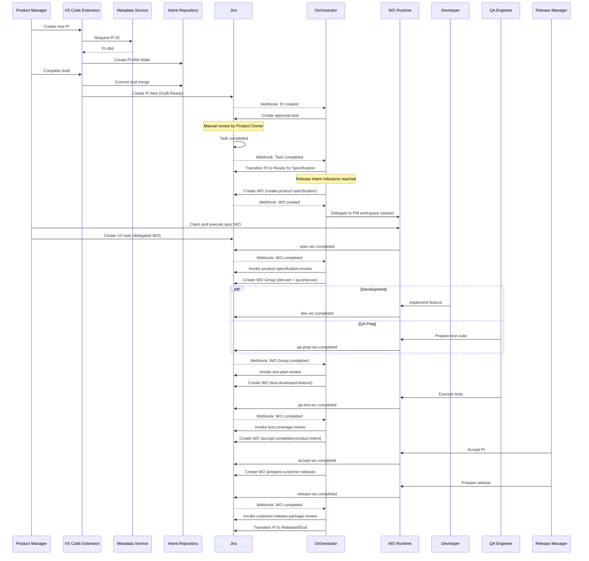
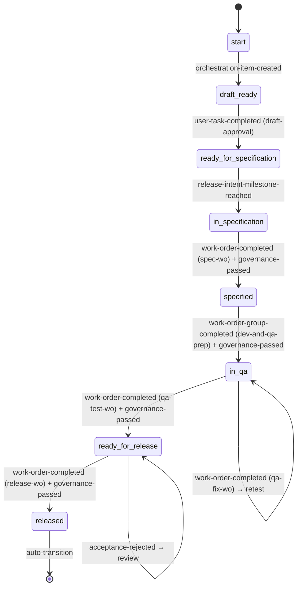

# Product Intent Journey

## Purpose

Track a Product Intent (PI) through its complete lifecycle—from creation to customer release—and understand how the Orchestrator coordinates work across Workspaces.

## Audience

| Role | When to use this guide |
|------|------------------------|
| Program Manager | Planning and tracking PI progress through Releases |
| Product Owner | Monitoring PI approval and specification milestones |
| Workbench Manager | Understanding how PIs flow through their Workbench |

## Prerequisites

- Access to the [Orchestration Console](../../foundry-web-app/platform-developer-guide/pages/consoles/work/orchestration-console.md) in the Foundry Web App
- Familiarity with [ACE Tracks and Workspaces](../../../ace/workspaces/README.md)
- Understanding of Release Intents and how PIs are batched for release

## Journey map

```mermaid
flowchart LR
    subgraph Creation["📝 Creation"]
        A[PI Created] --> B[Draft Ready]
    end
    
    subgraph Review["✅ Review"]
        B --> C[Draft Approved]
        C --> D[Ready for Specification]
    end
    
    subgraph Specification["📋 Specification"]
        D --> E[In Specification]
        E --> F[Specified]
    end
    
    subgraph Build["🔨 Build"]
        F --> G[Development + QA Prep]
        G --> H[In QA]
        H --> I[Ready for Release]
    end
    
    subgraph Release["🚀 Release"]
        I --> J[Released]
    end
    
    style Creation fill:#e1f5fe
    style Review fill:#fff3e0
    style Specification fill:#f3e5f5
    style Build fill:#e8f5e9
    style Release fill:#fce4ec
```



A Product Intent is the Build Track's primary orchestration item. It represents a discrete unit of product evolution—a feature, enhancement, or fix—that flows through the SDLC from customer release.

## Steps

### Phase 1: PI Creation

**Location:** Product Workspace  
**Actor:** Product Manager (PM)

#### Step 1.1: Author Creates PI

The PM opens VS Code in the Product Workspace and initiates a new PI:

1. **Invoke extension command:** `Foundry: Create Product Intent`
2. **Extension requests PI ID:** Calls Metadata Service
   ```
   POST /metadata/ids/product-intent
   Response: { "id": "PI-456" }
   ```
3. **Create folder structure:** In the Intent Repository
   ```
   intent-repo/
   └── PI-456/
       └── README.md
   ```
4. **Draft content:** PM authors the PI README with problem statement, proposed solution, and acceptance criteria

#### Step 1.2: Submit Draft

When the draft is ready:

1. **Commit and push:** Extension commits changes and pushes to origin
2. **Merge to main:** Extension creates PR (auto-merged or reviewed)
3. **Create Jira item:** Extension creates PI in Jira
   ```json
   {
     "project": "PRODUCT-ABC-PI",
     "issueType": "Product Intent",
     "summary": "Add user preferences panel",
     "status": "Draft Ready",
     "customFields": {
       "foundry-orchestration-item": "PI-456",
       "foundry-workbench": "workbench-acme-app",
       "foundry-intent-repo-path": "PI-456/"
     }
   }
   ```

#### Step 1.3: Orchestrator Receives Event

Jira webhook fires `issue_created`. Orchestrator:

1. Loads workflow for `product-intent` type
2. Matches `orchestration-item-created` event at `start` stage
3. Executes action: transition to `draft-ready`
4. Executes `on-enter` for `draft-ready`:
   - Creates User Task for draft approval
   - Sends notification to Product Owners channel

### Phase 2: Draft Review and Approval

**Location:** Jira / Web Console  
**Actor:** Product Owner

#### Step 2.1: Review Task

The Product Owner sees the approval task in their queue:

```
Task: Review and approve PI: Add user preferences panel
PI ID: PI-456
Author: alice@acme.com
```

They review the PI draft in the Intent Repository and decide:
- **Approve:** Complete the task → triggers transition
- **Request changes:** Add comments, PI stays in draft

#### Step 2.2: Transition to Ready for Specification

When the task is completed:

1. Jira webhook fires `issue_updated` (task completed)
2. Orchestrator matches `user-task-completed` with `task-label: draft-approval`
3. Executes action: transition to `ready-for-specification`
4. PI is now approved, waiting for Release Intent milestone

### Phase 3: Release Intent and Specification Trigger

**Location:** Release Management  
**Actor:** Program Manager

#### Step 3.1: Tag PI to Release Intent

The Program Manager associates PI-456 with Release Intent RI-78 (e.g., "Q3 Feature Release").

#### Step 3.2: Initiate Milestone

When RI-78 reaches milestone `product-specification-development-start`:

1. Orchestrator detects milestone change
2. Fires `release-intent-milestone-reached` for all tagged PIs in `ready-for-specification`
3. For PI-456, matches handler and executes:
   - Create Work Order `spec-wo`
   - Transition to `in-specification`

```json
{
  "project": "PRODUCT-ABC-WO",
  "issueType": "Work Order",
  "summary": "Create specification for PI-456",
  "customFields": {
    "foundry-scenario": "create-product-specification",
    "foundry-orchestration-item": "PI-456",
    "foundry-wo-label": "spec-wo",
    "foundry-workbench": "workbench-acme-app"
  }
}
```

### Phase 4: Product Specification

**Location:** Product Specification Workspace  
**Actor:** Product Manager

#### Step 4.1: Claim and Execute WO

The PM sees `spec-wo` in their Work Orders panel:

1. **Claim WO:** PM accepts the assignment (or auto-assigned)
2. **Session activation:** Orchestrator activates PM's Workspace Session (if configured)
3. **WO Runtime starts:** Loads scenario `create-product-specification`
4. **Agent spawns:** Trained Agent with spec-writing capabilities

#### Step 4.2: Author Product Specification Document (PSD)

The PM works with the agent to create:
- Detailed requirements
- User stories
- API contracts
- UI specifications

The PSD is committed to the Intent Repository under `PI-456/`.

#### Step 4.3: UX Design Tasks (Delegated WOs)

During specification, UX work is needed:

1. PM creates UX task via IDE
2. WO Runtime creates delegated WO:
   ```json
   {
     "foundry-scenario": "create-mockup",
     "foundry-parent-wo": "spec-wo",
     "foundry-task-workspace": "ux-design"
   }
   ```
3. Orchestrator routes to UX Design Workspace
4. UX Designer completes mockups
5. Completion bubbles up to parent WO

#### Step 4.4: Governance Review

When `spec-wo` completes:

1. Orchestrator invokes `product-specification-review` governance scenario
2. Governance WO created, executed
3. **Approved:** Transition continues
4. **Rejected (soft-block):** User can override with justification

### Phase 5: Development and QA Preparation (Parallel)

**Location:** Development Workspace, QA Workspace  
**Actors:** Developer, QA Engineer

#### Step 5.1: WO Group Creation

Upon entering `specified` stage, Orchestrator creates WO Group:

```yaml
group-label: dev-and-qa-prep
work-orders:
  - wo-label: dev-wo
    workspace: development
    scenario: implement-product-specification
  - wo-label: qa-prep-wo
    workspace: qa
    scenario: prepare-test-suite-for-product-specification
```

Both WOs are created atomically in Jira.

#### Step 5.2: Parallel Execution

**Development Workspace:**
1. Developer claims `dev-wo`
2. Implements feature based on PSD
3. Creates PRs, runs CI
4. Marks WO complete

**QA Workspace:**
1. QA Engineer claims `qa-prep-wo`
2. Creates test plan based on PSD
3. Authors automated test cases
4. Marks WO complete

#### Step 5.3: Group Completion

Orchestrator tracks both WOs:
- `dev-wo` completes → update group status
- `qa-prep-wo` completes → check if group complete
- Both complete → fire `work-order-group-completed`

Then:
1. Invoke `test-plan-review` governance
2. Transition to `in-qa`

### Phase 6: QA Testing

**Location:** QA Workspace  
**Actor:** QA Engineer

#### Step 6.1: Test Execution

Upon entering `in-qa`:

1. Create `qa-test-wo` with scenario `test-developed-feature`
2. QA Engineer executes test suite against built feature
3. Records results

#### Step 6.2: Test Results

**Tests pass:**
1. Invoke `test-coverage-review` governance
2. Transition to `ready-for-release`

**Tests fail:**
1. Create fix WO in Development (`qa-fix-wo`)
2. Developer fixes issues
3. Create retest WO (`qa-retest-wo`)
4. QA re-executes tests

### Phase 7: Release

**Location:** Release Workspace  
**Actor:** Release Manager

#### Step 7.1: Acceptance

Upon entering `ready-for-release`:

1. Create `accept-wo` with scenario `accept-completed-product-intent`
2. Release Manager reviews:
   - All requirements met
   - All tests passed
   - Documentation complete
3. Marks acceptance complete

#### Step 7.2: Release Preparation

Upon acceptance:

1. Create `release-wo` with scenario `prepare-customer-release`
2. Release Manager:
   - Packages release artifacts
   - Updates release notes
   - Prepares deployment

#### Step 7.3: Final Governance

Before release:

1. Invoke `customer-release-package-review` governance (hard-block)
2. Must pass—no override allowed
3. Upon approval, transition to `released`

### Phase 8: Released

**Location:** End state  

Upon entering `released`:

1. Notifications sent to stakeholders
2. PI marked complete in Jira
3. Automatic transition to `end` stage
4. PI lifecycle complete

## Sequence Diagram



## PI State Diagram



## Key Touchpoints

| Phase | Workspace | Scenario | Governance |
|-------|-----------|----------|------------|
| Creation | Product | — | — |
| Draft Review | — (Jira/Console) | — | — |
| Specification | Product Specification | `create-product-specification` | `product-specification-review` |
| UX Design | UX Design | `create-mockup`, `create-visual-design` | — |
| Development | Development | `implement-product-specification` | — |
| QA Prep | QA | `prepare-test-suite-for-product-specification` | `test-plan-review` |
| QA Test | QA | `test-developed-feature` | `test-coverage-review` |
| Release Accept | Release | `accept-completed-product-intent` | — |
| Release Prep | Release | `prepare-customer-release` | `customer-release-package-review` |

## Jira Attributes Throughout

| Attribute | Set By | Purpose |
|-----------|--------|---------|
| `foundry-orchestration-item` | IDE Extension | Links WO/task to PI |
| `foundry-scenario` | Orchestrator | Scenario for WO execution |
| `foundry-wo-label` | Orchestrator | Correlates events in workflow |
| `foundry-wo-group` | Orchestrator | Groups parallel WOs |
| `foundry-parent-wo` | WO Runtime | Links delegated WO to parent |
| `foundry-task-workspace` | WO Runtime | Associates task with session |
| `foundry-workbench` | IDE Extension / Orchestrator | Workbench scope |

## Timeout and Escalation

Each stage has a configurable timeout. When exceeded:

1. `work-order-timeout` event fires
2. Workflow handler executes:
   - Send notification to managers
   - Create escalation task
   - (Optionally) reassign WO

Default timeouts:
- Draft review: 14 days
- Waiting for RI milestone: 90 days
- Specification: 21 days
- Development + QA prep: (per WO)
- QA testing: 14 days
- Release: 7 days

## Manual Intervention Points

| Point | Who | Action |
|-------|-----|--------|
| Draft approval | Product Owner | Review and approve PI draft |
| Governance soft-block | Authorized user | Override with justification |
| Stage transition | Workbench Manager | Manually advance/revert stage |
| Escalation task | Workbench queue | Handle stalled WO |
| Acceptance rejection | Workbench Manager | Review and resolve |

## Expected outcome

After following a PI through its journey, you should:
- Understand how the Orchestrator transitions PIs through stages based on events
- Know where to monitor PI progress in the [Orchestration Console](../../foundry-web-app/platform-developer-guide/pages/consoles/work/orchestration-console.md)
- Understand the governance gates that must pass before critical transitions
- Know how to interpret timeout escalations and manual intervention points

## Related

### Concepts

- [Orchestration Item](../../concepts/orchestration-item.md) — Track-level coordination token (PI is the Build Track's item)
- [Work Order](../../concepts/work-order.md) — Instantiation of a Scenario for execution
- [Track](../../concepts/track.md) — Build Track that PIs flow through
- [Governance](../../concepts/governance.md) — Policy enforcement at transition gates
- [Work Catalog](../../concepts/work-catalog.md) — Where OI Workflows and Scenarios are defined
- [Workflow Engine](../concepts/workflow-engine.md) — Event-driven processor (module-specific)

### Consoles and Guides

- [Orchestration Console](../../foundry-web-app/platform-developer-guide/pages/consoles/work/orchestration-console.md) — Web App console for tracking orchestration items
- [Progress Console](../../foundry-web-app/platform-developer-guide/pages/consoles/work/progress-console.md) — Release progress tracking and burndown
- [Orchestration item workflow](orchestration-item-workflow.md) — OI Workflow YAML schema
- [Orchestrator README](../README.md) — Module boundaries and architecture summary
- [Requirements spec](../platform-developer-guide/requirements.md) — Implementation specs
- [Work Order lifecycle](../../work-order-runtime/user-guide/work-order-lifecycle.md) — How Work Orders execute

## Troubleshooting

| Symptom | Likely cause | What to do |
|---------|--------------|------------|
| PI stuck in `draft-ready` | Approval task not completed | Check approval task in Jira; complete or escalate |
| PI not transitioning on milestone | Not tagged to Release Intent, or RI milestone not set | Verify PI is tagged to correct RI; check RI milestone status |
| Governance gate blocking | Governance WO returned rejection | Review governance findings; address issues or request override |
| WO Group not completing | One WO still in progress or failed | Check individual WO status in Orchestration Console |
| Timeout escalation triggered | Stage SLA exceeded | Review escalation task; reassign or extend if appropriate |
