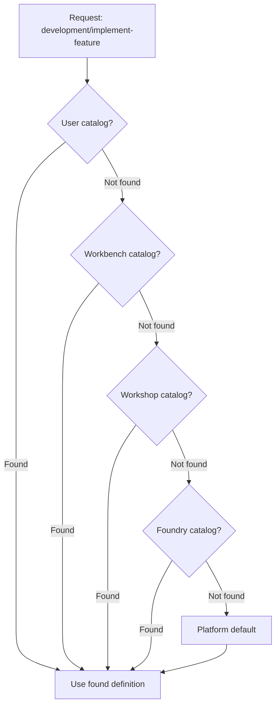

# Work Catalogues

**Module scope:** Conceptual documentation, user guides, and platform-shipped default content for Work Catalogs.

## What is a Work Catalog?

A Work Catalog is the executable realization of the [UPIM Work Model](../../upim/README.md). It defines:

- **OI Workflows** — state machines that orchestrate an Orchestration Item (e.g., Product Intent) through its lifecycle
- **Scenarios** — ingress contracts that define what work a Workspace accepts and how to process it

Together, OI Workflows and Scenarios operationalize UPIM's abstract work model into concrete, executable definitions that the platform can run.

## Relationship to UPIM Work Model

| UPIM Concept | Work Catalog Realization |
|--------------|--------------------------|
| 6 Tracks (Build, Discovery, Run, Win, Evolve, Governance) | Track folders in catalog structure |
| Orchestration Items (Product Intent, Discovery Case, etc.) | OI folders containing workflow.yaml |
| Work Model entities (Epic, Story, Task, Bug, etc.) | Input/output types in Scenarios |
| State transitions and governance gates | OI Workflow stages and handlers |

The Work Catalog makes UPIM executable. UPIM says "Product Intents move through specification, development, QA, and release"; the Work Catalog's `product-intent/workflow.yaml` defines exactly how that happens — what triggers each transition, what Work Orders get created, and what governance checks apply.

## Catalog Hierarchy

Work Catalogs exist at multiple levels, with more specific levels overriding more general ones:

```
Platform (shipped with product)
    └── Foundry (organization customizations)
        └── Workshop (team defaults)
            └── Workbench (project overrides)
                └── User (personal experiments)
```

**Resolution rule:** Closest wins. If you define a scenario in your User catalog, it shadows the same-named scenario at Workbench/Workshop/Foundry/Platform levels.

### Repository Locations

| Level | Repository | Provisioned By |
|-------|------------|----------------|
| Platform | `platform-defaults/work-catalog/` in this module | Platform release |
| Foundry | `foundry-{id}/work-catalog/` (embedded in Foundry repo) | Foundry provisioning |
| Workshop | `workshop-{id}/work-catalog/` (in Workshop definition repo) | Workshop provisioning |
| Workbench | `workshop-{id}/workbenches/{wb}/work-catalog/` | Workbench provisioning |
| User | `user-work-catalog-{userId}/work-catalog/` | On first publish |

User catalogs are provisioned lazily when a user first publishes a personal scenario.

## Catalog Structure

Each catalog (at any level) follows this structure:

```
work-catalog/
├── <track>/                      # e.g., build, discovery, run, win, evolve, governance
│   └── <orchestration-item>/     # e.g., product-intent, discovery-case
│       ├── workflow.yaml         # OI Workflow definition
│       └── <workspace>/          # e.g., development, qa, release
│           └── scenarios/
│               ├── scenario-a.yaml
│               └── scenario-b.yaml
```

The path `work-catalog/build/product-intent/development/scenarios/implement-feature.yaml` means:
- Track: Build
- Orchestration Item: Product Intent
- Workspace: Development
- Scenario: implement-feature

## Resolution Concept

When the Orchestrator needs an OI Workflow or WO Runtime needs a Scenario, the platform resolves through the hierarchy:



### User Catalog Activation

User catalogs only participate in resolution when explicitly activated:

| Mode | How to Activate | Scope |
|------|-----------------|-------|
| Session flag | Set `user_catalog_enabled: true` on Work Order | Single Work Order |
| User profile | Enable "Use my Work Catalog" in settings | All Work Orders for user |

This prevents accidental use of experimental scenarios in production work.

## Effective Catalog View

The **effective catalog** is the merged result of all levels. Users can view the effective catalog in:

- **Web App:** Resources > Work Catalogs
- **IDE:** Work Catalog Explorer extension

The effective catalog view shows:
- All available OI Workflows and Scenarios
- Source level for each definition (Platform, Foundry, Workshop, Workbench, User)
- Override indicators where lower levels shadow higher levels

## Implementation Details

For implementation specifics (schemas, APIs, validation rules, resolution algorithm):

→ [../management/platform-developer-guide/work-catalog-management/](../management/platform-developer-guide/work-catalog-management/) — Schemas, resolution, sync  
→ [../management/platform-developer-guide/validation/README.md](../management/platform-developer-guide/validation/README.md) — Validation module (pre-publish gate)

## Module Contents

| Path | Description |
|------|-------------|
| [user-guide/](user-guide/) | How to browse, author, test, and publish Work Catalog content |
| [platform-defaults/](platform-defaults/) | Platform-shipped OI Workflows and Scenarios |

## Documentation

| Guide | Audience | Index |
|-------|----------|-------|
| Concepts | Anyone | This README |
| [User guide](user-guide/) | Admins, builders | Task-oriented usage |

Implementation specs (schemas, validation, resolution) live under [Management platform-developer-guide](../management/platform-developer-guide/work-catalog-management/).

## Read Next

- [user-guide/how-work-flows.md](user-guide/how-work-flows.md) — Conceptual guide: OI → Workflow → Scenario → Agent
- [user-guide/authoring-scenarios.md](user-guide/authoring-scenarios.md) — How to create Scenarios
- [platform-defaults/work-catalog/build/product-intent/](platform-defaults/work-catalog/build/product-intent/) — Example OI Workflow
- [../management/platform-developer-guide/validation/README.md](../management/platform-developer-guide/validation/README.md) — Validation module
- [../management/platform-developer-guide/work-catalog-management/](../management/platform-developer-guide/work-catalog-management/) — Schemas, resolution, sync
